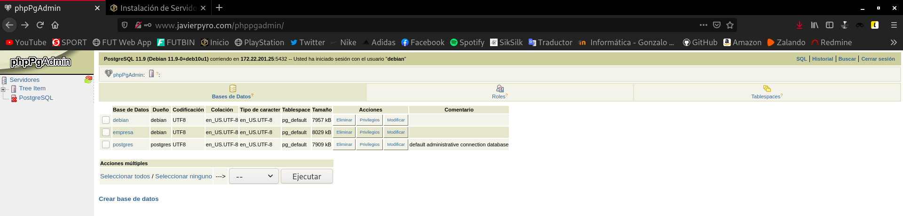

Title: Instalación de Servidores y Clientes
Date: 2020/12/04
Category: Administración de Base de Datos
Header_Cover: theme/images/banner-basededatos.png
Tags: Base de Datos, Oracle, MySQL, PostgreSQL, MongoDB

**Con esta práctica aprenderéis la instalación y configuración de distintos servidores y clientes de bases de datos.**

**Tras la instalación de cada servidor,  debe crearse una base de datos con al menos tres tablas o colecciones y poblarse de datos adecuadamente. Debe crearse un usuario y dotarlo de los privilegios necesarios para acceder remotamente a los datos. Se proporcionará esta información al resto de los miembros del grupo.**

**Los clientes deben estar siempre en máquinas diferentes de los respectivos servidores a los que acceden.**

**Se documentará todo el proceso de configuración de los servidores.**

**Se aportarán pruebas del funcionamiento remoto de cada uno de los clientes.**

**Se aportará el código de las aplicaciones realizadas y prueba de funcionamiento de las mismas.**

**El trabajo constará de las siguientes partes:**

- **Instalación de un servidor de ORACLE 19c**

- **Instalación de un servidor MySQL  y configuración para permitir el acceso remoto desde la red local.**

- **Prueba desde un cliente remoto de SQL*Plus.**

- **Realización de una aplicación web en cualquier lenguaje que conecte con un servidor Postgres tras autenticarse y muestre alguna información almacenada en el mismo.**

Primeramente voy a instalar un servidor PostgreSQL en una instancia del cloud, para luego acceder de manera remota desde una máquina virtual donde haré la aplicación web.

Instalo en la instancia el servidor:

<pre>
apt install postgresql-11 -y
</pre>

Para verificar si la base de datos *PostgreSQL* está inicializada y verificar el estado de conexión del servidor utilizamos este comando:

<pre>
root@servidor-postgresql:~# pg_isready
/var/run/postgresql:5432 - accepting connections
</pre>

Una vez instalado se crea un nuevo usuario llamado *postgres* que tiene rol de superusuario. Vamos a asignarle una contraseña por cuestión de seguridad:

<pre>
postgres@servidor-postgresql:/root$ psql postgres
psql (11.9 (Debian 11.9-0+deb10u1))
Type "help" for help.

postgres=# ALTER ROLE postgres PASSWORD 'contraseña';
ALTER ROLE

postgres=#
</pre>

Vamos a crear un nuevo rol, y debemos hacerlo a través de este usuario.

Utilizamos el argumento *--interactive* para que nos pregunte si el nuevo rol será de administrador o no:

<pre>
debian@servidor-postgresql:~$ sudo -u postgres createuser --interactive
Enter name of role to add: debian
Shall the new role be a superuser? (y/n) y
</pre>

Ahora creamos una base de datos con el mismo nombre que el rol que hemos creado y nos conectamos:

<pre>
debian@servidor-postgresql:~$ psql
psql (11.9 (Debian 11.9-0+deb10u1))
Type "help" for help.

debian=# ALTER ROLE debian PASSWORD 'contraseña';

debian=# CREATE DATABASE empresa;
CREATE DATABASE

debian=# GRANT ALL PRIVILEGES ON DATABASE empresa TO debian;
GRANT

debian=# \c empresa
You are now connected to database "empresa" as user "debian".

empresa=#
</pre>

Vamos a crear unas tablas y unos registros, para ello, utilizamos el siguiente [script](images/abd_instalacion_de_servidores_y_clientes/scriptpostgresql.txt).

Si comprobamos las tablas:

<pre>
empresa=# \d
          List of relations
 Schema |   Name    | Type  | Owner  
--------+-----------+-------+--------
 public | empleados | table | debian
 public | productos | table | debian
 public | tiendas   | table | debian
(3 rows)
</pre>

Ahora vamos a permitir el acceso remoto al servidor. Para ello debemos dirigirnos al fichero `/etc/postgresql/11/main/postgresql.conf` y descomentamos la línea *listen_addresses = 'localhost'* y sustituimos el valor *localhost* por la dirección que queremos que se conecte remotamente o si queremos habilitar conexiones desde todas las direcciones, establecemos el valor *****. En mi caso, la línea quedaría así:

<pre>
listen_addresses = '*'
</pre>

Nos quedaría modificar un fichero de configuración para terminar de habilitar el acceso remoto. Tenemos que editar el fichero `/etc/postgresql/11/main/pg_hba.conf` y en la línea que hace referencia a las direcciones *IPv4*, modificar el valor **127.0.0.1/32** por **all**, de manera que quedaría así:

<pre>
# IPv4 local connections:
host    all             all             all            md5
</pre>

Ya hemos configurado todo lo necesario para poder acceder remotamente a nuestro servidor *PostgreSQL*. Vamos a dirigirnos a la máquina virtual y vamos a instalar el cliente y a intentar acceder remotamente a la base de datos *empresa*:

<pre>
apt install postgresql-client -y
</pre>

Intentamos acceder de manera remota. Utilizamos los parámetros **-h** para indicar la dirección IP del servidor, **-U** para indicar el usuario y **-d** para indicar la base de datos:

<pre>
root@buster:/etc/apache2/conf-available# psql -h 172.22.201.25 -U debian -d empresa
Password for user debian:
psql (11.9 (Debian 11.9-0+deb10u1))
SSL connection (protocol: TLSv1.3, cipher: TLS_AES_256_GCM_SHA384, bits: 256, compression: off)
Type "help" for help.

empresa=# \d
          List of relations
 Schema |   Name    | Type  | Owner  
--------+-----------+-------+--------
 public | empleados | table | debian
 public | productos | table | debian
 public | tiendas   | table | debian
(3 rows)

empresa=# select * from tiendas;
 codigo |      nombre       | especialidad | localizacion
--------+-------------------+--------------+--------------
 000001 | Javi s Pet        | Animales     | Sevilla
 000002 | Javi s Sport      | Deportes     | Cordoba
 000003 | Javi s Food       | Comida       | Granada
 000004 | Javi s Technology | Tecnologia   | Cadiz
 000005 | Javi s Clothes    | Ropa         | Huelva
(5 rows)
</pre>

Vemos como tenemos acceso remoto y tenemos acceso a los datos almacenados.

En este punto, solo nos quedaría configurar la aplicación web.

Para servir una página web lógicamente necesitamos un servidor web. Yo he decidido utilizar *Apache*:

<pre>
apt install apache2 apache2-utils -y
</pre>

Instalamos los paquetes necesarios para poder acceder desde una aplicación web:

<pre>
apt install php libapache2-mod-php php-cli php-pgsql phppgadmin -y
</pre>

En este punto solo nos quedaría hacer unas pequeñas modificaciones en algunos ficheros de configuración.

El primer cambio debemos hacerlo en el fichero `/etc/apache2/conf-available/phppgadmin.conf` y comentar la línea **Require local**.

Después de hacer esto, en el fichero `/etc/phppgadmin/config.inc.php` debemos buscar la siguiente línea:

<pre>
$conf['extra_login_security'] = true;
</pre>

Tenemos que asegurarnos que su valor sea igual a **true**, y añadir estas líneas que indican la dirección del servidor y el puerto de la máquina remota:

<pre>
$conf['servers'][1]['host'] = '172.22.201.25';
$conf['servers'][1]['port'] = 5432;
</pre>

Si accedemos a la dirección `.../phppgadmin` en nuestro navegador e iniciamos sesión con las credenciales de nuestro usuario de la base de datos, obtendremos un resultado como éste:

- **Instalación de una herramienta de administración web para MongoDB y prueba desde un cliente remoto.**

.
