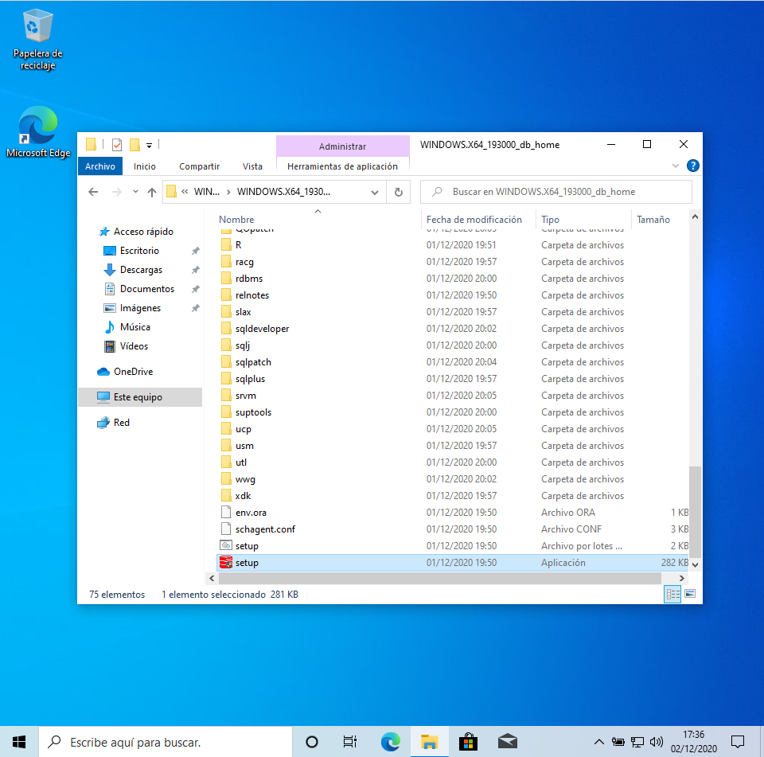
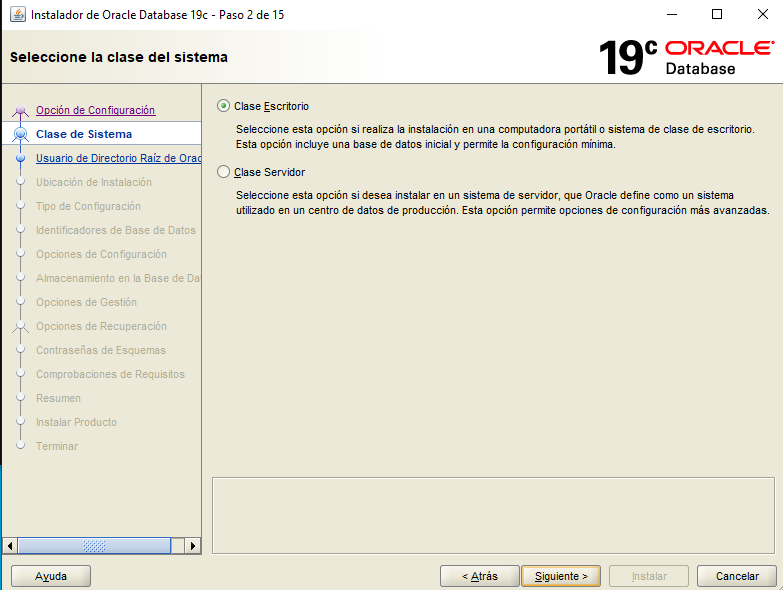
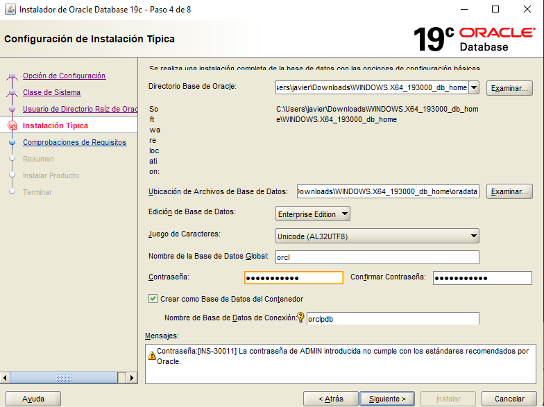

Title: Instalación de Servidores y Clientes de bases de datos
Date: 2020/12/04
Category: Administración de Base de Datos
Header_Cover: theme/images/banner-basededatos.png
Tags: Base de Datos, Oracle, MySQL, PostgreSQL, MongoDB

**Con esta práctica aprenderéis la instalación y configuración de distintos servidores y clientes de bases de datos.**

**Tras la instalación de cada servidor,  debe crearse una base de datos con al menos tres tablas o colecciones y poblarse de datos adecuadamente. Debe crearse un usuario y dotarlo de los privilegios necesarios para acceder remotamente a los datos. Se proporcionará esta información al resto de los miembros del grupo.**

**Los clientes deben estar siempre en máquinas diferentes de los respectivos servidores a los que acceden.**

**Se documentará todo el proceso de configuración de los servidores.**

**Se aportarán pruebas del funcionamiento remoto de cada uno de los clientes.**

**Se aportará el código de las aplicaciones realizadas y prueba de funcionamiento de las mismas.**

**El trabajo constará de las siguientes partes:**

#### Instalación de un servidor de ORACLE 19c

Vamos a llevar a cabo la instalación de **Oracle** en su versión **19c**. Esta instalación se hará sobre un sistema **Windows 10**, que se ejecuraá en una máquina virtual conectada en mod puente a mi red local.

Lo primero que debemos hacer, sería descargarnos el paquete de instalación desde la [web oficial de Oracle](https://www.oracle.com/es/database/technologies/oracle-database-software-downloads.html#19c), para realizar la descarga nos hará falta estar registrados como usuarios de *Oracle*.

Una vez descargado el archivo *.zip*, tenemos que extraerlo y ahora empezaremos el proceso de instalación.

Debemos buscar en el directorio resultante este ejecutable llamado **setup**:

Lo abrimos con permisos de administrador y se nos abrirá esta ventana que quedará cargando:

Una vez haya terminado de cargar el instalador de *Oracle*, se nos abrirá este asistente en el que configuraremos todos los parámetros de los que queremos disponer en nuestro nuevo servidor de base de datos.

Seleccionamos de que tipo de sistema queremos disponer, en mi caso, selecciono la *clase de escritorio* ya que, si seleccionara la *case servidor*, el propio *Oracle* nos realizaría todo el proceso de configuración para el acceso remoto, y esto prefiero mostrar como hacerlo manualmente.

Este paso es bastante importante, pues debemos establecer la contraseña de administrador que poseerá nuestro nuevo *Oracle*:

En este punto, nos redacta un resumen de las preferencias que hemos escogido, y después de esto, ya comenzará el proceso de instalación:

Una vez terminada la instalación, obtendremos esta ventana:

Bien, ya hemos instalado el servidor *Oracle* en nuestro sistema, vamos a acceder a él. Para ello vamos a abrir la aplicación **SQLPlus**. También podemos acceder a través de nuestro **cmd** con el comando:

<pre>
sqlplus
</pre>

Yo accedo mediante esta segunda opción. Como es la primera vez que vamos a acceder, debemos hacerlo mediante el usuario **system** que nos lo crea por defecto y es administrador. Una vez en él, crearé un usuario personal y le asignaré permisos:

<pre>
Microsoft Windows [Versión 10.0.19042.572]
(c) 2020 Microsoft Corporation. Todos los derechos reservados.

C:\Users\javier>sqlplus

SQL*Plus: Release 19.0.0.0.0 - Production on Lun Dic 7 16:43:18 2020
Version 19.3.0.0.0

Copyright (c) 1982, 2019, Oracle.  All rights reserved.

Introduzca el nombre de usuario: system
Introduzca la contrase±a:
Hora de ┌ltima Conexi¾n Correcta: Sßb Dic 05 2020 18:50:15 +01:00

Conectado a:
Oracle Database 19c Enterprise Edition Release 19.0.0.0.0 - Production
Version 19.3.0.0.0

SQL> CREATE USER c##javier IDENTIFIED BY contraseña;

Usuario creado.

SQL> GRANT ALL PRIVILEGES TO c##javier;

Concesi¾n terminada correctamente.

SQL>
</pre>

Ya tenemos nuestro usuario disponible, en mi caso, voy a acceder a él y a crear una serie de tablas de prueba y a insertarle unos pocos registros a partir de este [script](images/abd_instalacion_de_servidores_y_clientes/scriptoracle.txt).

#### Instalación de un servidor MySQL y configuración para permitir el acceso remoto desde la red local

Para realizar este ejercicio he decidido crear dos máquinas virtuales conectadas en modo puente a mi red local, las dos poseen un sistema **Debian 10**, y una actuará como servidor y la otra como cliente. Las he creado con **Vagrant**, con el siguiente fichero *Vagrantfile*:

<pre>
# -*- mode: ruby -*-
# vi: set ft=ruby :

Vagrant.configure("2") do |config|
  config.vm.define :servidor do |servidor|
        servidor.vm.box="debian/buster64"
        servidor.vm.hostname="servidor"
	servidor.vm.network :public_network, :bridge=>"wlo1"
  end

  config.vm.define :cliente do |cliente|
        cliente.vm.box="debian/buster64"
        cliente.vm.hostname="cliente"
	cliente.vm.network :public_network, :bridge=>"wlo1"
  end

end
</pre>

Las direcciones IP de ambas máquinas son:

- **Servidor:** 192.168.0.32

- **Cliente:** 192.168.0.33

Primeramente nos dirigimos a la máquina *servidor*, e instalamos el servidor **MySQL**:

<pre>
apt install mariadb-server -y
</pre>

Una vez lo hemos instalado, vamos a configurar una serie de opciones con el comando `mysql_secure_installation`. Vamos a especificarle una **contraseña de root**, vamos a **eliminar los usuarios anónimos**, vamos a especificar que queremos **desactivar el acceso remoto** a la base de datos, en resumen, vamos a restablecer la base de datos, con nuestras preferencias. Esta es una manera de asegurar el servicio. Aquí muestro el proceso:

<pre>
root@servidor:/home/vagrant# mysql_secure_installation

NOTE: RUNNING ALL PARTS OF THIS SCRIPT IS RECOMMENDED FOR ALL MariaDB
      SERVERS IN PRODUCTION USE!  PLEASE READ EACH STEP CAREFULLY!

In order to log into MariaDB to secure it, we'll need the current
password for the root user.  If you've just installed MariaDB, and
you haven't set the root password yet, the password will be blank,
so you should just press enter here.

Enter current password for root (enter for none):
OK, successfully used password, moving on...

Setting the root password ensures that nobody can log into the MariaDB
root user without the proper authorisation.

You already have a root password set, so you can safely answer 'n'.

Change the root password? [Y/n] y
New password:
Re-enter new password:
Password updated successfully!
Reloading privilege tables..
 ... Success!

By default, a MariaDB installation has an anonymous user, allowing anyone
to log into MariaDB without having to have a user account created for
them.  This is intended only for testing, and to make the installation
go a bit smoother.  You should remove them before moving into a
production environment.

Remove anonymous users? [Y/n] y
 ... Success!

Normally, root should only be allowed to connect from 'localhost'.  This
ensures that someone cannot guess at the root password from the network.

Disallow root login remotely? [Y/n] y
 ... skipping.

By default, MariaDB comes with a database named 'test' that anyone can
access.  This is also intended only for testing, and should be removed
before moving into a production environment.

Remove test database and access to it? [Y/n] y
 - Dropping test database...
 ... Success!
 - Removing privileges on test database...
 ... Success!

Reloading the privilege tables will ensure that all changes made so far
will take effect immediately.

Reload privilege tables now? [Y/n] y
 ... Success!

Cleaning up...

All done!  If you've completed all of the above steps, your MariaDB
installation should now be secure.

Thanks for using MariaDB!
</pre>

Es el turno de crear un usuario propio, asignarle privilegios y especificarle que sea accesible solo desde mi red local, es decir, desde cualquier dirección IP dentro de **192.168.0.XXX**. Para hacer esto debemos conectarnos como *root*:

<pre>
root@servidor:~# mysql -u root -p
Enter password:
Welcome to the MariaDB monitor.  Commands end with ; or \g.
Your MariaDB connection id is 39
Server version: 10.3.27-MariaDB-0+deb10u1 Debian 10

Copyright (c) 2000, 2018, Oracle, MariaDB Corporation Ab and others.

Type 'help;' or '\h' for help. Type '\c' to clear the current input statement.

MariaDB [(none)]> CREATE USER 'javier'@'192.168.0.*' IDENTIFIED BY 'contraseña';
Query OK, 0 rows affected (0.001 sec)

MariaDB [(none)]> GRANT ALL PRIVILEGES ON *.* TO 'javier'@'192.168.0.*';
Query OK, 0 rows affected (0.000 sec)

MariaDB [(none)]> exit
Bye
</pre>

Una vez tenemos el usuario al que accederemos remotamente, nos quedaría configurar el acceso remoto a nuestro servidor *MySQL*, para ello, debemos modificar el fichero de configuración `/etc/mysql/mariadb.conf.d/50-server.cnf` y buscar la línea `bind-address = 127.0.0.1` y sustituirla por la siguiente:

<pre>
bind-address = 0.0.0.0
</pre>

Esto hará que el servidor escuche las peticiones que provienen de todas las interfaces, a diferencia del punto anterior, que estaba configurado para que solo escuchara en *localhost*.

Hecho esto podemos dirigirnos al **cliente**, donde vamos a instalar el cliente *MySQL*:

<pre>
apt install mariadb-client -y
</pre>

Una vez instalado, vamos a intentar acceder al usuario **javier** que hemos creado en el servidor. Recordemos que la dirección IP del servidor es la **192.168.0.32**, por tanto, para conectarnos, vamos a emplear este comando:

<pre>
mysql -h 192.168.0.32 -u javier -p
</pre>

El parámetro **-h** indica la dirección del servidor, y los parámetros **-u** y **-p**, como ya sabemos, indican el usuario y la autenticación mediante contraseña.

Obtenemos este resultado:

<pre>
vagrant@cliente:~$ mysql -h 192.168.0.32 -u javier -p
Enter password:
Welcome to the MariaDB monitor.  Commands end with ; or \g.
Your MariaDB connection id is 40
Server version: 10.3.27-MariaDB-0+deb10u1 Debian 10

Copyright (c) 2000, 2018, Oracle, MariaDB Corporation Ab and others.

Type 'help;' or '\h' for help. Type '\c' to clear the current input statement.

MariaDB [(none)]>
</pre>

Hemos accedido a nuestro servidor con el nuevo usuario, ahora vamos a crear una base de datos de prueba llamada *empresa*:

<pre>
MariaDB [(none)]> create database empresa;
Query OK, 1 row affected (0.001 sec)

MariaDB [(none)]> use empresa;
Reading table information for completion of table and column names
You can turn off this feature to get a quicker startup with -A

Database changed
MariaDB [empresa]>
</pre>

En esta base de datos voy a crear una serie de tablas y a introducirle unos registros de prueba a través de este [script](images/abd_instalacion_de_servidores_y_clientes/scriptmysql.txt).

Vemos las tablas y algunos de los registros creados:

<pre>
MariaDB [empresa]> show tables;
+-------------------+
| Tables_in_empresa |
+-------------------+
| Empleados         |
| Productos         |
| Tiendas           |
+-------------------+
3 rows in set (0.002 sec)

MariaDB [empresa]> select * from Tiendas;
+--------+-------------------+--------------+--------------+
| Codigo | Nombre            | Especialidad | Localizacion |
+--------+-------------------+--------------+--------------+
| 000001 | Javi s Pet        | Animales     | Sevilla      |
| 000002 | Javi s Sport      | Deportes     | Cordoba      |
| 000003 | Javi s Food       | Comida       | Granada      |
| 000004 | Javi s Technology | Tecnologia   | Cadiz        |
| 000005 | Javi s Clothes    | Ropa         | Huelva       |
+--------+-------------------+--------------+--------------+
5 rows in set (0.001 sec)

MariaDB [empresa]>
</pre>

El resultado es el esperado, y por tanto, ya hemos terminado este ejercicio donde hemos configurado el acceso desde un cliente a un servidor remoto *MySQL*.

#### Prueba desde un cliente remoto de SQL*Plus

He creado otra máquina virtual con **Windows 10**, que en este caso, actuará como cliente que accederá al servidor creado anteriormente. También está conectada en modo puente a mi red doméstica, por lo que tiene totalmente accesible al servidor y viceversa. En esta segunda máquina he instalado *Oracle* de igual manera que en la primera.

Me he dado cuenta de un pequeño detalle, y es que por defecto, el cortafuegos de *Windows 10* (*firewall*), me bloqueaba la entrada de paquetes, es decir, me dejaba enviar paquetes pero no recibir, de manera que las máquinas virtuales no llegaban a establecer una conexión, ya que los paquetes sí salían pero nunca llegaban a su destino, por tanto, he tenido que desactivar los cortafuegos de ambas máquinas. Como estoy trabajando en máquinas virtuales en mi red local, no hay problema, pero obviamente no es nada recomendable desactivar todo el sistemas de cortafuegos del sistema.

**Servidor**:

<pre>
C:\Users\javier>lsnrctl start

LSNRCTL for 64-bit Windows: Version 19.0.0.0.0 - Production on 05-DIC-2020 18:59:49

Copyright (c) 1991, 2019, Oracle.  All rights reserved.

TNS-01106: El listener que utiliza el nombre de listener LISTENER ya ha sido iniciado

C:\Users\javier>
</pre>

#### Realización de una aplicación web en cualquier lenguaje que conecte con un servidor PostgreSQL tras autenticarse y muestre alguna información almacenada en el mismo

Primeramente voy a instalar un servidor **PostgreSQL** en una instancia del *cloud*, para luego acceder de manera remota desde una máquina virtual donde haré la aplicación web.

Instalo en la instancia el servidor:

<pre>
apt install postgresql-11 -y
</pre>

Para verificar si la base de datos *PostgreSQL* está inicializada y verificar el estado de conexión del servidor utilizamos este comando:

<pre>
root@servidor-postgresql:~# pg_isready
/var/run/postgresql:5432 - accepting connections
</pre>

Una vez instalado se crea un nuevo usuario llamado *postgres* que tiene rol de superusuario. Vamos a asignarle una contraseña por cuestión de seguridad:

<pre>
postgres@servidor-postgresql:/root$ psql postgres
psql (11.9 (Debian 11.9-0+deb10u1))
Type "help" for help.

postgres=# ALTER ROLE postgres PASSWORD 'contraseña';
ALTER ROLE

postgres=#
</pre>

Vamos a crear un nuevo rol, y debemos hacerlo a través de este usuario.

Utilizamos el argumento *--interactive* para que nos pregunte si el nuevo rol será de administrador o no:

<pre>
debian@servidor-postgresql:~$ sudo -u postgres createuser --interactive
Enter name of role to add: debian
Shall the new role be a superuser? (y/n) y
</pre>

Ahora creamos una base de datos con el mismo nombre que el rol que hemos creado y nos conectamos:

<pre>
debian@servidor-postgresql:~$ psql
psql (11.9 (Debian 11.9-0+deb10u1))
Type "help" for help.

debian=# ALTER ROLE debian PASSWORD 'contraseña';

debian=# CREATE DATABASE empresa;
CREATE DATABASE

debian=# GRANT ALL PRIVILEGES ON DATABASE empresa TO debian;
GRANT

debian=# \c empresa
You are now connected to database "empresa" as user "debian".

empresa=#
</pre>

Vamos a crear unas tablas y unos registros, para ello, utilizamos el siguiente [script](images/abd_instalacion_de_servidores_y_clientes/scriptpostgresql.txt).

Si comprobamos las tablas:

<pre>
empresa=# \d
          List of relations
 Schema |   Name    | Type  | Owner  
--------+-----------+-------+--------
 public | empleados | table | debian
 public | productos | table | debian
 public | tiendas   | table | debian
(3 rows)
</pre>

Ahora vamos a permitir el acceso remoto al servidor. Para ello debemos dirigirnos al fichero `/etc/postgresql/11/main/postgresql.conf` y descomentamos la línea *listen_addresses = 'localhost'* y sustituimos el valor *localhost* por la dirección que queremos que se conecte remotamente o si queremos habilitar conexiones desde todas las direcciones, establecemos el valor *****. En mi caso, la línea quedaría así:

<pre>
listen_addresses = '*'
</pre>

Nos quedaría modificar un fichero de configuración para terminar de habilitar el acceso remoto. Tenemos que editar el fichero `/etc/postgresql/11/main/pg_hba.conf` y en la línea que hace referencia a las direcciones *IPv4*, modificar el valor **127.0.0.1/32** por **all**, de manera que quedaría así:

<pre>
# IPv4 local connections:
host    all             all             all            md5
</pre>

Ya hemos configurado todo lo necesario para poder acceder remotamente a nuestro servidor *PostgreSQL*. Vamos a dirigirnos a la máquina virtual y vamos a instalar el cliente y a intentar acceder remotamente a la base de datos *empresa*:

<pre>
apt install postgresql-client -y
</pre>

Intentamos acceder de manera remota. Utilizamos los parámetros **-h** para indicar la dirección IP del servidor, **-U** para indicar el usuario y **-d** para indicar la base de datos:

<pre>
root@buster:/etc/apache2/conf-available# psql -h 172.22.201.25 -U debian -d empresa
Password for user debian:
psql (11.9 (Debian 11.9-0+deb10u1))
SSL connection (protocol: TLSv1.3, cipher: TLS_AES_256_GCM_SHA384, bits: 256, compression: off)
Type "help" for help.

empresa=# \d
          List of relations
 Schema |   Name    | Type  | Owner  
--------+-----------+-------+--------
 public | empleados | table | debian
 public | productos | table | debian
 public | tiendas   | table | debian
(3 rows)

empresa=# select * from tiendas;
 codigo |      nombre       | especialidad | localizacion
--------+-------------------+--------------+--------------
 000001 | Javi s Pet        | Animales     | Sevilla
 000002 | Javi s Sport      | Deportes     | Cordoba
 000003 | Javi s Food       | Comida       | Granada
 000004 | Javi s Technology | Tecnologia   | Cadiz
 000005 | Javi s Clothes    | Ropa         | Huelva
(5 rows)
</pre>

Vemos como tenemos acceso remoto y tenemos acceso a los datos almacenados.

En este punto, solo nos quedaría configurar la aplicación web.

Para servir una página web lógicamente necesitamos un servidor web. Yo he decidido utilizar *Apache*:

<pre>
apt install apache2 apache2-utils -y
</pre>

Instalamos los paquetes necesarios para poder acceder desde una aplicación web:

<pre>
apt install php libapache2-mod-php php-cli php-pgsql phppgadmin -y
</pre>

En este punto solo nos quedaría hacer unas pequeñas modificaciones en algunos ficheros de configuración.

El primer cambio debemos hacerlo en el fichero `/etc/apache2/conf-available/phppgadmin.conf` y comentar la línea **Require local**.

Después de hacer esto, en el fichero `/etc/phppgadmin/config.inc.php` debemos buscar la siguiente línea:

<pre>
$conf['extra_login_security'] = true;
</pre>

Tenemos que asegurarnos que su valor sea igual a **true**, y añadir estas líneas que indican la dirección del servidor y el puerto de la máquina remota:

<pre>
$conf['servers'][1]['host'] = '172.22.201.25';
$conf['servers'][1]['port'] = 5432;
</pre>

Si accedemos a la dirección `.../phppgadmin` en nuestro navegador e iniciamos sesión con las credenciales de nuestro usuario de la base de datos, obtendremos un resultado como éste:

Podemos ver como nuestra aplicación nos muestra las bases de datos existentes en el servidor, y podemos eliminarlas, modificarlas y establecer privilegios, entre otras cosas, ya que también podemos realizar consultas, ...

#### Instalación de una herramienta de administración web para MongoDB y prueba desde un cliente remoto
