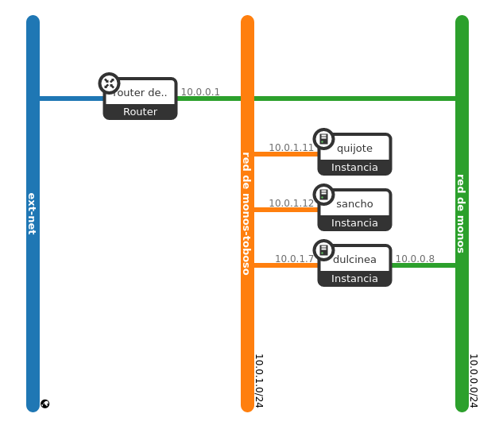
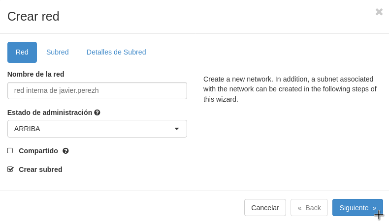
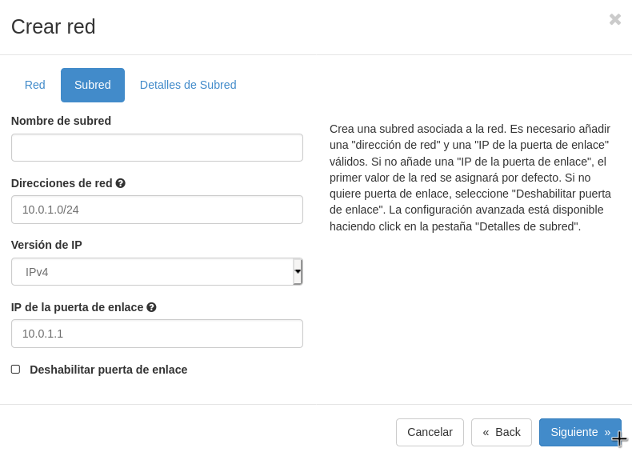
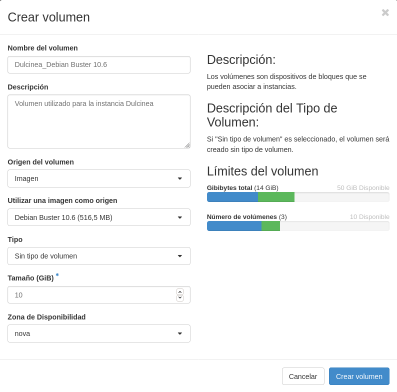
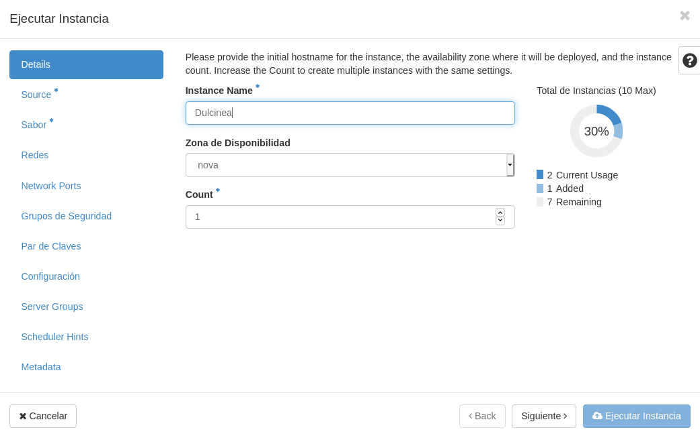
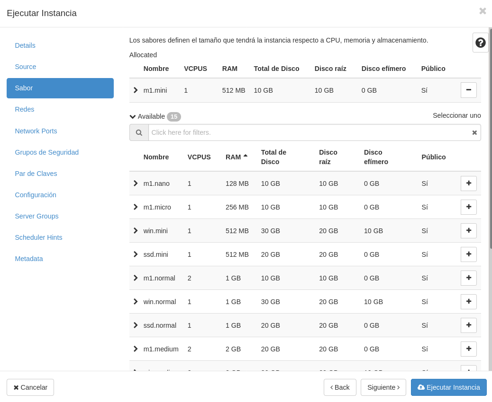
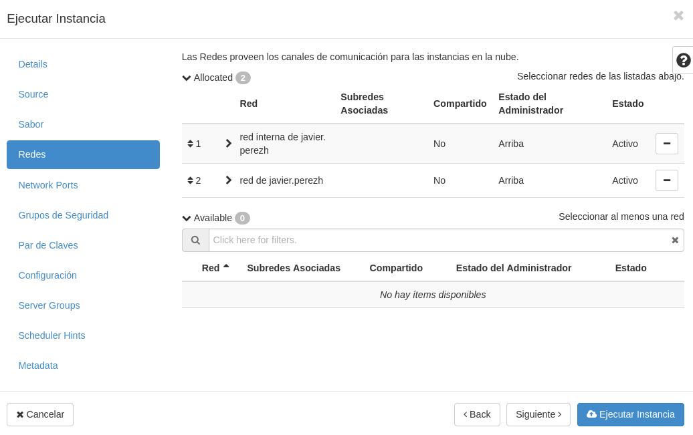
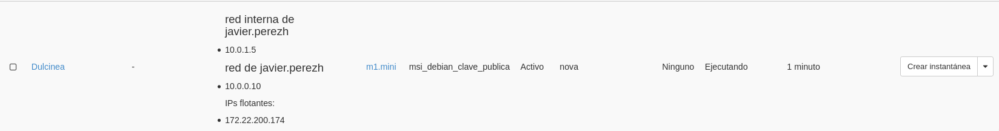
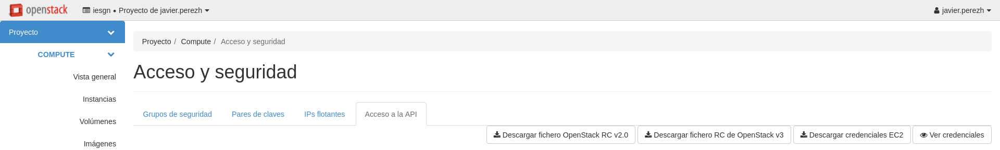

Title: Creación del escenario de trabajo en OpenStack
Date: 2020/11/12
Category: Cloud Computing
Header_Cover: theme/images/banner-hlc.jpg
Tags: OpenStack

**En esta tarea se va a crear el escenario de trabajo que se va a usar durante todo el curso, que va a constar inicialmente de 3 instancias con nombres relacionados con el libro "Don Quijote de la Mancha".**

**Pasos a realizar:**

**1. Creación de la red interna:**

- **Nombre red interna de (nombre de usuario)**
- **10.0.1.0/24**

Levantamos la VPN:

<pre>
systemctl start openvpn.service
</pre>

Creación de la red:

**2. Creación de las instancias:**

- **Dulcinea:**

    - **Debian Buster sobre volumen de 10GB con sabor m1.mini**
    - **Accesible directamente a través de la red externa y con una IP flotante**
    - **Conectada a la red interna, de la que será la puerta de enlace**

Creación de **Dulcinea**:

Creamos el volumen:

Instancia:

<pre>
javier@debian:~$ ssh -A debian@172.22.200.174
The authenticity of host '172.22.200.174 (172.22.200.174)' can't be established.
ECDSA key fingerprint is SHA256:02tcuAKlKD7EDhB9XcFYBAXsFQ+j0cuD5cTXLoWZxHE.
Are you sure you want to continue connecting (yes/no)? yes
Warning: Permanently added '172.22.200.174' (ECDSA) to the list of known hosts.
Linux dulcinea 4.19.0-11-cloud-amd64 #1 SMP Debian 4.19.146-1 (2020-09-17) x86_64

The programs included with the Debian GNU/Linux system are free software;
the exact distribution terms for each program are described in the
individual files in /usr/share/doc/*/copyright.

Debian GNU/Linux comes with ABSOLUTELY NO WARRANTY, to the extent
permitted by applicable law.
</pre>

<pre>
root@dulcinea:/home/debian# passwd debian
New password:
Retype new password:
passwd: password updated successfully

root@dulcinea:/home/debian# passwd root
New password:
Retype new password:
passwd: password updated successfully
</pre>

- **Sancho:**

    - **Ubuntu 20.04 sobre volumen de 10GB con sabor m1.mini**
    - **Conectada a la red interna**
    - **Accesible indirectamente a través de dulcinea**

Vamos a repetir el mismo proceso que con **Dulcinea**.

Creamos el volumen:

Instancia:

<pre>
debian@dulcinea:~$ ssh ubuntu@10.0.1.8
The authenticity of host '10.0.1.8 (10.0.1.8)' can't be established.
ECDSA key fingerprint is SHA256:pI1VfiGw672VL++WhAu5C2J7VPK4SHPdD6PJWXP5l8Q.
Are you sure you want to continue connecting (yes/no)? yes
Warning: Permanently added '10.0.1.8' (ECDSA) to the list of known hosts.
Welcome to Ubuntu 20.04.1 LTS (GNU/Linux 5.4.0-48-generic x86_64)

 * Documentation:  https://help.ubuntu.com
 * Management:     https://landscape.canonical.com
 * Support:        https://ubuntu.com/advantage

  System information as of Thu Nov 12 11:21:33 UTC 2020

  System load:  0.68              Processes:             101
  Usage of /:   12.8% of 9.52GB   Users logged in:       0
  Memory usage: 36%               IPv4 address for ens3: 10.0.1.8
  Swap usage:   0%

1 update can be installed immediately.
0 of these updates are security updates.
To see these additional updates run: apt list --upgradable

The list of available updates is more than a week old.
To check for new updates run: sudo apt update

The programs included with the Ubuntu system are free software;
the exact distribution terms for each program are described in the
individual files in /usr/share/doc/*/copyright.

Ubuntu comes with ABSOLUTELY NO WARRANTY, to the extent permitted by
applicable law.

To run a command as administrator (user "root"), use "sudo <command>".
See "man sudo_root" for details.

ubuntu@sancho:~$
</pre>

<pre>
root@sancho:/home/ubuntu# passwd ubuntu
New password:
Retype new password:
passwd: password updated successfully

root@sancho:/home/ubuntu# passwd root
New password:
Retype new password:
passwd: password updated successfully
</pre>

- **Quijote:**

    - **CentOS 7 sobre volumen de 10GB con sabor m1.mini**
    - **Conectada a la red interna**
    - **Accesible indirectamente a través de dulcinea**

  Y por último repetimos el proceso para crear a **Quijote**.

Creamos el volumen:

Instancia:

<pre>
debian@dulcinea:~$ ssh centos@10.0.1.4
The authenticity of host '10.0.1.4 (10.0.1.4)' can't be established.
ECDSA key fingerprint is SHA256:M40LvGOKlrafavtqmYPTSfp5QATqqRYGitJjqhGIzBI.
Are you sure you want to continue connecting (yes/no)? yes
Warning: Permanently added '10.0.1.4' (ECDSA) to the list of known hosts.

[centos@quijote ~]$
</pre>

<pre>
[root@quijote centos]# passwd centos
Changing password for user centos.
New password:
Retype new password:
passwd: all authentication tokens updated successfully.

[root@quijote centos]# passwd root
Changing password for user root.
New password:
Retype new password:
passwd: all authentication tokens updated successfully.
</pre>

**3. Configuración de NAT en Dulcinea (Es necesario deshabilitar la seguridad en todos los puertos de Dulcinea) Ver este [vídeo](https://youtu.be/jqfILWzHrS0).**

Para hacer NAT en **Dulcinea** hacia **Quijote** y **Sancho**, tenemos que modificar el grupo de seguridad de **Dulcinea** y deshabilitar la seguridad de todos sus puertos, es decir, quitarle las reglas de cortafuegos, para luego añadirle nuestra propia regla de `iptables`.

Para ello tenemos que configurar *OpenStack* para administrar nuestro proyecto desde la línea de comandos, que es desde donde vamos a realizar este proceso.

Vamos a crear un entorno virtual y trabajaremos desde aquí. Es necesario instalar estos paquetes:

<pre>
apt install python-virtualenv python3-pip -y
</pre>

Creamos nuestro entorno virtual:

<pre>
javier@debian:~/openstack$ python3 -m venv openstack

javier@debian:~/openstack$ source openstack/bin/activate

(openstack) javier@debian:~/openstack$
</pre>

Una vez estemos en nuestro entorno virtual, vamos a realizar la instalación del paquete `python-openstackclient`, que es el que necesitamos para administrar nuestra cuenta de *OpenStack*. Antes de realizar la instalación recomiendo actualizar la herramienta `pip`.

<pre>
(openstack) javier@debian:~/openstack$ pip install --upgrade pip

(openstack) javier@debian:~/openstack$ pip install python-openstackclient
</pre>

Una vez tenemos instalado este paquete, nos quedaría vincular nuestra cuenta. Para llevar a cabo el proceso de vinculación, debemos dirigirnos desde el navegador hacia el gestor de nuestro proyecto, e irnos al apartado de **Acceso y seguridad** y **Acceso a la API**. Obtendremos esta salida:

Podemos observar que nos muestra unos ficheros para descargar, debemos hacer click en el llamado **Descargar fichero RC de OpenStack v3**. Una vez descargado, lo movemos al directorio donde hemos creado el entorno virtual.

<pre>
(openstack) javier@debian:~/openstack$ ls
 openstack  'Proyecto de javier.perezh-openrc.sh'
</pre>

En mi caso, el archivo descargado recibe el nombre **Proyecto de javier.perezh-openrc.sh**, y en él, vamos a introducir la siguiente línea, donde especificaremos la ruta donde se encuentra el certificado del Gonzalo Nazareno, que es la entidad que maneja los proyectos de *OpenStack*, entre los cuáles se encuentra el mío.

<pre>
export OS_CACERT=/etc/ssl/certs/gonzalonazareno.crt
</pre>

En este punto, ya podríamos iniciar el proceso de vinculación desde la terminal. Ejecutamos el siguiente comando para verificar nuestras credenciales e iniciar sesión.

<pre>
(openstack) javier@debian:~/openstack$ source 'Proyecto de javier.perezh-openrc.sh'
Please enter your OpenStack Password for project Proyecto de javier.perezh as user javier.perezh:
</pre>

Si hemos introducido correctamente la contraseña, ya podríamos administrar nuestro proyecto desde la terminal. Por ejemplo, podemos listar nuestras instancias:

<pre>
(openstack) javier@debian:~/openstack$ openstack server list
+--------------------------------------+----------------------+--------+---------------------------------------------------------------------------------------+--------------------------+---------+
| ID                                   | Name                 | Status | Networks                                                                              | Image                    | Flavor  |
+--------------------------------------+----------------------+--------+---------------------------------------------------------------------------------------+--------------------------+---------+
| c7f6c834-1eeb-402a-9ed2-5ce1cb1246a2 | Quijote              | ACTIVE | red interna de javier.perezh=10.0.1.4                                                 | N/A (booted from volume) | m1.mini |
| bff8a1d9-01d8-4835-9513-fb49290f11ed | Sancho               | ACTIVE | red interna de javier.perezh=10.0.1.8                                                 | N/A (booted from volume) | m1.mini |
| 1e501c2a-69dd-40ea-9d89-8fb97a355b27 | Dulcinea             | ACTIVE | red de javier.perezh=10.0.0.10, 172.22.200.174; red interna de javier.perezh=10.0.1.5 | N/A (booted from volume) | m1.mini |
| 1228132f-73ae-4ccf-9216-bf17fab31d12 | Deb10-ServidorNginx2 | ACTIVE | red de javier.perezh=10.0.0.9                                                         | N/A (booted from volume) | m1.mini |
| 70264938-6486-4db0-af71-89d0037f3d54 | Deb10-ServidorNginx  | ACTIVE | red de javier.perezh=10.0.0.3, 172.22.200.116                                         | N/A (booted from volume) | m1.mini |
+--------------------------------------+----------------------+--------+---------------------------------------------------------------------------------------+--------------------------+---------+
</pre>

Vemos como nos muestra las instancias creadas, entre las cuáles se encuentran las tres que formarán el escenario, **Quijote**, **Sancho** y **Dulcinea**.

Antes estuvimos realizando las comprobaciones de que efectivamente nos podíamos conectar a estas máquinas, esto se debe a que tiene un grupo de seguridad asociado, llamado `default`, que por defecto se asocia a las instancias que lanzamos, y que permite esta opción, entre otras.

Lo que vamos a hacer es eliminar este grupo de seguridad a **Dulcinea**, por tanto, ya no podríamos conectarnos a ella, pero luego vamos a deshabilitar la seguridad de puertos, y ya de nuevo, sería accesible mediante *SSH*.

Primeramente. vamos a ver los detalles de esta instancia:

<pre>
(openstack) javier@debian:~/openstack$ openstack server show Dulcinea
+-----------------------------+---------------------------------------------------------------------------------------+
| Field                       | Value                                                                                 |
+-----------------------------+---------------------------------------------------------------------------------------+
| OS-DCF:diskConfig           | AUTO                                                                                  |
| OS-EXT-AZ:availability_zone | nova                                                                                  |
| OS-EXT-STS:power_state      | Running                                                                               |
| OS-EXT-STS:task_state       | None                                                                                  |
| OS-EXT-STS:vm_state         | active                                                                                |
| OS-SRV-USG:launched_at      | 2020-11-12T11:02:24.000000                                                            |
| OS-SRV-USG:terminated_at    | None                                                                                  |
| accessIPv4                  |                                                                                       |
| accessIPv6                  |                                                                                       |
| addresses                   | red de javier.perezh=10.0.0.10, 172.22.200.174; red interna de javier.perezh=10.0.1.5 |
| config_drive                |                                                                                       |
| created                     | 2020-11-12T11:02:01Z                                                                  |
| flavor                      | m1.mini (12)                                                                          |
| hostId                      | 1cd650c7bff842c92682e8bc3d0d184f4ddcc2e41fc41ae8487eeb6a                              |
| id                          | 1e501c2a-69dd-40ea-9d89-8fb97a355b27                                                  |
| image                       | N/A (booted from volume)                                                              |
| key_name                    | msi_debian_clave_publica                                                              |
| name                        | Dulcinea                                                                              |
| progress                    | 0                                                                                     |
| project_id                  | 678e0304a62c445ba78d3b825cb4f1ab                                                      |
| properties                  |                                                                                       |
| security_groups             | name='default'                                                                        |
|                             | name='default'                                                                        |
| status                      | ACTIVE                                                                                |
| updated                     | 2020-11-12T11:02:24Z                                                                  |
| user_id                     | fc6228f3de9b2e4abfc00a526192e37c323cde31412ffd98d1bf7c584915f35a                      |
| volumes_attached            | id='9bd08310-3e86-4146-b70f-68950c86749f'                                             |
+-----------------------------+---------------------------------------------------------------------------------------+
</pre>

Vemos como efectivamente posee el grupo de seguridad `default` comentando anteriormente.

Procedemos a eliminar este grupo de seguridad:

<pre>

</pre>

**4.Definición de contraseña en todas las instancias (para poder modificarla desde consola en caso necesario)**

Dulcinea:

<pre>
root@dulcinea:/home/debian# passwd debian
New password:
Retype new password:
passwd: password updated successfully

root@dulcinea:/home/debian# passwd root
New password:
Retype new password:
passwd: password updated successfully
</pre>

Sancho:

<pre>
root@sancho:/home/ubuntu# passwd ubuntu
New password:
Retype new password:
passwd: password updated successfully

root@sancho:/home/ubuntu# passwd root
New password:
Retype new password:
passwd: password updated successfully
</pre>

Quijote:

<pre>
[root@quijote centos]# passwd centos
Changing password for user centos.
New password:
Retype new password:
passwd: all authentication tokens updated successfully.

[root@quijote centos]# passwd root
Changing password for user root.
New password:
Retype new password:
passwd: all authentication tokens updated successfully.
</pre>

**5. Modificación de las instancias sancho y quijote para que usen direccionamiento estático y dulcinea como puerta de enlace**

<pre>
root@dulcinea:~# nano /etc/sysctl.conf

root@dulcinea:~# sysctl -p /etc/sysctl.conf
net.ipv4.ip_forward = 1

root@dulcinea:~# iptables -t nat -A POSTROUTING -s 10.0.1.0/24 -o eth1 -j MASQUERADE
</pre>

**6. Modificación de la subred de la red interna, deshabilitando el servidor DHCP**

**7. Utilización de ssh-agent para acceder a las instancias**

**8. Creación del usuario profesor en todas las instancias. Usuario que puede utilizar sudo sin contraseña**

**9. Copia de las claves públicas de todos los profesores en las instancias para que puedan acceder con el usuario profesor**

**10. Realiza una actualización completa de todos los servidores**

**11. Configura el servidor con el nombre de dominio <nombre-usuario>.gonzalonazareno.org**

**12. Hasta que no esté configurado el servidor DNS, incluye resolución estática en las tres instancias tanto usando nombre completo como hostname**

**13. Asegúrate que el servidor tiene sincronizado su reloj utilizando un servidor NTP externo**
