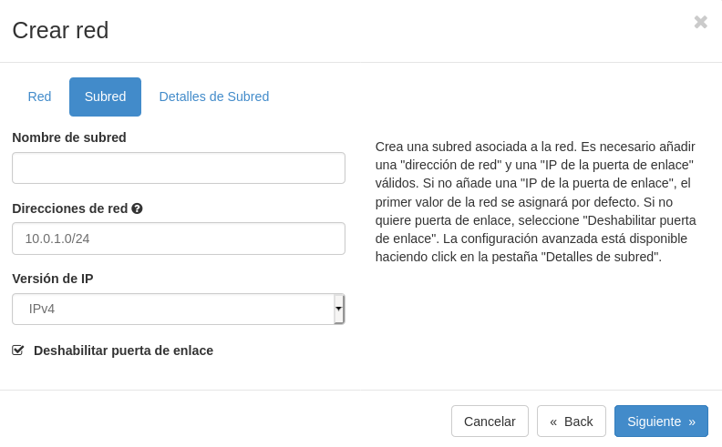
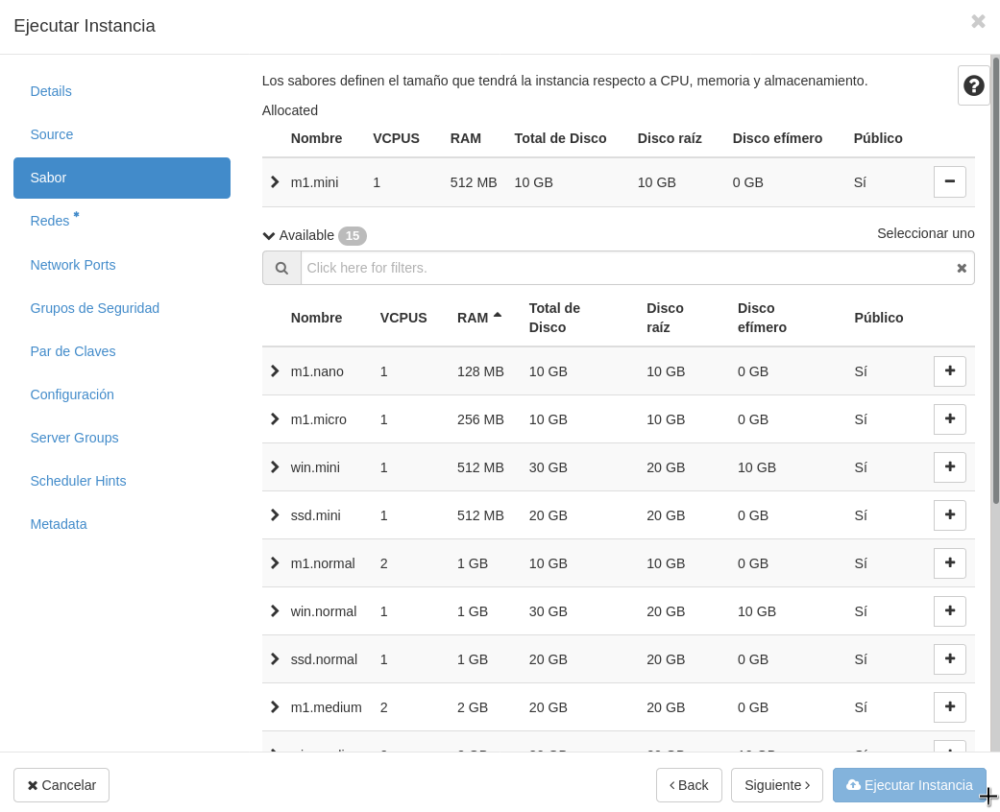

Title: Creación del escenario de trabajo en OpenStack
Date: 2020/11/12
Category: Cloud Computing
Header_Cover: theme/images/banner-hlc.jpg
Tags: OpenStack

**En esta tarea se va a crear el escenario de trabajo que se va a usar durante todo el curso, que va a constar inicialmente de 3 instancias con nombres relacionados con el libro "Don Quijote de la Mancha".**

**Pasos a realizar:**

**1. Creación de la red interna:**

- **Nombre red interna de (nombre de usuario)**
- **10.0.1.0/24**

Creación de la red:

**2. Creación de las instancias:**

- **Dulcinea:**

    - **Debian Buster sobre volumen de 10GB con sabor m1.mini**
    - **Accesible directamente a través de la red externa y con una IP flotante**
    - **Conectada a la red interna, de la que será la puerta de enlace**

Creación de **Dulcinea**:

Creamos el volumen:

Instancia:

<pre>
javier@debian:~$ ssh -A debian@172.22.200.174
The authenticity of host '172.22.200.174 (172.22.200.174)' can't be established.
ECDSA key fingerprint is SHA256:02tcuAKlKD7EDhB9XcFYBAXsFQ+j0cuD5cTXLoWZxHE.
Are you sure you want to continue connecting (yes/no)? yes
Warning: Permanently added '172.22.200.174' (ECDSA) to the list of known hosts.
Linux dulcinea 4.19.0-11-cloud-amd64 #1 SMP Debian 4.19.146-1 (2020-09-17) x86_64

The programs included with the Debian GNU/Linux system are free software;
the exact distribution terms for each program are described in the
individual files in /usr/share/doc/*/copyright.

Debian GNU/Linux comes with ABSOLUTELY NO WARRANTY, to the extent
permitted by applicable law.
</pre>

<pre>
root@dulcinea:/home/debian# passwd debian
New password:
Retype new password:
passwd: password updated successfully

root@dulcinea:/home/debian# passwd root
New password:
Retype new password:
passwd: password updated successfully
</pre>

- **Sancho:**

    - **Ubuntu 20.04 sobre volumen de 10GB con sabor m1.mini**
    - **Conectada a la red interna**
    - **Accesible indirectamente a través de dulcinea**

Vamos a repetir el mismo proceso que con **Dulcinea**.

Creamos el volumen:

Instancia:

- **Quijote:**

    - **CentOS 7 sobre volumen de 10GB con sabor m1.mini**
    - **Conectada a la red interna**
    - **Accesible indirectamente a través de dulcinea**

  Y por último repetimos el proceso para crear a **Quijote**.

Creamos el volumen:

Instancia:

**3. Configuración de NAT en Dulcinea (Es necesario deshabilitar la seguridad en todos los puertos de dulcinea) [[https://youtu.be/jqfILWzHrS0]]**

**4.Definición de contraseña en todas las instancias (para poder modificarla desde consola en caso necesario)**

**5. Modificación de las instancias sancho y quijote para que usen direccionamiento estático y dulcinea como puerta de enlace**

**6. Modificación de la subred de la red interna, deshabilitando el servidor DHCP**

**7. Utilización de ssh-agent para acceder a las instancias**

**8. Creación del usuario profesor en todas las instancias. Usuario que puede utilizar sudo sin contraseña**

**9. Copia de las claves públicas de todos los profesores en las instancias para que puedan acceder con el usuario profesor**

**10. Realiza una actualización completa de todos los servidores**

**11. Configura el servidor con el nombre de dominio <nombre-usuario>.gonzalonazareno.org**

**12. Hasta que no esté configurado el servidor DNS, incluye resolución estática en las tres instancias tanto usando nombre completo como hostname**

**13. Asegúrate que el servidor tiene sincronizado su reloj utilizando un servidor NTP externo**
