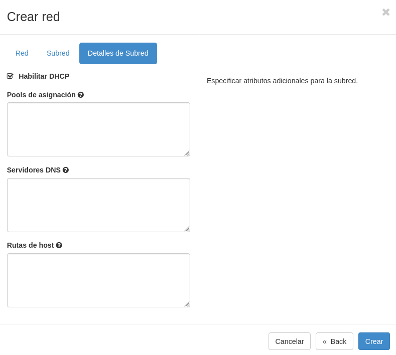
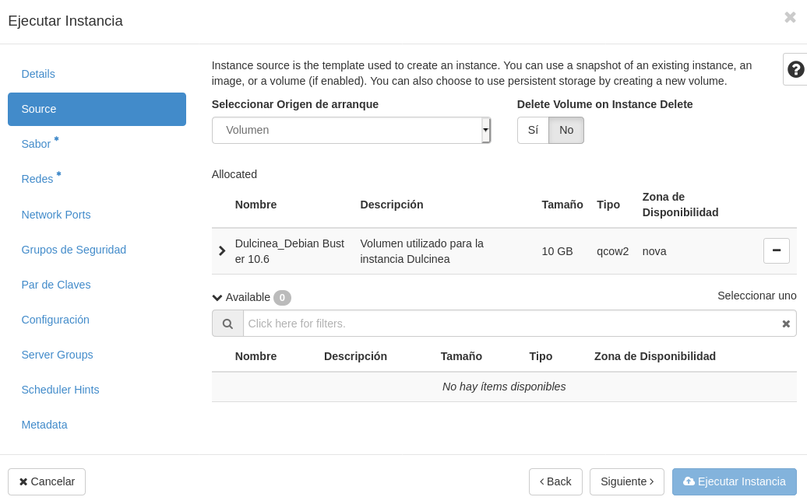
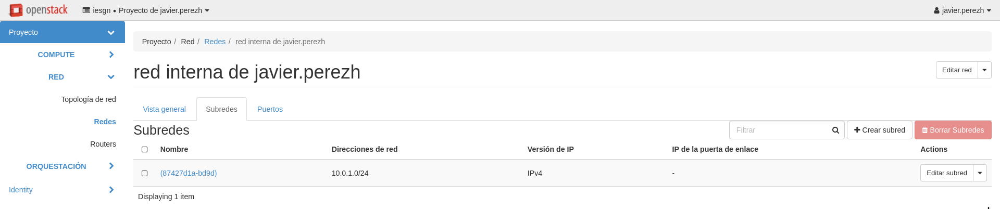

Title: Creación del escenario de trabajo en OpenStack
Date: 2020/11/12
Category: Cloud Computing
Header_Cover: theme/images/banner-hlc.jpg
Tags: OpenStack

**En esta tarea se va a crear el escenario de trabajo que se va a usar durante todo el curso, que va a constar inicialmente de 3 instancias con nombres relacionados con el libro "Don Quijote de la Mancha".**

**Pasos a realizar:**

**1. Creación de la red interna:**

- **Nombre red interna de (nombre de usuario)**
- **10.0.1.0/24**

Levantamos la VPN:

<pre>
systemctl start openvpn.service
</pre>

Creación de la red:

Deshabilitamos la puerta de enlace ya que no nos va hacer falta debido a que vamos a poner a *Dulcinea*.

**2. Creación de las instancias:**

- **Dulcinea:**

    - **Debian Buster sobre volumen de 10GB con sabor m1.mini**
    - **Accesible directamente a través de la red externa y con una IP flotante**
    - **Conectada a la red interna, de la que será la puerta de enlace**

Creación de **Dulcinea**:

Creamos el volumen:

Instancia:

<pre>
javier@debian:~$ ssh -A debian@172.22.200.174
The authenticity of host '172.22.200.174 (172.22.200.174)' can't be established.
ECDSA key fingerprint is SHA256:02tcuAKlKD7EDhB9XcFYBAXsFQ+j0cuD5cTXLoWZxHE.
Are you sure you want to continue connecting (yes/no)? yes
Warning: Permanently added '172.22.200.174' (ECDSA) to the list of known hosts.
Linux dulcinea 4.19.0-11-cloud-amd64 #1 SMP Debian 4.19.146-1 (2020-09-17) x86_64

The programs included with the Debian GNU/Linux system are free software;
the exact distribution terms for each program are described in the
individual files in /usr/share/doc/*/copyright.

Debian GNU/Linux comes with ABSOLUTELY NO WARRANTY, to the extent
permitted by applicable law.
</pre>

- **Sancho:**

    - **Ubuntu 20.04 sobre volumen de 10GB con sabor m1.mini**
    - **Conectada a la red interna**
    - **Accesible indirectamente a través de dulcinea**

Vamos a repetir el mismo proceso que con **Dulcinea**.

Creamos el volumen:

Instancia:

<pre>
debian@dulcinea:~$ ssh ubuntu@10.0.1.8
The authenticity of host '10.0.1.8 (10.0.1.8)' can't be established.
ECDSA key fingerprint is SHA256:pI1VfiGw672VL++WhAu5C2J7VPK4SHPdD6PJWXP5l8Q.
Are you sure you want to continue connecting (yes/no)? yes
Warning: Permanently added '10.0.1.8' (ECDSA) to the list of known hosts.
Welcome to Ubuntu 20.04.1 LTS (GNU/Linux 5.4.0-48-generic x86_64)

 * Documentation:  https://help.ubuntu.com
 * Management:     https://landscape.canonical.com
 * Support:        https://ubuntu.com/advantage

  System information as of Thu Nov 12 11:21:33 UTC 2020

  System load:  0.68              Processes:             101
  Usage of /:   12.8% of 9.52GB   Users logged in:       0
  Memory usage: 36%               IPv4 address for ens3: 10.0.1.8
  Swap usage:   0%

1 update can be installed immediately.
0 of these updates are security updates.
To see these additional updates run: apt list --upgradable

The list of available updates is more than a week old.
To check for new updates run: sudo apt update

The programs included with the Ubuntu system are free software;
the exact distribution terms for each program are described in the
individual files in /usr/share/doc/*/copyright.

Ubuntu comes with ABSOLUTELY NO WARRANTY, to the extent permitted by
applicable law.

To run a command as administrator (user "root"), use "sudo <command>".
See "man sudo_root" for details.

ubuntu@sancho:~$
</pre>

- **Quijote:**

    - **CentOS 7 sobre volumen de 10GB con sabor m1.mini**
    - **Conectada a la red interna**
    - **Accesible indirectamente a través de dulcinea**

  Y por último repetimos el proceso para crear a **Quijote**.

Creamos el volumen:

Instancia:

<pre>
debian@dulcinea:~$ ssh centos@10.0.1.4
The authenticity of host '10.0.1.4 (10.0.1.4)' can't be established.
ECDSA key fingerprint is SHA256:M40LvGOKlrafavtqmYPTSfp5QATqqRYGitJjqhGIzBI.
Are you sure you want to continue connecting (yes/no)? yes
Warning: Permanently added '10.0.1.4' (ECDSA) to the list of known hosts.

[centos@quijote ~]$
</pre>

**3. Configuración de NAT en Dulcinea (Es necesario deshabilitar la seguridad en todos los puertos de Dulcinea) Ver este [vídeo](https://youtu.be/jqfILWzHrS0).**

Para hacer NAT en **Dulcinea** hacia **Quijote** y **Sancho**, tenemos que modificar el grupo de seguridad de **Dulcinea** y deshabilitar la seguridad de todos sus puertos, es decir, quitarle las reglas de cortafuegos, para luego añadirle nuestra propia regla de `iptables`.

Para ello tenemos que configurar *OpenStack* para administrar nuestro proyecto desde la línea de comandos, que es desde donde vamos a realizar este proceso.

Vamos a crear un entorno virtual y trabajaremos desde aquí. Es necesario instalar estos paquetes:

<pre>
apt install python-virtualenv python3-pip -y
</pre>

Creamos nuestro entorno virtual:

<pre>
javier@debian:~/openstack$ python3 -m venv openstack

javier@debian:~/openstack$ source openstack/bin/activate

(openstack) javier@debian:~/openstack$
</pre>

Una vez estemos en nuestro entorno virtual, vamos a realizar la instalación del paquete `python-openstackclient`, que es el que necesitamos para administrar nuestra cuenta de *OpenStack*. Antes de realizar la instalación recomiendo actualizar la herramienta `pip`.

<pre>
(openstack) javier@debian:~/openstack$ pip install --upgrade pip

(openstack) javier@debian:~/openstack$ pip install python-openstackclient
</pre>

Una vez tenemos instalado este paquete, nos quedaría vincular nuestra cuenta. Para llevar a cabo el proceso de vinculación, debemos dirigirnos desde el navegador hacia el gestor de nuestro proyecto, e irnos al apartado de **Acceso y seguridad** y **Acceso a la API**. Obtendremos esta salida:

Podemos observar que nos muestra unos ficheros para descargar, debemos hacer click en el llamado **Descargar fichero RC de OpenStack v3**. Una vez descargado, lo movemos al directorio donde hemos creado el entorno virtual.

<pre>
(openstack) javier@debian:~/openstack$ ls
 openstack  'Proyecto de javier.perezh-openrc.sh'
</pre>

En mi caso, el archivo descargado recibe el nombre **Proyecto de javier.perezh-openrc.sh**, y en él, vamos a introducir la siguiente línea, donde especificaremos la ruta donde se encuentra el certificado del Gonzalo Nazareno, que es la entidad que maneja los proyectos de *OpenStack*, entre los cuáles se encuentra el mío.

<pre>
export OS_CACERT=/etc/ssl/certs/gonzalonazareno.crt
</pre>

En este punto, ya podríamos iniciar el proceso de vinculación desde la terminal. Ejecutamos el siguiente comando para verificar nuestras credenciales e iniciar sesión.

<pre>
(openstack) javier@debian:~/openstack$ source 'Proyecto de javier.perezh-openrc.sh'
Please enter your OpenStack Password for project Proyecto de javier.perezh as user javier.perezh:
</pre>

Si hemos introducido correctamente la contraseña, ya podríamos administrar nuestro proyecto desde la terminal. Por ejemplo, podemos listar nuestras instancias:

<pre>
(openstack) javier@debian:~/openstack$ openstack server list
+--------------------------------------+----------------------+--------+---------------------------------------------------------------------------------------+--------------------------+---------+
| ID                                   | Name                 | Status | Networks                                                                              | Image                    | Flavor  |
+--------------------------------------+----------------------+--------+---------------------------------------------------------------------------------------+--------------------------+---------+
| c7f6c834-1eeb-402a-9ed2-5ce1cb1246a2 | Quijote              | ACTIVE | red interna de javier.perezh=10.0.1.4                                                 | N/A (booted from volume) | m1.mini |
| bff8a1d9-01d8-4835-9513-fb49290f11ed | Sancho               | ACTIVE | red interna de javier.perezh=10.0.1.8                                                 | N/A (booted from volume) | m1.mini |
| 1e501c2a-69dd-40ea-9d89-8fb97a355b27 | Dulcinea             | ACTIVE | red de javier.perezh=10.0.0.10, 172.22.200.174; red interna de javier.perezh=10.0.1.5 | N/A (booted from volume) | m1.mini |
| 1228132f-73ae-4ccf-9216-bf17fab31d12 | Deb10-ServidorNginx2 | ACTIVE | red de javier.perezh=10.0.0.9                                                         | N/A (booted from volume) | m1.mini |
| 70264938-6486-4db0-af71-89d0037f3d54 | Deb10-ServidorNginx  | ACTIVE | red de javier.perezh=10.0.0.3, 172.22.200.116                                         | N/A (booted from volume) | m1.mini |
+--------------------------------------+----------------------+--------+---------------------------------------------------------------------------------------+--------------------------+---------+
</pre>

Vemos como nos muestra las instancias creadas, entre las cuáles se encuentran las tres que formarán el escenario, **Quijote**, **Sancho** y **Dulcinea**.

Antes estuvimos realizando las comprobaciones de que efectivamente nos podíamos conectar a estas máquinas, esto se debe a que tiene un grupo de seguridad asociado, llamado `default`, que por defecto se asocia a las instancias que lanzamos, y que permite esta opción, entre otras.

Lo que vamos a hacer es eliminar este grupo de seguridad a **Dulcinea**, por tanto, ya no podríamos conectarnos a ella, pero luego vamos a deshabilitar la seguridad de puertos, y ya de nuevo, sería accesible mediante *SSH*.

Primeramente. vamos a ver los detalles de esta instancia:

<pre>
(openstack) javier@debian:~/openstack$ openstack server show Dulcinea
+-----------------------------+---------------------------------------------------------------------------------------+
| Field                       | Value                                                                                 |
+-----------------------------+---------------------------------------------------------------------------------------+
| OS-DCF:diskConfig           | AUTO                                                                                  |
| OS-EXT-AZ:availability_zone | nova                                                                                  |
| OS-EXT-STS:power_state      | Running                                                                               |
| OS-EXT-STS:task_state       | None                                                                                  |
| OS-EXT-STS:vm_state         | active                                                                                |
| OS-SRV-USG:launched_at      | 2020-11-12T11:02:24.000000                                                            |
| OS-SRV-USG:terminated_at    | None                                                                                  |
| accessIPv4                  |                                                                                       |
| accessIPv6                  |                                                                                       |
| addresses                   | red de javier.perezh=10.0.0.10, 172.22.200.174; red interna de javier.perezh=10.0.1.5 |
| config_drive                |                                                                                       |
| created                     | 2020-11-12T11:02:01Z                                                                  |
| flavor                      | m1.mini (12)                                                                          |
| hostId                      | 1cd650c7bff842c92682e8bc3d0d184f4ddcc2e41fc41ae8487eeb6a                              |
| id                          | 1e501c2a-69dd-40ea-9d89-8fb97a355b27                                                  |
| image                       | N/A (booted from volume)                                                              |
| key_name                    | msi_debian_clave_publica                                                              |
| name                        | Dulcinea                                                                              |
| progress                    | 0                                                                                     |
| project_id                  | 678e0304a62c445ba78d3b825cb4f1ab                                                      |
| properties                  |                                                                                       |
| security_groups             | name='default'                                                                        |
|                             | name='default'                                                                        |
| status                      | ACTIVE                                                                                |
| updated                     | 2020-11-12T11:02:24Z                                                                  |
| user_id                     | fc6228f3de9b2e4abfc00a526192e37c323cde31412ffd98d1bf7c584915f35a                      |
| volumes_attached            | id='9bd08310-3e86-4146-b70f-68950c86749f'                                             |
+-----------------------------+---------------------------------------------------------------------------------------+
</pre>

Vemos como efectivamente posee el grupo de seguridad `default` comentando anteriormente.

Procedemos a eliminar este grupo de seguridad:

<pre>
(openstack) javier@debian:~/openstack$ openstack server remove security group Dulcinea default
</pre>

Si vemos de nuevo los detalles de **Dulcinea**:

<pre>
(openstack) javier@debian:~/openstack$ openstack server show Dulcinea
+-----------------------------+---------------------------------------------------------------------------------------+
| Field                       | Value                                                                                 |
+-----------------------------+---------------------------------------------------------------------------------------+
| OS-DCF:diskConfig           | AUTO                                                                                  |
| OS-EXT-AZ:availability_zone | nova                                                                                  |
| OS-EXT-STS:power_state      | Running                                                                               |
| OS-EXT-STS:task_state       | None                                                                                  |
| OS-EXT-STS:vm_state         | active                                                                                |
| OS-SRV-USG:launched_at      | 2020-11-12T11:02:24.000000                                                            |
| OS-SRV-USG:terminated_at    | None                                                                                  |
| accessIPv4                  |                                                                                       |
| accessIPv6                  |                                                                                       |
| addresses                   | red de javier.perezh=10.0.0.10, 172.22.200.174; red interna de javier.perezh=10.0.1.5 |
| config_drive                |                                                                                       |
| created                     | 2020-11-12T11:02:01Z                                                                  |
| flavor                      | m1.mini (12)                                                                          |
| hostId                      | 1cd650c7bff842c92682e8bc3d0d184f4ddcc2e41fc41ae8487eeb6a                              |
| id                          | 1e501c2a-69dd-40ea-9d89-8fb97a355b27                                                  |
| image                       | N/A (booted from volume)                                                              |
| key_name                    | msi_debian_clave_publica                                                              |
| name                        | Dulcinea                                                                              |
| progress                    | 0                                                                                     |
| project_id                  | 678e0304a62c445ba78d3b825cb4f1ab                                                      |
| properties                  |                                                                                       |
| status                      | ACTIVE                                                                                |
| updated                     | 2020-11-12T11:02:24Z                                                                  |
| user_id                     | fc6228f3de9b2e4abfc00a526192e37c323cde31412ffd98d1bf7c584915f35a                      |
| volumes_attached            | id='9bd08310-3e86-4146-b70f-68950c86749f'                                             |
+-----------------------------+---------------------------------------------------------------------------------------+
</pre>

Podemos apreciar como ya no nos muestra el apartado **security_groups** ya que no posee ningún grupo de seguridad, lo que significa por tanto, que lo hemos eliminado.

Al eliminar el grupo de seguridad, se habilita un cortafuegos por defecto de *OpenStack*, que es la seguridad del puerto, que no permite el tráfico.

Por tanto, si ahora intentamos hacer un ping, o conectarnos mediante *SSH*:

<pre>
(openstack) javier@debian:~/openstack$ ping 172.22.200.174
PING 172.22.200.174 (172.22.200.174) 56(84) bytes of data.
^C
--- 172.22.200.174 ping statistics ---
5 packets transmitted, 0 received, 100% packet loss, time 106ms

(openstack) javier@debian:~/openstack$ ssh debian@172.22.200.174
^C
</pre>

Ya no responde y por tanto hemos perdido la conectividad a ella.

Si miramos el puertos de esta máquina, que nos lo mostrará mediante su IP fija, (en caso de **Dulcinea** la IP fija es la **10.0.0.10**) podemos apreciar el **ID** del puerto, la **MAC**, ...
Nos interesa el **ID** del puerto, ya que necesitamos utilizar el siguiente comando para deshabilitar la seguridad del puerto:

<pre>
(openstack) javier@debian:~/openstack$ openstack port set --disable-port-security ff9e0846-8ba8-42ec-b7be-bdb2b6279b1d
</pre>

Una vez hemos deshabilitado el cortafuegos que establece la seguridad del puerto, la máquina vuelve a estar accesible, ya que ahora la máquina tiene abiertos todo el rango de puertos completo, porque ahora no posee ningún cortafuegos.

Obviamente esto, no es recomendable en situaciones donde la máquina no se encuentre en un entorno que tengamos controlado, yo lo hago porque **Dulcinea** se encuentra en una nube privada, además de que vamos a establecer un cortafuegos desde dentro de la instancia.

Si volvemos a hacerle ping y a intentar una conexión mediante *SSH*:

<pre>
(openstack) javier@debian:~/openstack$ ping 172.22.200.174
PING 172.22.200.174 (172.22.200.174) 56(84) bytes of data.
64 bytes from 172.22.200.174: icmp_seq=1 ttl=61 time=80.5 ms
64 bytes from 172.22.200.174: icmp_seq=2 ttl=61 time=117 ms
64 bytes from 172.22.200.174: icmp_seq=3 ttl=61 time=77.7 ms
^C
--- 172.22.200.174 ping statistics ---
3 packets transmitted, 3 received, 0% packet loss, time 5ms
rtt min/avg/max/mdev = 77.683/91.631/116.705/17.768 ms

(openstack) javier@debian:~/openstack$ ssh debian@172.22.200.174
Linux dulcinea 4.19.0-11-cloud-amd64 #1 SMP Debian 4.19.146-1 (2020-09-17) x86_64

The programs included with the Debian GNU/Linux system are free software;
the exact distribution terms for each program are described in the
individual files in /usr/share/doc/*/copyright.

Debian GNU/Linux comes with ABSOLUTELY NO WARRANTY, to the extent
permitted by applicable law.
Last login: Thu Nov 12 11:26:50 2020 from 172.23.0.46
debian@dulcinea:~$
</pre>

Vemos que **Dulcinea** es completamente accesible.

También vamos a deshabilitar la seguridad del puerto cuya IP es la que posee **Dulcinea** de la red interna, es decir, la **10.0.1.5**.

<pre>
(openstack) javier@debian:~/openstack$ openstack port set --disable-port-security bad04056-63b4-4d73-afb0-fac3b9137699
</pre>

**4.Definición de contraseña en todas las instancias (para poder modificarla desde consola en caso necesario)**

Vamos a establecerle contraseñas a los usuarios, tanto al usuario sin privilegios como a *root*, de las tres instancias. Normalmente no nos va a ser necesario ya que accedemos mediante el par de claves, pero es muy recomendable para poder acceder a ellas si fuera necesario mediante la consola. Para ello vamos a utilizar la herramienta `passwd`.

**Dulcinea:**

<pre>
root@dulcinea:/home/debian# passwd debian
New password:
Retype new password:
passwd: password updated successfully

root@dulcinea:/home/debian# passwd root
New password:
Retype new password:
passwd: password updated successfully
</pre>

**Sancho:**

<pre>
root@sancho:/home/ubuntu# passwd ubuntu
New password:
Retype new password:
passwd: password updated successfully

root@sancho:/home/ubuntu# passwd root
New password:
Retype new password:
passwd: password updated successfully
</pre>

**Quijote:**

<pre>
[root@quijote centos]# passwd centos
Changing password for user centos.
New password:
Retype new password:
passwd: all authentication tokens updated successfully.

[root@quijote centos]# passwd root
Changing password for user root.
New password:
Retype new password:
passwd: all authentication tokens updated successfully.
</pre>

**5. Modificación de las instancias sancho y quijote para que usen direccionamiento estático y dulcinea como puerta de enlace**

Para realizar este paso, en **Dulcinea** debemos habilitar el **bit de forward** y añadir la regla de `iptables` necesaria.

<pre>
root@dulcinea:~# nano /etc/sysctl.conf

root@dulcinea:~# sysctl -p /etc/sysctl.conf
net.ipv4.ip_forward = 1

root@dulcinea:~# ip a
1: lo: <LOOPBACK,UP,LOWER_UP> mtu 65536 qdisc noqueue state UNKNOWN group default qlen 1000
    link/loopback 00:00:00:00:00:00 brd 00:00:00:00:00:00
    inet 127.0.0.1/8 scope host lo
       valid_lft forever preferred_lft forever
    inet6 ::1/128 scope host
       valid_lft forever preferred_lft forever
2: eth0: <BROADCAST,MULTICAST,UP,LOWER_UP> mtu 8950 qdisc pfifo_fast state UP group default qlen 1000
    link/ether fa:16:3e:f0:c8:77 brd ff:ff:ff:ff:ff:ff
    inet 10.0.0.10/24 brd 10.0.0.255 scope global dynamic eth0
       valid_lft 74650sec preferred_lft 74650sec
    inet6 fe80::f816:3eff:fef0:c877/64 scope link
       valid_lft forever preferred_lft forever
3: eth1: <BROADCAST,MULTICAST,UP,LOWER_UP> mtu 8950 qdisc pfifo_fast state UP group default qlen 1000
    link/ether fa:16:3e:ab:e3:8d brd ff:ff:ff:ff:ff:ff
    inet 10.0.1.5/24 brd 10.0.1.255 scope global dynamic eth1
       valid_lft 73883sec preferred_lft 73883sec
    inet6 fe80::f816:3eff:feab:e38d/64 scope link
       valid_lft forever preferred_lft forever

root@dulcinea:~# iptables -t nat -A POSTROUTING -s 10.0.1.0/24 -o eth0 -j MASQUERADE
</pre>

Hemos habilitado el **bit de forward** y hemos añadido la regla de `iptables` que necesitamos para que todo el tráfico que provenga de la red **10.0.1.0/24**, salga por la interfaz **eth0**, que es la red que se conecta con el exterior, por tanto ya habríamos configurado lo necesario en **Dulcinea**.

**Sancho**

Para establecer el direccionamiento estático en **Ubuntu**, debemos editar el fichero `/etc/netplan/50-cloud-init.yaml`.

<pre>
nano /etc/netplan/50-cloud-init.yaml
</pre>

En este fichero nos encontramos con esta configuración predeterminada:

<pre>
network:
    version: 2
    ethernets:
        ens3:
            dhcp4: true
            match:
                macaddress: fa:16:3e:17:7d:15
            mtu: 8950
            set-name: ens3
</pre>

Debemos sustituirlo por este bloque, en el que indicamos que el **DHCP4** pasa a ser desactivado, que la IP estática que le estamos asignando es la **10.0.1.8**, cuya máscara de red es una **255.255.255.0**, de ahí el **/24**, que la puerta de enlace es la **10.0.1.5**, es decir, la IP de *Dulcinea*, y que utilice esos **DNS** indicados.

<pre>
network:
    version: 2
    ethernets:
        ens3:
            dhcp4: no
            addresses: [10.0.1.8/24]
            gateway4: 10.0.1.5
            nameservers:
              addresses: [10.0.1.5, 8.8.8.8]
</pre>

Reiniciamos y aplicamos los cambios en las interfaces de red:

<pre>
netplan apply
</pre>

También reinicio la máquina para verificar que en cada inicio se aplicará esta configuración:

<pre>
root@sancho:~# reboot

root@sancho:~# Connection to 10.0.1.8 closed by remote host.
Connection to 10.0.1.8 closed.

debian@dulcinea:~$ ssh ubuntu@10.0.1.8
Welcome to Ubuntu 20.04.1 LTS (GNU/Linux 5.4.0-48-generic x86_64)

...

Last login: Sat Nov 14 10:04:52 2020 from 10.0.1.5

ubuntu@sancho:~$ ip a
1: lo: <LOOPBACK,UP,LOWER_UP> mtu 65536 qdisc noqueue state UNKNOWN group default qlen 1000
    link/loopback 00:00:00:00:00:00 brd 00:00:00:00:00:00
    inet 127.0.0.1/8 scope host lo
       valid_lft forever preferred_lft forever
    inet6 ::1/128 scope host
       valid_lft forever preferred_lft forever
2: ens3: <BROADCAST,MULTICAST,UP,LOWER_UP> mtu 1500 qdisc fq_codel state UP group default qlen 1000
    link/ether fa:16:3e:17:7d:15 brd ff:ff:ff:ff:ff:ff
    inet 10.0.1.8/24 brd 10.0.1.255 scope global ens3
       valid_lft forever preferred_lft forever
    inet6 fe80::f816:3eff:fe17:7d15/64 scope link
       valid_lft forever preferred_lft forever

ubuntu@sancho:~$ ip r
default via 10.0.1.5 dev ens3 proto static
10.0.1.0/24 dev ens3 proto kernel scope link src 10.0.1.8

ubuntu@sancho:~$ ping www.google.es
PING www.google.es (216.58.209.67) 56(84) bytes of data.
64 bytes from mad07s22-in-f3.1e100.net (216.58.209.67): icmp_seq=1 ttl=112 time=44.5 ms
64 bytes from mad07s22-in-f3.1e100.net (216.58.209.67): icmp_seq=2 ttl=112 time=43.5 ms
^C
--- www.google.es ping statistics ---
2 packets transmitted, 2 received, 0% packet loss, time 1001ms
rtt min/avg/max/mdev = 43.542/44.002/44.463/0.460 ms

ubuntu@sancho:~$
</pre>

Podemos ver como efectivamente nos ha aplicado la configuración, poseemos una IP estática y la puerta de enlace es la IP de *Dulcinea*, y además comprobamos que poseemos conectividad al exterior, y podemos disfrutar de una resolución de nombres satisfactoria.

**Quijote**

Para establecer el direccionamiento estático en **CentOS 7**, debemos editar el fichero `/etc/sysconfig/network-scripts/ifcfg-eth0`. En *CentOS* por defecto no viene instalado el editor de texto `nano`, que es el que suelo utilizar y el que más me gusta, por tanto tenemos que utilizar `vi`, de momento...

<pre>
[root@quijote ~]# vi /etc/sysconfig/network-scripts/ifcfg-eth0
</pre>

En este archivo nos encontramos con esta configuración predeterminada:

<pre>
BOOTPROTO=dhcp
DEVICE=eth0
HWADDR=fa:16:3e:84:6d:fb
MTU=8950
ONBOOT=yes
TYPE=Ethernet
USERCTL=no
</pre>

Debemos sustituirlo por este bloque, en el que indicamos que en el apartado **BOOTPROTO**, la IP ahora se establece como estática, y el **DHCP4** pasa a ser desactivado, que la IP estática que le estamos asignando es la **10.0.1.4**, cuya máscara de red es una **255.255.255.0**, que la puerta de enlace es la **10.0.1.5**, es decir, la IP de *Dulcinea*, y que utilice esos **DNS** indicados. Es importante establecer en el apartado **ONBOOT** el valor *yes*, ya que esto hará que esta configuración se active en cada inicio del sistema.

<pre>
OTPROTO=static
DEVICE=eth0
HWADDR=fa:16:3e:84:6d:fb
MTU=8950
ONBOOT=yes
TYPE=Ethernet
USERCTL=no
IPADDR=10.0.1.4
NETMASK=255.255.255.0
GATEWAY=10.0.1.5
DNS1=10.0.1.5
DNS2=8.8.8.8
</pre>

Reiniciamos y aplicamos los cambios en las interfaces de red:

<pre>
systemctl restart network.service
</pre>

También reinicio la máquina para verificar que en cada inicio se aplicará esta configuración:

<pre>
[root@quijote ~]# reboot
Connection to 10.0.1.4 closed by remote host.
Connection to 10.0.1.4 closed.

debian@dulcinea:~$ ssh centos@10.0.1.4
Last login: Sat Nov 14 11:29:18 2020 from gateway

[centos@quijote ~]$ ip a
1: lo: <LOOPBACK,UP,LOWER_UP> mtu 65536 qdisc noqueue state UNKNOWN group default qlen 1000
    link/loopback 00:00:00:00:00:00 brd 00:00:00:00:00:00
    inet 127.0.0.1/8 scope host lo
       valid_lft forever preferred_lft forever
    inet6 ::1/128 scope host
       valid_lft forever preferred_lft forever
2: eth0: <BROADCAST,MULTICAST,UP,LOWER_UP> mtu 8950 qdisc pfifo_fast state UP group default qlen 1000
    link/ether fa:16:3e:84:6d:fb brd ff:ff:ff:ff:ff:ff
    inet 10.0.1.4/24 brd 10.0.1.255 scope global eth0
       valid_lft forever preferred_lft forever
    inet6 fe80::f816:3eff:fe84:6dfb/64 scope link
       valid_lft forever preferred_lft forever

[centos@quijote ~]$ ip r
default via 10.0.1.5 dev eth0
10.0.1.0/24 dev eth0 proto kernel scope link src 10.0.1.4

[centos@quijote ~]$ ping www.google.es
PING www.google.es (216.58.215.131) 56(84) bytes of data.
64 bytes from mad41s04-in-f3.1e100.net (216.58.215.131): icmp_seq=1 ttl=112 time=42.9 ms
64 bytes from mad41s04-in-f3.1e100.net (216.58.215.131): icmp_seq=2 ttl=112 time=43.1 ms
64 bytes from mad41s04-in-f3.1e100.net (216.58.215.131): icmp_seq=3 ttl=112 time=43.3 ms
^C
--- www.google.es ping statistics ---
3 packets transmitted, 3 received, 0% packet loss, time 2002ms
rtt min/avg/max/mdev = 42.997/43.144/43.313/0.129 ms

[centos@quijote ~]$
</pre>

Podemos ver como efectivamente nos ha aplicado la configuración, poseemos una IP estática y la puerta de enlace es la IP de *Dulcinea*, y además comprobamos que poseemos conectividad al exterior, y podemos disfrutar de una resolución de nombres satisfactoria.

**6. Modificación de la subred de la red interna, deshabilitando el servidor DHCP**

Esta modificación, la podemos llevar a cabo en nuestro gestor de proyectos de *OpenStack* desde el navegador, pero como ya tenemos configurada el administrador de *OpenStack* desde la terminal, vamos a probar a hacerlo desde aquí.

Listamos todas nuestra redes:

<pre>
(openstack) javier@debian:~/openstack$ openstack network list
+--------------------------------------+------------------------------+----------------------------------------------------------------------------+
| ID                                   | Name                         | Subnets                                                                    |
+--------------------------------------+------------------------------+----------------------------------------------------------------------------+
| 446d94eb-183a-4f34-a05c-2dacc6cd3a54 | red de javier.perezh         | 98c0ae2f-d2ee-48a3-9122-f1369a6e99b3                                       |
| 49812d85-8e7a-4c31-baa2-d427692f6568 | ext-net                      | 158bbe3e-3c98-485e-8042-ba6402111ea6, 6218710b-aa05-46f7-b198-7639efe3da95 |
| 789a71de-1aff-4d0e-ade4-f0dc4a921e64 | red interna de javier.perezh | 625d5c66-aa76-4887-af3c-18053b943b5a                                       |
+--------------------------------------+------------------------------+----------------------------------------------------------------------------+
</pre>

Si vemos los detalles de nuestra red interna obtenemos:

<pre>
(openstack) javier@debian:~/openstack$ openstack network show 789a71de-1aff-4d0e-ade4-f0dc4a921e64
+---------------------------+--------------------------------------+
| Field                     | Value                                |
+---------------------------+--------------------------------------+
| admin_state_up            | UP                                   |
| availability_zone_hints   |                                      |
| availability_zones        | nova                                 |
| created_at                | 2020-11-12T10:19:58Z                 |
| description               |                                      |
| dns_domain                | None                                 |
| id                        | 789a71de-1aff-4d0e-ade4-f0dc4a921e64 |
| ipv4_address_scope        | None                                 |
| ipv6_address_scope        | None                                 |
| is_default                | None                                 |
| is_vlan_transparent       | None                                 |
| mtu                       | 8950                                 |
| name                      | red interna de javier.perezh         |
| port_security_enabled     | True                                 |
| project_id                | 678e0304a62c445ba78d3b825cb4f1ab     |
| provider:network_type     | None                                 |
| provider:physical_network | None                                 |
| provider:segmentation_id  | None                                 |
| qos_policy_id             | None                                 |
| revision_number           | 8                                    |
| router:external           | Internal                             |
| segments                  | None                                 |
| shared                    | False                                |
| status                    | ACTIVE                               |
| subnets                   | 625d5c66-aa76-4887-af3c-18053b943b5a |
| tags                      |                                      |
| updated_at                | 2020-11-14T11:45:33Z                 |
+---------------------------+--------------------------------------+
</pre>

Pero nos encontramos con que no podemos apreciar ningún apartado que nos indique nada del servidor DHCP. He estado buscando un poco por internet pero no he conseguido averiguar nada. De hecho, ni siquiera sé si esta opción la podemos configurar desde aquí, aunque obviamente pienso que sí, por ello he intentado este proceso.

Dicho esto, nos dirigimos a nuestro proyecto de *OpenStack* en el navegador, a este apartado:

Seleccionamos la opción **Editar subred**, y se nos abrirá esta ventana en la que tendremos que desmarcar la opción llamada **Habilitar DHCP**.

Guardamos los cambios y ya tendríamos deshabilitado el servidor DHCP de nuestra red interna.

**7. Utilización de ssh-agent para acceder a las instancias**

**8. Creación del usuario profesor en todas las instancias. Usuario que puede utilizar sudo sin contraseña**

**9. Copia de las claves públicas de todos los profesores en las instancias para que puedan acceder con el usuario profesor**

**10. Realiza una actualización completa de todos los servidores**

**Dulcinea:**

<pre>
root@dulcinea:~# apt update
Hit:1 http://deb.debian.org/debian buster InRelease                                     
Get:2 http://security.debian.org/debian-security buster/updates InRelease [65.4 kB]
Get:3 http://deb.debian.org/debian buster-updates InRelease [51.9 kB]
Get:4 http://security.debian.org/debian-security buster/updates/main amd64 Packages [248 kB]
Get:5 http://security.debian.org/debian-security buster/updates/main Translation-en [135 kB]
Fetched 501 kB in 4s (122 kB/s)         
Reading package lists... Done
Building dependency tree       
Reading state information... Done
3 packages can be upgraded. Run 'apt list --upgradable' to see them.

root@dulcinea:~# apt upgrade
Reading package lists... Done
Building dependency tree       
Reading state information... Done
Calculating upgrade... Done
The following NEW packages will be installed:
  linux-image-4.19.0-12-cloud-amd64
The following packages will be upgraded:
  libfreetype6 linux-image-cloud-amd64 tzdata
3 upgraded, 1 newly installed, 0 to remove and 0 not upgraded.
Need to get 17.0 MB of archives.
After this operation, 73.7 MB of additional disk space will be used.
Do you want to continue? [Y/n] y
Get:1 http://security.debian.org/debian-security buster/updates/main amd64 libfreetype6 amd64 2.9.1-3+deb10u2 [380 kB]
Get:2 http://deb.debian.org/debian buster-updates/main amd64 tzdata all 2020d-0+deb10u1 [264 kB]
Get:3 http://security.debian.org/debian-security buster/updates/main amd64 linux-image-4.19.0-12-cloud-amd64 amd64 4.19.152-1 [16.4 MB]
Get:4 http://security.debian.org/debian-security buster/updates/main amd64 linux-image-cloud-amd64 amd64 4.19+105+deb10u7 [8,228 B]
Fetched 17.0 MB in 2s (8,069 kB/s)            
Preconfiguring packages ...
(Reading database ... 27036 files and directories currently installed.)
Preparing to unpack .../tzdata_2020d-0+deb10u1_all.deb ...
Unpacking tzdata (2020d-0+deb10u1) over (2020a-0+deb10u1) ...
Preparing to unpack .../libfreetype6_2.9.1-3+deb10u2_amd64.deb ...
Unpacking libfreetype6:amd64 (2.9.1-3+deb10u2) over (2.9.1-3+deb10u1) ...
Selecting previously unselected package linux-image-4.19.0-12-cloud-amd64.
Preparing to unpack .../linux-image-4.19.0-12-cloud-amd64_4.19.152-1_amd64.deb ...
Unpacking linux-image-4.19.0-12-cloud-amd64 (4.19.152-1) ...
Preparing to unpack .../linux-image-cloud-amd64_4.19+105+deb10u7_amd64.deb ...
Unpacking linux-image-cloud-amd64 (4.19+105+deb10u7) over (4.19+105+deb10u6) ...
Setting up tzdata (2020d-0+deb10u1) ...

Current default time zone: 'Etc/UTC'
Local time is now:      Sat Nov 14 00:03:00 UTC 2020.
Universal Time is now:  Sat Nov 14 00:03:00 UTC 2020.
Run 'dpkg-reconfigure tzdata' if you wish to change it.

Setting up libfreetype6:amd64 (2.9.1-3+deb10u2) ...
Setting up linux-image-4.19.0-12-cloud-amd64 (4.19.152-1) ...
I: /vmlinuz is now a symlink to boot/vmlinuz-4.19.0-12-cloud-amd64
I: /initrd.img is now a symlink to boot/initrd.img-4.19.0-12-cloud-amd64
/etc/kernel/postinst.d/initramfs-tools:
update-initramfs: Generating /boot/initrd.img-4.19.0-12-cloud-amd64
/etc/kernel/postinst.d/zz-update-grub:
Generating grub configuration file ...
Found linux image: /boot/vmlinuz-4.19.0-12-cloud-amd64
Found initrd image: /boot/initrd.img-4.19.0-12-cloud-amd64
Found linux image: /boot/vmlinuz-4.19.0-11-cloud-amd64
Found initrd image: /boot/initrd.img-4.19.0-11-cloud-amd64
done
Setting up linux-image-cloud-amd64 (4.19+105+deb10u7) ...
Processing triggers for ntp (1:4.2.8p12+dfsg-4) ...
Processing triggers for libc-bin (2.28-10) ...
</pre>

**11. Configura el servidor con el nombre de dominio <nombre-usuario>.gonzalonazareno.org**

**12. Hasta que no esté configurado el servidor DNS, incluye resolución estática en las tres instancias tanto usando nombre completo como hostname**

**13. Asegúrate que el servidor tiene sincronizado su reloj utilizando un servidor NTP externo**
