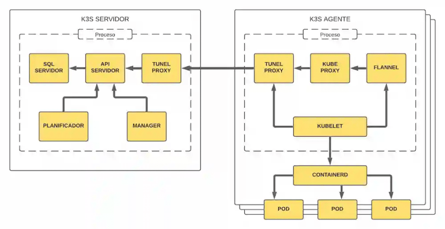

Title: Despliegue de un cluster de Kubernetes
Date: 2018/03/05
Category: Cloud Computing
Header_Cover: theme/images/banner-kubernetes.jpg
Tags: Kubernetes, Let's Chat

En este artículo vamos a crear un **cluster de Kubernetes (k8s)** y para ello he decidido utilizar la distribución **k3s**. Posteriormente, desplegaremos la aplicación **Let's Chat** en él.

Todo el proceso se llevará a cabo en varias instancias de *OpenStack*:

- **controlador:** máquina que controlará el *cluster*. Posee la dirección IP 172.22.201.59
- **worker1:** máquina que actuará como *worker*. Posee la dirección IP 172.22.201.69
- **worker2:** máquina que actuará como *worker*. Posee la dirección IP 172.22.201.79

## ¿Qué es k3s?

**k3s** es una distribución de *Kubernetes*, desarrollada por Rancher Labs, muy ligera y muy fácil de instalar, que requiere pocos requisitos y un uso de memoria mínimo.

Para el planteamiento de un entorno de desarrollo, esto se convierte en una gran mejora sobre lo que hemos hablado anteriormente en *Kubernetes*; crear un entorno mínimo para desarrollo, donde la creación del entorno es compleja y requiere de muchos recursos, aunque sea *Ansible* el que realice el trabajo difícil.

Entre las herramientas que nos proporciona se incluye **kubectl**. Esta herramienta, es una interfaz de línea de comandos desarrollada en *Go* para gestionar nuestros *clusters* de manera centralizada.

A continuación podemos ver un diagrama acerca de la estructura interna de *k3s*:

## Instalación de k3s en el controlador

Para llevar a cabo la instalación del *software* de **k3s**, vamos a utilizar el *script* de instalación que se nos proporciona. Para ello, necesitaremos la herramienta `curl` en nuestro sistema, así que vamos a instalarla:

<pre>
apt install curl -y
</pre>

Una vez instalada, procederemos a la descarga del propio *software* ejecutando el siguiente comando:

<pre>
root@controlador:~# curl -sfL https://get.k3s.io | sh -
[INFO]  Finding release for channel stable
[INFO]  Using v1.20.4+k3s1 as release
[INFO]  Downloading hash https://github.com/k3s-io/k3s/releases/download/v1.20.4+k3s1/sha256sum-amd64.txt
[INFO]  Downloading binary https://github.com/k3s-io/k3s/releases/download/v1.20.4+k3s1/k3s
[INFO]  Verifying binary download
[INFO]  Installing k3s to /usr/local/bin/k3s
[INFO]  Creating /usr/local/bin/kubectl symlink to k3s
[INFO]  Creating /usr/local/bin/crictl symlink to k3s
[INFO]  Creating /usr/local/bin/ctr symlink to k3s
[INFO]  Creating killall script /usr/local/bin/k3s-killall.sh
[INFO]  Creating uninstall script /usr/local/bin/k3s-uninstall.sh
[INFO]  env: Creating environment file /etc/systemd/system/k3s.service.env
[INFO]  systemd: Creating service file /etc/systemd/system/k3s.service
[INFO]  systemd: Enabling k3s unit
Created symlink /etc/systemd/system/multi-user.target.wants/k3s.service → /etc/systemd/system/k3s.service.
[INFO]  systemd: Starting k3s
</pre>

Realizada la instalación, ya dispondríamos de todas las herramientas necesarias, incluyendo `kubectl`. Para comprobarlo vamos a listar los nodos existentes en el *cluster*:

<pre>
root@controlador:~# kubectl get nodes
NAME          STATUS   ROLES                  AGE    VERSION
controlador   Ready    control-plane,master   113s   v1.20.4+k3s1
</pre>

Lógicamente tan sólo nos muestra uno, que hace referencia al propio nodo que acabamos de instalar, ya que aún no hemos asociado ningún *worker*.

Es el momento de vincular los *workers*, para ello, necesitaremos conocer el *token* del nodo maestro. Para conocer dicho *token* ejecutamos el siguiente comando:

<pre>
root@controlador:~# cat /var/lib/rancher/k3s/server/node-token
K10fad848963eda043b3b917043618456893554b621a76f832e41883708a4dc094a::server:af342b2794ad1f7bcdfe0a7bd0ae9f31
</pre>

Hecho esto, es el momento de pasar con la instalación de *k3s* en los *workers*.

## Instalación de k3s en los workers

Para llevar a cabo la instalación del *software* de **k3s** en estas máquinas, volveremos a utilizar el *script* de instalación que se nos proporciona, pero esta vez, tendremos que indicarle dos parámetros para llevar a cabo la vinculación al nodo maestro. Dichos parámetros son:

- **K3S_URL:** indica la URL del controlador, a la que se conectará el *worker*.
- **K3S_TOKEN:** indica el *token* del nodo maestro.

De igual manera, volveremos a necesitar la herramienta `curl` en nuestro sistema, así que vamos a instalarla:

<pre>
apt install curl -y
</pre>

Llevamos a cabo las instalaciones:

**worker1**

<pre>
root@worker1:~# curl -sfL https://get.k3s.io | K3S_URL=https://172.22.201.59:6443 K3S_TOKEN=K10fad848963eda043b3b917043618456893554b621a76f832e41883708a4dc094a::server:af342b2794ad1f7bcdfe0a7bd0ae9f31 sh -
[INFO]  Finding release for channel stable
[INFO]  Using v1.20.4+k3s1 as release
[INFO]  Downloading hash https://github.com/k3s-io/k3s/releases/download/v1.20.4+k3s1/sha256sum-amd64.txt
[INFO]  Downloading binary https://github.com/k3s-io/k3s/releases/download/v1.20.4+k3s1/k3s
[INFO]  Verifying binary download
[INFO]  Installing k3s to /usr/local/bin/k3s
[INFO]  Creating /usr/local/bin/kubectl symlink to k3s
[INFO]  Creating /usr/local/bin/crictl symlink to k3s
[INFO]  Creating /usr/local/bin/ctr symlink to k3s
[INFO]  Creating killall script /usr/local/bin/k3s-killall.sh
[INFO]  Creating uninstall script /usr/local/bin/k3s-agent-uninstall.sh
[INFO]  env: Creating environment file /etc/systemd/system/k3s-agent.service.env
[INFO]  systemd: Creating service file /etc/systemd/system/k3s-agent.service
[INFO]  systemd: Enabling k3s-agent unit
Created symlink /etc/systemd/system/multi-user.target.wants/k3s-agent.service → /etc/systemd/system/k3s-agent.service.
[INFO]  systemd: Starting k3s-agent
</pre>

**worker2**

<pre>
root@worker2:~# curl -sfL https://get.k3s.io | K3S_URL=https://172.22.201.59:6443 K3S_TOKEN=K10fad848963eda043b3b917043618456893554b621a76f832e41883708a4dc094a::server:af342b2794ad1f7bcdfe0a7bd0ae9f31 sh -
[INFO]  Finding release for channel stable
[INFO]  Using v1.20.4+k3s1 as release
[INFO]  Downloading hash https://github.com/k3s-io/k3s/releases/download/v1.20.4+k3s1/sha256sum-amd64.txt
[INFO]  Downloading binary https://github.com/k3s-io/k3s/releases/download/v1.20.4+k3s1/k3s
[INFO]  Verifying binary download
[INFO]  Installing k3s to /usr/local/bin/k3s
[INFO]  Creating /usr/local/bin/kubectl symlink to k3s
[INFO]  Creating /usr/local/bin/crictl symlink to k3s
[INFO]  Creating /usr/local/bin/ctr symlink to k3s
[INFO]  Creating killall script /usr/local/bin/k3s-killall.sh
[INFO]  Creating uninstall script /usr/local/bin/k3s-agent-uninstall.sh
[INFO]  env: Creating environment file /etc/systemd/system/k3s-agent.service.env
[INFO]  systemd: Creating service file /etc/systemd/system/k3s-agent.service
[INFO]  systemd: Enabling k3s-agent unit
Created symlink /etc/systemd/system/multi-user.target.wants/k3s-agent.service → /etc/systemd/system/k3s-agent.service.
[INFO]  systemd: Starting k3s-agent
</pre>

Finalizada la instalación en ambos *workers*, vamos a listar los nodos existentes en el nodo maestro:

<pre>
root@controlador:~# kubectl get nodes
NAME          STATUS   ROLES                  AGE     VERSION
controlador   Ready    control-plane,master   8m25s   v1.20.4+k3s1
worker1       Ready    <none>                 81s     v1.20.4+k3s1
worker2       Ready    <none>                 51s     v1.20.4+k3s1
</pre>

Podemos ver como efectivamente, ahora sí nos muestra los dos *workers* que acabamos de vincular.

## Conectando nuestro cluster a la máquina anfitriona

Una vez tenemos nuestro *cluster* listo, vamos a configurarlo para que en vez de gestionarlo desde la máquina *controlador*, lo podamos gestionar desde nuestra máquina anfitriona, lo cuál sería mucho más cómodo.

Lo primero que debemos hacer, es instalar `kubectl` en nuestra máquina anfitriona. Para hacer esto, debemos ejecutar los siguientes comandos:

<pre>
echo "deb https://apt.kubernetes.io/ kubernetes-xenial main" | sudo tee -a /etc/apt/sources.list.d/kubernetes.list

curl -s https://packages.cloud.google.com/apt/doc/apt-key.gpg | sudo apt-key add -

apt update && apt install kubectl -y
</pre>

Una vez disponemos de la herramienta, vamos a crear el directorio `~/.kube`:

<pre>
root@debian:~# mkdir .kube
</pre>

¿Y para qué creamos este directorio? Pues porque para conectarnos a nuestro *cluster* remotamente, necesitaremos un fichero llamado `config` almacenado en esta ruta.

Bien, el contenido del fichero `config` debe ser el mismo contenido que podemos encontrar en el fichero `/etc/rancher/k3s/k3s.yaml` del nodo maestro de nuestro *cluster*, por tanto copiamos dicho contenido. En mi caso queda de esta manera:

<pre>
root@debian:~# cat .kube/config
apiVersion: v1
clusters:
- cluster:
    certificate-authority-data: LS0tLS1CRUdJTiBDRVJUSUZJQ0FURS0tLS0tCk1JSUJkekNDQVIyZ0F3SUJBZ0lCQURBS0JnZ3Foa2pPUFFRREFqQWpNU0V3SHdZRFZRUUREQmhyTTNNdGMyVnkKZG1WeUxXTmhRREUyTVRRNU5qZ3pPREl3SGhjTk1qRXdNekExTVRneE9UUXlXaGNOTXpFd016QXpNVGd4T1RReQpXakFqTVNFd0h3WURWUVFEREJock0zTXRjMlZ5ZG1WeUxXTmhRREUyTVRRNU5qZ3pPREl3V1RBVEJnY3Foa2pPClBRSUJCZ2dxaGtqT1BRTUJCd05DQUFTL254RkNkRk1kODlPQ1VObTJTa3h0cWk3WUlGUGFBVDR2ckRzY2tJYTkKVzNha3l1di9MNVVlakdXK1FrWVF1TXp5a1pXdGVOKytIQSt4SkZ5YkZPdW9vMEl3UURBT0JnTlZIUThCQWY4RQpCQU1DQXFRd0R3WURWUjBUQVFIL0JBVXdBd0VCL3pBZEJnTlZIUTRFRmdRVXlWM1lYS2Q2dWNYNDVhajY1Nk9mCktJZ2RnYmt3Q2dZSUtvWkl6ajBFQXdJRFNBQXdSUUloQUpBVTNDekpBME9RSGR1SnUyZzNSeXBjQUZnVHFyem8KbWZaMUhtN0YvWUZEQWlCbzhpSEdsUDZvUXJKYUI4Q2lKUnJWSVJQNkFWeGJzQTBjZlBsalBSMG9BZz09Ci0tLS0tRU5EIENFUlRJRklDQVRFLS0tLS0K
    server: https://127.0.0.1:6443
  name: default
contexts:
- context:
    cluster: default
    user: default
  name: default
current-context: default
kind: Config
preferences: {}
users:
- name: default
  user:
    client-certificate-data: LS0tLS1CRUdJTiBDRVJUSUZJQ0FURS0tLS0tCk1JSUJrakNDQVRlZ0F3SUJBZ0lJVWdQTGJDWXFFMWN3Q2dZSUtvWkl6ajBFQXdJd0l6RWhNQjhHQTFVRUF3d1kKYXpOekxXTnNhV1Z1ZEMxallVQXhOakUwT1RZNE16Z3lNQjRYRFRJeE1ETXdOVEU0TVRrME1sb1hEVEl5TURNdwpOVEU0TVRrME1sb3dNREVYTUJVR0ExVUVDaE1PYzNsemRHVnRPbTFoYzNSbGNuTXhGVEFUQmdOVkJBTVRESE41CmMzUmxiVHBoWkcxcGJqQlpNQk1HQnlxR1NNNDlBZ0VHQ0NxR1NNNDlBd0VIQTBJQUJKeDRyUkFsRWdpN0RQZGQKTTJ4NGFBQVVEdEdBSzR2Rzlhd2ZmL1RsZ0YxZ1NaRHZRMTBwKzd0WHg3RjdPajZoQVNGcWNWNlZxaEtidU53ZwpyT2ZLRFZXalNEQkdNQTRHQTFVZER3RUIvd1FFQXdJRm9EQVRCZ05WSFNVRUREQUtCZ2dyQmdFRkJRY0RBakFmCkJnTlZIU01FR0RBV2dCVEpTRE9YUnFZQzZuMWtZOHJkUHQ0VWo3VllDVEFLQmdncWhrak9QUVFEQWdOSkFEQkcKQWlFQTllUzhpUGpoaHloVWZYL01nZXJqOFN3dmlNMnUzNzFPanMycXVkanJNQlVDSVFDRG5qSmQzbFpoMVphZwpjUmcwdU1QMzdaQ0lTTnBtQWVDMHRjYXlCT3hOTHc9PQotLS0tLUVORCBDRVJUSUZJQ0FURS0tLS0tCi0tLS0tQkVHSU4gQ0VSVElGSUNBVEUtLS0tLQpNSUlCZURDQ0FSMmdBd0lCQWdJQkFEQUtCZ2dxaGtqT1BRUURBakFqTVNFd0h3WURWUVFEREJock0zTXRZMnhwClpXNTBMV05oUURFMk1UUTVOamd6T0RJd0hoY05NakV3TXpBMU1UZ3hPVFF5V2hjTk16RXdNekF6TVRneE9UUXkKV2pBak1TRXdId1lEVlFRRERCaHJNM010WTJ4cFpXNTBMV05oUURFMk1UUTVOamd6T0RJd1dUQVRCZ2NxaGtqTwpQUUlCQmdncWhrak9QUU1CQndOQ0FBVFBhR0FxbFhkRk5LSW96VDFjZUhXVEFxTXlGczFCV0JnbjB6dDNnd0FnClEzUVJUb0QrRzJZQi84WTl0SDZQQzAzbktRYW1PakNjV3BlSkRxdFQzVzVBbzBJd1FEQU9CZ05WSFE4QkFmOEUKQkFNQ0FxUXdEd1lEVlIwVEFRSC9CQVV3QXdFQi96QWRCZ05WSFE0RUZnUVV5VWd6bDBhbUF1cDlaR1BLM1Q3ZQpGSSsxV0Frd0NnWUlLb1pJemowRUF3SURTUUF3UmdJaEFNTGs3TDNhQk9Nc0kwWURRQVhkREs4bkpzNDZLR0pPCm50alRYcUNLL2JSRUFpRUF3QnowZll3S1BaY0toV0hhYUw2S1IydlFmTnhFTjNNZUZUS0l4VEViMXBRPQotLS0tLUVORCBDRVJUSUZJQ0FURS0tLS0tCg==
    client-key-data: LS0tLS1CRUdJTiBFQyBQUklWQVRFIEtFWS0tLS0tCk1IY0NBUUVFSUVaWDF5WkNMRDBEbExac3dZSWcvY1lSNysxYlMyTHJyb1JwMXRGVkJheGpvQW9HQ0NxR1NNNDkKQXdFSG9VUURRZ0FFbkhpdEVDVVNDTHNNOTEwemJIaG9BQlFPMFlBcmk4YjFyQjkvOU9XQVhXQkprTzlEWFNuNwp1MWZIc1hzNlBxRUJJV3B4WHBXcUVwdTQzQ0NzNThvTlZRPT0KLS0tLS1FTkQgRUMgUFJJVkFURSBLRVktLS0tLQo=
</pre>

Una vez tenemos el mismo contenido en nuestro equipo anfitrión, debemos cambiar el valor del parámetro `server`, y en él establecer la dirección del nodo maestro del *cluster*. En mi caso esta directiva quedaría tal que así:

<pre>
root@debian:~# cat .kube/config
...
    server: https://172.22.201.59:6443
...
</pre>

En teoría ya habríamos realizado toda la configuración y podríamos gestionar nuestro *cluster* remotamente, para ello vamos a intentar los nodos existentes en él mediante el siguiente comando: `kubectl get nodes`. En este punto, en mi caso, me reportó un error debido a certificados x509, que logré solucionar con el siguiente comando:

<pre>
kubectl --insecure-skip-tls-verify cluster-info dump
</pre>

Tras él, volvemos a intentar listar los nodos:

<pre>
root@debian:~# kubectl get nodes
NAME          STATUS     ROLES                  AGE   VERSION
worker1       Ready      <none>                 30m   v1.20.4+k3s1
worker2       NotReady   <none>                 30m   v1.20.4+k3s1
controlador   Ready      control-plane,master   37m   v1.20.4+k3s1
</pre>

Efectivamente podemos ver los tanto el nodo maestro como los *workers* por lo que ya podríamos gestionar nuestro *cluster* de manera remota.

## Desplegando una aplicación en nuestro cluster

Para desplegar la aplicación **Let's Chat** utilizaremos [este repositorio](https://github.com/iesgn/kubernetes-storm/tree/master/unidad3/ejemplos-3.2/ejemplo8) de *GitHub*, que contiene todos los ficheros `.yaml` en los que se definen los *deployment*, los servicios, ...

En primer lugar, lógicamente clonaremos dicho repositorio:

<pre>

</pre>

.
