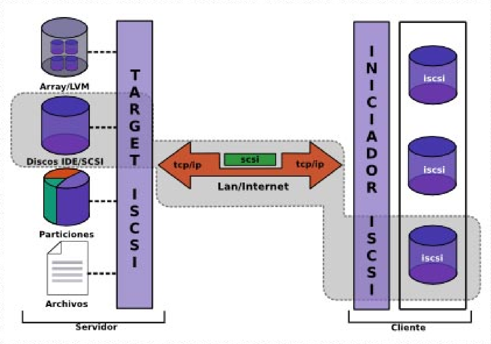

Title: iSCSI
Date: 2021/02/10
Category: Cloud Computing
Header_Cover: theme/images/banner-hlc.jpg
Tags: iSCSI

- Crea un target con una LUN y conéctala a un cliente GNU/Linux. Explica cómo escaneas desde el cliente buscando los targets disponibles y utiliza la unidad lógica proporcionada, formateándola si es necesario y montándola.
- Utiliza systemd mount para que el target se monte automáticamente al arrancar el cliente
- Crea un target con 2 LUN y autenticación por CHAP y conéctala a un cliente windows. Explica cómo se escanea la red en windows y cómo se utilizan las unidades nuevas (formateándolas con NTFS)

--------------------------------------------------------------------------------

En este artículo vamos a configurar un escenario con *Vagrant* que incluirá varias máquinas, y permitirá realizar la configuración de un servidor **iSCSI** y dos clientes, (uno linux y otro windows).

## ¿Qué es iSCSI? ¿Cómo funciona?

**iSCSI** es un extensión de *SCSI*, que es un protocolo para comunicación de dispositivos. *SCSI* suele usarse en dispositivos conectados físicamente a un *host* o servidor, tales como discos duros, lectoras de CDs, ... En *iSCSI*, los comandos *SCSI* que manejan el dispositivo, se envían a través de la red. De forma que en vez de tener un disco *SCSI* conectado físicamente a nuestro equipo, lo conectamos por medio de la red.

¿Eso quiere decir que es lo mismo que *Samba* o *NFS*? Pues no, ya que esos sistemas trabajan importando un sistema de archivos mediante la red, mientras que *iSCSI* importa todo el dispositivo hardware por la red, de manera que en el cliente es detectado como un dispositivo *SCSI* más. Todo esto se hace de forma transparente, como si el disco estuviera conectado directamente al hardware.

Es una gran alternativa económica a *FiberChannel*.

Y respecto a la **velocidad**, ¿es rápido, es lento? Un requisito indispensable de un buen disco es que sea rápido. Los discos *SCSI* suelen entregar excelentes tasas de transferencia. Pero recordemos que *iSCSI* se lleva sobre la red, por eso mismo, *iSCSI* es recomendado solo para redes conmutadas de alta velocidad.

La velocidad de transferencia del *iSCSI* es de **1000 MB/seg**, aunque debido al protocolo, la velocidad baja hasta *800 MB/seg*. En caso de que utilicemos tarjetas *DUAL CHANNEL*, podremos llegar a *1600 MB/seg*, teniendo en cuenta las pérdidas por protocolo.

Respecto al **acceso a los datos**, en teoría, *iSCSI* no soporta múltiples conexiones a la vez. Por ejemplo, dos equipos no podrían utilizar el mismo disco *iSCSI* para escribir en él. Eso sería como tener un disco rígido conectado a dos máquinas a la vez. Lo más probable es que surgieran inconsistencias en los datos o problemas en los accesos de lectura y escritura de la información.

Aún así, existen alternativas para que *iSCSI* pueda soportar múltiples usuarios. Por ejemplo, el global *filesystem (GFS)* de *RedHat*, que es un *filesystem* especialmente diseñado para permitir concurrencia de usuarios en dispositivos que normalmente no lo permiten, como *iSCSI*.

Hablemos sobre el **target iSCSI**. En pocas palabras, es el servidor. Un *target* puede ofrecer uno o más recursos *iSCSI* por la red. En las soluciones *Linux* para *iSCSI*, no hace falta que el dispositivo a exportar sea necesariamente un disco *SCSI*. Se pueden usar medios de almacenamiento de distinta naturaleza como:

- Particiones RAID
- Particiones LVM
- Discos enteros
- Particiones comunes
- Archivos
- Dispositivos de CD, cintas, etc.

Y por el otro lado, nos encontramos con el **iniciador iSCSI**. El iniciador es el cliente de *iSCSI*. Generalmente el iniciador consta de dos partes: los módulos o *drivers* que proveen soporte para que el sistema operativo pueda reconocer discos de tipo *iSCSI* y un programa que gestiona las conexiones a dichos discos. En *Linux* hay varias opciones, y en las últimas versiones de *Windows* nos encontramos con un iniciador instalado por defecto.

Creo que no hace falta decirlo, pero por si acaso, imaginemos tener un *target* montado en *Linux*, obviamente podremos utilizar los discos de dicho servidor en sistemas *Windows*, *MacOSX* o incluso *Solaris*.

##

.
