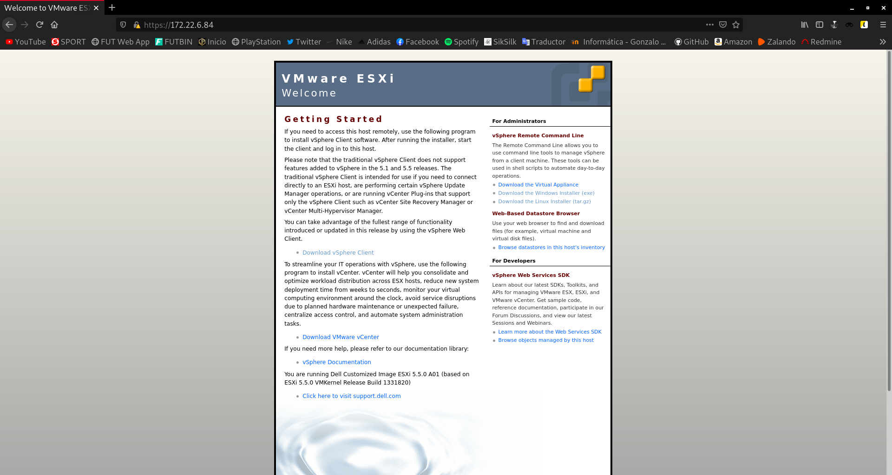
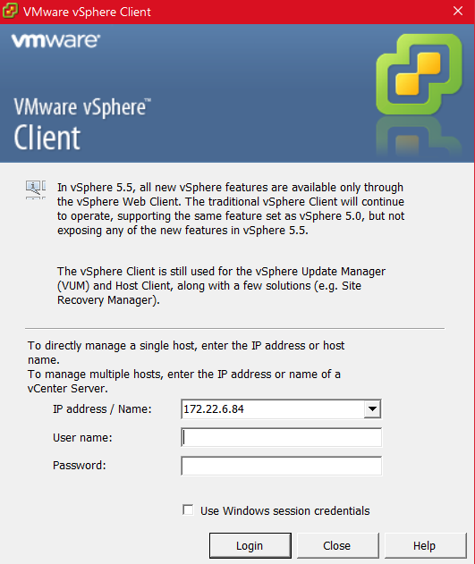

Title: Instalación y configuración básica de VMWare ESXi
Date: 2020/12/14
Category: Cloud Computing
Header_Cover: theme/images/banner-hlc.jpg
Tags: VMWare

#### Utiliza el servidor físico que se te haya asignado e instala la versión adecuada del sistema de virtualización VMWare ESXi (hay que tener en cuenta que recibe diferentes denominaciones comerciales, pero nos referimos al sistema de virtualización de VMWare que proporciona virtualización de alto rendimiento mediante la técnica de la paravirtualización).

#### Realiza la configuración del servicio que permita su gestión remota desde un equipo cliente e instala en tu equipo la aplicación cliente que permita gestionar remotamente el hipervisor.

#### Instala una máquina virtual que tenga acceso a Internet. La corrección consistirá en comprobar el funcionamiento de dicha máquina virtual.

Como dice el título de la práctica, voy a realizar la instalación de **VMWare ESXi** en su versión **5.5** sobre el servidor físico que tengo asignado.

En mi caso, dispongo de un servidor **Dell PowerEdge 2900**, que recibe el nombre de **Panoramix**.

Lo primero que he tenido que hacer, obviamente, ha sido preparar un medio de arranque, en mi caso descargué la ISO de **VMWare** y cree un medio de instalación USB, con el que realicé la primera instalación, en la que descubrí, que este modelo de servidor en concreto, no es compatible con dicha ISO.

Para resolver este problema, estuve investigando y acabé descargando una ISO que supuestamente sí era compatible con este servidor. Dejo aquí la [página desde donde descargué la ISO](https://www.dell.com/support/home/es-es/drivers/driversdetails?driverid=20vnp).

Volví a realizar el mismo proceso para la creación de un USB de arranque con esta ISO. Lógicamente había configurado previamente la BIOS del servidor para que hiciera el arranque mediante el USB.

El proceso de instalación la verdad que es de lo más trivial que he llegado a experimentar, simplemente nos pide que especifiquemos en que unidad de se va a almacenar el sistema y nos pide una contraseña de superusuario. Después de indicar estos parámetros se instalará el sistema.

Una vez ya había instalado *VMWare ESXi*, volví a la BIOS para modificar de nuevo la secuencia de arranque y poner en primer lugar la unidad de almacenamiento *SATA*.

Al iniciar el sistema, nos aparece una ventana en la que nos indica la dirección IP, que tenemos que introducir desde un navegador, para descargar las herramientas necesarias para llevar a cabo la gestión remota.

Descargué e instalé la aplicación llamada `vSphere Client`.

.
