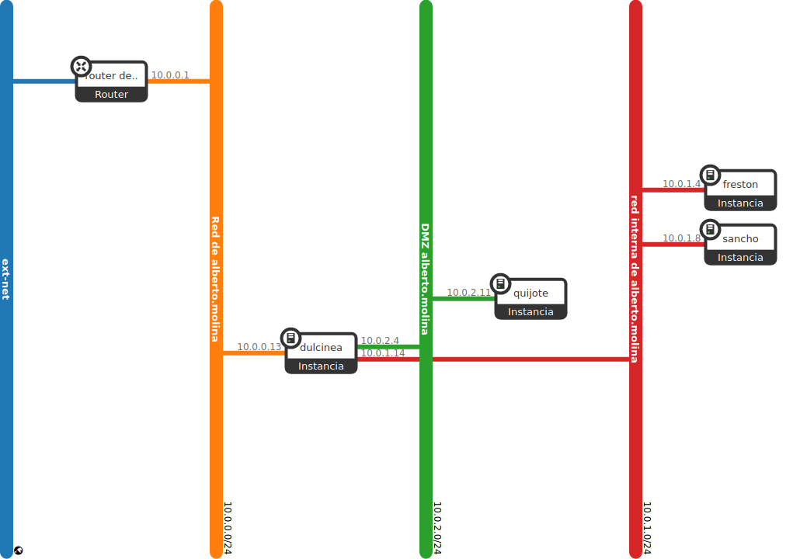

Title: Modificación del escenario de trabajo en OpenStack
Date: 2020/12/12
Category: Cloud Computing
Header_Cover: theme/images/banner-hlc.jpg
Tags: OpenStack

Vamos a modificar el escenario que tenemos actualmente en OpenStack para que se adecúe a la realización de todas las prácticas en todos los módulos de 2º, en particular para que tenga una estructura más real a la de varios equipos detrás de un cortafuegos, separando los servidores en dos redes: red interna y DMZ. Para ello vamos a reutilizar todo lo hecho hasta ahora y añadiremos una máquina más: Frestón

#### 1. Creación de la red DMZ:

- **Nombre: DMZ de <nombre de usuario>**

- **10.0.2.0/24**

#### 2. Creación de las instancias:

- **freston:**

    - **Debian Buster sobre volumen de 10GB con sabor m1.mini**
    - **Conectada a la red interna**
    - **Accesible indirectamente a través de dulcinea**
    - **IP estática**

#### 3. Modificación de la ubicación de quijote

- **Pasa de la red interna a la DMZ y su direccionamiento tiene que modificarse apropiadamente**
