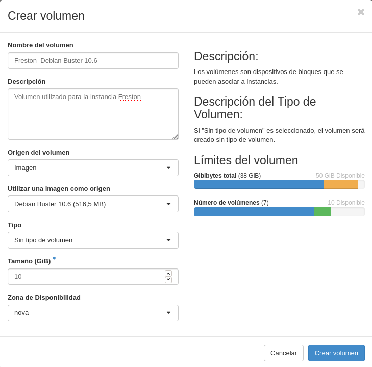

Title: Modificación del escenario de trabajo en OpenStack
Date: 2020/12/12
Category: Cloud Computing
Header_Cover: theme/images/banner-hlc.jpg
Tags: OpenStack

**En este *post* voy a realizar modificaciones sobre un escenario de *OpenStack* que fue creado anteriormente y cuya explicación se encuentra en [este post](https://javierpzh.github.io/creacion-del-escenario-de-trabajo-en-openstack.html), por si quieres saber más al respecto.**

**Vamos a modificar el escenario que tenemos actualmente en OpenStack para que se adecúe a la realización de todas las prácticas en todos los módulos de 2º, en particular para que tenga una estructura más real a la de varios equipos detrás de un cortafuegos, separando los servidores en dos redes: red interna y DMZ. Para ello vamos a reutilizar todo lo hecho hasta ahora y añadiremos una máquina más: Frestón**

#### 1. Creación de la red DMZ:

- **Nombre: DMZ de (nombre de usuario)**
- **10.0.2.0/24**

Vamos a crear una nueva red, en esta caso, una **red DMZ**, que se situará entre la red interna y la externa.

Para crearla, nos dirigimos hacia nuestro panel de administración de *OpenStack* y nos situamos en la sección de **Redes**. Una vez aquí, *clickamos* en el botón llamado **+ Crear red**, y se nos abrirá un menú, donde debemos indicar las características de la red que queremos crear:

En el primer apartado de este asistente, indicamos el nombre que poseerá nuestra nueva red:

En segundo lugar, indicamos las direcciones de red que abarcará, y deshabilitaremos la puerta de enlace ya que no nos va hacer falta debido a que vamos a poner a *Dulcinea* como *gateway*:

Por último, vamos a dejar marcada la opción de **Habilitar DHCP** que viene de manera predeterminada, para que de esta forma, nos dé una dirección IP de manera automática cuando conectemos una instancia.

Hecho esto, ya tendríamos nuestra red DMZ creada, como podemos observar:

Hemos finalizado este primer ejercicio.

#### 2. Creación de las instancias:

- **freston:**

    - **Debian Buster sobre volumen de 10GB con sabor m1.mini**
    - **Conectada a la red interna**
    - **Accesible indirectamente a través de dulcinea**
    - **IP estática**

Antes de crear la propia instancia en sí, vamos a crear el volumen sobre el que posteriormente generaremos la instancia **freston**. Para ello he creado un volumen con estas preferencias:

Una vez ha terminado el proceso de creación del nuevo volumen, obtenemos como resultado:

Y ahora, un detalle importante que hay que tener en cuenta antes de realizar el lanzamiento de la nueva instancia es, que si recordamos, a la **red interna**, le deshabilitamos el **servidor DHCP**, por lo que si ahora generamos esta nueva instancia perteneciente a esta red, no adquirirá ninguna dirección mediante *DHCP*, por lo que será inaccesible, porque recordemos que a esta máquina también se accederá a través de *Dulcinea*. Por tanto, vamos a habilitar el servidor *DHCP* de la red interna.

Ahora sí, es momento de crear la nueva instancia.

Para crearla, nos dirigimos hacia nuestro panel de administración de *OpenStack* y nos situamos en la sección de **Instancias**. Una vez aquí, *clickamos* en el botón llamado **+ Lanzar instancia**, y se nos abrirá un menú, donde debemos indicar las características de la instancia que queremos crear:

En el primer apartado de este asistente, indicamos el nombre que poseerá nuestra nueva instancia:

Ahora establecemos que el origen de arranque sea el volumen creado previamente:

Como **Sabor** indicamos que tenga un **m1.mini**.

Y por último, le asignamos la red a la que va a pertenecer esta máquina.

Aquí podemos ver como hemos creado esta instancia correctamente y que pertenece a la red interna, ya que posee una dirección **10.0.1.6**

Vamos a probar a acceder a **freston** a través de *Dulcinea*:

<pre>
debian@dulcinea:~$ ssh debian@10.0.1.6
The authenticity of host '10.0.1.6 (10.0.1.6)' can't be established.
ECDSA key fingerprint is SHA256:uR1IwMruxlhVJzsAB7UuqHlyR7r+6xqyVhwFXxvX6PM.
Are you sure you want to continue connecting (yes/no)? yes
Warning: Permanently added '10.0.1.6' (ECDSA) to the list of known hosts.
Linux freston 4.19.0-11-cloud-amd64 #1 SMP Debian 4.19.146-1 (2020-09-17) x86_64

The programs included with the Debian GNU/Linux system are free software;
the exact distribution terms for each program are described in the
individual files in /usr/share/doc/*/copyright.

Debian GNU/Linux comes with ABSOLUTELY NO WARRANTY, to the extent
permitted by applicable law.

debian@freston:~$ ip a
1: lo: <LOOPBACK,UP,LOWER_UP> mtu 65536 qdisc noqueue state UNKNOWN group default qlen 1000
    link/loopback 00:00:00:00:00:00 brd 00:00:00:00:00:00
    inet 127.0.0.1/8 scope host lo
       valid_lft forever preferred_lft forever
    inet6 ::1/128 scope host
       valid_lft forever preferred_lft forever
2: eth0: <BROADCAST,MULTICAST,UP,LOWER_UP> mtu 8950 qdisc pfifo_fast state UP group default qlen 1000
    link/ether fa:16:3e:4a:d0:53 brd ff:ff:ff:ff:ff:ff
    inet 10.0.1.6/24 brd 10.0.1.255 scope global dynamic eth0
       valid_lft 86277sec preferred_lft 86277sec
    inet6 fe80::f816:3eff:fe4a:d053/64 scope link
       valid_lft forever preferred_lft forever
debian@freston:~$
</pre>

Vemos como efectivamente hemos accedido a **freston**.

Es el momento de realizar las configuraciones necesarias en esta nueva máquina.

En primer lugar vamos a asignarle una **dirección IP estática**.

<pre>
nano /etc/network/interfaces
</pre>

<pre>
allow-hotplug eth0
iface eth0 inet static
address 10.0.1.6
netmask 255.255.255.0
gateway 10.0.1.11
</pre>

<pre>
systemctl restart networking
</pre>

#### 3. Modificación de la ubicación de quijote

- **Pasa de la red interna a la DMZ y su direccionamiento tiene que modificarse apropiadamente**
