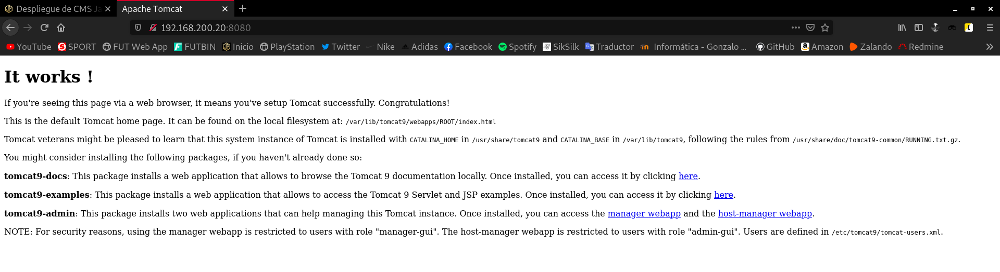
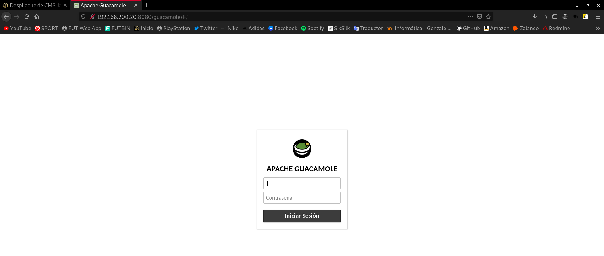

Title: Despliegue de CMS Java
Date: 2020/12/14
Category: Implantación de Aplicaciones Web
Header_Cover: theme/images/banner-aplicacionesweb.jpg
Tags: CMS, Java, Tomcat

**En esta práctica vamos a desplegar un [CMS escrito en Java](https://java-source.net/open-source/content-managment-systems). Puedes escoger la aplicación que vas a desplegar de CMS escritos en Java o de [Aplicaciones Java en Bitnami](https://bitnami.com/tag/java).**

#### Indica la aplicación escogida y su funcionalidad

He decidido escoger el **CMS escrito en Java**, llamado **Guacamole**.

*Apache Guacamole* es una herramienta libre que nos permite conectarnos remotamente a un servidor mediante el navegador web sin necesidad de usar un cliente.

Gracias a HTML5, una vez tengamos instalado y configurado *Apache Guacamole*, tan solo tenemos que conectarnos mediante el navegador web para empezar a trabajar remotamente.

#### Escribe una guía de los pasos fundamentales para realizar la instalación

1. Instalar *tomcat 9*.

2. Comprobar el acceso al puerto 8080.

3. Buscar un archivo `.war` y almacenarlo en la ruta `/var/lib/tomcat9/webapps`.

4. Acceder a la aplicación.

5. Configurar el fichero `/etc/tomcat9/server.xml` para activar el conector `ajp`.

6. Buscar información sobre el **proxy.ajp** en **Apache2** y realizar la configuración necesaria.

A continuación vamos a realizar la instalación de *tomcat 9* y de la aplicación en sí.

Antes de nada, necesitaremos un equipo donde trabajar. Yo voy a instalar una máquina virtual, y para ello, voy a utilizar *Vagrant*. He creado este *Vagrantfile*:

<pre>
# -*- mode: ruby -*-
# vi: set ft=ruby :

Vagrant.configure("2") do |config|

  config.vm.box = "debian/buster64"

  config.vm.network "private_network", ip: "192.168.200.20"

end
</pre>

Una vez estamos en nuestro equipo de trabajo, en primer lugar, debemos instalar **Tomcat**, en mi caso, voy a instalar la versión *9*.

*Tomcat* requiere que **Java** esté instalado para poder ejecutar cualquier código de aplicación web *Java*.

<pre>
apt install default-jdk -y
</pre>

Instalado *Java*, ya podemos proceder a instalar *Tomcat*. Para ello:

<pre>
apt install tomcat9 -y
</pre>

Para comprobar el funcionamiento de una forma más visual, podemos conectarnos desde un navegador web mediante la dirección IP de la máquina especificando el puerto **8080**:

Vemos que está funcionando correctamente.

En este punto, ya podemos descargar el fichero `.war`.

¿Alguien se pregunta qué es un fichero `.war`?

Un fichero `.war` es una aplicación web que permite a *Tomcat* acceder a su utilización. El fichero `.war` tiene que ser descomprimido para ser leído.

Nos descargamos el fichero `.war` de la [página oficial de Apache Guacamole](https://guacamole.apache.org/releases/). En mi caso, descargo la última versión, que en este momento es la **1.2.0**. La he descargado desde mi máquina y la he pasado mediante `scp` a la máquina virtual *Vagrant*, aquí podemos ver que ya lo tenemos:

<pre>
root@buster:~# ls
guacamole-1.2.0.war
</pre>

Una vez la hemos descargado, tenemos que mover el archivo `.war` al directorio `/var/lib/tomcat9/webapps`, y podremos apreciar como automáticamente, al almacenar el fichero en esta ruta, se descomprime generando una carpeta llamada `guacamole-1.2.0` que es la que contiene la aplicación:

<pre>
root@buster:~# mv guacamole-1.2.0.war /var/lib/tomcat9/webapps

root@buster:~# ls /var/lib/tomcat9/webapps/
guacamole-1.2.0  guacamole-1.2.0.war  ROOT

root@buster:~# ls /var/lib/tomcat9/webapps/guacamole-1.2.0
app	   guacamole-common-js	guacamole.min.css  index.html	META-INF	       WEB-INF
fonts	   guacamole.css	guacamole.min.js   layouts	relocateParameters.js
generated  guacamole.js		images		   license.txt	translations
</pre>

Antes de probar a acceder desde el navegador, en mi caso, prefiero cambiarle el nombre a este nuevo directorio, para así no tener que escribir también la versión en cada acceso a la web:

<pre>
root@buster:/var/lib/tomcat9/webapps# mv guacamole-1.2.0 guacamole

root@buster:/var/lib/tomcat9/webapps# ls
guacamole  guacamole-1.2.0.war	ROOT
</pre>

Me he dado cuenta, que al cambiarle el nombre, el fichero `.war` vuelve a generar otra vez la carpeta `guacamole-1.2.0`. Parece ser que al cambiarle el nombre, este fichero detecta que la carpeta no está creada y la vuelve a originar de manera automática. Para solucionar esto, he eliminado el fichero `.war` y el nuevo directorio, de manera que ahora solo poseo el directorio `guacamole`.

Hecho esto, vamos a probar a acceder a la dirección `192.168.200.20:8080/guacamole`:

Vemos que podemos acceder a la aplicación.

#### ¿Has necesitado instalar alguna librería? ¿Has necesitado instalar un conector de una base de datos?

.

#### Entrega una captura de pantalla donde se vea la aplicación funcionando

.

#### Realiza la configuración necesaria en Apache2 y tomcat (utilizando el protocolo AJP) para que la aplicación sea servida por el servidor web

.

#### Entrega una captura de pantalla donde se vea la aplicación funcionando servida por Apache2

.

------------------------------------------------------------------------------------------------------

Ahora vamos a comenzar la instalación de **Apache Guacamole**, para ello vamos a instalar los paquetes mínimos necesarios:

<pre>
apt install build-essential gcc libcairo2-dev libjpeg62-turbo-dev libpng-dev libtool-bin libossp-uuid-dev -y
</pre>

Acabo de comentar que iba a instalar los paquetes necesarios. Esto es porque en función de los protocolos que queramos utilizar, vamos a instalar una serie de paquetes u otros (podemos instalarlos todos y trabajarán de manera conjunta sin problemas).

En mi caso, voy a instalar los paquetes necesarios para el soporte de **SSH**:

<pre>
apt install libpango1.0-dev libssh2-1-dev -y
</pre>

Como vamos a utilizar *SSH*, también nos es necesario el soporte de **OpenSSL**.

Aquí dejo también los paquetes a instalar para cada protocolo, por si estás interesado en instalarlos:

- Soporte para **OpenSSL**:

<pre>
apt install libssl-dev -y
</pre>

- Soporte para **RDP**:

<pre>
apt install libfreerdp-dev -y
</pre>

- Soporte para **telnet**:

<pre>
apt install libpango1.0-dev libtelnet-dev -y
</pre>

- Soporte para **Guacenc**:

<pre>
apt install libavcodec-dev libavutil-dev libswscale-dev -y
</pre>

- Soporte para **VNC** y **audio**:

<pre>
apt install libvncserver-dev libpulse-dev -y
</pre>

- Soporte para **Ogg Vorbis**:

<pre>
apt install libvorbis-dev -y
</pre>

- Soporte para **WebP**:

<pre>
apt install libwebp-dev -y
</pre>

Ahora nos vamos a descargar el paquete correspondiente al servidor:

<pre>
wget http://archive.apache.org/dist/guacamole/0.9.14/source/guacamole-server-0.9.14.tar.gz
</pre>

Lo descomprimimos:

<pre>
tar -xzf guacamole-server-0.9.14.tar.gz
</pre>

Dentro del directorio `/guacamole-server-0.9.14`, ejecutamos el configurador automático. Si nos da algún error, será señal de que nos faltan algunas librerías necesarias:

<pre>
./configure --with-init-dir=/etc/init.d
</pre>

Cuando termina el proceso, y observamos que todo ha ido según lo previsto, es el momento de compilar:

<pre>
make
</pre>

Una vez terminada la compilación, ya podemos instalar **guacamole-server**:

<pre>
make install
</pre>

Una vez terminada la instalación, actualizamos las librerías instaladas en el sistema:

<pre>
ldconfig
</pre>
