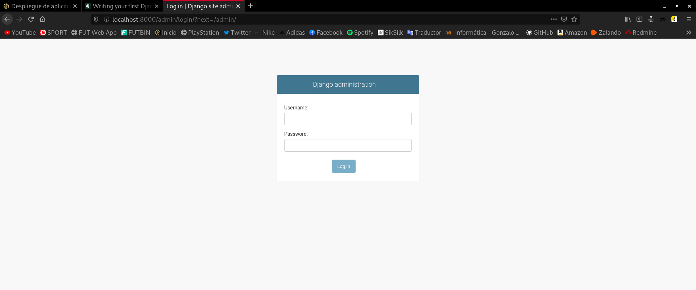
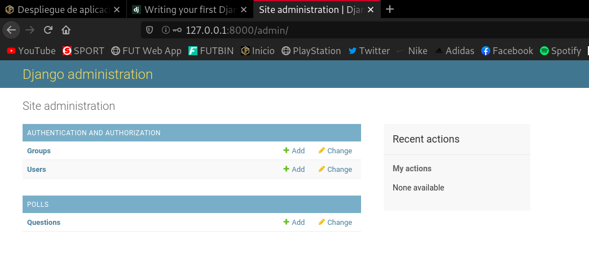
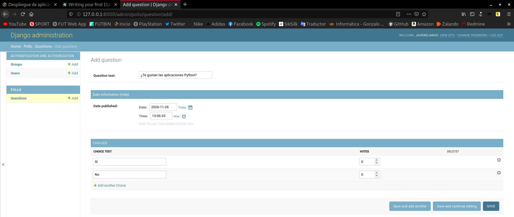
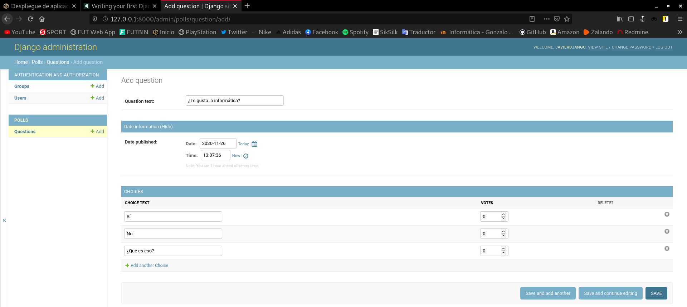
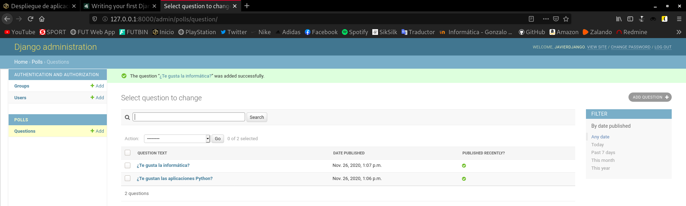
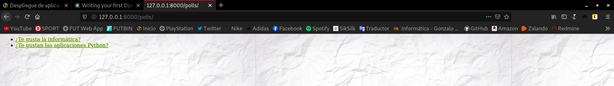
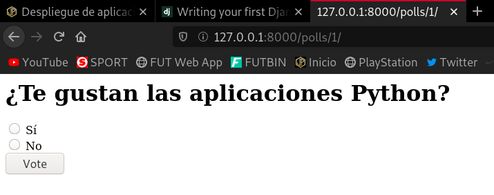
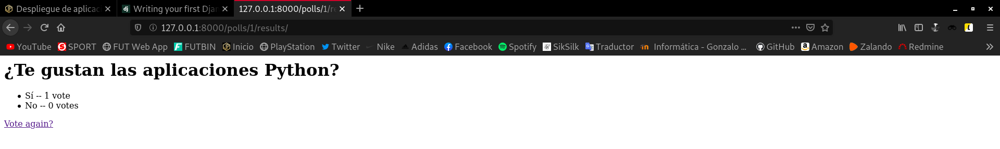

Title: Despliegue de aplicaciones Python
Date: 2020/11/26
Category: Implantación de Aplicaciones Web
Header_Cover: theme/images/banner-aplicacionesweb.jpg
Tags: Django, Python, virtualenv

## Tarea 1: Entorno de desarrollo

**Vamos a desarrollar la aplicación del [tutorial de django 3.1](https://docs.djangoproject.com/en/3.1/intro/tutorial01/). Vamos a configurar tu equipo como entorno de desarrollo para trabajar con la aplicación, para ello:**

- **Realiza un *fork* del repositorio de GitHub: `https://github.com/josedom24/django_tutorial`.**

- **Crea un entorno virtual de *python3* e instala las dependencias necesarias para que funcione el proyecto (fichero `requirements.txt`).**

Tras hacer el *fork* del repositorio, vamos a clonarlo y a crear dentro de la carpeta que obtendremos un entorno virtual en el que trabajaremos:

<pre>
javier@debian:~/entornos_virtuales$ git clone git@github.com:javierpzh/django_tutorial.git
Clonando en 'django_tutorial'...
remote: Enumerating objects: 37, done.
remote: Counting objects: 100% (37/37), done.
remote: Compressing objects: 100% (32/32), done.
remote: Total 129 (delta 4), reused 24 (delta 3), pack-reused 92
Recibiendo objetos: 100% (129/129), 4.25 MiB | 1002.00 KiB/s, listo.
Resolviendo deltas: 100% (28/28), listo.

javier@debian:~/entornos_virtuales$ cd django_tutorial/

javier@debian:~/entornos_virtuales/django_tutorial$ python3 -m venv django

javier@debian:~/entornos_virtuales/django_tutorial$ source django/bin/activate
</pre>

Ya en el entorno virtual, actualizamos `pip` e instalamos el fichero `requirements.txt` que nos instalará de manera automática todos los paquetes que se incluyan en él.

<pre>
(django) javier@debian:~/entornos_virtuales/django_tutorial$ pip install --upgrade pip

(django) javier@debian:~/entornos_virtuales/django_tutorial$ pip install -r requirements.txt
</pre>

Hecho esto, tenemos nuestro área de trabajo listo.

- **Comprueba que vamos a trabajar con una base de datos *sqlite* (`django_tutorial/settings.py`). ¿Cómo se llama la base de datos que vamos a crear?**

Para realizar esta comprobación, vamos a inspeccionar las líneas del fichero `settings.py`.

<pre>
nano django_tutorial/settings.py
</pre>

Ahora debemos buscar el siguiente bloque:

<pre>
DATABASES = {
    'default': {
        'ENGINE': 'django.db.backends.sqlite3',
        'NAME': BASE_DIR / 'db.sqlite3',
    }
}
</pre>

En él podemos ver como efectivamente, trabajaremos con una base de datos *sqlite*, que recibirá el nombre **`db.sqlite3`**.

- **Crea la base de datos. A partir del modelo de datos se crean las tablas de la base de datos.**

Creamos la base de datos con el siguiente comando:

<pre>
python3 manage.py migrate
</pre>

Ya habríamos creado la nueva base de datos.

- **Crea un usuario administrador:**

Creamos el nuevo usuario administrador con el siguiente comando:

<pre>
(django) javier@debian:~/entornos_virtuales/django_tutorial$ python3 manage.py createsuperuser
Username (leave blank to use 'javier'): javierdjango
Email address: javierperezhidalgo01@gmail.com
Password:
Password (again):
Superuser created successfully.
</pre>

Ya habríamos creado el nuevo administrador.

- **Ejecuta el servidor web de desarrollo y entra en la zona de administración (`\admin`) para comprobar que los datos se han añadido correctamente.**

Es momento de intentar acceder con el usuario administrador creado:

Ejecutamos el servidor web con este comando:

<pre>
(django) javier@debian:~/entornos_virtuales/django_tutorial$ python manage.py runserver
Watching for file changes with StatReloader
Performing system checks...

System check identified no issues (0 silenced).
November 26, 2020 - 12:56:30
Django version 3.1.3, using settings 'django_tutorial.settings'
Starting development server at http://127.0.0.1:8000/
Quit the server with CONTROL-C.

...
</pre>

En el momento que introducimos este comando y dejamos el proceso ejecutándose en la terminal podemos acceder a la página.

Nos dirigimos al navegador e introducimos la dirección de *localhost* y el puerto *8000* para visualizar esta página, es decir, accedemos a `http://127.0.0.1:8000/`. Como queremos entrar en la zona de administración, la dirección será `http://127.0.0.1:8000/admin`.

Nos debe aparecer una interfaz como esta:

Si introducimos las credenciales que hemos especificado a la hora de la creación del usuario administrador, accederemos a esta web:

- **Crea dos preguntas, con posibles respuestas.**

Para crear una pregunta nueva, debemos dirigirnos a la sección **POLLS** y en el apartado **Questions** hacemos *click* en el botón **Add**.

Nos aparecerá un menú como este que rellenaremos con los datos que deseemos:

Voy a crear la segunda pregunta:

Y con esto ya habríamos creado las dos preguntas con las respuestas. Aquí lo podemos ver:

- **Comprueba en el navegador que la aplicación está funcionando, accede a la url `\polls`.**

Después de haber generado las dos nuevas preguntas, si nos dirigimos a la dirección `http://127.0.0.1:8000/polls`, podemos ver que nos aparecen ambas:

Si hacemos *click* en cualquiera de ellas:

Elegimos una respuesta:

Y podemos observar como nos ha contabilizado el valor de la nueva respuesta.

## Tarea 2: Entorno de producción

**Vamos a realizar el despliegue de nuestra aplicación en un entorno de producción, para ello vamos a utilizar una instancia del cloud, sigue los siguientes pasos:**

- **Instala en el servidor los servicios necesarios (*Apache2*). Instala el módulo de *Apache* para ejecutar código *Python*.**

- **Clona el repositorio en el *DocumentRoot* de tu *virtualhost*.**

- **Crea un entorno virtual e instala las dependencias de tu aplicación.**

- **Instala el módulo que permite que *Python* trabaje con *MySQL*:**

<pre>
apt install python3-mysqldb
</pre>

**Y en el entorno virtual:**

<pre>
pip install mysql-connector-python
</pre>

- **Crea una base de datos y un usuario en *MySQL*.**

- **Configura la aplicación para trabajar con *MySQL*, para ello modifica la configuración de la base de datos en el archivo `settings.py`:**

<pre>
DATABASES = {
    'default': {
        'ENGINE': 'mysql.connector.django',
        'NAME': 'myproject',
        'USER': 'myprojectuser',
        'PASSWORD': 'password',
        'HOST': 'localhost',
        'PORT': '',
    }
}
</pre>

- **Como en la tarea 1, realiza la migración de la base de datos que creará la estructura de datos necesarias. comprueba en *MariaDB* que la base de datos y las tablas se han creado.**

- **Crea un usuario administrador: `python3 manage.py createsuperuser`.**

- **Configura un *virtualhost* en *Apache* con la configuración adecuada para que funcione la aplicación. El punto de entrada de nuestro servidor será `django_tutorial/django_tutorial/wsgi.py`. Puedes guiarte por el [Ejercicio: Desplegando aplicaciones flask](https://fp.josedomingo.org/iawgs/u03/flask.html), por la documentación de *Django*: [How to use Django with Apache and mod_wsgi](https://docs.djangoproject.com/en/3.1/howto/deployment/wsgi/modwsgi/),…**

- **Debes asegurarte que el contenido estático se está sirviendo: ¿Se muestra la imagen de fondo de la aplicación? ¿Se ve de forma adecuada la hoja de estilo de la zona de administración? Para arreglarlo puedes encontrar documentación en [How to use Django with Apache and mod_wsgi](https://docs.djangoproject.com/en/3.1/howto/deployment/wsgi/modwsgi/).**

- **Desactiva en la configuración (fichero `settings.py`) el modo *debug* a *False*. Para que los errores de ejecución no den información sensible de la aplicación.**

- **Muestra la página funcionando. En la zona de administración se debe ver de forma adecuada la hoja de estilo.**

**En este momento, muestra al profesor la aplicación funcionando. Entrega una documentación resumida donde expliques los pasos fundamentales para realizar esta tarea.**

## Tarea 3: Modificación de nuestra aplicación

**Vamos a realizar cambios en el entorno de desarrollo y posteriormente vamos a subirlas a producción. Vamos a realizar tres modificaciones (entrega una captura de pantalla donde se ven cada una de ellas). Recuerda que primero lo haces en el entrono de desarrollo, y luego tendrás que llevar los cambios a producción:**

**1. Modifica la página inicial donde se ven las encuestas para que aparezca tu nombre: Para ello modifica el archivo `django_tutorial/polls/templates/polls/index.html`.**

**2. Modifica la imagen de fondo que se ve la aplicación.**

**3. Vamos a crear una nueva tabla en la base de datos, para ello sigue los siguientes pasos:**

- **Añade un nuevo modelo al fichero `polls/models.py`:**

<pre>
class Categoria(models.Model):
	Abr = models.CharField(max_length=4)
	Nombre = models.CharField(max_length=50)

	def __str__(self):
		return self.Abr+" - "+self.Nombre 		
</pre>

- **Crea una nueva migración: `python3 manage.py makemigrations`.**

- **Y realiza la migración: `python3 manage.py migrate`**

- **Añade el nuevo modelo al sitio de administración de django:**

**Para ello cambia la siguiente línea en el fichero `polls/admin.py`:**

<pre>
from .models import Choice, Question
</pre>

**Por esta otra:**

<pre>
from .models import Choice, Question, Categoria
</pre>

**Y añade al final la siguiente línea:**

<pre>
admin.site.register(Categoria)
</pre>

- **Despliega el cambio producido al crear la nueva tabla en el entorno de producción.**

**Explica los cambios que has realizado en el entorno de desarrollo y cómo lo has desplegado en producción para cada una de las modificaciones.**
