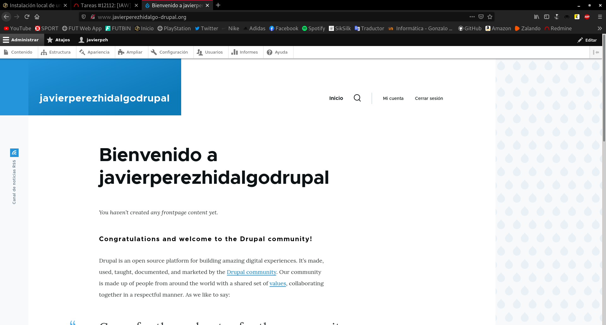
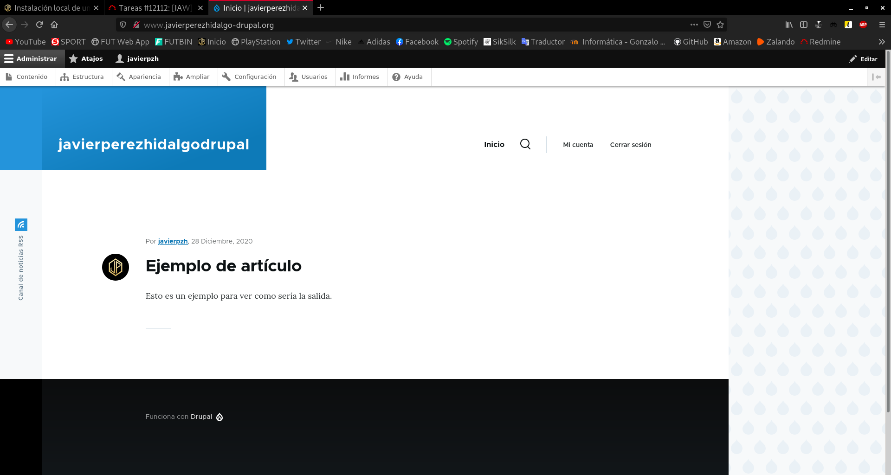
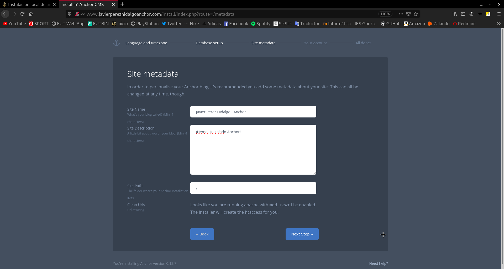
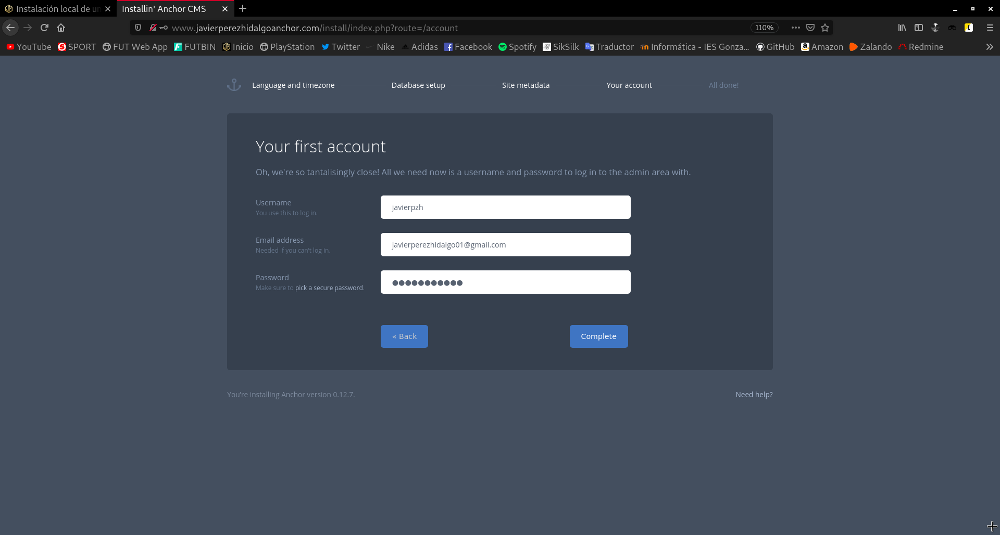
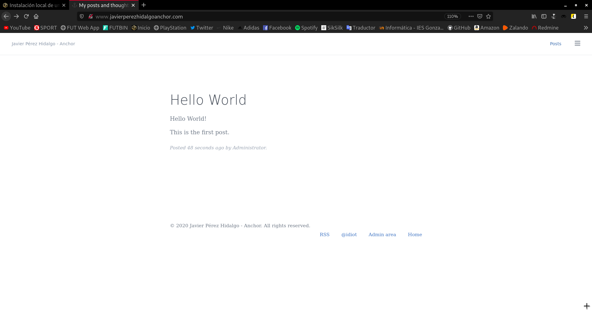
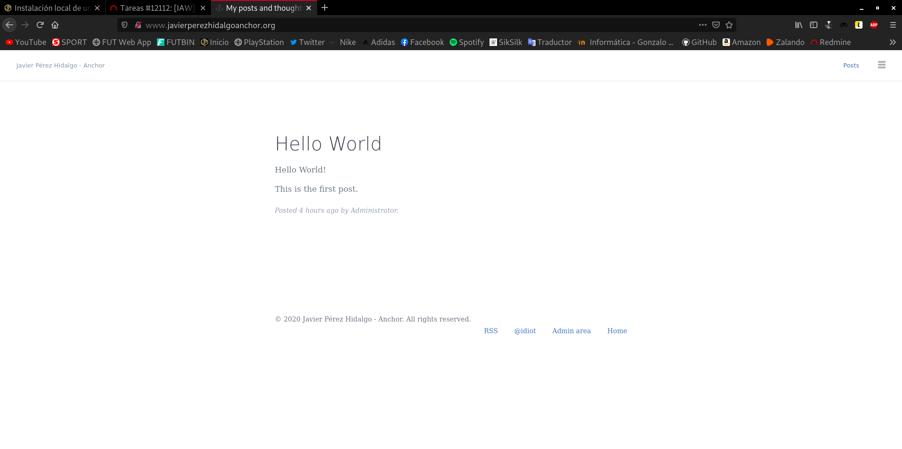
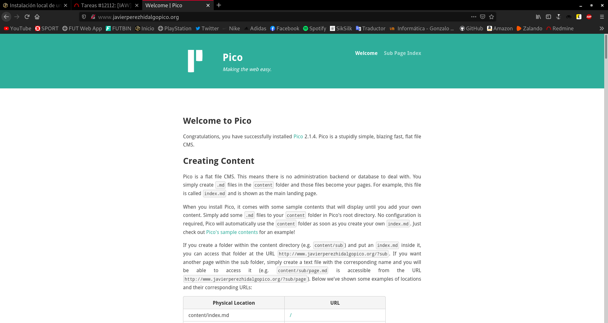
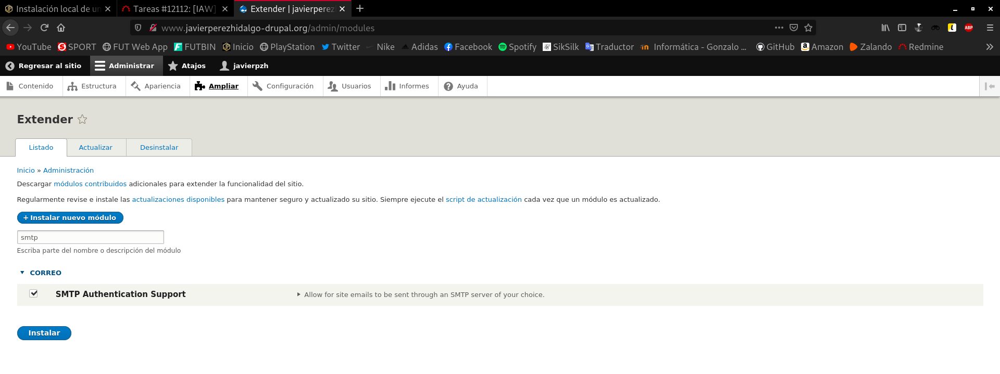

Title: Instalación local de un CMS PHP
Date: 2020/12/28
Category: Implantación de Aplicaciones Web
Header_Cover: theme/images/banner-aplicacionesweb.jpg
Tags: LAMP, CMS, Linux, Apache, MariaDB, MySQL, PHP, DrupalCMS, AnchorCMS, PicoCMS

Esta tarea consiste en instalar un **CMS** de tecnología **PHP** en un servidor local. Los pasos que tendrás que dar los siguientes:

## Tarea 1: Instalación de un servidor LAMP

- **Crea una instancia de vagrant basado en un box debian o ubuntu**

He creado una máquina virtual utilizando **Vagrant** y **VirtualBox**, mediante el siguiente fichero *VagrantFile*:

<pre>
# -*- mode: ruby -*-
# vi: set ft=ruby :

Vagrant.configure("2") do |config|

 config.vm.define :servidor1 do |servidor1|
  servidor1.vm.box = "debian/buster64"
  servidor1.vm.network "private_network", ip: "192.168.30.15"
 end

end
</pre>

- **Instala en esa máquina virtual toda la pila LAMP**
- **Entrega una documentación resumida donde expliques los pasos fundamentales para realizar esta tarea.**

Una vez tenemos la máquina lista, vamos a instalar el **servidor LAMP**, que hace referencia a:

- **L**inux, el sistema operativo
- **A**pache, el servidor web
- **M**ySQL/MariaDB, el gestor de bases de datos
- **P**HP, el lenguaje de programación

Antes de nada voy a preparar la máquina para la instalación, voy a actualizar los paquetes instalados, ya que la box que estoy utilizando no es de la última versión de Debian.

<pre>
apt update && apt upgrade -y && apt autoremove -y
</pre>

El primer paso sería instalar nuestro gestor de base de datos, **MySQL**, por tanto, lo instalamos:

<pre>
apt install mariadb-server mariadb-client -y
</pre>

Una vez lo hemos instalado, vamos a configurar una serie de opciones con el comando `mysql_secure_installation`. Vamos a especificarle una **contraseña de root**, vamos a **eliminar los usuarios anónimos**, vamos a **desactivar el acceso remoto** a la base de datos, en resumen, vamos a restablecer la base de datos, con nuestras preferencias:

<pre>
root@buster:/home/vagrant# mysql_secure_installation

NOTE: RUNNING ALL PARTS OF THIS SCRIPT IS RECOMMENDED FOR ALL MariaDB
      SERVERS IN PRODUCTION USE!  PLEASE READ EACH STEP CAREFULLY!

In order to log into MariaDB to secure it, we'll need the current
password for the root user.  If you've just installed MariaDB, and
you haven't set the root password yet, the password will be blank,
so you should just press enter here.

Enter current password for root (enter for none):
OK, successfully used password, moving on...

Setting the root password ensures that nobody can log into the MariaDB
root user without the proper authorisation.

You already have a root password set, so you can safely answer 'n'.

Change the root password? [Y/n] Y
New password:
Re-enter new password:
Password updated successfully!
Reloading privilege tables..
 ... Success!

By default, a MariaDB installation has an anonymous user, allowing anyone
to log into MariaDB without having to have a user account created for
them.  This is intended only for testing, and to make the installation
go a bit smoother.  You should remove them before moving into a
production environment.

Remove anonymous users? [Y/n] Y
 ... Success!

Normally, root should only be allowed to connect from 'localhost'.  This
ensures that someone cannot guess at the root password from the network.

Disallow root login remotely? [Y/n] Y
 ... Success!

By default, MariaDB comes with a database named 'test' that anyone can
access.  This is also intended only for testing, and should be removed
before moving into a production environment.

Remove test database and access to it? [Y/n] Y
 - Dropping test database...
 ... Success!
 - Removing privileges on test database...
 ... Success!

Reloading the privilege tables will ensure that all changes made so far
will take effect immediately.

Reload privilege tables now? [Y/n] Y
 ... Success!

Cleaning up...

All done!  If you've completed all of the above steps, your MariaDB
installation should now be secure.

Thanks for using MariaDB!
</pre>

Procedemos a instalar el servidor web **Apache**, que lo vamos a instalar con este comando:

<pre>
apt install apache2 apache2-utils -y
</pre>

Y vamos a habilitar su servicio en cada inicio del sistema con:

<pre>
systemctl enable apache2
</pre>

Nos quedaría por instalar el **servidor PHP**, para ello:

<pre>
apt install php libapache2-mod-php php-mysql -y
</pre>

También he instalado las **librerías php** de *apache* y *mysql*, para que todos los sistemas puedan funcionar de manera conjunta.

Activamos el módulo de **PHP** de **Apache**.

<pre>
a2enmod php7.3
</pre>

Y por último introducimos la siguiente línea en forma de *script PHP*, que lo único que hace es crear un fichero llamado `phpinfo.php` dentro del directorio `/var/www/html`, en el que escribe **<?php phpinfo(); ?>**.

`echo "<?php phpinfo(); ?>" | sudo tee /var/www/html/phpinfo.php`

Hemos terminado de montar nuestro servidor LAMP.

##Tarea 2: Instalación de drupal en mi servidor local

- **Configura el servidor web con virtual hosting para que el CMS sea accesible desde la dirección: `www.nombrealumno-drupal.org`.**

En la ruta `/etc/apache2/sites-available/` creamos un fichero de configuración para esta página. Podemos copiar el fichero llamado `000-default.conf` para tener la estructura y luego lo modificamos:

<pre>
root@buster:/etc/apache2/sites-available# cp 000-default.conf javierperezhidalgo-drupal.conf

root@buster:/etc/apache2/sites-available# nano javierperezhidalgo-drupal.conf
</pre>

Dentro de este fichero, establecemos la *URL* de la web en el apartado **ServerName**. Tiene que quedar así:

<pre>
<\VirtualHost *:80\>
        ServerName www.javierperezhidalgo-drupal.org

        ServerAdmin webmaster@localhost
        DocumentRoot /srv/www/drupal

        ErrorLog ${APACHE_LOG_DIR}/error.log
        CustomLog ${APACHE_LOG_DIR}/access.log combined

<\/VirtualHost\>
</pre>

**Atención:** a esta configuración hay que eliminarle los carácteres `\`, que he tenido que introducir para escapar los carácteres siguientes, así que en caso de querer copiar la configuración, debemos tener en cuenta esto.

Creamos el enlace simbólico para activar el sitio web:

<pre>
root@buster:/etc/apache2/sites-available# a2ensite javierperezhidalgo-drupal.conf
</pre>

Reinicamos el servicio del servidor apache:

<pre>
systemctl restart apache2
</pre>

Si nos dirigimos a nuestra máquina anfitriona y añadimos al `/etc/hosts` esta línea, en el navegador podremos visualizar la web `www.javierperezhidalgo-drupal.org`:

<pre>
192.168.30.15   www.javierperezhidalgo-drupal.org
</pre>

La página web tiene este aspecto:

- **Crea un usuario en la base de datos para trabajar con la base de datos donde se van a guardar los datos del CMS.**

Para crear un usario en MySQL:

<pre>
root@buster:/var/www/html# mysql -u root -p
Enter password:
Welcome to the MariaDB monitor.  Commands end with ; or \g.
Your MariaDB connection id is 65
Server version: 10.3.27-MariaDB-0+deb10u1 Debian 10

Copyright (c) 2000, 2018, Oracle, MariaDB Corporation Ab and others.

Type 'help;' or '\h' for help. Type '\c' to clear the current input statement.

MariaDB [(none)]> CREATE DATABASE drupal;
Query OK, 1 row affected (0.002 sec)

MariaDB [(none)]> CREATE USER 'drupal' IDENTIFIED BY 'contraseña';
Query OK, 0 rows affected (0.001 sec)

MariaDB [(none)]> GRANT ALL PRIVILEGES ON drupal.* TO 'drupal';
Query OK, 0 rows affected (0.000 sec)

MariaDB [(none)]> exit
Bye
</pre>

Además de crear el usuario **drupal**, le he concedido todos los permisos para tener acceso y control sobre todas las tablas y bases de datos.

- **Descarga la versión que te parezca más oportuna de Drupal y realiza la instalación.**

Para descargar **Drupal** en su última versión, que en este momento es la **9**, nos dirigimos a la [página oficial de Drupal](https://www.drupal.org/download). Copiamos la ruta del enlace de descarga del archivo, en mi caso prefiero el *tar.gz* y lo descargamos en nuestro servidor *LAMP* con la utilidad `wget`.

<pre>
root@buster:~# wget https://www.drupal.org/download-latest/tar.gz
--2020-12-28 13:18:56--  https://www.drupal.org/download-latest/tar.gz
Resolving www.drupal.org (www.drupal.org)... 151.101.134.217
Connecting to www.drupal.org (www.drupal.org)|151.101.134.217|:443... connected.
HTTP request sent, awaiting response... 302 Moved Temporarily
Location: https://ftp.drupal.org/files/projects/drupal-9.1.0.tar.gz [following]
--2020-12-28 13:18:57--  https://ftp.drupal.org/files/projects/drupal-9.1.0.tar.gz
Resolving ftp.drupal.org (ftp.drupal.org)... 151.101.134.217
Connecting to ftp.drupal.org (ftp.drupal.org)|151.101.134.217|:443... connected.
HTTP request sent, awaiting response... 200 OK
Length: 17741953 (17M) [application/octet-stream]
Saving to: ‘tar.gz’

tar.gz                    100%[=====================================>]  16.92M  8.86MB/s    in 1.9s    

2020-12-28 13:18:59 (8.86 MB/s) - ‘tar.gz’ saved [17741953/17741953]

root@buster:~# tar xf tar.gz -C /srv/www/
</pre>

Hemos descargado **Drupal** y lo hemos descomprimido en la ruta en la que se encuentra el sitio web, en mi caso, `/srv/www/`. Para utilizar esta ruta, debemos modificar el fichero `apache2.conf`, que actualmente posee esta configuración:

<pre>
<\Directory /var/www/\>
       Options Indexes FollowSymLinks
       AllowOverride None
       Require all granted
<\/Directory\>

#<\Directory /srv/\>
#        Options Indexes FollowSymLinks
#        AllowOverride None
#        Require all granted
#<\/Directory\>
</pre>

**Atención:** a esta configuración hay que eliminarle los carácteres `\`, que he tenido que introducir para escapar los carácteres siguientes, así que en caso de querer copiar la configuración, debemos tener en cuenta esto.

Esto indica que mostrará todos los ficheros de las páginas alojadas en la ruta `/var/www/`. Lo que debemos hacer es comentar estas líneas y descomentar las de abajo que hacen referencia a la ruta `/srv/` y todos sus hijos:

<pre>
#<\Directory /var/www/\>
#       Options Indexes FollowSymLinks
#       AllowOverride None
#       Require all granted
#<\/Directory\>

<\Directory /srv/\>
        Options Indexes FollowSymLinks
        AllowOverride None
        Require all granted
<\/Directory\>
</pre>

**Atención:** a esta configuración hay que eliminarle los carácteres `\`, que he tenido que introducir para escapar los carácteres siguientes, así que en caso de querer copiar la configuración, debemos tener en cuenta esto.

Además conviene crear un enlace simbólico sobre el directorio de *Drupal* para tener un nombre sin números de versión. Hemos otorgado al usuario `www-data` como dueño del directorio y su contenido al servidor web.

<pre>
root@buster:~# ln -s /srv/www/drupal-9.1.0/ /srv/www/drupal

root@buster:~# chown -R www-data:www-data /srv/www/drupal/
</pre>

También necesitamos algunas extensiones de *PHP*:

<pre>
apt install php-gd php-mbstring php-xml -y
</pre>

*Drupal* puede hacer uso del sistema de reescritura de *URLs*, basado en el módulo **Rewrite** de *Apache*, que no está activado por defecto. Este módulo permite crear direcciones *URL* alternativas a las dinámicas generadas por la programación de nuestros sitio web, de tal modo que sean más legibles y fáciles de recordar. Activamos el módulo **Rewrite**:

<pre>
a2enmod rewrite
</pre>

Ya tendríamos activado el módulo *Rewrite* de *Apache*, pero nos quedaría por configurar nuestra aplicación *Drupal* para que haga uso de él. Para ello, nos dirigimos al fichero de configuración del *virtualhost* de *Drupal* e introducimos el siguiente bloque, que permite, entre ellos, el uso de archivos `.htaccess`.

<pre>
<\Directory /srv/www/drupal>
        AllowOverride all
<\/Directory>
</pre>

**Atención:** a esta configuración hay que eliminarle los carácteres `\`, que he tenido que introducir para escapar los carácteres siguientes, así que en caso de querer copiar la configuración, debemos tener en cuenta esto.

¿Y para qué hacemos esto?

Pues bien, porque en la carpeta *drupal* que hemos obtenido al descomprimir el paquete descargado, ya nos encontramos con un fichero de este tipo, que viene configurado para solucionar el problema de las *URLs* limpias.

De manera que el fichero del *virtualhost* quedaría con el siguiente aspecto:

<pre>
<\VirtualHost *:80\>
        ServerName www.javierperezhidalgo-drupal.org

        ServerAdmin webmaster@localhost
        DocumentRoot /srv/www/drupal

        ErrorLog ${APACHE_LOG_DIR}/error.log
        CustomLog ${APACHE_LOG_DIR}/access.log combined

        <\Directory /srv/www/drupal/\>
          AllowOverride All
        <\/Directory\>

<\/VirtualHost\>
</pre>

**Atención:** a esta configuración hay que eliminarle los carácteres `\`, que he tenido que introducir para escapar los carácteres siguientes, así que en caso de querer copiar la configuración, debemos tener en cuenta esto.

Aplicamos los cambios en la configuración reiniciando el servidor web:

<pre>
systemctl restart apache2
</pre>

En este punto ya podemos hacer uso del **Instalador Web de Drupal**. Accedemos a la web que hemos configurado antes con la URL `http://www.javierperezhidalgo-drupal.org`, y se nos abrirá el instalador.

- Seleccionamos el idioma deseado.
- Seleccionamos el perfil de la instalación, en mi caso **estándar**.
- Configuramos la base de datos:

Y ya comienza el proceso de instalación:

Terminada la instalación llega el momento de configurar la identidad del sitio y crear el usuario administrador.

Completamos según nuestras preferencias y guardamos y listo:

- **Realiza una configuración mínima de la aplicación (Cambia la plantilla, crea algún contenido, …)**

Para **cambiar el tema de nuestro CMS**, nos dirigimos a la opción que nos aparece arriba, **Apariencia** y seleccionamos `+ Instalar nuevo tema`, introducimos el enlace de descarga del tema que queremos añadir y listo. Cuidado, tenemos que comprobar que el tema que vamos a instalar es compatible con la versión de *Drupal* que estamos utilizando.

Puede ser que no nos aparezca el botón `+ Instalar nuevo tema`. En este caso, debemos dirigirnos a la pestaña **Contenido** y en ésta, activar el módulo **Update Manager**. Hecho esto, ya nos aparecería este botón.

Una vez tenemos instalado el tema que queremos, lo seleccionamos como activo:

Y ya hemos cambiado el tema:

Vamos a añadir alguna entrada, para ver como se mostraría el contenido. Para ello en la parte superior de las opciones, donde dice **Contenido**, *clickamos* en `+ Añadir contenido`, y se nos abrirá una especie de editor, que configuramos a nuestro gusto y guardamos los cambios.

Así quedaría nuestra nueva publicación:

- **Instala un módulo para añadir alguna funcionalidad a Drupal.**

Para **instalar un nuevo módulo** en Drupal, es bastante sencillo y parecido a los temas. Vamos a la opción **Ampliar**, *clickamos* en `+ Instalar nuevo módulo`, introducimos el enlace de descarga del módulo que queremos añadir y listo. Al igual que con el tema, tenemos que verificar que funciona con nuestra versión de *Drupal*.

En mi caso, voy a instalar un módulo llamado ***AddToAny*** que permite compartir los artículos y entradas de la web a través de nuestras redes sociales.

Activamos el nuevo módulo:

Observamos como en la página de inicio, ahora nos aparece un pequeño menú con varias redes sociales para compartir el artículo.

## Tarea 3: Configuración multinodo

- **Realiza un copia de seguridad de la base de datos.**

Realizamos una copia de seguridad de la base de datos de *Drupal* que tenemos en *MySQL*, mediante el comando:

<pre>
root@buster:~# mysqldump -u drupal -p drupal > copiaseguridaddrupal.sql
Enter password:

root@buster:~# ls
copiaseguridaddrupal.sql
</pre>

Le pasamos dos parámetros: la opción **-u** indica el nombre de usuario y la opción **-p** el nombre de la base de datos.

- **Crea otra máquina con Vagrant, conectada con una red interna a la anterior y configura un servidor de base de datos.**

Modifico el escenario creado antes y queda así:

<pre>
# -*- mode: ruby -*-
# vi: set ft=ruby :

Vagrant.configure("2") do |config|

 config.vm.define :servidor1 do |servidor1|
  servidor1.vm.box = "debian/buster64"
  servidor1.vm.network "private_network", ip: "192.168.30.15"
 end

 config.vm.define :maquina2 do |maquina2|
  maquina2.vm.box = "debian/buster64"
  maquina2.vm.network "private_network", ip: "192.168.30.30"
 end

end
</pre>

En la nueva máquina llamada **maquina2** hay que configurar el nuevo servidor de base de datos, para ello previamente preparo y actualizo los paquetes, e instalo los relativos a **MySQL**:

<pre>
apt update && apt upgrade -y && apt autoremove -y && apt install mariadb-server mariadb-client -y
</pre>

Una vez lo hemos instalado, vamos a configurar una serie de opciones con el comando `mysql_secure_installation`. Vamos a especificarle una **contraseña de root**, vamos a **eliminar los usuarios anónimos**, vamos a **desactivar el acceso remoto** a la base de datos, en resumen, vamos a restablecer la base de datos, con nuestras preferencias:

<pre>
root@buster:/home/vagrant# mysql_secure_installation

NOTE: RUNNING ALL PARTS OF THIS SCRIPT IS RECOMMENDED FOR ALL MariaDB
      SERVERS IN PRODUCTION USE!  PLEASE READ EACH STEP CAREFULLY!

In order to log into MariaDB to secure it, we'll need the current
password for the root user.  If you've just installed MariaDB, and
you haven't set the root password yet, the password will be blank,
so you should just press enter here.

Enter current password for root (enter for none):
OK, successfully used password, moving on...

Setting the root password ensures that nobody can log into the MariaDB
root user without the proper authorisation.

You already have a root password set, so you can safely answer 'n'.

Change the root password? [Y/n] Y
New password:
Re-enter new password:
Password updated successfully!
Reloading privilege tables..
 ... Success!

By default, a MariaDB installation has an anonymous user, allowing anyone
to log into MariaDB without having to have a user account created for
them.  This is intended only for testing, and to make the installation
go a bit smoother.  You should remove them before moving into a
production environment.

Remove anonymous users? [Y/n] Y
 ... Success!

Normally, root should only be allowed to connect from 'localhost'.  This
ensures that someone cannot guess at the root password from the network.

Disallow root login remotely? [Y/n] Y
 ... Success!

By default, MariaDB comes with a database named 'test' that anyone can
access.  This is also intended only for testing, and should be removed
before moving into a production environment.

Remove test database and access to it? [Y/n] Y
 - Dropping test database...
 ... Success!
 - Removing privileges on test database...
 ... Success!

Reloading the privilege tables will ensure that all changes made so far
will take effect immediately.

Reload privilege tables now? [Y/n] Y
 ... Success!

Cleaning up...

All done!  If you've completed all of the above steps, your MariaDB
installation should now be secure.

Thanks for using MariaDB!
</pre>

- **Crea un usuario en la base de datos para trabajar con la nueva base de datos.**

Para crear un usario en MySQL:

<pre>
root@buster:/home/vagrant# mysql -u root -p
Enter password:
Welcome to the MariaDB monitor.  Commands end with ; or \g.
Your MariaDB connection id is 57
Server version: 10.3.27-MariaDB-0+deb10u1 Debian 10

Copyright (c) 2000, 2018, Oracle, MariaDB Corporation Ab and others.

Type 'help;' or '\h' for help. Type '\c' to clear the current input statement.

MariaDB [(none)]> CREATE DATABASE drupal;
Query OK, 1 row affected (0.002 sec)

MariaDB [(none)]> CREATE USER 'drupal' IDENTIFIED BY 'contraseña';
Query OK, 0 rows affected (0.001 sec)

MariaDB [(none)]> GRANT ALL PRIVILEGES ON drupal.* TO 'drupal';
Query OK, 0 rows affected (0.001 sec)

MariaDB [(none)]> exit
Bye
</pre>

- **Restaura la copia de seguridad en el nuevo servidor de base datos.**

Para mover la copia de seguridad de la base de datos que hemos realizado en pasos anteriores, en la máquina **servidor1** he instalado la utilidad **rclone**, he configurado mi cuenta de *Dropbox* y he copiado el archivo. Si quieres aprender más sobre *rclone* puedes visitar este [post](https://javierpzh.github.io/rclone-gestionando-nuestro-almacenamiento-en-la-nube.html).

Podríamos haberlo hecho con el típico comando `scp`, pero en caso de querer utilizarlo, tendríamos que establecer una contraseña en las máquinas, ya que *Vagrant* por defecto no deja que nos conectemos por **SSH** si no utilizamos la clave privada, y luego configurar en el fichero `/etc/ssh/sshd_config` la línea `PasswordAuthentication no` y sustituir el **no** por un **yes**, y reiniciar el servicio *SSH*, ya que hemos tocado su configuración.

Ahora voy a configurar la misma cuenta de *Dropbox* con *rclone* en la máquina **maquina2**, y voy a descargar la copia de seguridad de la base de datos.

<pre>
root@buster:~# rclone copy dropbox:/rclone/copiaseguridaddrupal.sql /home/vagrant/

root@buster:~# ls
copiaseguridaddrupal.sql
</pre>

Ya tengo la copia de seguridad en la **maquina2**, que es donde quiero restaurarla. Para restaurar una copia de seguridad de una base de datos en *MySQL*, introducimos el siguiente comando:

<pre>
root@buster:~# mysql -u drupal -p drupal < copiaseguridaddrupal.sql
Enter password:

root@buster:~#
</pre>

El parámetro **-u** indica el nombre de usuario y **-p** el nombre de la base de datos, donde se va a restaurar la copia.

Si miramos las bases de datos del usuario **drupal**:

<pre>
root@buster:~# mysql -u drupal -p
Enter password:
Welcome to the MariaDB monitor.  Commands end with ; or \g.
Your MariaDB connection id is 59
Server version: 10.3.27-MariaDB-0+deb10u1 Debian 10

Copyright (c) 2000, 2018, Oracle, MariaDB Corporation Ab and others.

Type 'help;' or '\h' for help. Type '\c' to clear the current input statement.

MariaDB [(none)]> show databases;
+--------------------+
| Database           |
+--------------------+
| drupal             |
| information_schema |
+--------------------+
2 rows in set (0.001 sec)
</pre>

Si entramos en la base de datos **drupal** y miramos las tablas:

<pre>
MariaDB [(none)]> use drupal;
Reading table information for completion of table and column names
You can turn off this feature to get a quicker startup with -A

Database changed
MariaDB [drupal]> show tables;
+----------------------------------+
| Tables_in_drupal                 |
+----------------------------------+
| batch                            |
| block_content                    |
| block_content__body              |
| block_content_field_data         |
| block_content_field_revision     |
| block_content_revision           |
| block_content_revision__body     |
| cache_bootstrap                  |
| cache_config                     |
| cache_container                  |
| cache_data                       |
| cache_default                    |
| cache_discovery                  |
| cache_dynamic_page_cache         |
| cache_entity                     |
| cache_menu                       |
| cache_render                     |
| cachetags                        |
| comment                          |
| comment__comment_body            |
| comment_entity_statistics        |
| comment_field_data               |
| config                           |
| file_managed                     |
| file_usage                       |
| history                          |
| key_value                        |
| key_value_expire                 |
| locale_file                      |
| locales_location                 |
| locales_source                   |
| locales_target                   |
| menu_link_content                |
| menu_link_content_data           |
| menu_link_content_field_revision |
| menu_link_content_revision       |
| menu_tree                        |
| node                             |
| node__body                       |
| node__comment                    |
| node__field_image                |
| node__field_tags                 |
| node_access                      |
| node_field_data                  |
| node_field_revision              |
| node_revision                    |
| node_revision__body              |
| node_revision__comment           |
| node_revision__field_image       |
| node_revision__field_tags        |
| path_alias                       |
| path_alias_revision              |
| queue                            |
| router                           |
| search_dataset                   |
| search_index                     |
| search_total                     |
| semaphore                        |
| sequences                        |
| sessions                         |
| shortcut                         |
| shortcut_field_data              |
| shortcut_set_users               |
| taxonomy_index                   |
| taxonomy_term__parent            |
| taxonomy_term_data               |
| taxonomy_term_field_data         |
| taxonomy_term_field_revision     |
| taxonomy_term_revision           |
| taxonomy_term_revision__parent   |
| user__roles                      |
| user__user_picture               |
| users                            |
| users_data                       |
| users_field_data                 |
| watchdog                         |
+----------------------------------+
76 rows in set (0.001 sec)

MariaDB [drupal]>
</pre>

Vemos que la copia se ha restaurado correctamente.

- **Desinstala el servidor de base de datos en el servidor principal.**

En **servidor1** desinstalamos el servidor de base de datos y borramos todos sus datos:

<pre>
apt remove --purge mariadb-server mariadb-client -y && apt autoremove -y
</pre>

Probamos a acceder a la página de *Drupal* ahora:

Obviamente, no podemos acceder a la web, ya que ahora mismo no se encuentra conectada a ninguna base de datos.

- **Realiza los cambios de configuración necesarios en *Drupal* para que la página funcione.**

En este punto, queremos volver a tener disponible nuestra web de *Drupal*, pero funcionando con la base de datos en la nueva máquina, es decir, en **maquina2**.

Tenemos que cambiar la configuración de *Drupal*, para ello nos dirigimos al fichero que se encuentra en la ruta `/srv/www/drupal-9.1.0/sites/default/settings.php` de la máquina **servidor1**, y al final del archivo, se encuentra la configuración de la base de datos que utiliza *Drupal*. Como es obvio, está configurada como que la base de datos está en el mismo equipo, por tanto está configurado en **localhost**. Aquí viene el primer cambio, pues debemos remover *localhost* y sustituirlo por la IP de la máquina donde se encuentra la nueva base de datos sobre la que va a funcionar Drupal, que es la **192.168.30.30**.

<pre>
$databases['default']['default'] = array (
  'database' => 'drupal',
  'username' => 'drupal',
  'password' => 'contraseña',
  'prefix' => '',
  'host' => '192.168.30.30',
  'port' => '3306',
  'namespace' => 'Drupal\\Core\\Database\\Driver\\mysql',
  'driver' => 'mysql',
);
</pre>

Una vez hecho esto, tendríamos que dirigirnos a la máquina donde hemos migrado la copia de seguridad, es decir la llamada **maquina2**, y tenemos que permitirle el acceso remoto a la base de datos.

El primer paso es editar el fichero de configuración que se encuentra en `/etc/mysql/mariadb.conf.d/50-server.cnf` y tenemos que editar, y en caso de estar comentadas la línea `bind-address`. En esta línea, tenemos que cambiar la IP, ya que por defecto aparece la de *localhost*, y esto hace que el servidor esté configurado para que solo escuche peticiones de *localhost*. Si queremos que escuche las peticiones de todas las interfaces de red, la línea debe quedar así:

<pre>
bind-address            = 0.0.0.0
</pre>

En último lugar, vamos a permitirle tanto a nuestro usuario *drupal*, como a *root*, que puedan ser accesibles desde otros equipos.

<pre>
root@buster:~# mysql -u root -p
Enter password:
Welcome to the MariaDB monitor.  Commands end with ; or \g.
Your MariaDB connection id is 61
Server version: 10.3.27-MariaDB-0+deb10u1 Debian 10

Copyright (c) 2000, 2018, Oracle, MariaDB Corporation Ab and others.

Type 'help;' or '\h' for help. Type '\c' to clear the current input statement.

MariaDB [(none)]> GRANT ALL PRIVILEGES ON *.* TO 'root'@'%' IDENTIFIED BY 'contraseña' WITH GRANT OPTION;
Query OK, 0 rows affected (0.001 sec)

MariaDB [(none)]> GRANT ALL PRIVILEGES ON *.* TO 'drupal'@'%' IDENTIFIED BY 'contraseña' WITH GRANT OPTION;
Query OK, 0 rows affected (0.000 sec)

MariaDB [(none)]> FLUSH PRIVILEGES;
Query OK, 0 rows affected (0.001 sec)

MariaDB [(none)]> exit
Bye
</pre>

Reiniciamos el servidor:

<pre>
systemctl restart mysqld
</pre>

Accedemos a la dirección `www.javierperezhidalgo-drupal.org` para ver si ya vuelve a funcionar:

Ya podemos acceder de nuevo a nuestro sitio web *Drupal* que esta vez está utilizando una base de datos que se encuentra en otra máquina.

## Tarea 4: Instalación de otro CMS PHP

- **Elige otro CMS realizado en PHP y realiza la instalación en tu infraestructura.**

- **Configura otro Virtualhost y elige otro nombre en el mismo dominio.**

He decidido elegir el CMS llamado **Anchor**. Este CMS cuenta con una interfaz de usuario muy simple. Instalar *Anchor* nos llevará muy poco tiempo. Soporta *Markdown editor*, campos personalizados, múltiples idiomas y la posibilidad de instalar múltiples temas.

Si nos ayudamos de la página oficial de [Anchor](https://anchorcms.com/), la descarga la podemos realizar desde [aquí](https://anchorcms.com/download).

Como antes para realizar la migración, desinstalé *MySQL* de la máquina **servidor1**, voy a volver a realizar la instalación y configuración, esta vez sin tantos detalles.

<pre>
root@buster:~# apt install mariadb-server mariadb-client -y

root@buster:~# mysql_secure_installation

...
</pre>

Creamos el usuario **anchor** de la base de datos y le otorgamos los permisos:

<pre>
root@buster:~# mysql -u root -p
Enter password:
Welcome to the MariaDB monitor.  Commands end with ; or \g.
Your MariaDB connection id is 44
Server version: 10.3.27-MariaDB-0+deb10u1 Debian 10

Copyright (c) 2000, 2018, Oracle, MariaDB Corporation Ab and others.

Type 'help;' or '\h' for help. Type '\c' to clear the current input statement.

MariaDB [(none)]> CREATE DATABASE anchor;
Query OK, 1 row affected (0.002 sec)

MariaDB [(none)]> CREATE USER anchor IDENTIFIED BY 'contraseña';
Query OK, 0 rows affected (0.003 sec)

MariaDB [(none)]> GRANT ALL PRIVILEGES ON anchor. * TO 'anchor';
Query OK, 0 rows affected (0.002 sec)

MariaDB [(none)]> exit
Bye
</pre>

Necesitamos instalar **composer** en el sistema, que es un administrador de dependencias *PHP*. También necesitamos tener instalado el paquete `git`, ya que nos hará falta durante la instalación:

<pre>
apt install composer git -y
</pre>

Descargamos y creamos la página de *Anchor* utilizando *composer* con el comando:

<pre>
root@buster:/srv/www# composer create-project anchorcms/anchor-cms
Do not run Composer as root/super user! See https://getcomposer.org/root for details
Continue as root/super user [yes]? yes
Creating a "anchorcms/anchor-cms" project at "./anchor-cms"
Installing anchorcms/anchor-cms (0.12.7)
    Failed to download anchorcms/anchor-cms from dist: The zip extension and unzip command are both missing, skipping.
Your command-line PHP is using multiple ini files. Run `php --ini` to show them.
    Now trying to download from source
  - Syncing anchorcms/anchor-cms (0.12.7) into cache
  - Installing anchorcms/anchor-cms (0.12.7): Cloning 08e8e50790 from cache
Created project in /srv/www/anchor-cms

  [Composer\Json\JsonValidationException]                    
  "./composer.json" does not match the expected JSON schema  

create-project [-s|--stability STABILITY] [--prefer-source] [--prefer-dist] [--repository REPOSITORY] [--repository-url REPOSITORY-URL] [--add-repository] [--dev] [--no-dev] [--no-custom-installers] [--no-scripts] [--no-progress] [--no-secure-http] [--keep-vcs] [--remove-vcs] [--no-install] [--ignore-platform-req IGNORE-PLATFORM-REQ] [--ignore-platform-reqs] [--ask] [--] [<package>] [<directory>] [<version>]
</pre>

Antes de pasar con el error del que nos ha informado, he cambiado el nombre del directorio:

<pre>
root@buster:/srv/www# mv anchor-cms anchor
</pre>

Si nos fijamos, nos ha reportado un mensaje de error. Nos indica que ha detectado un fallo en el fichero `composer.json`. Para solucionar este error, debemos editar el fichero:

<pre>
root@buster:/srv/www/anchor# nano composer.json
</pre>

En la línea que hace referencia al tipo, debemos cambiar el valor, que por defecto viene *CMS*, debemos indicar el tipo con letras minúsculas, de forma que quede así:

<pre>
"type": "cms"
</pre>

Corremos el instalador de nuevo:

<pre>
root@buster:/srv/www/anchor# composer install
Do not run Composer as root/super user! See https://getcomposer.org/root for details
Continue as root/super user [yes]? yes
Installing dependencies from lock file (including require-dev)
Verifying lock file contents can be installed on current platform.
Warning: The lock file is not up to date with the latest changes in composer.json. You may be getting outdated dependencies. It is recommended that you run `composer update` or `composer update <package name>`.
Package operations: 13 installs, 0 updates, 0 removals
    Failed to download indigophp/hash-compat from dist: The zip extension and unzip command are both missing, skipping.
Your command-line PHP is using multiple ini files. Run `php --ini` to show them.
    Now trying to download from source
  - Syncing indigophp/hash-compat (v1.1.0) into cache
    Failed to download ircmaxell/password-compat from dist: The zip extension and unzip command are both missing, skipping.
Your command-line PHP is using multiple ini files. Run `php --ini` to show them.
    Now trying to download from source
  - Syncing ircmaxell/password-compat (v1.0.4) into cache
    Failed to download ircmaxell/security-lib from dist: The zip extension and unzip command are both missing, skipping.
Your command-line PHP is using multiple ini files. Run `php --ini` to show them.
    Now trying to download from source
  - Syncing ircmaxell/security-lib (v1.1.0) into cache
    Failed to download ircmaxell/random-lib from dist: The zip extension and unzip command are both missing, skipping.
Your command-line PHP is using multiple ini files. Run `php --ini` to show them.
    Now trying to download from source
  - Syncing ircmaxell/random-lib (v1.2.0) into cache
    Failed to download peridot-php/leo from dist: The zip extension and unzip command are both missing, skipping.
Your command-line PHP is using multiple ini files. Run `php --ini` to show them.
    Now trying to download from source
  - Syncing peridot-php/leo (1.6.1) into cache
    Failed to download symfony/polyfill-mbstring from dist: The zip extension and unzip command are both missing, skipping.
Your command-line PHP is using multiple ini files. Run `php --ini` to show them.
    Now trying to download from source
  - Syncing symfony/polyfill-mbstring (v1.7.0) into cache
    Failed to download psr/log from dist: The zip extension and unzip command are both missing, skipping.
Your command-line PHP is using multiple ini files. Run `php --ini` to show them.
    Now trying to download from source
  - Syncing psr/log (1.0.2) into cache
    Failed to download symfony/debug from dist: The zip extension and unzip command are both missing, skipping.
Your command-line PHP is using multiple ini files. Run `php --ini` to show them.
    Now trying to download from source
  - Syncing symfony/debug (v4.0.5) into cache
    Failed to download symfony/console from dist: The zip extension and unzip command are both missing, skipping.
Your command-line PHP is using multiple ini files. Run `php --ini` to show them.
    Now trying to download from source
  - Syncing symfony/console (v3.4.5) into cache
    Failed to download phpunit/php-timer from dist: The zip extension and unzip command are both missing, skipping.
Your command-line PHP is using multiple ini files. Run `php --ini` to show them.
    Now trying to download from source
  - Syncing phpunit/php-timer (1.0.9) into cache
    Failed to download peridot-php/peridot-scope from dist: The zip extension and unzip command are both missing, skipping.
Your command-line PHP is using multiple ini files. Run `php --ini` to show them.
    Now trying to download from source
  - Syncing peridot-php/peridot-scope (1.3.0) into cache
    Failed to download evenement/evenement from dist: The zip extension and unzip command are both missing, skipping.
Your command-line PHP is using multiple ini files. Run `php --ini` to show them.
    Now trying to download from source
  - Syncing evenement/evenement (v2.1.0) into cache
    Failed to download peridot-php/peridot from dist: The zip extension and unzip command are both missing, skipping.
Your command-line PHP is using multiple ini files. Run `php --ini` to show them.
    Now trying to download from source
  - Syncing peridot-php/peridot (1.19.0) into cache
  - Installing indigophp/hash-compat (v1.1.0): Cloning 43a19f4209 from cache
  - Installing ircmaxell/password-compat (v1.0.4): Cloning 5c5cde8822 from cache
  - Installing ircmaxell/security-lib (v1.1.0): Cloning f3db6de12c from cache
  - Installing ircmaxell/random-lib (v1.2.0): Cloning e9e0204f40 from cache
  - Installing peridot-php/leo (1.6.1): Cloning 2a6f60f237 from cache
  - Installing symfony/polyfill-mbstring (v1.7.0): Cloning 78be803ce0 from cache
  - Installing psr/log (1.0.2): Cloning 4ebe3a8bf7 from cache
  - Installing symfony/debug (v4.0.5): Cloning 1721e4e7ef from cache
  - Installing symfony/console (v3.4.5): Cloning 067339e9b8 from cache
  - Installing phpunit/php-timer (1.0.9): Cloning 3dcf38ca72 from cache
  - Installing peridot-php/peridot-scope (1.3.0): Cloning b5cc7ac35b from cache
  - Installing evenement/evenement (v2.1.0): Cloning 6ba9a77787 from cache
  - Installing peridot-php/peridot (1.19.0): Cloning 1c573868d8 from cache
Generating autoload files
</pre>

Ahora sí hemos instalado correctamente *Anchor* como nuestro CMS.

Hemos otorgado a `www-data` como dueño del directorio y su contenido al servidor web.

<pre>
root@buster:/srv/www/anchor# chown -R www-data:www-data /srv/
</pre>

Solo nos quedaría configurar nuestro servidor web *Apache* para que sirviera la web. Para ello vamos a generar un fichero de configuración para *Anchor*:

<pre>
root@buster:/etc/apache2/sites-available# cp javierperezhidalgo-drupal.conf anchor.conf

root@buster:/etc/apache2/sites-available# nano anchor.conf
</pre>

Dentro de este fichero especificamos la dirección de la web (*ServerName*) y el *DocumentRoot*, quedaría así:

<pre>
<\VirtualHost *:80\>

        ServerName www.javierperezhidalgoanchor.org

        ServerAdmin webmaster@localhost
        DocumentRoot /srv/www/anchor

        ErrorLog ${APACHE_LOG_DIR}/error.log
        CustomLog ${APACHE_LOG_DIR}/access.log combined

<\/VirtualHost\>
</pre>

**Atención:** a esta configuración hay que eliminarle los carácteres `\`, que he tenido que introducir para escapar los carácteres siguientes, así que en caso de querer copiar la configuración, debemos tener en cuenta esto.

Habilitamos el sitio web para que *Apache* lo muestre y reiniciamos el servidor, como siempre hay que hacer cuando hagamos un cambio:

<pre>
a2ensite anchor.conf
</pre>

Por último, añadimos esta línea al fichero `/etc/hosts` del equipo anfitrión para que podamos ver la web en nuestro navegador.

<pre>
192.168.30.15   www.javierperezhidalgoanchor.org
</pre>

Introducimos en el navegador la dirección `www.javierperezhidalgoanchor.org` y nos saldrá el instalador de *Anchor*:

Vamos a realizar una instalación rápida, ya que es muy parecido al proceso que hemos realizado para *Drupal*.

En primer lugar indicamos el idioma y la zona horaria:

Especificamos la base de datos que va utilizar. La que previamente hemos creado en *MySQL*:

Configuramos el nombre de la página, la descripción, ...

Creamos la cuenta administradora del sitio web:

Y con esto ya hemos terminado la instalación de *Anchor*.

Así luce nuestra nueva página:

Hemos terminado la instalación de *Anchor*, pero me gustaría hacer una modificación. Y no es más, sino que volver a migrar nuestra base de datos a nuestra segunda máquina, es decir, a la **maquina2**, para así acceder a la base de datos remotamente.

Volvemos a repetir el mismo proceso que realizamos con *Drupal*, y en primer lugar, vamos a realizar una copia de seguridad y a copiarla a la segunda máquina:

<pre>
root@buster:~# mysqldump -u anchor -p anchor > copiaseguridadanchor.sql

root@buster:~# ls
copiaseguridadanchor.sql  copiaseguridaddrupal.sql
</pre>

Le pasamos dos parámetros: la opción **-u** indica el nombre de usuario y la opción **-p** el nombre de la base de datos.

En este punto, ya podríamos desinstalar la base de datos existente en la máquina llamada **servidor1**.

<pre>
apt remove --purge mariadb-server mariadb-client -y && apt autoremove -y
</pre>

Si probamos a acceder ahora a nuestra web *Anchor*:

Vemos como efectivamente hemos eliminado correctamente la base de datos.

Hecho esto, en la **maquina2**, vamos a crear la base de datos y el usuario **anchor**.

<pre>
root@buster:~# mysql -u root -p
Enter password:
Welcome to the MariaDB monitor.  Commands end with ; or \g.
Your MariaDB connection id is 39
Server version: 10.3.27-MariaDB-0+deb10u1 Debian 10

Copyright (c) 2000, 2018, Oracle, MariaDB Corporation Ab and others.

Type 'help;' or '\h' for help. Type '\c' to clear the current input statement.

MariaDB [(none)]> CREATE DATABASE anchor;
Query OK, 1 row affected (0.001 sec)

MariaDB [(none)]> CREATE USER 'anchor' IDENTIFIED BY 'contraseña';
Query OK, 0 rows affected (0.001 sec)

MariaDB [(none)]> GRANT ALL PRIVILEGES ON anchor.* TO 'anchor';
Query OK, 0 rows affected (0.001 sec)

MariaDB [(none)]> exit
Bye

</pre>

Copiamos el nuevo archivo a la *maquina2*, donde vamos a restaurar la copia de seguridad con el siguiente comando:

<pre>
root@buster:~# mysql -u anchor -p anchor < copiaseguridadanchor.sql
Enter password:

root@buster:~#
</pre>

Vamos a comprobar como efectivamente hemos restaurado todos los datos:

<pre>
root@buster:~# mysql -u anchor -p
Enter password:
Welcome to the MariaDB monitor.  Commands end with ; or \g.
Your MariaDB connection id is 41
Server version: 10.3.27-MariaDB-0+deb10u1 Debian 10

Copyright (c) 2000, 2018, Oracle, MariaDB Corporation Ab and others.

Type 'help;' or '\h' for help. Type '\c' to clear the current input statement.

MariaDB [(none)]> show databases;
+--------------------+
| Database           |
+--------------------+
| anchor             |
| information_schema |
+--------------------+
2 rows in set (0.001 sec)

MariaDB [(none)]> use anchor;
Reading table information for completion of table and column names
You can turn off this feature to get a quicker startup with -A

Database changed
MariaDB [anchor]> show tables;
+----------------------+
| Tables_in_anchor     |
+----------------------+
| anchor_categories    |
| anchor_category_meta |
| anchor_comments      |
| anchor_extend        |
| anchor_meta          |
| anchor_page_meta     |
| anchor_pages         |
| anchor_pagetypes     |
| anchor_post_meta     |
| anchor_posts         |
| anchor_sessions      |
| anchor_user_meta     |
| anchor_users         |
+----------------------+
13 rows in set (0.001 sec)

MariaDB [anchor]>
</pre>

Vemos que sí. Y por último, nos queda configurar nuestro CMS para que haga uso de esta base de datos. Para esto nos tenemos que dirigir al fichero `db.php`, que se encuentra en la ruta `/srv/www/anchor/anchor/config/db.php` de la máquina donde tenemos instalado nuestro CMS, es decir, en **servidor1**.

En él, nos encontraremos la configuración de la base de datos asociada al CMS. Ajustamos los nuevos parámetros que necesitamos, cambiando la dirección de la base de datos y estableciendo la IP de nuestra segunda máquina:

<pre>
<?php

return [
    'default'     => 'mysql',
    'prefix'      => 'anchor_',
    'connections' => [
        'mysql' => [
            'driver'   => 'mysql',
            'hostname' => '192.168.30.30',
            'port'     => '3306',
            'username' => 'anchor',
            'password' => 'contraseña',
            'database' => 'anchor',
            'charset'  => 'utf8mb4'
        ]
    ]
];
</pre>

Hecho esto, vamos a reiniciar nuestro servidor web y a comprobar que nuestro CMS vuelve a funcionar:

La respuesta es afirmativa, por tanto habríamos terminado el ejercicio.

## Instalación de un CMS PHP que no utiliza base de datos

También voy a instalar un CMS llamado **Pico**. No tiene un *backend* para editar los datos (aunque existe un *plugin* para ello). No utiliza consultas a la base de datos, por lo tanto, es súper rápido. Es compatible con el formato *Markdown* y las plantillas *twig*.

Vamos a proceder a instalarlo.

Si nos ayudamos de la página oficial de [Pico](http://picocms.org/), la descarga la podemos realizar clonando un repositorio de *GitHub*. Por tanto necesitamos el paquete `git` en nuestro sistema:

<pre>
apt install git -y
</pre>

Clonamos el repositorio en `/srv/www`:

<pre>
root@buster:/srv/www# git clone https://github.com/picocms/Pico.git
</pre>

Hemos otorgado al usuario `www-data` como dueño del directorio y su contenido al servidor web.

<pre>
root@buster:/srv/www# chown -R www-data:www-data /srv/
</pre>

Descargamos el instalador y lo lanzamos mediante los siguientes comandos:

<pre>
root@buster:/srv/www# apt install composer -y

...

root@buster:/srv/www# php composer.phar create-project picocms/pico-composer pico

...
</pre>

Hemos instalado el CMS *Pico*. Solo nos quedaría configurar *Apache* para que sirva este sitio web en la dirección `www.javierperezhidalgopico.com`. Primero creamos el fichero de configuración en `/etc/apache2/sites-available`, lo voy a llamar `pico.conf`. Añado las siguientes líneas:

<pre>
<\VirtualHost *:80\>

        ServerName www.javierperezhidalgopico.org

        ServerAdmin webmaster@localhost
        DocumentRoot /srv/www/pico

        ErrorLog ${APACHE_LOG_DIR}/error.log
        CustomLog ${APACHE_LOG_DIR}/access.log combined

<\/VirtualHost\>
</pre>

**Atención:** a esta configuración hay que eliminarle los carácteres `\`, que he tenido que introducir para escapar los carácteres siguientes, así que en caso de querer copiar la configuración, debemos tener en cuenta esto.

Habilitamos el despliegue de la página:

<pre>
a2ensite pico.conf
</pre>

Reiniciamos el servicio:

<pre>
systemctl restart apache2
</pre>

Acabamos de lanzar nuestra página en Pico, si queremos visualizarla en nuestra máquina anfitrión, añadimos la siguiente línea al fichero `/etc/hosts`:

<pre>
192.168.30.15   www.javierperezhidalgopico.org
</pre>

Nos dirigimos a la web `www.javierperezhidalgopico.org`:

Ya hemos instalado *Pico*.

##Tarea 5: Necesidad de otros servicios

**La mayoría de los CMS tienen la posibilidad de mandar correos electrónicos (por ejemplo para notificar una nueva versión, notificar un comentario,…)**

- **Instala un servidor de correo electrónico en tu servidor. Debes configurar un *servidor relay de correo*, para ello en el fichero `/etc/postfix/main.cf`, debes poner la siguiente línea:**

- **Configura alguno de los CMS para utilizar tu servidor de correo y realiza una prueba de funcionamiento.**

Para llevar a cabo este ejercicio, voy a configurar la web *Drupal* que instalé anteriormente.

Lo primero que debemos hacer, es dirigirnos hacia nuestra aplicación e instalarle el módulo llamado **SMTP Authentication Support**. Como ya sabemos, para instalar un módulo, debemos situarnos en la opción **Ampliar**, *clickamos* en `+ Instalar nuevo módulo`, introducimos el enlace de descarga del módulo que queremos añadir y listo.

Lo instalo y lo añado:

Debemos instalar **composer**, ya que vamos a necesitar hacer uso de una dependencia llamada **phpmailer**:

<pre>
apt install composer -y
</pre>

Instalado el manejador de dependencias, instalamos la propia dependencia:

<pre>
root@buster:~# composer require phpmailer/phpmailer
Do not run Composer as root/super user! See https://getcomposer.org/root for details
Continue as root/super user [yes]? yes
Using version ^6.2 for phpmailer/phpmailer
./composer.json has been created
Running composer update phpmailer/phpmailer
Loading composer repositories with package information
Updating dependencies
Lock file operations: 1 install, 0 updates, 0 removals
  - Locking phpmailer/phpmailer (v6.2.0)
Writing lock file
Installing dependencies from lock file (including require-dev)
Package operations: 1 install, 0 updates, 0 removals
  - Downloading phpmailer/phpmailer (v6.2.0)
  - Installing phpmailer/phpmailer (v6.2.0): Extracting archive
5 package suggestions were added by new dependencies, use `composer suggest` to see details.
Generating autoload files
1 package you are using is looking for funding.
Use the `composer fund` command to find out more!
</pre>

Hecho esto, tan solo nos quedaría configurar *Drupal*. Nos dirigimos a nuestra web, y vamos a proceder a configurar el nuevo módulo instalado.

.
