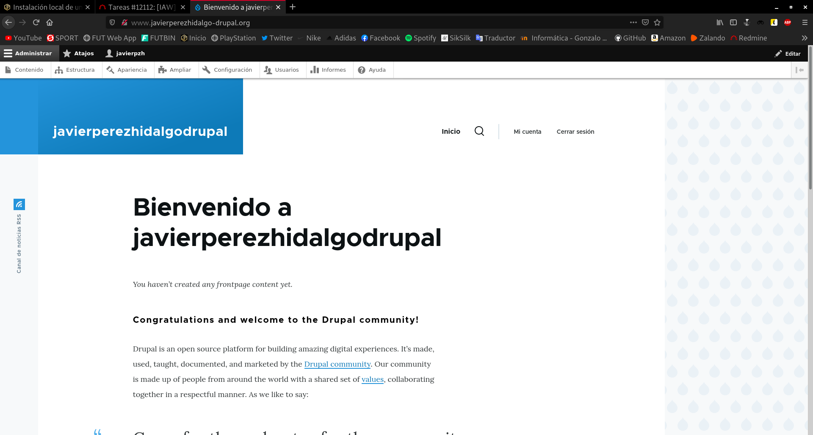

Title: Instalación local de un CMS PHP
Date: 2020/10/21
Category: Implantación de Aplicaciones Web
Header_Cover: theme/images/banner-aplicacionesweb.jpg
Tags: lamp, cms, apache, mariadb, mysql, php, drupal

Esta tarea consiste en instalar un **CMS** de tecnología **PHP** en un servidor local. Los pasos que tendrás que dar los siguientes:

## Tarea 1: Instalación de un servidor LAMP

- **Crea una instancia de vagrant basado en un box debian o ubuntu**

He creado una máquina virtual utilizando **Vagrant** y **VirtualBox**, mediante el siguiente fichero *VagrantFile*:

<pre>
# -*- mode: ruby -*-
# vi: set ft=ruby :

Vagrant.configure("2") do |config|

  config.vm.box = "debian/buster64"
  config.vm.network "private_network", ip: "192.168.30.15"

end
</pre>

- **Instala en esa máquina virtual toda la pila LAMP**
- **Entrega una documentación resumida donde expliques los pasos fundamentales para realizar esta tarea.**

Una vez tenemos la máquina lista, vamos a instalar el **servidor LAMP**. Antes de nada vamos a preparar la máquina para la instalación:

<pre>
apt update && apt upgrade -y && apt autoremove -y
</pre>

El primer paso sería instalar nuestro gestor de base de datos, yo voy a utilizar **MySQL**. Lo instalamos:

<pre>
apt install mariadb-server mariadb-client -y
</pre>

Una vez lo hemos instalado, vamos a configurar una serie de opciones con el comando `mysql_secure_installation`. Vamos a especificarle una **contraseña de root**, vamos a **eliminar los usuarios anónimos**, vamos a **desactivar el acceso remoto** a la base de datos, en resumen, vamos a restablecer la base de datos, con nuestras preferencias:

<pre>
root@buster:/home/vagrant# mysql_secure_installation

NOTE: RUNNING ALL PARTS OF THIS SCRIPT IS RECOMMENDED FOR ALL MariaDB
      SERVERS IN PRODUCTION USE!  PLEASE READ EACH STEP CAREFULLY!

In order to log into MariaDB to secure it, we'll need the current
password for the root user.  If you've just installed MariaDB, and
you haven't set the root password yet, the password will be blank,
so you should just press enter here.

Enter current password for root (enter for none):
OK, successfully used password, moving on...

Setting the root password ensures that nobody can log into the MariaDB
root user without the proper authorisation.

You already have a root password set, so you can safely answer 'n'.

Change the root password? [Y/n] Y
New password:
Re-enter new password:
Password updated successfully!
Reloading privilege tables..
 ... Success!

By default, a MariaDB installation has an anonymous user, allowing anyone
to log into MariaDB without having to have a user account created for
them.  This is intended only for testing, and to make the installation
go a bit smoother.  You should remove them before moving into a
production environment.

Remove anonymous users? [Y/n] Y
 ... Success!

Normally, root should only be allowed to connect from 'localhost'.  This
ensures that someone cannot guess at the root password from the network.

Disallow root login remotely? [Y/n] Y
 ... Success!

By default, MariaDB comes with a database named 'test' that anyone can
access.  This is also intended only for testing, and should be removed
before moving into a production environment.

Remove test database and access to it? [Y/n] Y
 - Dropping test database...
 ... Success!
 - Removing privileges on test database...
 ... Success!

Reloading the privilege tables will ensure that all changes made so far
will take effect immediately.

Reload privilege tables now? [Y/n] Y
 ... Success!

Cleaning up...

All done!  If you've completed all of the above steps, your MariaDB
installation should now be secure.

Thanks for using MariaDB!
</pre>

Procedemos a instalar el servidor web **Apache**, que lo vamos a instalar con este comando:

<pre>
apt install -y apache2 apache2-utils
</pre>

Y vamos a habilitar su servicio en cada inicio del sistema con:

<pre>
systemctl enable apache2
</pre>

Nos quedaría por instalar el **servidor PHP**, para ello:

<pre>
apt install php libapache2-mod-php php-cli php-mysql -y
</pre>

También he instalado las **librerías php** de *apache* y *mysql*.

Activamos el módulo de **PHP** de **Apache**.

<pre>
a2enmod php7.3
</pre>

Y por último introducimos la siguiente línea en forma de script PHP, que lo único que hace es crear un fichero llamado `phpinfo.php` dentro del directorio `/var/www/html`, en el que escribe **<?php phpinfo(); ?>**.

`echo "<?php phpinfo(); ?>" | sudo tee /var/www/html/phpinfo.php`

Hemos terminado nuestro servidor LAMP.

##Tarea 2: Instalación de drupal en mi servidor local

- **Configura el servidor web con virtual hosting para que el CMS sea accesible desde la dirección: `www.nombrealumno-drupal.org`.**

En la ruta `/etc/apache2/sites-available/` creamos un fichero de configuración para esta página. Podemos copiar el fichero llamado `000-default.conf` para tener la estructura y luego lo modificamos:

<pre>
cp 000-default.conf javierperezhidalgo-drupal.conf
nano javierperezhidalgo-drupal.conf
</pre>

Dentro de este fichero, establecemos la url de la web en el apartado **ServerName**. Tiene que quedar así:

<pre>
ServerName www.javierperezhidalgo-drupal.org
</pre>

Creamos el enlace simbólico para activar el sitio web:

<pre>
a2ensite javierperezhidalgo-drupal.conf
</pre>

Reinicamos el servicio del servidor apache:

<pre>
systemctl restart apache2
</pre>

Si nos dirigimos a nuestra máquina anfitriona y añadimos al `/etc/hosts` esta línea, en el navegador podremos visualizar la web `www.javierperezhidalgo-drupal.org`:

<pre>
192.168.30.15   www.javierperezhidalgo-drupal.org
</pre>

La página web tiene este aspecto:

- **Crea un usuario en la base de datos para trabajar con la base de datos donde se van a guardar los datos del CMS.**

Para crear un usario en MySQL:

<pre>
root@buster:/var/www/html# mysql -u root -p
Enter password:
Welcome to the MariaDB monitor.  Commands end with ; or \g.
Your MariaDB connection id is 65
Server version: 10.3.25-MariaDB-0+deb10u1 Debian 10

Copyright (c) 2000, 2018, Oracle, MariaDB Corporation Ab and others.

Type 'help;' or '\h' for help. Type '\c' to clear the current input statement.

MariaDB [(none)]> CREATE DATABASE drupal;
Query OK, 1 row affected (0.002 sec)

MariaDB [(none)]> CREATE USER 'drupal' IDENTIFIED BY 'contraseña';
Query OK, 0 rows affected (0.001 sec)

MariaDB [(none)]> GRANT ALL PRIVILEGES ON drupal.* TO 'drupal';
Query OK, 0 rows affected (0.000 sec)

MariaDB [(none)]> FLUSH PRIVILEGES;
Query OK, 0 rows affected (0.001 sec)

MariaDB [(none)]> exit
Bye
</pre>

Además de crear el usuario **javier**, le he concedido todos los permisos para tener acceso y control sobre todas las tablas y bases de datos.

- **Descarga la versión que te parezca más oportuna de Drupal y realiza la instalación.**

Para descargar **Drupal** en su última versión, que en este momento es la **9**, nos dirigimos a la [página oficial de Drupal](https://www.drupal.org/download). Copiamos la ruta del enlace de descarga del archivo, en mi caso prefiero el *tar.gz* y lo descargamos en nuestro servidor LAMP con la utilidad `wget`.

<pre>
root@buster:~# wget https://www.drupal.org/download-latest/tar.gz
--2020-10-22 18:29:12--  https://www.drupal.org/download-latest/tar.gz
Resolving www.drupal.org (www.drupal.org)... 151.101.134.217
Connecting to www.drupal.org (www.drupal.org)|151.101.134.217|:443... connected.
HTTP request sent, awaiting response... 302 Moved Temporarily
Location: https://ftp.drupal.org/files/projects/drupal-9.0.7.tar.gz [following]
--2020-10-22 18:29:13--  https://ftp.drupal.org/files/projects/drupal-9.0.7.tar.gz
Resolving ftp.drupal.org (ftp.drupal.org)... 151.101.134.217
Connecting to ftp.drupal.org (ftp.drupal.org)|151.101.134.217|:443... connected.
HTTP request sent, awaiting response... 200 OK
Length: 16863270 (16M) [application/octet-stream]
Saving to: ‘tar.gz’

tar.gz                    100%[=====================================>]  16.08M  28.9MB/s    in 0.6s    

2020-10-22 18:29:14 (28.9 MB/s) - ‘tar.gz’ saved [16863270/16863270]

root@buster:~# tar xf tar.gz -C /var/www/html/

root@buster:~# ln -s /var/www/html/drupal-9.0.7/ /var/www/html/drupal

root@buster:~# chown -R www-data:www-data /var/www/html/drupal/
</pre>

Hemos descargado **Drupal** y lo hemos descomprimido en la ruta en la que se encuentra el sitio web. Además conviene crear un enlace simbólico sobre el directorio de Drupal para tener un nombre sin números de versión. Y como Drupal necesita escribir en su propio directorio, lo hemos otorgado como dueño del directorio y su contenido al servidor web.

También necesitamos algunas extensiones de PHP:

<pre>
apt install php-apcu php-gd php-mbstring php-uploadprogress php-xml -y
</pre>

Drupal puede hacer uso del sistema de reescritura de URLs, basado en el módulo `Rewrite` de Apache, que no está activado por defecto. Activamos el módulo `Rewrite` y otros que puede usar Drupal:

<pre>
a2enmod expires headers rewrite
</pre>

Generamos un fichero de configuración para Drupal que permita el uso de archivos `.htaccess` que configuren el módulo `Rewrite`:

<pre>
root@buster:/var/www/html# cd /etc/apache2/conf-available/

root@buster:/etc/apache2/conf-available# nano drupal.conf
</pre>

El archivo `drupal.conf` tiene que contener:

<pre>
<\Directory /var/www/html/drupal>
        AllowOverride all
<\/Directory>
</pre>

Activamos la configuración:

<pre>
root@buster:/etc/apache2/conf-available# a2enconf drupal.conf
Enabling conf drupal.
To activate the new configuration, you need to run:
  systemctl reload apache2
</pre>

Reiniciamos el servidor web:

<pre>
systemctl restart apache2
</pre>

En este punto ya podemos hacer uso del **Instalador Web de Drupal**. Accedemos a la web que hemos configurado antes con la URL `http://www.javierperezhidalgo-drupal.org` y le añadimos `/drupal`, y se nos abrirá el instalador.

- Seleccionamos el idioma deseado.
- Seleccionamos el perfil de la instalación, en mi caso **estándar**.
- Configuramos la base de datos. En mi caso:
    - **Tipo:** MySQL
    - **Nombre de la base de datos:** drupal
    - **Nombre de usuario de la base de datos:** drupal
    - **Contraseña de la base de datos:**

Terminada la instalación llega el momento de configurar la identidad del sitio y crear el usuario administrador.

Completamos según nuestras preferencias y guardamos y listo:

- **Realiza una configuración mínima de la aplicación (Cambia la plantilla, crea algún contenido, …)**

Para cambiar el tema de nuestro CMS, nos dirigimos a la opción que nos aparece arriba, **Apariencia** y seleccionamos `+ Instalar nuevo tema`, introducimos el enlace de descarga del tema que queremos añadir y listo.

Lo seleccionamos como activo:

Y ya hemos cambiado el tema:

- **Instala un módulo para añadir alguna funcionalidad a drupal.**

**En este momento, muestra al profesor la aplicación funcionando en local. Entrega un documentación resumida donde expliques los pasos fundamentales para realizar esta tarea.**

## Tarea 3: Configuración multinodo

- **Realiza un copia de seguridad de la base de datos**
- **Crea otra máquina con vagrant, conectada con una red interna a la anterior y configura un servidor de base de datos.**
- **Crea un usuario en la base de datos para trabajar con la nueva base de datos.**
- **Restaura la copia de seguridad en el nuevo servidor de base datos.**
- **Desinstala el servidor de base de datos en el servidor principal.**
- **Realiza los cambios de configuración necesario en drupal para que la página funcione.**

**Entrega una documentación resumida donde expliques los pasos fundamentales para realizar esta tarea. En este momento, muestra al profesor la aplicación funcionando en local.**

## Tarea 4: Instalación de otro CMS PHP

- **Elige otro CMS realizado en PHP y realiza la instalación en tu infraestructura.**
- **Configura otro virtualhost y elige otro nombre en el mismo dominio.**

**En este momento, muestra al profesor la aplicación funcionando en local. Y describe en redmine los pasos fundamentales para realizar la tarea.**

##Tarea 5: Necesidad de otros servicios

- **La mayoría de los CMS tienen la posibilidad de mandar correos electrónicos (por ejemplo para notificar una nueva versión, notificar un comentario,…)**

- **Instala un servidor de correo electrónico en tu servidor. debes configurar un servidor relay de correo, para ello en el fichero `/etc/postfix/main.cf`, debes poner la siguiente línea:**

<pre>
relayhost = babuino-smtp.gonzalonazareno.org
</pre>

- **Configura alguno de los CMS para utilizar tu servidor de correo y realiza una prueba de funcionamiento.**

**Muestra al profesor algún correo enviado por tu CMS.**
