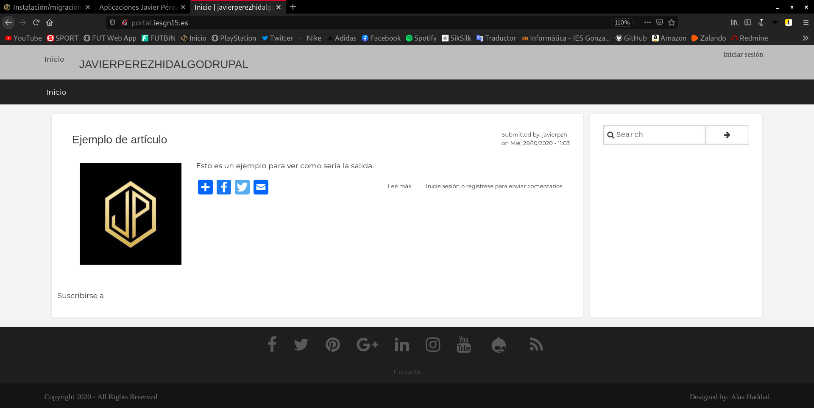
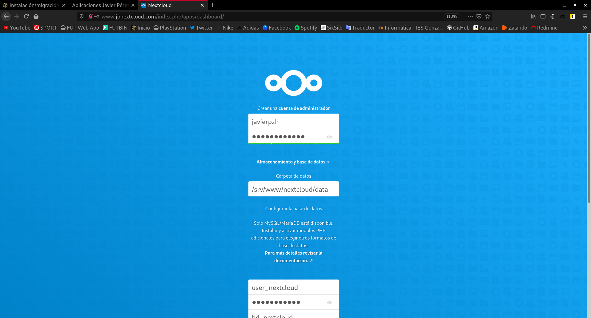
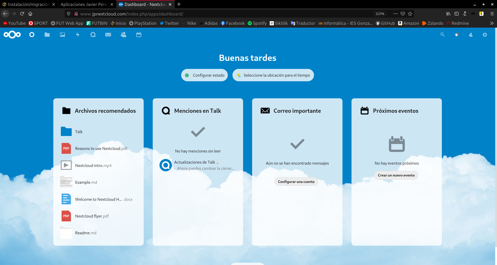

Title: Instalación/migración de aplicaciones web PHP
Date: 2020/11/18
Category: Implantación de Aplicaciones Web
Header_Cover: theme/images/banner-aplicacionesweb.jpg
Tags: Apache, PHP, Nginx, Drupal, Nextcloud

### Realizar la migración de la aplicación Drupal que tienes instalada en el entorno de desarrollo a nuestro entorno de producción, para ello ten en cuenta lo siguiente:

Cuando me refiero al entorno de producción, estoy haciendo referencia a un servidor de OVH.

Antes de realizar la migración necesitamos preparar nuestro entorno de producción instalando todos los paquetes necesarios, como pueden ser `php`, `mysql`, ... para poder migrar *Drupal* de manera correcta. En mi caso tengo listo el entorno de producción, ya que en él lleve a cabo la instalación de un *servidor LEMP* que es lo que al fin y al cabo vamos a utilizar. Si quieres ver como instalar un *servidor LEMP* puedes verlo [aquí](https://javierpzh.github.io/instalacion-de-un-servidor-lemp.html).

**1. La aplicación se tendrá que migrar a un nuevo virtualhost al que se accederá con el nombre `portal.iesgnXX.es.`**

En nuestro entorno en producción, vamos a crear este nuevo *virtualhost*. Para ello antes que nada creamos la ruta donde vamos a almacenar esta aplicación, en mi caso dentro de `/srv/www/aplicacionesiesgn/`.

Ahora debemos crear el fichero de configuración de *Nginx* que utilizará esta aplicación. Nos desplazamos a `/etc/nginx/sites-available/`, y podemos copiar el fichero por defecto para tener la estructura, en mi caso ya tengo un *virtualhost* creado y utilizo el fichero de este:

<pre>
root@vpsjavierpzh:/etc/nginx/sites-available# cp aplicacionesiesgn.conf drupal.conf
root@vpsjavierpzh:/etc/nginx/sites-available# nano drupal.conf
</pre>

Edito el fichero de configuración de *Drupal* y queda de tal manera:

<pre>
server {
        listen 80;
        listen [::]:80;

        root /srv/www/aplicacionesiesgn/drupal;

        index index.php index.html index.htm index.nginx-debian.html;

        server_name portal.iesgn15.es;

        location / {
                         try_files $uri $uri/ /index.php?$args;
                }

        location ~ \.php$ {
        include snippets/fastcgi-php.conf;
        fastcgi_pass unix:/run/php/php7.3-fpm.sock;
        }
}
</pre>

Como podemos apreciar, a esta aplicación se accederá con la URL: `portal.iesgn15.es` como nos pide el ejercicio. Ya solo nos quedaría habilitar el servicio de este sitio web mediante la creación de un **enlace simbólico** a la ruta `/etc/nginx/sites-enabled/`:

<pre>
root@vpsjavierpzh:/etc/nginx/sites-available# ln -s /etc/nginx/sites-available/drupal.conf /etc/nginx/sites-enabled/

root@vpsjavierpzh:/etc/nginx/sites-available# ls -l /etc/nginx/sites-enabled/
total 0
lrwxrwxrwx 1 root root 49 Nov  9 18:44 aplicacionesiesgn.conf -> /etc/nginx/sites-available/aplicacionesiesgn.conf
lrwxrwxrwx 1 root root 34 Nov  9 12:09 default -> /etc/nginx/sites-available/default
lrwxrwxrwx 1 root root 38 Nov 18 08:06 drupal.conf -> /etc/nginx/sites-available/drupal.conf
</pre>

Como hemos realizado cambios en la configuración de *Nginx* debemos reiniciar el servicio:

<pre>
systemctl restart nginx.service
</pre>

**2. Vamos a nombrar el servicio de base de datos que tenemos en producción. Como es un servicio interno no la vamos a nombrar en la zona DNS, la vamos a nombrar usando resolución estática. El nombre del servicio de base de datos se debe llamar: `bd.iesgnXX.es`.**

Para nombrar el servicio de la base de datos mediante resolución estática, debemos añadir al fichero `/etc/hosts` del servidor de OVH la siguiente línea:

<pre>
127.0.0.1       bd.iesgn15.es
</pre>

**3. Por lo tanto los recursos que deberás crear en la base de datos serán (respeta los nombres):**

- **Dirección de la base de datos: `bd.iesgnXX.es`**
- **Base de datos: `bd_drupal`**
- **Usuario: `user_drupal`**
- **Password: `pass_drupal`**

<pre>
root@vpsjavierpzh:~# mysql -u root -p
Enter password:
Welcome to the MariaDB monitor.  Commands end with ; or \g.
Your MariaDB connection id is 65
Server version: 10.3.25-MariaDB-0+deb10u1 Debian 10

Copyright (c) 2000, 2018, Oracle, MariaDB Corporation Ab and others.

Type 'help;' or '\h' for help. Type '\c' to clear the current input statement.

MariaDB [(none)]> SHOW DATABASES;
+--------------------+
| Database           |
+--------------------+
| information_schema |
| mysql              |
| performance_schema |
+--------------------+
3 rows in set (0.001 sec)

MariaDB [(none)]> CREATE DATABASE bd_drupal;
Query OK, 1 row affected (0.001 sec)

MariaDB [(none)]> CREATE USER 'user_drupal' IDENTIFIED BY 'pass_drupal';
Query OK, 0 rows affected (0.000 sec)

MariaDB [(none)]> GRANT ALL PRIVILEGES ON bd_drupal.* TO 'user_drupal';
Query OK, 0 rows affected (0.000 sec)

MariaDB [(none)]> SHOW DATABASES;
+--------------------+
| Database           |
+--------------------+
| bd_drupal          |
| information_schema |
| mysql              |
| performance_schema |
+--------------------+
4 rows in set (0.001 sec)

MariaDB [(none)]> exit
Bye

root@vpsjavierpzh:~#
</pre>

**4. Realiza la migración de la aplicación.**

Para realizar la migración, debemos llevarnos todos los archivos de *Drupal* desde el entorno de desarrollo hasta el entorno de producción. Para ello vamos a copiar los archivos con `scp`, pero primero vamos a comprimir todos los datos en un solo archivo:

<pre>
root@buster:/var/www/html# tar -cf ./drupaldat.tar.gz ./drupal/*
</pre>

Lo pasamos al servidor de OVH:

<pre>
root@buster:/var/www/html# scp ./drupaldat.tar.gz debian@vpsjavierpzh.iesgn15.es:/home/debian/
</pre>

Muevo este archivo al directorio donde vamos a almacenar esta aplicación:

<pre>
root@vpsjavierpzh:/home/debian# mv drupaldat.tar.gz /srv/www/aplicacionesiesgn/
</pre>

Y descomprimimos el fichero obteniendo como resultado:

<pre>
root@vpsjavierpzh:/srv/www/aplicacionesiesgn# tar -xvf drupaldat.tar.gz

root@vpsjavierpzh:/srv/www/aplicacionesiesgn# cd drupal/

root@vpsjavierpzh:/srv/www/aplicacionesiesgn/drupal# ls
autoload.php   core		  INSTALL.txt  profiles    sites       vendor
composer.json  example.gitignore  LICENSE.txt  README.txt  themes      web.config
composer.lock  index.php	  modules      robots.txt  update.php
</pre>

Nos faltaría simplemente cambiar el propietario de todos estos nuevos archivos a `www:data`, que es el usuario que posee los permisos de lectura y escritura en Nginx.

<pre>
chown -R www-data:www-data /srv/
</pre>

Ya tenemos los datos de *Drupal* en el entorno de producción por lo tanto nos faltaría restaurar la copia de seguridad en el servidor de OVH. Para ello primero pasamos la copia:

<pre>
root@buster:~# scp backupdrupal.sql debian@vpsjavierpzh.iesgn15.es:/home/debian/
debian@vpsjavierpzh.iesgn15.es's password:
backupdrupal.sql                                                      100% 8165KB  63.9KB/s   02:07

root@buster:~#
</pre>

Y por último restauramos la copia de seguridad en nuestro servidor de base de datos de OVH:

<pre>
mysql -u user_drupal -p bd_drupal < backupdrupal.sql
</pre>

Si entramos y vemos las tablas de esta base de datos:

<pre>
root@vpsjavierpzh:/home/debian/drupal# mysql -u user_drupal -p bd_drupal
Enter password:
Reading table information for completion of table and column names
You can turn off this feature to get a quicker startup with -A

Welcome to the MariaDB monitor.  Commands end with ; or \g.
Your MariaDB connection id is 74
Server version: 10.3.25-MariaDB-0+deb10u1 Debian 10

Copyright (c) 2000, 2018, Oracle, MariaDB Corporation Ab and others.

Type 'help;' or '\h' for help. Type '\c' to clear the current input statement.

MariaDB [bd_drupal]> show tables;
+----------------------------------+
| Tables_in_bd_drupal              |
+----------------------------------+
| batch                            |
| block_content                    |
| block_content__body              |
| block_content_field_data         |
| block_content_field_revision     |
| block_content_revision           |
| block_content_revision__body     |
| cache_bootstrap                  |
| cache_config                     |
| cache_container                  |
| cache_data                       |
| cache_default                    |
| cache_discovery                  |
| cache_dynamic_page_cache         |
| cache_entity                     |
| cache_menu                       |
| cache_page                       |
| cache_render                     |
| cachetags                        |
| comment                          |
| comment__comment_body            |
| comment_entity_statistics        |
| comment_field_data               |
| config                           |
| file_managed                     |
| file_usage                       |
| history                          |
| key_value                        |
| key_value_expire                 |
| locale_file                      |
| locales_location                 |
| locales_source                   |
| locales_target                   |
| menu_link_content                |
| menu_link_content_data           |
| menu_link_content_field_revision |
| menu_link_content_revision       |
| menu_tree                        |
| node                             |
| node__body                       |
| node__comment                    |
| node__field_image                |
| node__field_tags                 |
| node_access                      |
| node_field_data                  |
| node_field_revision              |
| node_revision                    |
| node_revision__body              |
| node_revision__comment           |
| node_revision__field_image       |
| node_revision__field_tags        |
| path_alias                       |
| path_alias_revision              |
| queue                            |
| router                           |
| search_dataset                   |
| search_index                     |
| search_total                     |
| semaphore                        |
| sequences                        |
| sessions                         |
| shortcut                         |
| shortcut_field_data              |
| shortcut_set_users               |
| taxonomy_index                   |
| taxonomy_term__parent            |
| taxonomy_term_data               |
| taxonomy_term_field_data         |
| taxonomy_term_field_revision     |
| taxonomy_term_revision           |
| taxonomy_term_revision__parent   |
| user__roles                      |
| user__user_picture               |
| users                            |
| users_data                       |
| users_field_data                 |
| watchdog                         |
+----------------------------------+
77 rows in set (0.001 sec)

MariaDB [bd_drupal]>
</pre>

Vemos que hemos restaurado la copia de seguridad correctamente.

Ahora nos faltaría crear un registro **CNAME** en nuestra zona DNS del servidor **OVH** como este:

Lo creamos:

Si accedemos a la dirección `portal.iesgn15.es`:

**5. Asegúrate que las URL limpias de *Drupal* siguen funcionando en *Nginx*.**

Para que *Drupal* utilice las URLs limpias debemos añadir esta línea en su fichero de configuración, es decir, en `/etc/nginx/sites-available/drupal.conf`:

<pre>
try_files $uri /index.php?dir=$uri;
</pre>

**6. La aplicación debe estar disponible en la URL: `portal.iesgnXX.es` (Sin ningún directorio).**

Se puede ver como efectivamente la URL de la aplicación `portal.iesgn15.es`.

### Instalación / migración de la aplicación Nextcloud

**1. Instala la aplicación web *Nextcloud* en tu entorno de desarrollo.**

Vamos a instalar la aplicación **Nextcloud** en un servidor web **Apache** de nuestro entorno de desarrollo para posteriormente realizar la migración a un servidor web **Nginx** en nuestro entorno de producción.

Nos descargamos *Nextcloud* desde su [página oficial](https://nextcloud.com/install/) con el siguiente comando:

<pre>
root@buster:/home/vagrant# wget https://download.nextcloud.com/server/releases/nextcloud-20.0.1.zip
--2020-11-18 17:08:17--  https://download.nextcloud.com/server/releases/nextcloud-20.0.1.zip
Resolving download.nextcloud.com (download.nextcloud.com)... 95.217.64.181, 2a01:4f9:2a:3119::181
Connecting to download.nextcloud.com (download.nextcloud.com)|95.217.64.181|:443... connected.
HTTP request sent, awaiting response... 200 OK
Length: 142691943 (136M) [application/zip]
Saving to: ‘nextcloud-20.0.1.zip’

nextcloud-20.0.1.zip      100%[=====================================>] 136.08M  10.7MB/s    in 16s     

2020-11-18 17:08:34 (8.26 MB/s) - ‘nextcloud-20.0.1.zip’ saved [142691943/142691943]

root@buster:/home/vagrant#
</pre>

Vamos a descomprimir el archivo descargado:

<pre>
root@buster:/home/vagrant# unzip nextcloud-20.0.1.zip
</pre>

La carpeta descomprimida la trasladamos al directorio donde vamos a almacenar nuestra aplicación web, en mi caso es dentro de `/srv/www/`, y le vamos a asignar como propietario de los archivos al usuario `www-data` que es el adecuado.

<pre>
root@buster:/home/vagrant# mv nextcloud /srv/www/

root@buster:/home/vagrant# ls /srv/www/nextcloud/
3rdparty  config       core	 index.html  occ	   ocs-provider  resources   themes
apps	  console.php  cron.php  index.php   ocm-provider  public.php	 robots.txt  updater
AUTHORS   COPYING      data	 lib	     ocs	   remote.php	 status.php  version.php

root@buster:/home/vagrant# chown -R www-data:www-data /srv/www/
</pre>

Una vez hecho esto, tendríamos que crear un fichero de configuración que nos mostrará la página, para ello creamos uno en `/etc/apache2/sites-available/`. En mi caso, copio uno ya existente para tener la plantilla, ustedes podéis utilizar el fichero `000-default.conf`.

<pre>
root@buster:/etc/apache2/sites-available# cp anchor.conf nextcloud.conf

root@buster:/etc/apache2/sites-available# nano nextcloud.conf
</pre>

El fichero `/etc/apache2/sites-available/nextcloud.conf` quedaría así:

<pre>
<\VirtualHost *:80\>

        ServerName www.jpnextcloud.com
        ServerAdmin webmaster@localhost
        DocumentRoot /srv/www/nextcloud

        ErrorLog ${APACHE_LOG_DIR}/error.log
        CustomLog ${APACHE_LOG_DIR}/access.log combined

<\/VirtualHost\>
</pre>

**Atención:** a esta configuración hay que eliminarle los carácteres `\`, que he tenido que introducir para escapar los carácteres siguientes, así que en caso de querer copiar la configuración, debemos tener en cuenta esto.

Habilitamos la página:

<pre>
root@buster:/etc/apache2/sites-available# a2ensite nextcloud.conf
Enabling site nextcloud.
To activate the new configuration, you need to run:
  systemctl reload apache2

root@buster:/etc/apache2/sites-available# systemctl reload apache2
</pre>

Por último, nos quedaría crear un usuario y una base de datos, para que *Nextcloud* guarde sus datos:

<pre>
root@buster:/var/www/html/nextcloud# mysql -u root -p
Enter password:
Welcome to the MariaDB monitor.  Commands end with ; or \g.
Your MariaDB connection id is 36
Server version: 10.3.25-MariaDB-0+deb10u1 Debian 10

Copyright (c) 2000, 2018, Oracle, MariaDB Corporation Ab and others.

Type 'help;' or '\h' for help. Type '\c' to clear the current input statement.

MariaDB [(none)]> SHOW DATABASES;
+--------------------+
| Database           |
+--------------------+
| anchor             |
| drupal             |
| information_schema |
| mysql              |
| performance_schema |
+--------------------+
5 rows in set (0.014 sec)

MariaDB [(none)]> CREATE DATABASE bd_nextcloud;
Query OK, 1 row affected (0.001 sec)

MariaDB [(none)]> CREATE USER 'user_nextcloud' IDENTIFIED BY 'pass_nextcloud';
Query OK, 0 rows affected (0.005 sec)

MariaDB [(none)]> GRANT ALL PRIVILEGES ON bd_nextcloud.* TO 'user_nextcloud';
Query OK, 0 rows affected (0.002 sec)

MariaDB [(none)]> SHOW DATABASES;
+--------------------+
| Database           |
+--------------------+
| anchor             |
| bd_nextcloud       |
| drupal             |
| information_schema |
| mysql              |
| performance_schema |
+--------------------+
6 rows in set (0.001 sec)

MariaDB [(none)]> exit
Bye
</pre>

Vemos que hemos creado un nuevo usuario con privilegios de la nueva base de datos.

Mi entorno de desarrollo se trata de una máquina virtual *Vagrant*, por tanto para visualizar este sitio web, necesito añadir en el fichero `/etc/hosts` de mi máquina la línea que corresponda.

Si nos dirigimos al navegador a la dirección `www.jpnextcloud.com` nos muestra:

Vemos que *Nextcloud* necesita una serie de extensiones *PHP*. Para instalar todas las extensiones necesarias:

<pre>
apt install php-{mysql,zip,curl,mbstring,xml} -y
</pre>

Si probamos a entrar ahora a la dirección `www.jpnextcloud.com` nos muestra:

Vemos como hemos creado una nueva base de datos y un usuario con los correspondientes permisos sobre esta base de datos. Ahora introducimos estos datos en el instalador y comenzará la instalación de *Nextcloud*.

Una vez finalizado el proceso podemos ver como ya hemos instalado esta aplicación web con *Apache*.

**2. Realiza la migración al servidor en producción, para que la aplicación sea accesible en la URL: `www.iesgnXX.es/cloud`**

Vamos a realizar la migración de esta aplicación instalada previamente a nuestro entorno de desarrollo, pero ahora en vez de trabajar con *Apache* haremos que trabaje con *Nginx*.

Lo primero que haremos será realizar una copia de seguridad de la base de datos, para restaurarla en el servidor de OVH. Para ello:

<pre>
root@buster:~# mysqldump -u user_nextcloud -p bd_nextcloud > backupnextcloud.sql
Enter password:

root@buster:~# ls
backupdrupal.sql  backupnextcloud.sql

root@buster:~#
</pre>

Vamos a comprimir todos los archivos del directorio `/srv/www/nextcloud`, ya que en él se encuentran todos los datos de la aplicación web:

<pre>
root@buster:/srv/www# tar -cf ./nextclouddat.tar.gz ./nextcloud/*
tar: Removing leading `/' from member names
tar: Removing leading `/' from hard link targets

root@buster:/srv/www# mv nextclouddat.tar.gz /root/

root@buster:~# ls
backupdrupal.sql  backupnextcloud.sql  nextclouddat.tar.gz  tar.gz
</pre>

<pre>
root@buster:~# scp ./backupnextcloud.sql debian@vpsjavierpzh.iesgn15.es:/home/debian/
debian@vpsjavierpzh.iesgn15.es's password:
backupnextcloud.sql                                                   100%  137KB 776.4KB/s   00:00    

root@buster:~# scp ./nextclouddat.tar.gz debian@vpsjavierpzh.iesgn15.es:/home/debian/
debian@vpsjavierpzh.iesgn15.es's password:
nextclouddat.tar.gz                                                   100%  528MB   8.4MB/s   01:02    

root@buster:~#
</pre>

<pre>
root@vpsjavierpzh:/home/debian# mv nextclouddat.tar.gz /srv/www/aplicacionesiesgn/

root@vpsjavierpzh:/home/debian# cd /srv/www/aplicacionesiesgn/

root@vpsjavierpzh:/srv/www/aplicacionesiesgn#tar -xvf nextclouddat.tar.gz

root@vpsjavierpzh:/srv/www/aplicacionesiesgn# ls
drupal	nextcloud  nextclouddat.tar.gz	principal

root@vpsjavierpzh:/srv/www/aplicacionesiesgn# rm nextclouddat.tar.gz

root@vpsjavierpzh:/srv/www/aplicacionesiesgn# ls nextcloud/
3rdparty  config       core	 index.html  occ	   ocs-provider  resources   themes
apps	  console.php  cron.php  index.php   ocm-provider  public.php	 robots.txt  updater
AUTHORS   COPYING      data	 lib	     ocs	   remote.php	 status.php  version.php
</pre>

<pre>
root@vpsjavierpzh:/srv/www/aplicacionesiesgn# mysql -u root -p
Enter password:
Welcome to the MariaDB monitor.  Commands end with ; or \g.
Your MariaDB connection id is 324
Server version: 10.3.25-MariaDB-0+deb10u1 Debian 10

Copyright (c) 2000, 2018, Oracle, MariaDB Corporation Ab and others.

Type 'help;' or '\h' for help. Type '\c' to clear the current input statement.

MariaDB [(none)]> SHOW DATABASES;
+--------------------+
| Database           |
+--------------------+
| bd_drupal          |
| information_schema |
| mysql              |
| performance_schema |
+--------------------+
4 rows in set (0.001 sec)

MariaDB [(none)]> CREATE DATABASE bd_nextcloud;
Query OK, 1 row affected (0.001 sec)

MariaDB [(none)]> CREATE USER 'user_nextcloud' IDENTIFIED BY 'pass_nextcloud';
Query OK, 0 rows affected (0.001 sec)

MariaDB [(none)]> GRANT ALL PRIVILEGES ON bd_nextcloud.* TO 'user_nextcloud';
Query OK, 0 rows affected (0.002 sec)

MariaDB [(none)]> flush privileges;
Query OK, 0 rows affected (0.001 sec)

MariaDB [(none)]> SHOW DATABASES;
+--------------------+
| Database           |
+--------------------+
| bd_drupal          |
| bd_nextcloud       |
| information_schema |
| mysql              |
| performance_schema |
+--------------------+
5 rows in set (0.001 sec)

MariaDB [(none)]> exit
Bye
</pre>

<pre>
root@vpsjavierpzh:/etc/nginx/sites-available# cp drupal.conf nextcloud.conf

root@vpsjavierpzh:/etc/nginx/sites-available# nano nextcloud.conf
</pre>

<pre>

</pre>

**3. Instala en un ordenador el cliente de *Nextcloud* y realiza la configuración adecuada para acceder a "tu nube".**

**Documenta de la forma más precisa posible cada uno de los pasos que has dado, y entrega pruebas de funcionamiento para comprobar el proceso que has realizado.**
