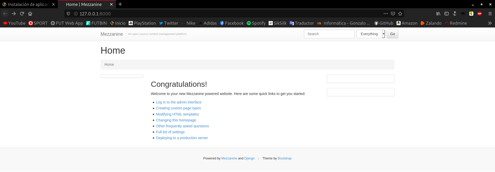
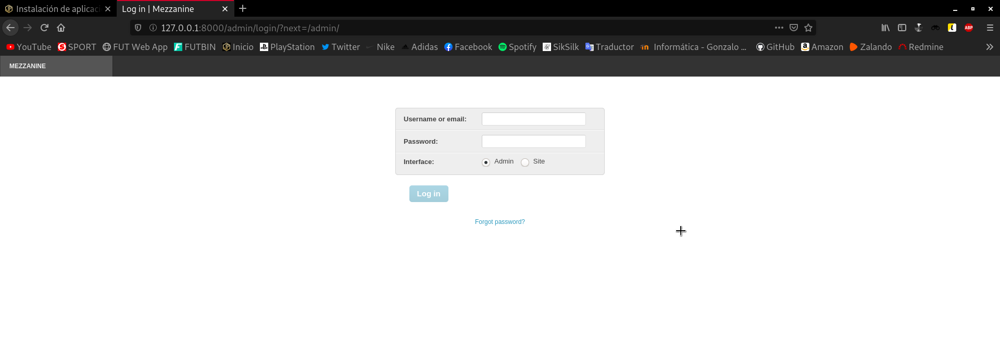
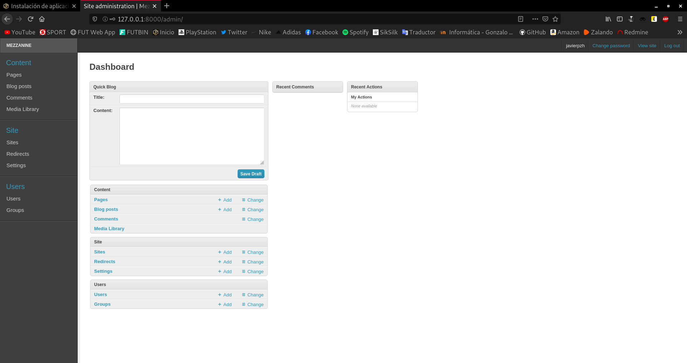
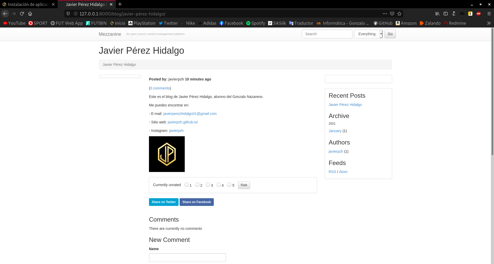

Title: Instalación de aplicación web Python en OpenStack
Date: 2021/01/15
Category: Implantación de Aplicaciones Web
Header_Cover: theme/images/banner-aplicacionesweb.jpg
Tags: OpenStack, Python, Django, Mezzanine, virtualenv, git

**En esta tarea vamos a realizar la instalación de un *CMS Python* basado en *Django*. Puedes encontrar varios en el siguiente [enlace](https://djangopackages.org/grids/g/cms/).**

#### Instala el CMS en el entorno de desarrollo. Debes utilizar un entorno virtual.

En primer lugar, me gustaría aclarar un poco cuál va a ser el entorno de trabajo, y es que el escenario sobre el que vamos a trabajar, ha sido construido en diferentes *posts* previamente elaborados. Los dejo ordenados a continuación por si te interesa:

- [Creación del escenario de trabajo en OpenStack](https://javierpzh.github.io/creacion-del-escenario-de-trabajo-en-openstack.html)
- [Modificación del escenario de trabajo en OpenStack](https://javierpzh.github.io/modificacion-del-escenario-de-trabajo-en-openstack.html)
- [Servidores OpenStack: DNS, Web y Base de Datos](https://javierpzh.github.io/servidores-openstack-dns-web-y-base-de-datos.html)

Comprendido esto, voy a realizar la instalación/configuración en un entorno de desarrollo, que será mi propio equipo, donde utilizaré una base de datos **sqlite3** como veremos posteriormente, y una vez que todo se encuentre completamente listo lo trasladaré a mi entorno de producción, es decir, al escenario de OpenStack, donde como ya sabemos, se encuentra una base de datos **MySQL**.

Utilizaremos un repositorio de *GitHub* en el que se van a ir guardando los ficheros que se generen durante la instalación del *CMS*. He creado un nuevo repositorio y lo voy a clonar en la dirección `entornos_virtuales`:

Para clonar dicho repositorio, obviamente necesitamos tener instalado el paquete `git`:

<pre>
apt install git -y
</pre>

Ahora sí, lo clonamos:

<pre>
javier@debian:~/entornos_virtuales$ git clone git@github.com:javierpzh/Web-Python-OpenStack.git
</pre>

En segundo lugar, vamos a crear el entorno virtual donde trabajaremos en el entorno de desarrollo, en mi caso, se encontrará en `entornos_virtuales/Web_Python_OpenStack`. Para crear un entorno virtual necesitamos tener instalado este paquete:

<pre>
apt install python3-venv -y
</pre>

Ya instalado, podemos crear el entorno virtual, y para ello, empleamos el siguiente comando:

<pre>
javier@debian:~/entornos_virtuales/Web-Python-OpenStack$ python3 -m venv webpython
</pre>

Una vez creado, vamos a activarlo mediante el siguiente comando:

<pre>
javier@debian:~/entornos_virtuales/Web-Python-OpenStack$ source webpython/bin/activate
</pre>

Si nos fijamos, vemos como el aspecto del *prompt* ha cambiado y ahora aparece el entorno virtual como activo:

<pre>
(webpython) javier@debian:~/entornos_virtuales/Web-Python-OpenStack$
</pre>

Para actualizar `pip`:

<pre>
pip install --upgrade pip
</pre>

Ya tendríamos el entorno virtual listo para trabajar con él.

Llegó el momento de decidir qué CMS instalaremos. En mi caso, he decidido instalar **Mezzanine**.

<pre>
(webpython) javier@debian:~/entornos_virtuales/Web-Python-OpenStack$ pip install mezzanine
</pre>

Una vez instalado, vamos a crear nuestra web/proyecto con el siguiente comando:

<pre>
(webpython) javier@debian:~/entornos_virtuales/Web-Python-OpenStack$ mezzanine-project javierpzh
</pre>

Hecho esto, podremos ver como nos ha creado una carpeta con el nombre que hayamos decidido establecerle a nuestro proyecto. Dentro de esta carpeta podremos encontrar varios directorios/ficheros, pero el que nos interesa en este punto es el llamado `javierpzh/local_settings.py`, ya que, en él se encuentra la configuración básica de la base de datos.

<pre>
(webpython) javier@debian:~/entornos_virtuales/Web-Python-OpenStack/javierpzh/javierpzh$ ls
__init__.py  local_settings.py  settings.py  urls.py  wsgi.py
</pre>

Si lo observamos, podremos apreciar como nos muestra los detalles de la base de datos que utilizará por defecto, que es una **sqlite3**:

<pre>
DATABASES = {
    "default": {
        # Ends with "postgresql_psycopg2", "mysql", "sqlite3" or "oracle".
        "ENGINE": "django.db.backends.sqlite3",
        # DB name or path to database file if using sqlite3.
        "NAME": "dev.db",
        # Not used with sqlite3.
        "USER": "",
        # Not used with sqlite3.
        "PASSWORD": "",
        # Set to empty string for localhost. Not used with sqlite3.
        "HOST": "",
        # Set to empty string for default. Not used with sqlite3.
        "PORT": "",
    }
}
</pre>

Vamos a utilizar esta, ya que nos viene por defecto, pero en el entorno de producción hay que recordar que estamos utilizando una *MySQL*, por tanto, habría que migrarla a este gestor.

Comentado estos detalles, vamos a proceder a crear la propia aplicación, y para ello nos vamos a situar en el primer directorio y haremos uso del siguiente comando:

<pre>
(webpython) javier@debian:~/entornos_virtuales/Web-Python-OpenStack/javierpzh$ ls
deploy  fabfile.py  javierpzh  manage.py  requirements.txt

(webpython) javier@debian:~/entornos_virtuales/Web-Python-OpenStack/javierpzh$ python manage.py createdb
Operations to perform:

...

Running migrations:

...

A site record is required.
Please enter the domain and optional port in the format 'domain:port'.
For example 'localhost:8000' or 'www.example.com'.
Hit enter to use the default (127.0.0.1:8000):

Creating default site record: 127.0.0.1:8000 ...

Creating default account ...

Username (leave blank to use 'javier'): javierpzh
Email address: javierperezhidalgo01@gmail.com
Password:
Password (again):
Superuser created successfully.

...
</pre>

Veremos como tras introducir nuestra información de administrador, se ejecutarán una serie de procesos que desembocarán en la creación de la nueva aplicación.

Probaremos a acceder a ella desde nuestro navegador, para ello, antes necesitaremos ejecutar un proceso para servirla localmente:

<pre>
(webpython) javier@debian:~/entornos_virtuales/Web-Python-OpenStack/javierpzh$ python manage.py runserver
              .....
          _d^^^^^^^^^b_
       .d''           ''b.
     .p'                'q.
    .d'                   'b.
   .d'                     'b.   * Mezzanine 4.3.1
   ::                       ::   * Django 1.11.29
  ::    M E Z Z A N I N E    ::  * Python 3.7.3
   ::                       ::   * SQLite 3.27.2
   'p.                     .q'   * Linux 4.19.0-13-amd64
    'p.                   .q'
     'b.                 .d'
       'q..          ..p'
          ^q........p^
              ''''

Performing system checks...

System check identified no issues (0 silenced).
January 15, 2021 - 13:08:21
Django version 1.11.29, using settings 'javierpzh.settings'
Starting development server at http://127.0.0.1:8000/
Quit the server with CONTROL-C.
</pre>

Si accedemos a la dirección `127.0.0.1:8000`:

Nuestra aplicación ya se está ejecutando. Ahora vamos a crear nuestro blog y vamos a personalizar un poco la web, para ello, nos *logueamos*:

Y así accederemos al panel de administración:

Una vez aquí, lo configuramos a nuestro gusto y una vez finalizado, podemos ver el resultado:

Es la hora de pasar esta aplicación al entorno de producción, para ello tendremos que realizar la copia de seguridad adecuada para restaurarla en este entorno. Como he comentado anteriormente, vamos a utilizar gestores de bases de datos distintos, por lo que, tendremos que buscar una solución para solventar esto.

Es por ello que existe el comando:

<pre>
python manage.py dumpdata
</pre>

Este comando lo que hace es imprimirnos por pantalla toda la información almacenada en la base de datos en formato **.json**, es decir, información que se puede restaurar en **MySQL**. Genial, ya tendríamos el "problema" solventado, ya que con guardar la salida de dicho comando en un fichero tendríamos la copia de seguridad. Pues eso es lo que vamos a hacer con el siguiente comando:

<pre>
(webpython) javier@debian:~/entornos_virtuales/Web-Python-OpenStack/javierpzh$ python manage.py dumpdata> copiadeseguridad.json

(webpython) javier@debian:~/entornos_virtuales/Web-Python-OpenStack/javierpzh$ ls
copiadeseguridad.json  deploy  dev.db  fabfile.py  javierpzh  manage.py  requirements.txt  static
</pre>

En el entorno de desarrollo ya hemos terminado nuestro trabajo, y si recordamos, íbamos a utilizar un repositorio de GitHub para almacenar esta información y descargarla en el entorno de desarrollo.

Almacenamos todos los nuevos ficheros, entre los que se encuentra la copia de seguridad:

<pre>
(webpython) javier@debian:~/entornos_virtuales/Web-Python-OpenStack$ git add *
...

(webpython) javier@debian:~/entornos_virtuales/Web-Python-OpenStack$ git commit -am "aplicación mezzanine"
...

(webpython) javier@debian:~/entornos_virtuales/Web-Python-OpenStack$ git push
Enumerando objetos: 12103, listo.
Contando objetos: 100% (12103/12103), listo.
Compresión delta usando hasta 12 hilos
Comprimiendo objetos: 100% (7709/7709), listo.
Escribiendo objetos: 100% (12102/12102), 22.34 MiB | 4.51 MiB/s, listo.
Total 12102 (delta 2845), reusado 12102 (delta 2845)
remote: Resolving deltas: 100% (2845/2845), done.
To github.com:javierpzh/Web-Python-OpenStack.git
   69c2563..c41a53a  main -> main
</pre>

Ya en el entorno de producción, en primer lugar en **Quijote**, que es donde se encuentra el servidor web *Apache*, vamos a dirigirnos a la ruta `/var/www/` y clonaremos el repositorio, por lo que tenemos que tener instalado el paquete `git`:

<pre>
[root@quijote www]# dnf install git -y

[root@quijote www]# git clone https://github.com/javierpzh/Web-Python-OpenStack.git
Cloning into 'Web-Python-OpenStack'...
remote: Enumerating objects: 12105, done.
remote: Counting objects: 100% (12105/12105), done.
remote: Compressing objects: 100% (7711/7711), done.
remote: Total 12105 (delta 2845), reused 12102 (delta 2845), pack-reused 0
Receiving objects: 100% (12105/12105), 22.34 MiB | 6.47 MiB/s, done.
Resolving deltas: 100% (2845/2845), done.
Updating files: 100% (8886/8886), done.

[root@quijote www]# ls
cgi-bin  html  iesgn  Web-Python-OpenStack
</pre>

#### Guarda los ficheros generados durante la instalación en un repositorio *GitHub*. Guarda también en ese repositorio la copia de seguridad de la base de datos. Ten en cuenta que en el entorno de desarrollo vas a tener una base de datos **sqlite**, y en el entorno de producción una **MariaDB**, por lo tanto, es recomendable para hacer la copia de seguridad y recuperarla los comandos: `python manage.py dumpdata` y `python manage.py loaddata`, para [más información](https://coderwall.com/p/mvsoyg/django-dumpdata-and-loaddata).

#### Realiza el despliegue de la aplicación en tu entorno de producción (servidor web y servidor de base de datos en el *cloud*). Utiliza un entorno virtual. Como servidor de aplicación puedes usar *gunicorn* o *uwsgi* (crea una unidad *systemd* para gestionar este servicio). El contenido estático debe servirlo el servidor web. La aplicación será accesible en la URL `python.javierpzh.gonzalonazareno.org`.
