Title: RAID5: Gestión del almacenamiento de la información
Date: 30-09-2020
Category:Seguridad y Alta Disponibilidad

## Ejercicio: RAID 5

**Vamos a crear una máquina virtual con un sistema operativo Linux. En esta máquina, queremos crear un raid 5 de 2 GB, para ello vamos a utilizar discos virtuales de 1 GB. Crea un fichero Vagrantfile para crear la máquina.**

**Tarea 1: Crea una raid llamado md5 con los discos que hemos conectado a la máquina. ¿Cuántos discos tienes que conectar? ¿Qué diferencia existe entre el RAID 5 y el RAID1?**

Antes de nada tenemos que crear la mv, por tanto hay que configurar el fichero Vagrantfile, en mi caso he añadido 3 discos para crear el RAID5 y uno más que actuará como hot spare, es decir como disco de repuesto.
Lo primero sería instalar la utilidad "mdadm", que normalmente no viene instalada por defecto. Esto lo hacemos con el siguiente comando:
<pre>
apt update && apt install mdadm
</pre>
Antes de empezar, una forma de asegurarnos de evitar problemas con sistemas de ficheros existentes, puedes ser llenar de ceros los discos que se van a incluir en el RAID.
Con el siguiente comando:
<pre>
mdadm --zero-superblock /dev/sdb /dev/sdc /dev/sdd
</pre>
En mi caso como acabo de añadir los discos y son totalmente nuevos, pues no haría falta. Porcedereíamos directamente a crear el RAID5. Lo creamos con el comando:
<pre>
mdadm -C /dev/md5 --level=raid5 --raid-devices=3 /dev/sdb /dev/sdc /dev/sdd
</pre>
Aquí vemos que se ha creado correctamente:

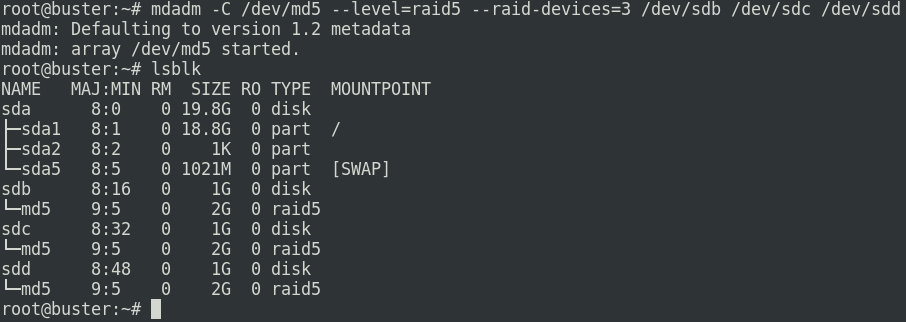

Hay que decir que aquí no he añadido un hot spare, es decir un disco de repuesto, por lo que si alguno de los 3 discos se estropeara, tendríamos que sacarlo y añadir uno nuevo manualmente. Si quisiéramos añadirlo desde un principio, que sería lo mejor, es tan simple como añadir un dispositivo más en el comando para crear el RAID.

Las diferencias que hay entre un RAID1 y un RAID5 principalmente son que el RAID1 necesita como mínimo 2 discos, donde los 2 van a contener la misma información y se replican entre ellos, y en RAID5 es necesario tener 3 o + discos y te ofrece redundancia de datos y con menos espacio perdido cosa que con RAID1 pierdes la mitad del disco. Ambos ofrecen que en caso del fallo de un disco, el sistema sigue funcionando, no se para, y también podemos sustituir discos en caliente.

**Tarea 2: Comprueba las características del RAID. Comprueba el estado del RAID. ¿Qué capacidad tiene el RAID que hemos creado?**

En la siguiente imagen podemos ver el estado del RAID, la cantidad de discos que lo componen (3), la capacidad ocupada, libre y total del RAID (2GB), nos muestra los dispositivos que presentan algún fallo (0), si disponemos de discos de repuesto...

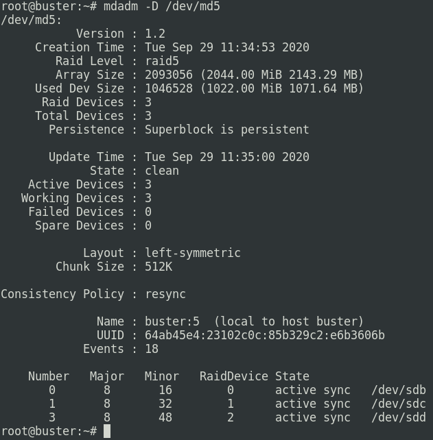

Si queremos mirar solo el estado del RAID, también podemos hacerlo con este comando:
<pre>
cat /proc/mdstat
</pre>

**Tarea 3: Crea un volumen lógico (LVM) de 500Mb en el raid 5.**

Lo primero para utlizar LVM, debemos instalar el siguiente paquete:
<pre>
apt install lvm2
</pre>
Ahora tenemos que tener claro que para crear un volumen lógico, antes debemos crear un volumen físico y un grupo de volúmenes.
Para crear un volumen físico:
<pre>
pvcreate /dev/md5
</pre>

Ahora tendríamos que crear el grupo de volúmenes al que va a pertenecer:
<pre>
vgcreate testing /dev/md5
</pre>

Y ahora sí, podemos crear el volumen lógico de 500MB que deseábamos:
<pre>
lvcreate testing -L 500M -n vollogico1
</pre>
El parámetro -L indica la cantidad de almacenamiento y el parámetro -n el nombre o identificación.

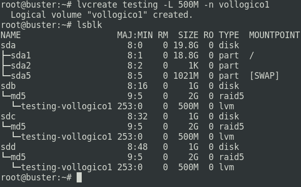

**Tarea 4: Formatea ese volumen con un sistema de archivos xfs.**

Antes de nada, para formatear el volumen con este tipo de sistema de archivos necesitamos instalar el paquete xfsprogs.
<pre>
apt install xfsprogs
</pre>
Ahora con la utilidad mkfs, seguido del sistema de archivos que queremos que posea, formateamos el volumen. Este sería el comando:
<pre>
mkfs.xfs /dev/testing/vollogico1
</pre>
Podemos comprobar que se ha establecido el sistema de archivos XFS, haciendo un 'lsblk -f' .

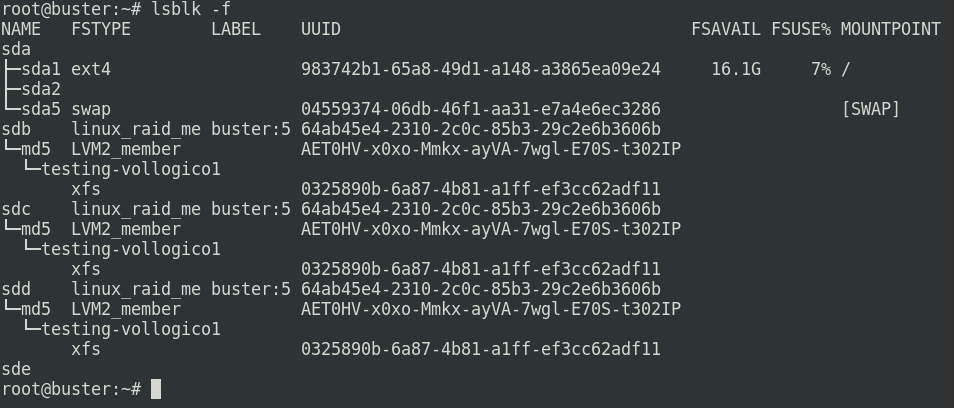

**Tarea 5: Monta el volumen en el directorio /mnt/raid5 y crea un fichero. ¿Qué tendríamos que hacer para que este punto de montaje sea permanente?**

Antes debemos crear el directorio raid5 dentro de la carpeta /mnt . Para ello:
<pre>
mkdir /mnt/raid5
</pre>
Ahora ya si podemos montar el volumen en este directorio, lo cuál lo hacemos con la utilidad 'mount':
<pre>
mount -t xfs /dev/testing/vollogico1 /mnt/raid5
</pre>
Haciendo un 'lsblk' podemos ver como se ha montado correctamente:

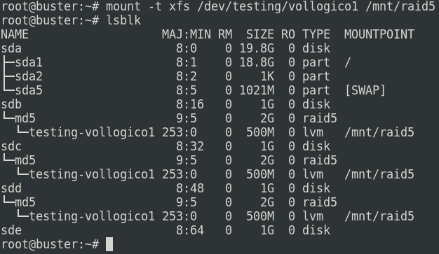

Ahora vamos a crear un fichero para mostrar que está bien montado y nos deja utilizarlo.

Para hacer que se monte automáticamente y de manera permanente, hay que modificar el archivo fstab, hay que añadir una línea con estos datos:

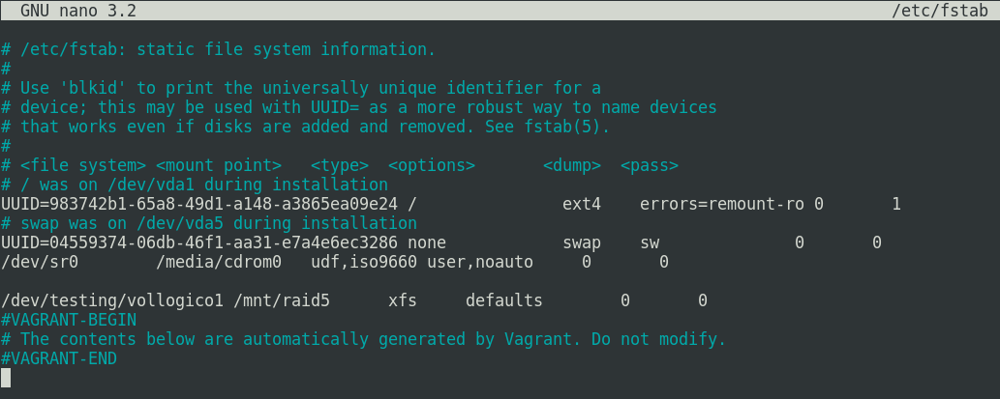

Ahora que hemos modificado y guardado el archivo 'fstab', vamos a reiniciar la máquina y comprobar que se monta automáticamente.

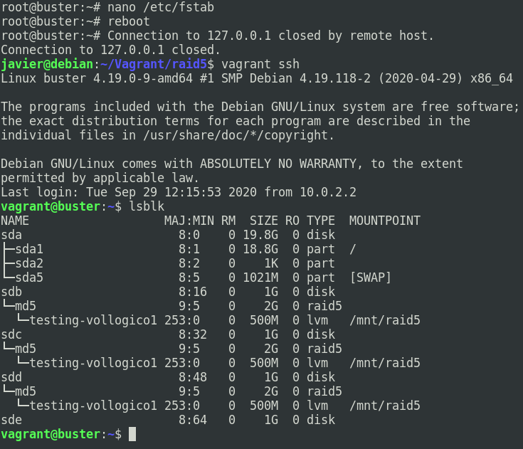

Vemos que funciona como queremos y se monta de manera automática en el directorio /mnt/raid5 .

**Tarea 6: Marca un disco como estropeado. Muestra el estado del raid para comprobar que un disco falla. ¿Podemos acceder al fichero?**

Vamos a marcar un disco como estropeado. En mi caso voy a marcar el tercer disco, que se identifica como /dev/sdd . Lo realizamos con este comando:
<pre>
mdadm --manage /dev/md5 --fail /dev/sdd
</pre>

Aquí muestro el estado del RAID y como efectivamente, el disco aparece estropeado(f).

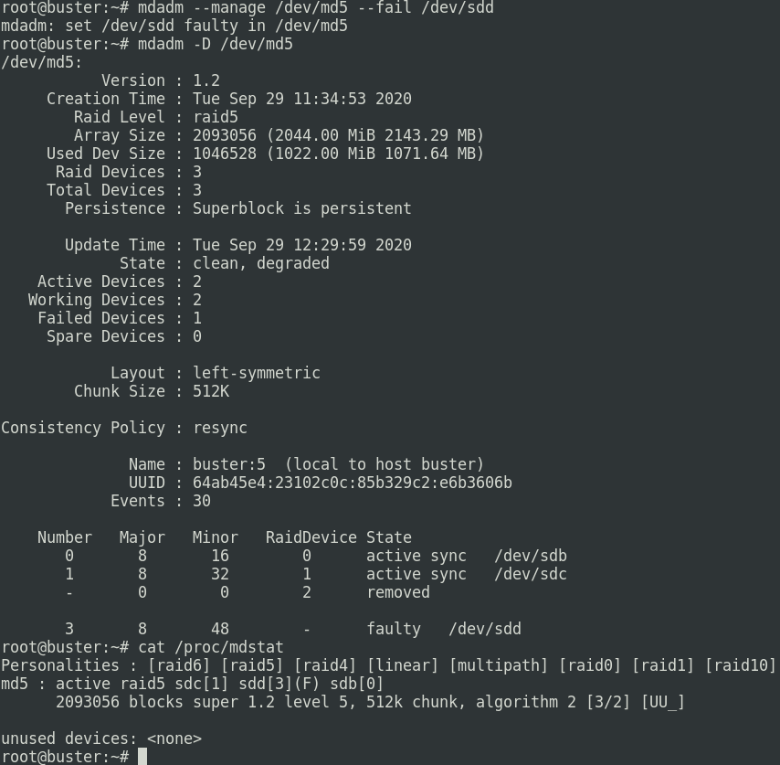

Respondiendo a la pregunta de si podemos acceder al fichero, antes de enseñarlo, ya respondo que sí, ya que en el RAID 5, si se estropea un disco, al haber paridad y redundancia de datos, no perdemos el acceso al sistema, lo único que perdemos es la seguridad ante el posible fallo de un segundo disco.
Aquí vemos como podemos acceder al fichero (que no muestra nada porque está vacío):

**Tarea 7: Una vez marcado como estropeado, lo tenemos que retirar del raid.**

Para retirar un disco del RAID, lo único que debemos especificar es el RAID al que pertenece y el nombre del dispositivo en sí, junto con la orden 'remove', tal que así:
<pre>
mdadm -r /dev/md5 /dev/sdd
</pre>
Comprobamos que se ha retirado y así es.

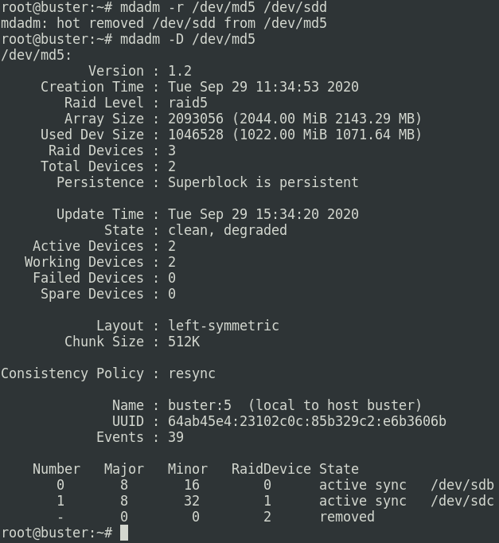

**Tarea 8: Imaginemos que lo cambiamos por un nuevo disco nuevo (el dispositivo de bloque se llama igual), añádelo al array y comprueba como se sincroniza con el anterior.**

Para añadir un disco, en este caso el /dev/sde , el comando es igual que el anterior pero cambiando la orden, 'remove' por 'add' .
<pre>
mdadm -a /dev/md5 /dev/sde
</pre>

Aquí vemos como lo hemos añadido exitosamente y como de manera instantánea empieza a sincronizarse con los otros discos, este proceso dura apenas unos segundos, obviamente no tenemos datos para que tarde más, tardará dependiendo el almacenamiento a sincronizar.

Ya ha terminado la sincronización y está actuando como un disco normal, el reemplazamiento ha sido exitoso.

**Tarea 9: Añade otro disco como reserva. Vuelve a simular el fallo de un disco y comprueba como automática se realiza la sincronización con el disco de reserva.**

Vamos a añadir un nuevo disco que se identifica como /dev/sdf . Este disco va a actuar como disco de repuesto, ya que ahora mismo el RAID funciona correctamente, y solo se utilizará y se pondrá en funcionamiento cuando en algunos de los discos principales se produzca un fallo.
<pre>
mdadm -a /dev/md5 /dev/sdf
</pre>

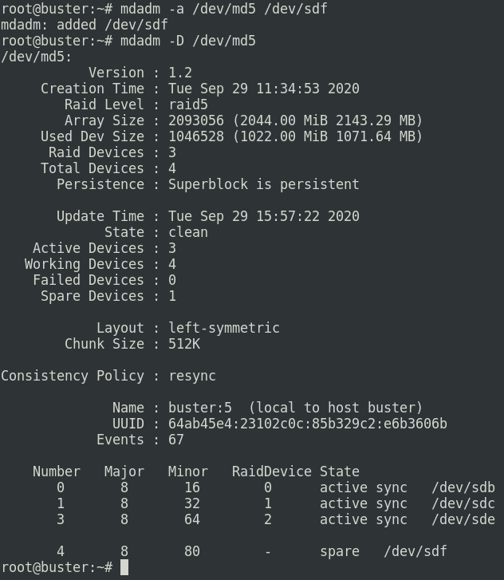

Vemos como se configura como hot spare.
Producimos un fallo en un disco para ver como actúa en caso de emergencia.
<pre>
mdadm --manage /dev/md5 --fail /dev/sde
</pre>

Vemos que sin tener que indicar nada, él automáticamente empieza a sincronizarse con los discos principales.

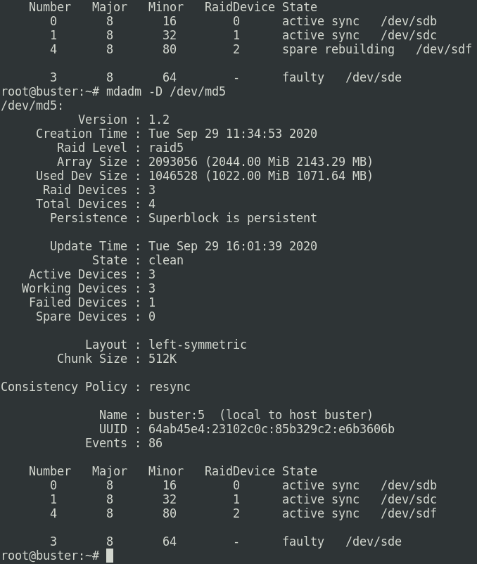

Ya ha terminado la sincronización y ha reemplazado al disco estropeado.

**Tarea 10: Redimensiona el volumen y el sistema de archivos de 500Mb al tamaño del raid.**

Lo primero que debemos hacer es agrandar el volumen lógico. Como nos dice que lo agrandemos al tamaño del RAID, el cuál es de 2GB, en el comando vamos a especificar que coja todo el espacio que haya libre. El comando sería:
<pre>
lvresize -l +100%FREE /dev/testing/vollogico1
</pre>

Nos manda un mensaje que nos dice que ahora poseemos prácticamente 2GB de espacio, por tanto solo nos quedaría extender el sistema de archivos.
Y ahora viene lo que de verdad es realmente ventajoso por parte de este sistema de archivos. Si nos acordamos, anteriormente, configuramos el fichero 'fstab' para que montara automáticamente el volumen, por tanto el volumen ahora mismo está montado. Otros sistemas de archivos no permiten extender el espacio sin desmontar el volumen, pero XFS a diferencia de éstos, no solo nos permite extenderlo en caliente, sino que también nos garantiza la integridad de los datos.
Para redimensionar el sistema de archivos utilizamos el siguiente comando:
<pre>
xfs_growfs /mnt/raid5/
</pre>

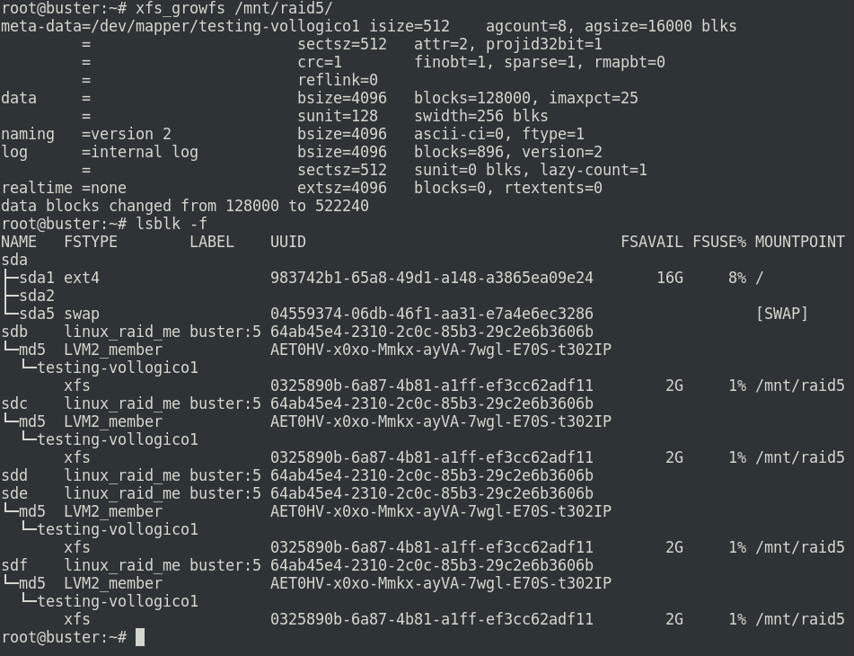

Comprobamos que se ha extendido y que ahora el espacio total es de 2GB.

**Configuración Vagrantfile**

A continuación voy a mostrar la configuración que he hecho en el fichero Vagrantfile para añadir a esta mv los discos utilizados.

<pre>
  disk1 = "./disk1.vdi"
  disk2 = "./disk2.vdi"
  disk3 = "./disk3.vdi"
  disk4 = "./disk4.vdi"
  disk5 = "./disk5.vdi"

  config.vm.provider "virtualbox" do |vb|
  unless File.exist?(disk1)
  vb.customize ['createhd', '--filename', disk1, '--size', 1 * 1024]
  end
  vb.customize ['storageattach', :id, '--storagectl', 'SATA Controller', '--port', 1, '--device', 0, '--type', 'hdd', '--medium', disk1]
  end

  config.vm.provider "virtualbox" do |vb|
  unless File.exist?(disk2)
  vb.customize ['createhd', '--filename', disk2, '--size', 1 * 1024]
  end
  vb.customize ['storageattach', :id, '--storagectl', 'SATA Controller', '--port', 2, '--device', 0, '--type', 'hdd', '--medium', disk2]
  end

  config.vm.provider "virtualbox" do |vb|
  unless File.exist?(disk3)
  vb.customize ['createhd', '--filename', disk3, '--size', 1 * 1024]
  end
  vb.customize ['storageattach', :id, '--storagectl', 'SATA Controller', '--port', 3, '--device', 0, '--type', 'hdd', '--medium', disk3]
  end

  config.vm.provider "virtualbox" do |vb|
  unless File.exist?(disk4)
  vb.customize ['createhd', '--filename', disk4, '--size', 1 * 1024]
  end
  vb.customize ['storageattach', :id, '--storagectl', 'SATA Controller', '--port', 4, '--device', 0, '--type', 'hdd', '--medium', disk4]
  end

  config.vm.provider "virtualbox" do |vb|
  unless File.exist?(disk5)
  vb.customize ['createhd', '--filename', disk5, '--size', 1 * 1024]
  end
  vb.customize ['storageattach', :id, '--storagectl', 'SATA Controller', '--port', 5, '--device', 0, '--type', 'hdd', '--medium', disk5]
  end
</pre>
