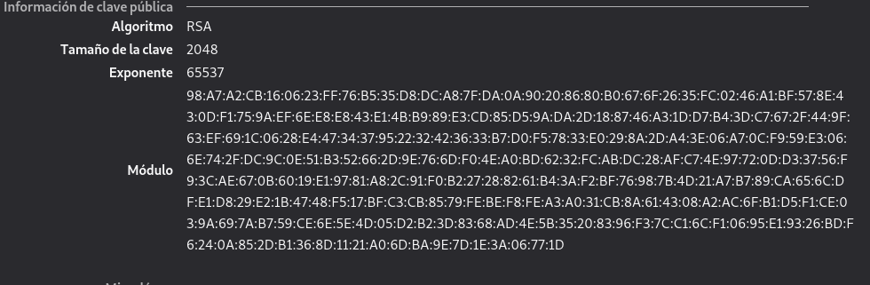
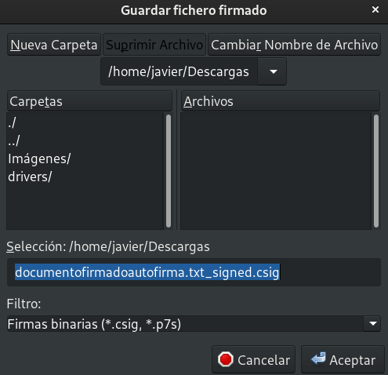
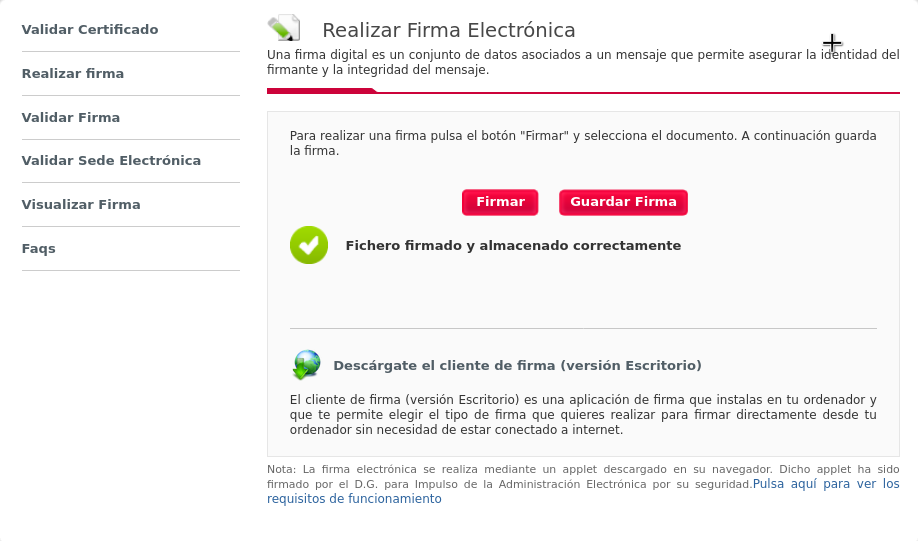

Title: Certificados digitales. HTTPS
Date: 2020/11/17
Category: Seguridad y Alta Disponibilidad
Header_Cover: theme/images/banner-seguridad.jpg
Tags: Criptografía, Certificado digital, HTTPS, SSL

## Certificado digital de persona física

#### Tarea 1: Instalación del certificado

**1. Una vez que hayas obtenido tu certificado, explica brevemente como se instala en tu navegador favorito.**

Una vez hemos solicitado y descargado nuestro certificado digital, se nos guardará en forma de una especie de carpeta/fichero que son los que tendremos que utilizar.

En mi caso utilizo **Mozilla Firefox**, por tanto lo voy a instalar en este navegador.

Nos dirigimos al menú de **Preferencias** del navegador, y en el apartado de **Privacidad & Seguridad**, nos desplazamos hasta la último opción, llamada **Certificados**. Aquí haremos *click* en **Ver certificados** y se nos abrirá una pequeña ventana en la que tendremos distintas secciones. Nos interesa la sección **Sus certificados**, y aquí haremos *click* en **Importar** y se nos abrirá una ventana donde tendremos que seleccionar el certificado que hemos descargado antes, y con esto, ya tendremos instalado nuestro certificado en nuestro navegador.

**2. Muestra una captura de pantalla donde se vea las preferencias del navegador donde se ve instalado tu certificado.**

**3. ¿Cómo puedes hacer una copia de tu certificado? ¿Como vas a realizar la copia de seguridad de tu certificado? Razona la respuesta.**

En la ventana de la imagen anterior, si seleccionamos nuestro certificado, y seleccionamos la opción **Hacer copia...** y elegimos una ruta en nuestro PC, habremos hecho una copia del certificado instalado.

...

...

...

...

**4. Investiga como exportar la clave pública de tu certificado.**

Para exportar nuestra clave pública, debemos hacer doble *click* en nuestro certificado, y se nos abrirá una nueva pestaña con la información del certificado. Nos dirigimos hasta el apartado **Información de clave pública** y aquí encontraremos nuestra clave pública y ya podremos exportarla y compartirla:

#### Tarea 2: Validación del certificado

**1. Instala en tu ordenador el software [autofirma](https://firmaelectronica.gob.es/Home/Descargas.html) y desde la página de *VALIDe*, valida tu certificado. Muestra capturas de pantalla donde se comprueba la validación.**

Para instalar **Autofirma** sobre *Debian*, tenemos que tener en cuenta que necesitamos tener instalado **Java**. Para instalar *Java* ejecutamos:

<pre>
sudo apt install default-jdk openjdk-11-jdk libnss3-tools -y
</pre>

Verificamos la versión instalada:

<pre>
javier@debian:~/Descargas/AutoFirma_Linux$ java -version
openjdk version "11.0.9" 2020-10-20
OpenJDK Runtime Environment (build 11.0.9+11-post-Debian-1deb10u1)
OpenJDK 64-Bit Server VM (build 11.0.9+11-post-Debian-1deb10u1, mixed mode, sharing)
</pre>

Ahora nos descargamos el programa de instalación de *Autofirma* desde este [enlace](https://firmaelectronica.gob.es/Home/Descargas.html).

Una vez descargado y descomprimido, instalamos el paquete `.deb`:

<pre>
sudo dpkg -i AutoFirma_1_6_5.deb
</pre>

Y ya tendríamos instalado **Autofirma**. Comprobamos que lo podemos abrir:

Para validar nuestro certificado, nos dirigimos a la página de **VALIDe** y al apartado **[Validar Certificado](https://valide.redsara.es/valide/validarCertificado/ejecutar.html)**. Seleccionamos el certificado mediante el software de *Autofirma*:

 

Seleccionamos nuestro certificado y hacemos *click* en **Validar**, y obtendremos una respuesta sobre sí el certificado es válido o no. En mi caso:

#### Tarea 3: Firma electrónica

**1. Utilizando la página *VALIDe* y el programa *Autofirma*, firma un documento con tu certificado y envíalo por correo a un compañero.**

Con **Autofirma**:

Para firmar un documento con nuestro certificado y el programa *Autofirma*, seleccionamos **Seleccionar ficheros a firmar**:

Seleccionamos el documento que deseamos firmar:

Seleccionamos con que certificado queremos firmar el documento:

Guardamos el fichero ya firmado con nuestro certificado:

Vemos que ya hemos firmado y guardado el documento firmado:

Con **Valide**:

Para firmar un documento con mi certificado y el programa *Valide*, nos dirigimos a la página de *VALIDe* y al apartado **[Realizar Firma](https://valide.redsara.es/valide/firmar/ejecutar.html)**.

Seleccionamos el documento que deseamos firmar:

Seleccionamos con que certificado queremos firmar el documento:

Vemos que ya hemos firmado el documento pero aún no lo hemos guardado en nuestro equipo:

Guardamos el fichero ya firmado con nuestro certificado:

Vemos que ya hemos firmado y guardado el documento firmado:

Ya dispongo de los documentos firmados, llamados `documentofirmadoautofirma.txt_signed.csig` y `documentofirmadovalide.txt.csig`, y se lo envío a mi compañero [Álvaro](https://www.instagram.com/whosalvr/).

**2. Tu debes recibir otro documento firmado por un compañero y utilizando las herramientas anteriores debes visualizar la firma (Visualizar Firma) y (Verificar Firma). ¿Puedes verificar la firma aunque no tengas la clave pública de tu compañero? ¿Es necesario estar conectado a internet para hacer la validación de la firma? Razona tus respuestas.**

He recibido de Álvaro los documentos `ficheroautofirma.txt_signed.csig` y `ficherovalide.txt_signed.csig`.

Con **Autofirma**:

En el programa *Autofirma* seleccionamos la opción **Ver firma**:

Seleccionamos el fichero del cuál queremos ver la firma:

Nos sale que está firmado por Álvaro:

Con **Valide**:

Para verificar la firma de un documento y el programa *Valide*, nos dirigimos a la página de *VALIDe* y al apartado **[Validar Firma](https://valide.redsara.es/valide/validarFirma/ejecutar.html)**.

Seleccionamos el fichero del cuál queremos ver la firma:

Nos sale que también está firmado por Álvaro:

**3. Entre dos compañeros, firmar los dos un documento, verificar la firma para comprobar que está firmado por los dos.**

Tanto yo como Álvaro hemos firmado el mismo documento, por tanto si verificamos la firma de éste:

Vemos que sale firmado por ambos.

#### Tarea 4: Autentificación

**1. Utilizando tu certificado accede a alguna página de la administración pública (cita médica, becas, puntos del carnet,…). Entrega capturas de pantalla donde se demuestre el acceso a ellas.**

Voy a intentar consultar mis puntos del carnet de conducir, utilizando mi certificado digital.

Me dirijo a la web llamada **[Consulta tus puntos](https://sede.dgt.gob.es/es/permisos-de-conducir/consulta-tus-puntos/#)** de la DGT, y aquí indico que me voy a identificar mediante **Clave**:

Vemos que tenemos distintas posibilidades para identificarnos, yo selecciono **Certificado Electrónico**. Como tengo instalado mi certificado en este navegador, me lo reconoce automáticamente y me pregunta si quiero acceder:

Le digo que sí y automáticamente nos hemos identificado con nuestra certificado digital y nos proporciona la siguiente información:

Sale este mensaje porque aún no me he sacado el carnet jajajaja.

## HTTPS / SSL

**Antes de hacer esta práctica vamos a crear una página web (puedes usar una página estática o instalar una aplicación web) en un servidor web apache2 que se acceda con el nombre `tunombre.iesgn.org`.**

#### Tarea 1: Certificado autofirmado

**Esta práctica la vamos a realizar con un compañero. En un primer momento un alumno creará una Autoridad Certficadora y firmará un certificado para la página del otro alumno. Posteriormente se volverá a realizar la práctica con los roles cambiados.**

**Para hacer esta práctica puedes buscar información en internet, algunos enlaces interesantes:**

- [Phil’s X509/SSL Guide](https://www.phildev.net/ssl/)
- [How to setup your own CA with OpenSSL](https://gist.github.com/Soarez/9688998)
- [Crear autoridad certificadora (CA) y certificados autofirmados en Linux](https://blog.guillen.io/2018/09/29/crear-autoridad-certificadora-ca-y-certificados-autofirmados-en-linux/)

**El alumno que hace de Autoridad Certificadora deberá entregar una documentación donde explique los siguientes puntos:**

**1. Crear su autoridad certificadora (generar el certificado digital de la CA). Mostrar el fichero de configuración de la AC.**

<pre>
mkdir CA
cd CA/
mkdir ./{certsdb,certreqs,crl,private}
chmod 700 ./private
touch ./index.txt
cp /usr/lib/ssl/openssl.cnf ./
nano openssl.cnf
</pre>

<pre>
root@https:~/CA# openssl req -new -newkey rsa:2048 -keyout private/cakey.pem -out careq.pem -config ./openssl.cnf
Generating a RSA private key
............................................+++++
..............................................................................+++++
writing new private key to 'private/cakey.pem'
Enter PEM pass phrase:
Verifying - Enter PEM pass phrase:
-----
You are about to be asked to enter information that will be incorporated
into your certificate request.
What you are about to enter is what is called a Distinguished Name or a DN.
There are quite a few fields but you can leave some blank
For some fields there will be a default value,
If you enter '.', the field will be left blank.
-----
Country Name (2 letter code) [ES]:
State or Province Name (full name) [Sevilla]:
Locality Name (eg, city) [Dos Hermanas]:
Organization Name (eg, company) [JavierPerez Corp]:
Organizational Unit Name (eg, section) [Informatica]:
Common Name (e.g. server FQDN or YOUR name) []:javier.debian
Email Address []:javierperezhidalgo01@gmail.com

root@https:~/CA#
</pre>

<pre>
root@https:~/CA# openssl ca -create_serial -out cacert.pem -days 365 -keyfile private/cakey.pem -selfsign -extensions v3_ca -config ./openssl.cnf -infiles careq.pem
Using configuration from ./openssl.cnf
Enter pass phrase for private/cakey.pem:
Check that the request matches the signature
Signature ok
Certificate Details:
        Serial Number:
            0a:7b:37:65:ef:20:c3:8c:e9:00:00:d2:54:7c:35:69:7c:0b:29:3d
        Validity
            Not Before: Nov 17 18:43:27 2020 GMT
            Not After : Nov 17 18:43:27 2021 GMT
        Subject:
            countryName               = ES
            stateOrProvinceName       = Sevilla
            organizationName          = JavierPerez Corp
            organizationalUnitName    = Informatica
            commonName                = javier.debian
            emailAddress              = javierperezhidalgo01@gmail.com
        X509v3 extensions:
            X509v3 Subject Key Identifier:
                92:F5:19:9E:24:0D:30:B0:83:14:FA:D5:74:BC:25:79:0F:9F:19:CD
            X509v3 Authority Key Identifier:
                keyid:92:F5:19:9E:24:0D:30:B0:83:14:FA:D5:74:BC:25:79:0F:9F:19:CD

            X509v3 Basic Constraints: critical
                CA:TRUE
Certificate is to be certified until Nov 17 18:43:27 2021 GMT (365 days)
Sign the certificate? [y/n]:y

1 out of 1 certificate requests certified, commit? [y/n]y
Write out database with 1 new entries
Data Base Updated

root@https:~/CA#
</pre>

**2. Debe recibir el fichero CSR (Solicitud de Firmar un Certificado) de su compañero, debe firmarlo y enviar el certificado generado a su compañero.**

<pre>
cp /home/javi/javierpzh_key.pem /certreqs
</pre>

<pre>
root@https:~/CA# openssl ca -config openssl.cnf -out certsdb/alvaro.crt -infiles certreqs/alvaro.csr
Using configuration from openssl.cnf
Enter pass phrase for /root/CA/private/cakey.pem:
Check that the request matches the signature
Signature ok
Certificate Details:
        Serial Number:
            0a:7b:37:65:ef:20:c3:8c:e9:00:00:d2:54:7c:35:69:7c:0b:29:3e
        Validity
            Not Before: Nov 17 18:48:00 2020 GMT
            Not After : Nov 17 18:48:00 2021 GMT
        Subject:
            countryName               = ES
            stateOrProvinceName       = Sevilla
            organizationName          = JavierPerez Corp
            organizationalUnitName    = Informatica
            commonName                = alvaro.iesgn.org
            emailAddress              = avacaferreras@gmail.com
        X509v3 extensions:
            X509v3 Basic Constraints:
                CA:FALSE
            Netscape Comment:
                OpenSSL Generated Certificate
            X509v3 Subject Key Identifier:
                6C:6E:4C:23:03:A7:E9:64:DC:0B:F3:5B:79:97:9A:2C:BE:FB:3D:22
            X509v3 Authority Key Identifier:
                keyid:92:F5:19:9E:24:0D:30:B0:83:14:FA:D5:74:BC:25:79:0F:9F:19:CD

Certificate is to be certified until Nov 17 18:48:00 2021 GMT (365 days)
Sign the certificate? [y/n]:y

1 out of 1 certificate requests certified, commit? [y/n]y
Write out database with 1 new entries
Data Base Updated

root@https:~/CA#
</pre>

<pre>
root@https:~/CA# cp certsdb/alvaro.crt /home/alvaro/
</pre>

**3. ¿Qué otra información debes aportar a tu compañero para que éste configure de forma adecuada su servidor web con el certificado generado?**

<pre>
root@https:~/CA# cp cacert.pem /home/alvaro/
</pre>

**El alumno que hace de administrador del servidor web, debe entregar una documentación que describa los siguientes puntos:**

**1. Crea una clave privada RSA de 4096 bits para identificar el servidor.**

<pre>
root@https:~# openssl genrsa 4096 > /etc/ssl/private/javi.key
Generating RSA private key, 4096 bit long modulus (2 primes)
................................................................................................................................................++++
............................++++
e is 65537 (0x010001)
root@https:~#
</pre>

**2. Utiliza la clave anterior para generar un CSR, considerando que deseas acceder al servidor tanto con el FQDN (`tunombre.iesgn.org`) como con el nombre de host (implica el uso de las extensiones `Alt Name`).**

<pre>
root@https:~# openssl req -new -key /etc/ssl/private/javi.key -out ./javi.csr
You are about to be asked to enter information that will be incorporated
into your certificate request.
What you are about to enter is what is called a Distinguished Name or a DN.
There are quite a few fields but you can leave some blank
For some fields there will be a default value,
If you enter '.', the field will be left blank.
-----
Country Name (2 letter code) [AU]:ES
State or Province Name (full name) [Some-State]:Sevilla
Locality Name (eg, city) []:Dos Hermanas
Organization Name (eg, company) [Internet Widgits Pty Ltd]:AlvaroVaca Corp
Organizational Unit Name (eg, section) []:Informatica
Common Name (e.g. server FQDN or YOUR name) []:javierpzh.iesgn.org
Email Address []:javierperezhidalgo01@gmail.com

Please enter the following 'extra' attributes
to be sent with your certificate request
A challenge password []:
An optional company name []:

root@https:~#
</pre>

**3. Envía la solicitud de firma a la entidad certificadora (su compañero).**

<pre>
root@https:~# scp javi.csr javi@172.22.200.186:/home/javi/
javi@172.22.200.186's password:
javi.csr                                                              100% 1801   980.4KB/s   00:00
</pre>

**4. Recibe como respuesta un certificado X.509 para el servidor firmado y el certificado de la autoridad certificadora.**

<pre>
root@https:~# scp javi@172.22.200.186:/home/javi/javier.crt ./
javi@172.22.200.186's password:
javier.crt                                                            100% 6284     1.9MB/s   00:00

root@https:~/CA# scp javi@172.22.200.186:/home/javi/cacert.pem ./
javi@172.22.200.186's password:
cacert.pem                                                            100% 4658     1.7MB/s   00:00
</pre>

**5. Configura tu servidor web con https en el puerto 443, haciendo que las peticiones http se redireccionen a https (forzar https).**

**6. Instala ahora un servidor nginx, y realiza la misma configuración que anteriormente para que se sirva la página con HTTPS.**
