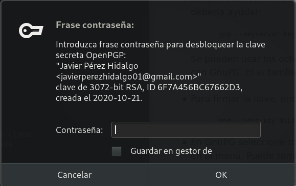

Title: Integridad, firmas y autenticación
Date: 2020/11/3
Category: Seguridad y Alta Disponibilidad
Header_Cover: theme/images/banner-seguridad.jpg
Tags: GPG

## Tarea 1: Firmas electrónicas

**En este primer apartado vamos a trabajar con las firmas electrónicas, para ello te pueden ayudar los siguientes enlaces:**

- [Intercambiar claves](https://www.gnupg.org/gph/es/manual/x75.html)
- [Validar otras claves en nuestro anillo de claves públicas](https://www.gnupg.org/gph/es/manual/x354.html)
- [Firmado de claves (Debian)](https://www.debian.org/events/keysigning.es.html)

#### GPG

**1. Manda un documento y la firma electrónica del mismo a un compañero. Verifica la firma que tu has recibido.**

**2. ¿Qué significa el mensaje que aparece en el momento de verificar la firma?**

<pre>
gpg: Firma correcta de "Pepe D <josedom24@gmail.com>" [desconocido]
gpg: ATENCIÓN: ¡Esta clave no está certificada por una firma de confianza!
gpg:          No hay indicios de que la firma pertenezca al propietario.
Huellas dactilares de la clave primaria: E8DD 5DA9 3B88 F08A DA1D  26BF 5141 3DDB 0C99 55FC
</pre>

Significa que la clave pública con la que hemos descifrado un archivo, no tiene ninguna firma de nuestras personas de confianza, por lo tanto, no podemos tener ninguna confianza en que esta clave pertenece de verdad a la persona que dice que es suya.

**3. Vamos a crear un anillo de confianza entre los miembros de nuestra clase, para ello.**

- **Tu clave pública debe estar en un servidor de claves**

- **Escribe tu fingerprint en un papel y dáselo a tu compañero, para que puede descargarse tu clave pública.**

- **Te debes bajar al menos tres claves públicas de compañeros. Firma estas claves.**

- **Tú te debes asegurar que tu clave pública es firmada por al menos tres compañeros de la clase.**

- **Una vez que firmes una clave se la tendrás que devolver a su dueño, para que otra persona se la firme.**

- **Cuando tengas las tres firmas sube la clave al servidor de claves y rellena tus datos en la tabla [Claves públicas PGP 2020-2021](https://dit.gonzalonazareno.org/redmine/projects/asir2/wiki/Claves_p%C3%BAblicas_PGP_2020-2021)**

- **Asegúrate que te vuelves a bajar las claves públicas de tus compañeros que tengan las tres firmas.**

Para exportar mi clave pública a un servidor de claves, en este caso al servidor `keys.gnupg.net`:

<pre>
gpg --keyserver keys.gnupg.net --send-key C67662D3
</pre>

El comando para importar una clave pública desde un servidor de claves sería:

<pre>
gpg --keyserver keys.gnupg.net --recv-keys XXXXXXXX
</pre>

Los servidores de claves no funcionaban muy bien en el momento que estábamos realizando la práctica, por tanto, nos pasamos las claves por correo.

Para exportar mi clave pública y poder enviarla:

<pre>
gpg --export C67662D3 > javi.asc
</pre>

Cuando nos firmen la clave debemos importarla para actualizar la lista de firmas de la clave, y posteriormente volver a exportarla para que posea todas las firmas.

Voy a importar la clave de mi compañero [Álvaro](https://www.instagram.com/whosalvr/) que previamente me ha pasado por correo electrónico y he descargado:

<pre>
javier@debian:~/Descargas$ ls
clave.asc  Imágenes

javier@debian:~/Descargas$ gpg --import clave.asc
gpg: key 3E0DA17912B9A4F8: 2 firmas no comprobadas por falta de claves
gpg: clave 3E0DA17912B9A4F8: clave pública "Álvaro Vaca Ferreras <avacaferreras@gmail.com>" importada
gpg: Cantidad total procesada: 1
gpg:               importadas: 1
gpg: marginals needed: 3  completes needed: 1  trust model: pgp
gpg: nivel: 0  validez:   1  firmada:   0  confianza: 0-, 0q, 0n, 0m, 0f, 1u
gpg: siguiente comprobación de base de datos de confianza el: 2022-10-21

javier@debian:~/Descargas$ gpg --list-key
/home/javier/.gnupg/pubring.kbx
-------------------------------
pub   rsa3072 2020-10-21 [SC] [caduca: 2022-10-21]
      76270D5E766E0F22D70466BE6F7A456BC67662D3
uid        [  absoluta ] Javier Pérez Hidalgo <javierperezhidalgo01@gmail.com>
sub   rsa3072 2020-10-21 [E] [caduca: 2022-10-21]

pub   rsa3072 2020-10-07 [SC] [caduca: 2022-10-07]
      4C220919DD2364BED7D49C3215E1B16E8352B9BB
uid        [desconocida] Juan Luis Millan Hidalgo <juanluismillanhidalgo@gmail.com>
sub   rsa3072 2020-10-07 [E] [caduca: 2022-10-07]

pub   rsa3072 2020-10-13 [SC] [caduca: 2022-10-13]
      B02B578465B0756DFD271C733E0DA17912B9A4F8
uid        [desconocida] Álvaro Vaca Ferreras <avacaferreras@gmail.com>
sub   rsa3072 2020-10-13 [E] [caduca: 2022-10-13]

javier@debian:~/Descargas$ gpg --list-sig
/home/javier/.gnupg/pubring.kbx
-------------------------------
...

pub   rsa3072 2020-10-13 [SC] [caduca: 2022-10-13]
      B02B578465B0756DFD271C733E0DA17912B9A4F8
uid        [desconocida] Álvaro Vaca Ferreras <avacaferreras@gmail.com>
sig 3        3E0DA17912B9A4F8 2020-10-13  Álvaro Vaca Ferreras <avacaferreras@gmail.com>
sig          15E1B16E8352B9BB 2020-10-21  Juan Luis Millan Hidalgo <juanluismillanhidalgo@gmail.com>
sig          73986F40D4BB0593 2020-10-21  [ID de usuario no encontrado]
sig          BEAECEA4DC2F7A96 2020-10-21  [ID de usuario no encontrado]
sub   rsa3072 2020-10-13 [E] [caduca: 2022-10-13]
sig          3E0DA17912B9A4F8 2020-10-13  Álvaro Vaca Ferreras <avacaferreras@gmail.com>

...
</pre>

Vemos como hemos importado a nuestro anillo de claves la clave pública de Álvaro, y que además si miramos las firmas que tiene su clave pública, encontramos que está firmada por 3 personas, entre las que se encuentra mi compañero [Juanlu](https://www.instagram.com/juanlu_millan/). Nos identifica la firma de Juanlu ya que en mi anillo de claves, también poseo la clave pública de Juanlu.

Voy a firmar la clave de Álvaro:

<pre>
javier@debian:~/Descargas$ gpg --edit-key 12B9A4F8
gpg (GnuPG) 2.2.12; Copyright (C) 2018 Free Software Foundation, Inc.
This is free software: you are free to change and redistribute it.
There is NO WARRANTY, to the extent permitted by law.

pub  rsa3072/3E0DA17912B9A4F8
     creado: 2020-10-13  caduca: 2022-10-13  uso: SC  
     confianza: desconocido   validez: desconocido
sub  rsa3072/8C88D2FAE94F5DDC
     creado: 2020-10-13  caduca: 2022-10-13  uso: E   
[desconocida] (1). Álvaro Vaca Ferreras <avacaferreras@gmail.com>

gpg> sign

pub  rsa3072/3E0DA17912B9A4F8
     creado: 2020-10-13  caduca: 2022-10-13  uso: SC  
     confianza: desconocido   validez: desconocido
 Huella clave primaria: B02B 5784 65B0 756D FD27  1C73 3E0D A179 12B9 A4F8

     Álvaro Vaca Ferreras <avacaferreras@gmail.com>

Esta clave expirará el 2022-10-13.
¿Está realmente seguro de querer firmar esta clave
con su clave: "Javier Pérez Hidalgo <javierperezhidalgo01@gmail.com>" (6F7A456BC67662D3)?

¿Firmar de verdad? (s/N) s
</pre>

Verificamos que queremos firmar la clave:

<pre>
gpg> save

javier@debian:~/Descargas$ gpg --list-sign
gpg: comprobando base de datos de confianza
gpg: marginals needed: 3  completes needed: 1  trust model: pgp
gpg: nivel: 0  validez:   1  firmada:   1  confianza: 0-, 0q, 0n, 0m, 0f, 1u
gpg: nivel: 1  validez:   1  firmada:   1  confianza: 1-, 0q, 0n, 0m, 0f, 0u
gpg: siguiente comprobación de base de datos de confianza el: 2022-10-07
/home/javier/.gnupg/pubring.kbx
-------------------------------
...

pub   rsa3072 2020-10-13 [SC] [caduca: 2022-10-13]
      B02B578465B0756DFD271C733E0DA17912B9A4F8
uid        [   total   ] Álvaro Vaca Ferreras <avacaferreras@gmail.com>
sig 3        3E0DA17912B9A4F8 2020-10-13  Álvaro Vaca Ferreras <avacaferreras@gmail.com>
sig          15E1B16E8352B9BB 2020-10-21  Juan Luis Millan Hidalgo <juanluismillanhidalgo@gmail.com>
sig          73986F40D4BB0593 2020-10-21  [ID de usuario no encontrado]
sig          BEAECEA4DC2F7A96 2020-10-21  [ID de usuario no encontrado]
sig          6F7A456BC67662D3 2020-11-03  Javier Pérez Hidalgo <javierperezhidalgo01@gmail.com>
sub   rsa3072 2020-10-13 [E] [caduca: 2022-10-13]
sig          3E0DA17912B9A4F8 2020-10-13  Álvaro Vaca Ferreras <avacaferreras@gmail.com>

...
</pre>

Observamos como se ha añadido una nueva firma, en este caso la mía. Por tanto, ahora simplemente nos faltaría exportar esta clave de Álvaro y hacérsela llegar para que él pueda actualizar su clave pública que ahora también posee mi firma.

<pre>
gpg --export 12B9A4F8 > alvaro.asc
</pre>

Se la paso por correo.

Me he encargado de pasar mi clave a tres compañeros para que me la firmen.

En este caso, voy a mostrar como importo mi clave pública, que recientemente me la ha enviado Álvaro firmada por él, para actualizar mi lista de firmas:

<pre>
javier@debian:~/Descargas$ ls
Imágenes  javi.asc

javier@debian:~/Descargas$ gpg --import javi.asc
gpg: clave 6F7A456BC67662D3: "Javier Pérez Hidalgo <javierperezhidalgo01@gmail.com>" 1 firma nueva
gpg: Cantidad total procesada: 1
gpg:         nuevas firmas: 1
gpg: marginals needed: 3  completes needed: 1  trust model: pgp
gpg: nivel: 0  validez:   1  firmada:   1  confianza: 0-, 0q, 0n, 0m, 0f, 1u
gpg: nivel: 1  validez:   1  firmada:   1  confianza: 1-, 0q, 0n, 0m, 0f, 0u
gpg: siguiente comprobación de base de datos de confianza el: 2022-10-07
javier@debian:~/Descargas$ gpg --list-sig
/home/javier/.gnupg/pubring.kbx
-------------------------------
pub   rsa3072 2020-10-21 [SC] [caduca: 2022-10-21]
      76270D5E766E0F22D70466BE6F7A456BC67662D3
uid        [  absoluta ] Javier Pérez Hidalgo <javierperezhidalgo01@gmail.com>
sig 3        6F7A456BC67662D3 2020-10-21  Javier Pérez Hidalgo <javierperezhidalgo01@gmail.com>
sig          15E1B16E8352B9BB 2020-10-27  Juan Luis Millan Hidalgo <juanluismillanhidalgo@gmail.com>
sig          3E0DA17912B9A4F8 2020-11-03  Álvaro Vaca Ferreras <avacaferreras@gmail.com>
sub   rsa3072 2020-10-21 [E] [caduca: 2022-10-21]
sig          6F7A456BC67662D3 2020-10-21  Javier Pérez Hidalgo <javierperezhidalgo01@gmail.com>

...
</pre>

Voy a repetir el proceso con mi compañero [Fran](https://www.instagram.com/thetrolleator/):

Primero importo su clave:

<pre>
javier@debian:~/Descargas$ gpg --import firma-fran.key
gpg: key BEAECEA4DC2F7A96: 1 firma no comprobada por falta de una clave
gpg: clave BEAECEA4DC2F7A96: clave pública "Francisco Javier Martín Núñez <franjaviermn17100@gmail.com>" importada
gpg: Cantidad total procesada: 1
gpg:               importadas: 1
gpg: marginals needed: 3  completes needed: 1  trust model: pgp
gpg: nivel: 0  validez:   1  firmada:   1  confianza: 0-, 0q, 0n, 0m, 0f, 1u
gpg: nivel: 1  validez:   1  firmada:   2  confianza: 1-, 0q, 0n, 0m, 0f, 0u
gpg: siguiente comprobación de base de datos de confianza el: 2022-10-07

javier@debian:~/Descargas$ gpg --list-key
/home/javier/.gnupg/pubring.kbx
-------------------------------
...

pub   rsa3072 2020-10-07 [SC] [caduca: 2022-10-07]
      D6BE9BF1C7D6A435BF1B9D38BEAECEA4DC2F7A96
uid        [no definida] Francisco Javier Martín Núñez <franjaviermn17100@gmail.com>
sub   rsa3072 2020-10-07 [E] [caduca: 2022-10-07]

...

javier@debian:~/Descargas$ gpg --list-sign
/home/javier/.gnupg/pubring.kbx
-------------------------------
...

pub   rsa3072 2020-10-07 [SC] [caduca: 2022-10-07]
      D6BE9BF1C7D6A435BF1B9D38BEAECEA4DC2F7A96
uid        [no definida] Francisco Javier Martín Núñez <franjaviermn17100@gmail.com>
sig 3        BEAECEA4DC2F7A96 2020-10-07  Francisco Javier Martín Núñez <franjaviermn17100@gmail.com>
sig          3E0DA17912B9A4F8 2020-10-21  Álvaro Vaca Ferreras <avacaferreras@gmail.com>
sig          73986F40D4BB0593 2020-10-21  [ID de usuario no encontrado]
sig          15E1B16E8352B9BB 2020-10-27  Juan Luis Millan Hidalgo <juanluismillanhidalgo@gmail.com>
sub   rsa3072 2020-10-07 [E] [caduca: 2022-10-07]
sig          BEAECEA4DC2F7A96 2020-10-07  Francisco Javier Martín Núñez <franjaviermn17100@gmail.com>

...
</pre>

Vemos como la he importado y nos aparecen las firmas que él posee, entre las que se encuentran las de Álvaro y Juanlu.

Le firmo la clave:

<pre>
javier@debian:~/Descargas$ gpg --edit-key DC2F7A96
gpg (GnuPG) 2.2.12; Copyright (C) 2018 Free Software Foundation, Inc.
This is free software: you are free to change and redistribute it.
There is NO WARRANTY, to the extent permitted by law.

pub  rsa3072/BEAECEA4DC2F7A96
     creado: 2020-10-07  caduca: 2022-10-07  uso: SC  
     confianza: desconocido   validez: no definido
sub  rsa3072/B9026374C5B1C2EE
     creado: 2020-10-07  caduca: 2022-10-07  uso: E   
[no definida] (1). Francisco Javier Martín Núñez <franjaviermn17100@gmail.com>

gpg> sign

pub  rsa3072/BEAECEA4DC2F7A96
     creado: 2020-10-07  caduca: 2022-10-07  uso: SC  
     confianza: desconocido   validez: no definido
 Huella clave primaria: D6BE 9BF1 C7D6 A435 BF1B  9D38 BEAE CEA4 DC2F 7A96

     Francisco Javier Martín Núñez <franjaviermn17100@gmail.com>

Esta clave expirará el 2022-10-07.
¿Está realmente seguro de querer firmar esta clave
con su clave: "Javier Pérez Hidalgo <javierperezhidalgo01@gmail.com>" (6F7A456BC67662D3)?

¿Firmar de verdad? (s/N) s

gpg> save
javier@debian:~/Descargas$ gpg --list-sig
gpg: comprobando base de datos de confianza
gpg: marginals needed: 3  completes needed: 1  trust model: pgp
gpg: nivel: 0  validez:   1  firmada:   2  confianza: 0-, 0q, 0n, 0m, 0f, 1u
gpg: nivel: 1  validez:   2  firmada:   1  confianza: 2-, 0q, 0n, 0m, 0f, 0u
gpg: siguiente comprobación de base de datos de confianza el: 2022-10-07
/home/javier/.gnupg/pubring.kbx
-------------------------------
...

pub   rsa3072 2020-10-07 [SC] [caduca: 2022-10-07]
      D6BE9BF1C7D6A435BF1B9D38BEAECEA4DC2F7A96
uid        [   total   ] Francisco Javier Martín Núñez <franjaviermn17100@gmail.com>
sig 3        BEAECEA4DC2F7A96 2020-10-07  Francisco Javier Martín Núñez <franjaviermn17100@gmail.com>
sig          3E0DA17912B9A4F8 2020-10-21  Álvaro Vaca Ferreras <avacaferreras@gmail.com>
sig          73986F40D4BB0593 2020-10-21  [ID de usuario no encontrado]
sig          15E1B16E8352B9BB 2020-10-27  Juan Luis Millan Hidalgo <juanluismillanhidalgo@gmail.com>
sig          6F7A456BC67662D3 2020-11-03  Javier Pérez Hidalgo <javierperezhidalgo01@gmail.com>
sub   rsa3072 2020-10-07 [E] [caduca: 2022-10-07]
sig          BEAECEA4DC2F7A96 2020-10-07  Francisco Javier Martín Núñez <franjaviermn17100@gmail.com>

...
</pre>

Exporto la clave de Fran, firmada por mí y se la paso:

<pre>
gpg --export DC2F7A96 > fran.asc
</pre>

También exporto mi clave para que él me la firme:

<pre>
gpg --export C67662D3 > clavejavi.asc
</pre>

Cuando he recibido mi clave firmada por Fran, la importo a mi anillo:

<pre>

</pre>

**4. Muestra las firmas que tiene tu clave pública.**

<pre>
gpg --list-sign
</pre>

**5. Comprueba que ya puedes verificar sin “problemas” una firma recibida por una persona en la que confías.**

**6. Comprueba que puedes verificar con confianza una firma de una persona en las que no confías, pero sin embargo si confía otra persona en la que tu tienes confianza total.**

## Tarea 2: Correo seguro con evolution/thunderbird

**Ahora vamos a configurar nuestro cliente de correo electrónico para poder mandar correos cifrados, para ello:**

**1. Configura el cliente de correo evolution con tu cuenta de correo habitual**

**2. Añade a la cuenta las opciones de seguridad para poder enviar correos firmados con tu clave privada o cifrar los mensajes para otros destinatarios**

**3. Envía y recibe varios mensajes con tus compañeros y comprueba el funcionamiento adecuado de GPG**

## Tarea 3: Integridad de ficheros

**Vamos a descargarnos la ISO de debian, y posteriormente vamos a comprobar su integridad.**

**Puedes encontrar la ISO en la dirección: [https://cdimage.debian.org/debian-cd/current/amd64/iso-cd/](https://cdimage.debian.org/debian-cd/current/amd64/iso-cd/).**

**1. Para validar el contenido de la imagen CD, solo asegúrese de usar la herramienta apropiada para sumas de verificación. Para cada versión publicada existen archivos de suma de comprobación con algoritmos fuertes (SHA256 y SHA512); debería usar las herramientas sha256sum o sha512sum para trabajar con ellos.**

**2. Verifica que el contenido del hash que has utilizado no ha sido manipulado, usando la firma digital que encontrarás en el repositorio. Puedes encontrar una guía para realizarlo en este artículo: [How to verify an authenticity of downloaded Debian ISO images](https://linuxconfig.org/how-to-verify-an-authenticity-of-downloaded-debian-iso-images)**

## Tarea 4: Integridad y autenticidad (apt secure)

**Cuando nos instalamos un paquete en nuestra distribución linux tenemos que asegurarnos que ese paquete es legítimo. Para conseguir este objetivo se utiliza criptografía asimétrica, y en el caso de Debian a este sistema se llama apt secure. Esto lo debemos tener en cuenta al utilizar los repositorios oficiales. Cuando añadamos nuevos repositorios tendremos que añadir las firmas necesarias para confiar en que los paquetes son legítimos y no han sido modificados.**

**Busca información sobre `apt secure` y responde las siguientes preguntas:**

**1.¿Qué software utiliza `apt secure` para realizar la criptografía asimétrica?**

**2.¿Para que sirve el comando `apt-key`? ¿Qué muestra el comando `apt-key list`?**

**3.¿En qué fichero se guarda el anillo de claves que guarda la herramienta `apt-key`?**

**4. ¿Qué contiene el archivo `Release` de un repositorio de paquetes?. ¿Y el archivo `Release.gpg`?. Puedes ver estos archivos en el repositorio `http://ftp.debian.org/debian/dists/Debian10.1/`. Estos archivos se descargan cuando hacemos un `apt update`.**

**5. Explica el proceso por el cual el sistema nos asegura que los ficheros que estamos descargando son legítimos.**

**6. Añade de forma correcta el repositorio de *Virtualbox* añadiendo la clave pública de Virtualbox como se indica en la [documentación](https://www.virtualbox.org/wiki/Linux_Downloads).**

## Tarea 5: Autentificación: ejemplo SSH

**Vamos a estudiar como la criptografía nos ayuda a cifrar las comunicaciones que hacemos utilizando el protocolo ssh, y cómo nos puede servir también para conseguir que un cliente se autentifique contra el servidor. Responde las siguientes cuestiones:**

**1. Explica los pasos que se producen entre el cliente y el servidor para que el protocolo cifre la información que se transmite? ¿Para qué se utiliza la criptografía simétrica? ¿Y la asimétrica?**

**2. Explica los dos métodos principales de autentificación: por contraseña y utilizando un par de claves públicas y privadas.**

**3. En el cliente para que sirve el contenido que se guarda en el fichero `~/.ssh/know_hosts`?**

**4. ¿Qué significa este mensaje que aparece la primera vez que nos conectamos a un servidor?**

<pre>
$ ssh debian@172.22.200.74
The authenticity of host '172.22.200.74 (172.22.200.74)' can't be established.
ECDSA key fingerprint is SHA256:7ZoNZPCbQTnDso1meVSNoKszn38ZwUI4i6saebbfL4M.
Are you sure you want to continue connecting (yes/no)?
</pre>

**5. En ocasiones cuando estamos trabajando en el cloud, y reutilizamos una ip flotante nos aparece este mensaje:**

<pre>
$ ssh debian@172.22.200.74
@@@@@@@@@@@@@@@@@@@@@@@@@@@@@@@@@@@@@@@@@@@@@@@@@@@@@@@@@@@
@    WARNING: REMOTE HOST IDENTIFICATION HAS CHANGED!     @
@@@@@@@@@@@@@@@@@@@@@@@@@@@@@@@@@@@@@@@@@@@@@@@@@@@@@@@@@@@
IT IS POSSIBLE THAT SOMEONE IS DOING SOMETHING NASTY!
Someone could be eavesdropping on you right now (man-in-the-middle attack)!
It is also possible that a host key has just been changed.
The fingerprint for the ECDSA key sent by the remote host is
SHA256:W05RrybmcnJxD3fbwJOgSNNWATkVftsQl7EzfeKJgNc.
Please contact your system administrator.
Add correct host key in /home/jose/.ssh/known_hosts to get rid of this message.
Offending ECDSA key in /home/jose/.ssh/known_hosts:103
 remove with:
 ssh-keygen -f "/home/jose/.ssh/known_hosts" -R "172.22.200.74"
ECDSA host key for 172.22.200.74 has changed and you have requested strict checking.
</pre>

**6.¿Qué guardamos y para qué sirve el fichero en el servidor `~/.ssh/authorized_keys`?**
