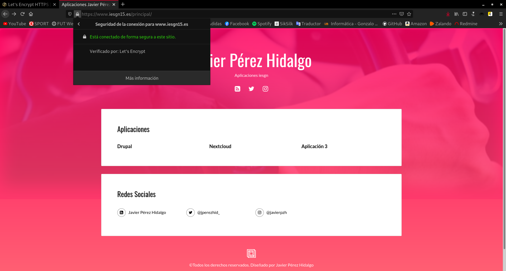
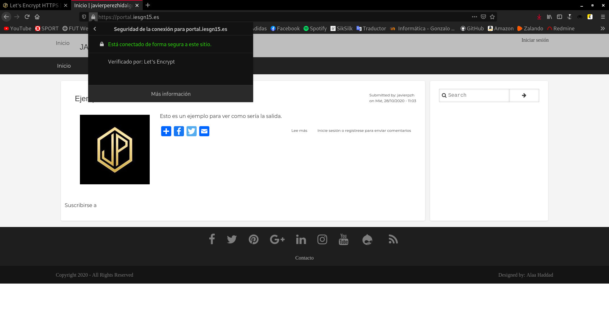
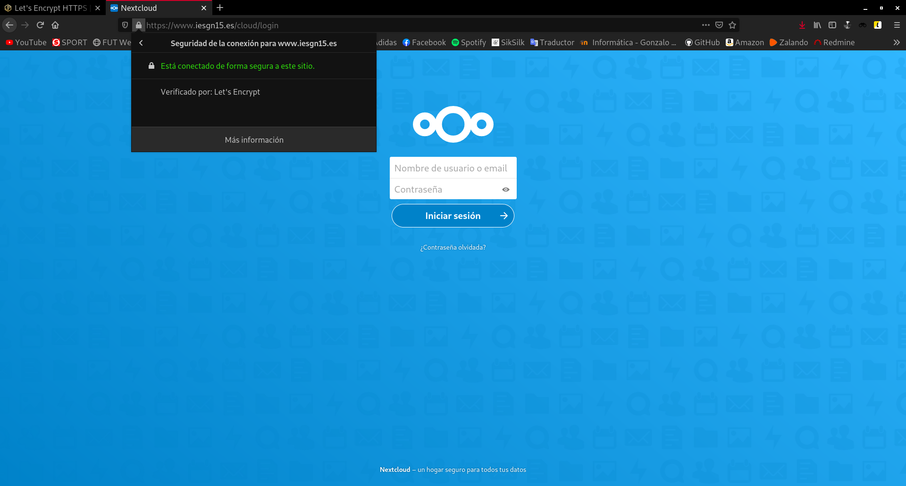
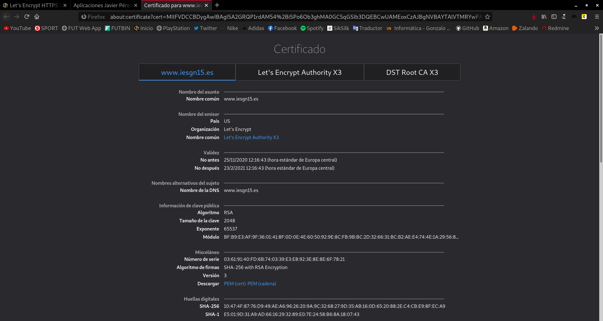
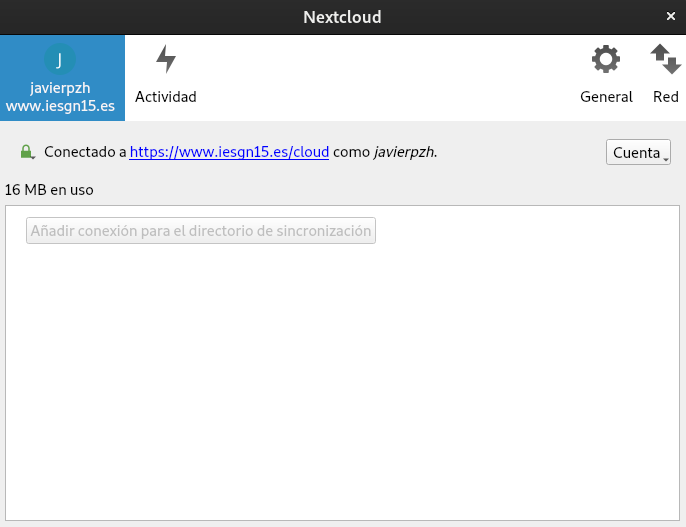

Title: Let's Encrypt HTTPS
Date: 2020/11/30
Category: Seguridad y Alta Disponibilidad
Header_Cover: theme/images/banner-seguridad.jpg
Tags: HTTPS, Let's Encrypt

#### Vamos a configurar el protocolo HTTPS para el acceso a nuestras aplicaciones, para ello tienes que tener en cuenta los siguiente.

**1. Vamos a utilizar el servicio `https://letsencrypt.org` para solicitar los certificados de nuestras páginas.**

Si queremos llevar a cabo la solicitud de los certificados para nuestras páginas dispongan de *HTTPS* verificado por *Let's Encryt*, tenemos que instalar el siguiente paquete:

<pre>
apt install certbot
</pre>

Como además, yo voy a hacer uso del *plugin* de *Nginx* para que **Certbot** además de solicitarnos, nos configure los ficheros de configuración de los distintos *virtualhost*, instalo este paquete:

<pre>
apt install python3-certbot-nginx
</pre>

Para solicitar el certificado y que lo instale el propio *Certbot*:

<pre>
certbot --nginx
</pre>

**2. Explica detenidamente cómo se solicita un certificado en *Let's Encrypt*. En tu explicación deberás responder a estas preguntas:**

**¿Qué función tiene el cliente ACME?**

**¿Qué configuración se realiza en el servidor web?**

**¿Qué pruebas realiza *Let's Encrypt* para asegurar que somos los administrados del sitio web?**

**¿Se puede usar el DNS para verificar que somos administradores del sitio?**

**3. Utiliza dos ficheros de configuración de *Nginx*: uno para la configuración del *virtualhost* *HTTP* y otro para la configuración del *virtualhost* *HTTPS*.**

Yo he utilizado solo un fichero de configuración para cada *virtualhost*, ya que *Nginx* te permite establecer en el mismo fichero, las configuraciones de *http* y *https*, por lo que, es una tontería crear dos ficheros si podemos utilizar uno.

Nos disponemos a pedir los certificados y a ver el proceso que nos enseña *Certbot*.

En primer lugar, voy a solicitar el certificado para la web `www.iesgn15.es`:

<pre>
root@vpsjavierpzh:/etc/nginx/sites-available# certbot --nginx
Saving debug log to /var/log/letsencrypt/letsencrypt.log
Plugins selected: Authenticator nginx, Installer nginx

Which names would you like to activate HTTPS for?
- - - - - - - - - - - - - - - - - - - - - - - - - - - - - - - - - - - - - - - -
1: portal.iesgn15.es
2: www.iesgn15.es
- - - - - - - - - - - - - - - - - - - - - - - - - - - - - - - - - - - - - - - -
Select the appropriate numbers separated by commas and/or spaces, or leave input
blank to select all options shown (Enter 'c' to cancel): 2
Cert not yet due for renewal

You have an existing certificate that has exactly the same domains or certificate name you requested and isn't close to expiry.
(ref: /etc/letsencrypt/renewal/www.iesgn15.es.conf)

What would you like to do?
- - - - - - - - - - - - - - - - - - - - - - - - - - - - - - - - - - - - - - - -
1: Attempt to reinstall this existing certificate
2: Renew & replace the cert (limit ~5 per 7 days)
- - - - - - - - - - - - - - - - - - - - - - - - - - - - - - - - - - - - - - - -
Select the appropriate number [1-2] then [enter] (press 'c' to cancel): 1
Keeping the existing certificate
Deploying Certificate to VirtualHost /etc/nginx/sites-enabled/aplicacionesiesgn.conf

Please choose whether or not to redirect HTTP traffic to HTTPS, removing HTTP access.
- - - - - - - - - - - - - - - - - - - - - - - - - - - - - - - - - - - - - - - -
1: No redirect - Make no further changes to the webserver configuration.
2: Redirect - Make all requests redirect to secure HTTPS access. Choose this for
new sites, or if you're confident your site works on HTTPS. You can undo this
change by editing your web server's configuration.
- - - - - - - - - - - - - - - - - - - - - - - - - - - - - - - - - - - - - - - -
Select the appropriate number [1-2] then [enter] (press 'c' to cancel): 2
Redirecting all traffic on port 80 to ssl in /etc/nginx/sites-enabled/aplicacionesiesgn.conf

- - - - - - - - - - - - - - - - - - - - - - - - - - - - - - - - - - - - - - - -
Congratulations! You have successfully enabled https://www.iesgn15.es

You should test your configuration at:
https://www.ssllabs.com/ssltest/analyze.html?d=www.iesgn15.es
- - - - - - - - - - - - - - - - - - - - - - - - - - - - - - - - - - - - - - - -

IMPORTANT NOTES:
 - Congratulations! Your certificate and chain have been saved at:
   /etc/letsencrypt/live/www.iesgn15.es/fullchain.pem
   Your key file has been saved at:
   /etc/letsencrypt/live/www.iesgn15.es/privkey.pem
   Your cert will expire on 2021-02-23. To obtain a new or tweaked
   version of this certificate in the future, simply run certbot again
   with the "certonly" option. To non-interactively renew *all* of
   your certificates, run "certbot renew"
 - If you like Certbot, please consider supporting our work by:

   Donating to ISRG / Let's Encrypt:   https://letsencrypt.org/donate
   Donating to EFF:                    https://eff.org/donate-le

root@vpsjavierpzh:/etc/nginx/sites-available#
</pre>

Vemos que a la hora de ejecutar el comando, nos identifica todos los *virtualhost* que poseemos, y tan solo tenemos que seleccionar para cual queremos el certificado. Acto seguido, nos pregunta si queremos que el certificado se renueve de manera automática, también nos pregunta si queremos que el propio *Certbot* nos realice toda la configuración en el fichero de configuración del *virtualhost*.

De nuevo realizo el mismo proceso, esta vez para el *virtualhost* `portal.iesgn15.es`:

<pre>
root@vpsjavierpzh:/etc/nginx/sites-available# certbot --nginx
Saving debug log to /var/log/letsencrypt/letsencrypt.log
Plugins selected: Authenticator nginx, Installer nginx

Which names would you like to activate HTTPS for?
- - - - - - - - - - - - - - - - - - - - - - - - - - - - - - - - - - - - - - - -
1: portal.iesgn15.es
2: www.iesgn15.es
- - - - - - - - - - - - - - - - - - - - - - - - - - - - - - - - - - - - - - - -
Select the appropriate numbers separated by commas and/or spaces, or leave input
blank to select all options shown (Enter 'c' to cancel): 1
Obtaining a new certificate
Performing the following challenges:
http-01 challenge for portal.iesgn15.es
Waiting for verification...
Cleaning up challenges
Deploying Certificate to VirtualHost /etc/nginx/sites-enabled/drupal.conf

Please choose whether or not to redirect HTTP traffic to HTTPS, removing HTTP access.
- - - - - - - - - - - - - - - - - - - - - - - - - - - - - - - - - - - - - - - -
1: No redirect - Make no further changes to the webserver configuration.
2: Redirect - Make all requests redirect to secure HTTPS access. Choose this for
new sites, or if you're confident your site works on HTTPS. You can undo this
change by editing your web server's configuration.
- - - - - - - - - - - - - - - - - - - - - - - - - - - - - - - - - - - - - - - -
Select the appropriate number [1-2] then [enter] (press 'c' to cancel): 2
Redirecting all traffic on port 80 to ssl in /etc/nginx/sites-enabled/drupal.conf

- - - - - - - - - - - - - - - - - - - - - - - - - - - - - - - - - - - - - - - -
Congratulations! You have successfully enabled https://portal.iesgn15.es

You should test your configuration at:
https://www.ssllabs.com/ssltest/analyze.html?d=portal.iesgn15.es
- - - - - - - - - - - - - - - - - - - - - - - - - - - - - - - - - - - - - - - -

IMPORTANT NOTES:
 - Congratulations! Your certificate and chain have been saved at:
   /etc/letsencrypt/live/portal.iesgn15.es/fullchain.pem
   Your key file has been saved at:
   /etc/letsencrypt/live/portal.iesgn15.es/privkey.pem
   Your cert will expire on 2021-02-23. To obtain a new or tweaked
   version of this certificate in the future, simply run certbot again
   with the "certonly" option. To non-interactively renew *all* of
   your certificates, run "certbot renew"
 - If you like Certbot, please consider supporting our work by:

   Donating to ISRG / Let's Encrypt:   https://letsencrypt.org/donate
   Donating to EFF:                    https://eff.org/donate-le

root@vpsjavierpzh:/etc/nginx/sites-available#
</pre>

**4. Realiza una redirección o una reescritura para que cuando accedas a *HTTP* te redirija al sitio *HTTPS*.**

Al escoger el *plugin* de *Nginx*, el propio **Certbot** te pregunta si quieres que también te cree la redirección permanente para que siempre se acceda a la página por *HTTPS*. Vamos a echarle un vistazo a las líneas que configura. Al final de nuestro fichero de configuración del *virtualhost* ha añadido:

<pre>
...

listen [::]:443 ssl ipv6only=on; # managed by Certbot
listen 443 ssl; # managed by Certbot
ssl_certificate /etc/letsencrypt/live/www.iesgn15.es/fullchain.pem; # managed by Certbot
ssl_certificate_key /etc/letsencrypt/live/www.iesgn15.es/privkey.pem; # managed by Certbot
include /etc/letsencrypt/options-ssl-nginx.conf; # managed by Certbot
ssl_dhparam /etc/letsencrypt/ssl-dhparams.pem; # managed by Certbot

}

server {
  if ($host = www.iesgn15.es) {
      return 301 https://$host$request_uri;
  } # managed by Certbot

      listen 80;
      listen [::]:80;

    server_name www.iesgn15.es;
  return 404; # managed by Certbot

}
</pre>

Podemos ver como automáticamente, nos ha añadido las líneas que nos establecen la configuración de los certificados y nos ha creado la redirección hacia *HTTPS*.

**5. Comprueba que se ha creado una tarea *cron* que renueva el certificado cada 3 meses.**

**6. Comprueba que las páginas son accesible por *HTTPS* y visualiza los detalles del certificado que has creado.**

Accedemos a `www.iesgn15.es`:

Accedemos a `portal.iesgn15.es`:

Accedemos a `www.iesgn15.es/cloud`, que es la dirección de la aplicación *Nextcloud*:

Si vemos los detalles del certificado:

**7. Modifica la configuración del cliente de *Nextcloud* para comprobar que sigue en funcionamiento con *HTTPS*.**

Nos dirigimos ahora a nuestro cliente de *Nextcloud*, que recordemos que está configurado para la dirección `http://www.iesgn15.es/cloud`:

Vemos como a pesar de no estar configurado para que use *HTTPS*, nos redirige automáticamente gracias a la redirección permanente que hemos creado, por tanto no haría falta volver a configurarlo.

#### Recursos interesantes

- [¿Qué es Let’s Encrypt y como configurarlo?](https://medium.com/@alonsus91/que-es-lets-encrypt-y-como-configurarlo-dae155f62a57)

- [¿Cómo funciona Let's Encrypt?](https://letsencrypt.org/es/how-it-works/)
