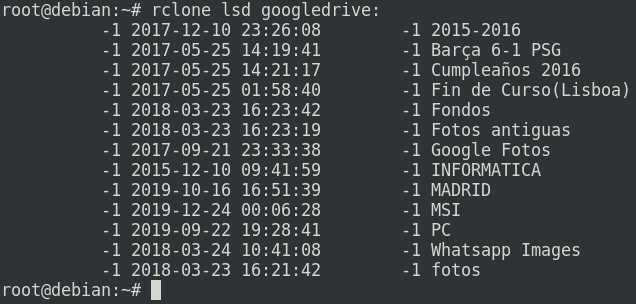
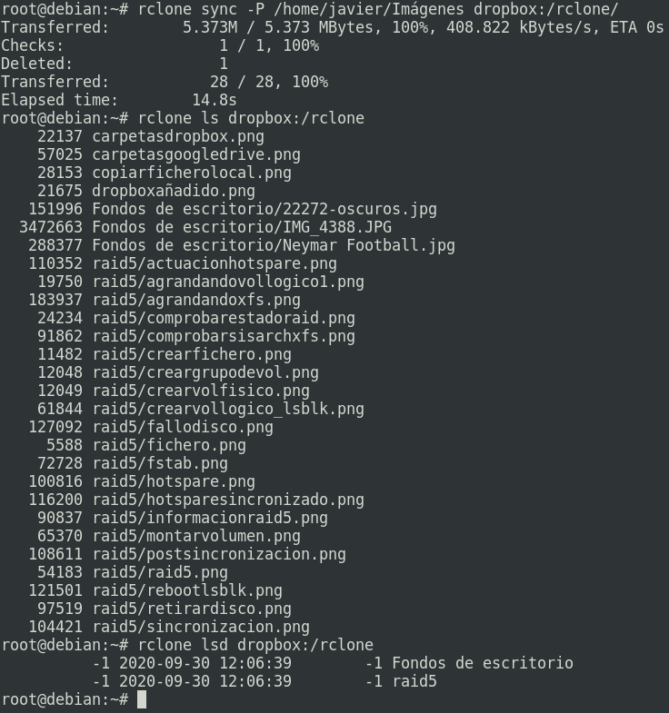
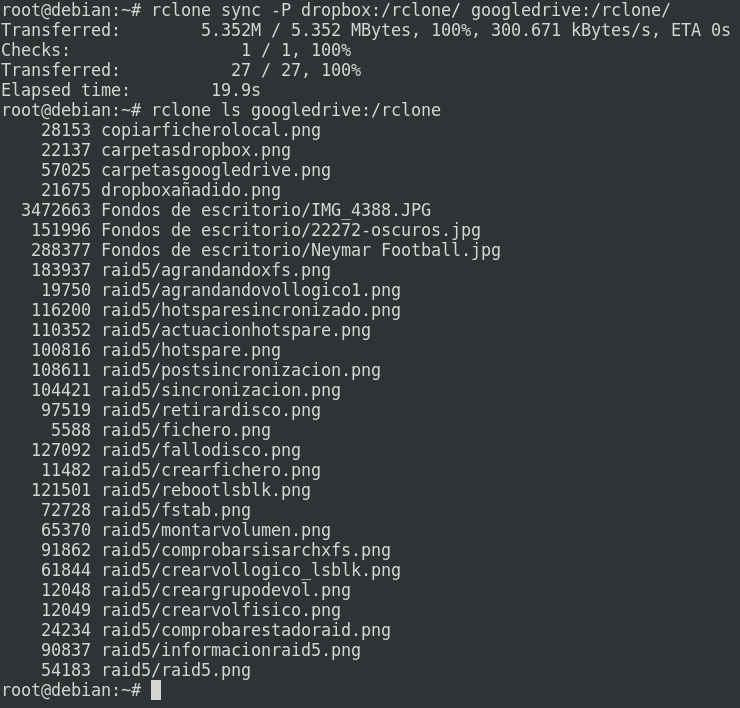
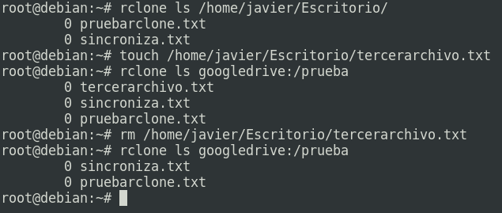

Title: rclone - Gestionando nuestro almacenamiento en la nube
Date: 2020/09/30
Category: Seguridad y Alta Disponibilidad

## rclone

**Tarea 1: Instala rclone en tu equipo.**

Antes de nada tenemos que instalar rclone en la máquina en la que vayamos a utilizarlo. Es un paquete que está disponible en los repositorios de Debian por tanto podemos instalarlo con el comando:
<pre>
apt update && apt install rclone
</pre>
Aunque hay que decir que la última versión disponible por este método es la 1.45 ,  la cual se lanzó en noviembre de 2018, y actualmente va por la 1.53, la cuál podemos descargar desde la página oficial, con el siguiente comando:
<pre>
curl https://rclone.org/install.sh | sudo bash
</pre>

**Tarea 2: Configura dos proveedores cloud en rclone (dropbox, google drive, mega, …)**

En mi caso utilizo desde que empecé a estudiar Dropbox, en el cuál tengo una carpeta sincronizada en la cuál todo lo que modifico, añado o elimino se sincroniza de manera automática, lo cuál es bastante cómodo al trabajar por ejemplo con Windows y Linux, o diferentes ordenadores, ...
También utilizo bastante Google Drive. Con estos datos, obviamente quiero decir que los dos proveedores que voy a configurar son Dropbox y Google Drive.

En primer lugar voy a configurar Dropbox. Para ello empleamos los siguientes comandos y realizamos la siguiente configuración:
<pre>
root@debian:~# rclone config
2020/09/29 19:34:15 NOTICE: Config file "/root/.config/rclone/rclone.conf" not found - using defaults
No remotes found - make a new one
n) New remote
s) Set configuration password
q) Quit config
n/s/q> n
name> dropbox
Type of storage to configure.
Enter a string value. Press Enter for the default ("").
Choose a number from below, or type in your own value
Storage> 9
** See help for dropbox backend at: https://rclone.org/dropbox/ **

OAuth Client Id
Leave blank normally.
Enter a string value. Press Enter for the default ("").
client_id>
OAuth Client Secret
Leave blank normally.
Enter a string value. Press Enter for the default ("").
client_secret>
Edit advanced config? (y/n)
y) Yes
n) No (default)
y/n> n
Remote config
Use auto config?
 * Say Y if not sure
 * Say N if you are working on a remote or headless machine
y) Yes (default)
n) No
y/n> n
For this to work, you will need rclone available on a machine that has
a web browser available.

For more help and alternate methods see: https://rclone.org/remote_setup/

Execute the following on the machine with the web browser (same rclone
version recommended):

	rclone authorize "dropbox"

Then paste the result below:
result>
</pre>
En este paso tenemos que abrir una nueva terminal y escribir el comando que nos ha indicado arriba ' rclone authorize "dropbox" ':
<pre>
root@debian:~# rclone authorize "dropbox"
2020/09/29 19:36:03 NOTICE: Config file "/root/.config/rclone/rclone.conf" not found - using defaults
If your browser doesn't open automatically go to the following link: http://127.0.0.1:53682/auth?state=tGMEKVLneaa4eg8SHGzrMw
Log in and authorize rclone for access
Waiting for code...
</pre>

Si nos fijamos la última línea nos indica que está esperando un código, automáticamente se nos abrirá en el navegador una página para iniciar sesión en Dropbox con permiso de rclone, nos logueamos y en la página de la terminal ya nos habrá generado un código que tenemos que copiar y pegar en la terminal donde estamos realizando la configuración de Dropbox con rclone.
Una vez generado el código la terminal luciría así:
<pre>
root@debian:~# rclone authorize "dropbox"
2020/09/29 19:36:03 NOTICE: Config file "/root/.config/rclone/rclone.conf" not found - using defaults
If your browser doesn't open automatically go to the following link: http://127.0.0.1:53682/auth?state=tGMEKVLneaa4eg8SHGzrMw
Log in and authorize rclone for access
Waiting for code...
Got code
Paste the following into your remote machine --->
{"access_token":"a2-EeF0YTd8AAAAAAAAAAS3zdBk96GXdolhFVbz1kcHOudSwcTE5FKfKWKNIsOoj","token_type":"bearer","expiry":"0001-01-01T00:00:00Z"}
<---End paste
root@debian:~#
</pre>
Ahora volvemos a la terminal original y copiamos el código y este sería el resultado final:
<pre>
result> {"access_token":"a2-EeF0YTd8AAAAAAAAAAS3zdBk96GXdolhFVbz1kcHOudSwcTE5FKfKWKNIsOoj","token_type":"bearer","expiry":"0001-01-01T00:00:00Z"}
--------------------
[dropbox]
type = dropbox
token = {"access_token":"a2-EeF0YTd8AAAAAAAAAAS3zdBk96GXdolhFVbz1kcHOudSwcTE5FKfKWKNIsOoj","token_type":"bearer","expiry":"0001-01-01T00:00:00Z"}
--------------------
y) Yes this is OK (default)
e) Edit this remote
d) Delete this remote
y/e/d> y
Current remotes:

Name                 Type
====                 ====
dropbox              dropbox

e) Edit existing remote
n) New remote
d) Delete remote
r) Rename remote
c) Copy remote
s) Set configuration password
q) Quit config
e/n/d/r/c/s/q>
</pre>

Ya tenemos Dropbox configurado con nuestra cuenta, ahora vamos a configurar Google Drive que en mi caso es el que me interesa más.
<pre>
root@debian:~# rclone config
Current remotes:

Name                 Type
====                 ====
dropbox              dropbox

e) Edit existing remote
n) New remote
d) Delete remote
r) Rename remote
c) Copy remote
s) Set configuration password
q) Quit config
e/n/d/r/c/s/q> n
name> googledrive
Type of storage to configure.
Enter a string value. Press Enter for the default ("").
Choose a number from below, or type in your own value
Storage> 13
** See help for drive backend at: https://rclone.org/drive/ **

Google Application Client Id
Setting your own is recommended.
See https://rclone.org/drive/#making-your-own-client-id for how to create your own.
If you leave this blank, it will use an internal key which is low performance.
Enter a string value. Press Enter for the default ("").
client_id>
OAuth Client Secret
Leave blank normally.
Enter a string value. Press Enter for the default ("").
client_secret>
Scope that rclone should use when requesting access from drive.
Enter a string value. Press Enter for the default ("").
Choose a number from below, or type in your own value
</pre>
Aquí debemos seleccionar una de las 5 opciones, esto afectará a los permisos que queremos tener de nuestra cuenta. Yo introduzco la opción 1 que otorga todos los permisos.
<pre>
scope> 1
ID of the root folder
Leave blank normally.

Fill in to access "Computers" folders (see docs), or for rclone to use
a non root folder as its starting point.

Enter a string value. Press Enter for the default ("").
root_folder_id>
Service Account Credentials JSON file path
Leave blank normally.
Needed only if you want use SA instead of interactive login.

Leading `~` will be expanded in the file name as will environment variables such as `${RCLONE_CONFIG_DIR}`.

Enter a string value. Press Enter for the default ("").
service_account_file>
Edit advanced config? (y/n)
y) Yes
n) No (default)
y/n> n
Remote config
Use auto config?
 * Say Y if not sure
 * Say N if you are working on a remote or headless machine
y) Yes (default)
n) No
y/n> y
If your browser doesn't open automatically go to the following link: http://127.0.0.1:53682/auth?state=5IOLvTa_0Sz511k2324bDg
Log in and authorize rclone for access
Waiting for code...
</pre>
Aquí se nos abre la página de validación en el navegador, nos logueamos y aceptamos que rclone acceda. Si no se abre automáticamente abrimos el link que aparece arriba y listo. Una vez que nos logueamos nos genera un código que se pega de manera automática.
<pre>
Got code
Configure this as a team drive?
y) Yes
n) No (default)
y/n> n
--------------------
[googledrive]
type = drive
scope = drive
token = {"access_token":"ya29.a0AfH6SMCd4Ny-Bioq7SWiq-fH3Ry2eHxMG5VHTFRs1V07yU24abdjHdzBt-D3tO0VO1oPhi0k7fd_C1nRQk4jDO-Q4sLAFm3Q-STmaVKYD7yl-OlaNS81z_FaLWFkQ-QCObB4C1CrafkEP5gZItEY8hmDDPAGsIfA1t0","token_type":"Bearer","refresh_token":"1//03GstGTBtqHJcCgYIARAAGAMSNwF-L9IrRZdXmUfL9PGlvKxCxlyMkQfS_nGMfkWiZl_qwxsdl3bm58o6yz-BT6ngoD-9-dpi7S8","expiry":"2020-09-30T12:32:26.112115058+02:00"}
--------------------
y) Yes this is OK (default)
e) Edit this remote
d) Delete this remote
y/e/d> y
Current remotes:

Name                 Type
====                 ====
dropbox              dropbox
googledrive          drive

e) Edit existing remote
n) New remote
d) Delete remote
r) Rename remote
c) Copy remote
s) Set configuration password
q) Quit config
e/n/d/r/c/s/q> q
root@debian:~#
</pre>

Hemos terminado de configurar nuestra cuenta de Google Drive, por tanto ya tenemos los dos proveedores que queríamos.

**Tarea 3: Muestra distintos comandos de rclone para gestionar los ficheros de los proveedores cloud: lista los ficheros, copia un fichero local a la nube, sincroniza un directorio local con un directorio en la nube, copia ficheros entre los dos proveedores cloud, muestra alguna funcionalidad más,…**

A continuación voy a mostrar algunos de los comando más comunes de rclone.
Podemos listar todos los archivos que tenemos en ambas nubes, con estos comandos:
<pre>
rclone ls dropbox:
</pre>
<pre>
rclone ls googledrive:
</pre>
También podemos listar las carpetas, algo que es mucho más legible:
<pre>
rclone lsd dropbox:
</pre>

<pre>
rclone lsd googledrive:
</pre>

Para copiar un fichero local a la nube:
<pre>
rclone copy /home/javier/Escritorio/pruebarclone.txt dropbox:/rclone/
</pre>
Si quisiéramos copiar un fichero de la nube a local, simplemente ponemos la ruta del fichero en la nube en primer lugar, seguido del directorio local.
Aquí muestro como creo el fichero 'pruebarclone.txt' y justo después lo añado a mi carpeta rclone de Dropbox:

Para sincronizar un directorio local con la nube, utilizamos el siguiente comando:
<pre>
rclone sync -P /home/javier/Imágenes dropbox:/rclone/
</pre>
Hay que decir que la opción 'sync' modifica únicamente el destino.
Aquí podemos apreciar como se han sincronizado todos los datos.

Ahora vamos a ver como se copian ficheros entre los dos proveedores cloud que hemos configurado. Por ejemplo, vamos a copiar el archivo png 'carpetasdropbox.png' que es una imagen, a la carpeta rclone de Google Drive (esta carpeta no existe, por tanto la vamos a crear también):
<pre>
rclone mkdir googledrive:/rclone
</pre>
<pre>
rclone copy dropbox:/rclone/carpetasdropbox.png googledrive:/rclone
</pre>

Aquí podemos ver como efectivamente hemos copiado la imagen de Dropbox a Google Drive.

También podemos sincronizar una carpeta de Dropbox con una de Google Drive. Voy a sincronizar las carpetas /rclone de ambas nubes:
<pre>
rclone sync -P dropbox:/rclone/ googledrive:/rclone/
</pre>

**Tarea 4: Monta en un directorio local de tu ordenador, los ficheros de un proveedor cloud. Comprueba que copiando o borrando ficheros en este directorio se crean o eliminan en el proveedor.**

Voy a montar la carpeta 'prueba' de mi Google Drive en mi escritorio, para ello:
<pre>
rclone mount --allow-non-empty googledrive:/prueba/ /home/javier/Escritorio/
</pre>

Ahora mismo en esa terminal se queda ejecutándose ese proceso y hace que la carpeta 'prueba' se monte en mi escritorio local y se sincronicen automáticamente. Lo podemos ver en la siguiente imagen, en la que hago cambios en local y en remoto y lo compruebo.

