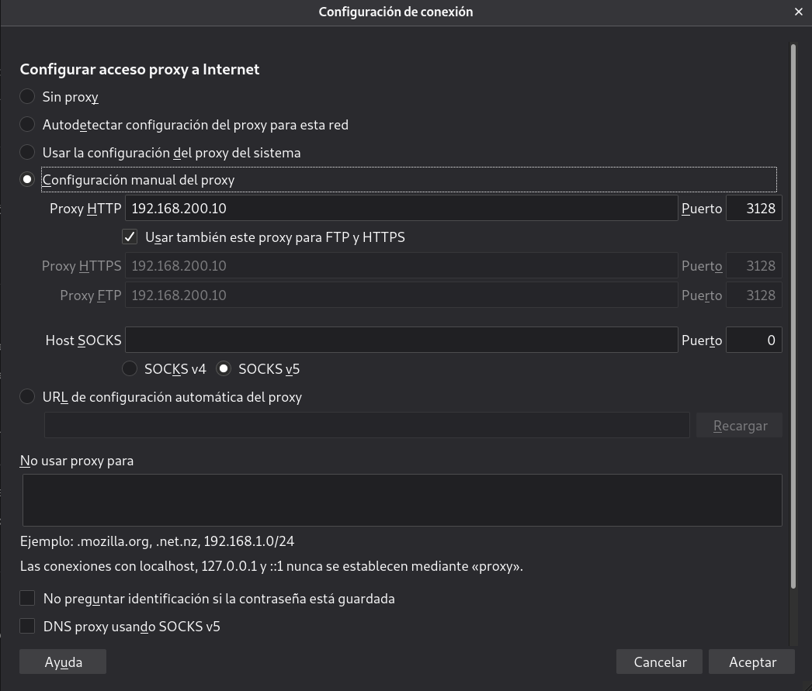
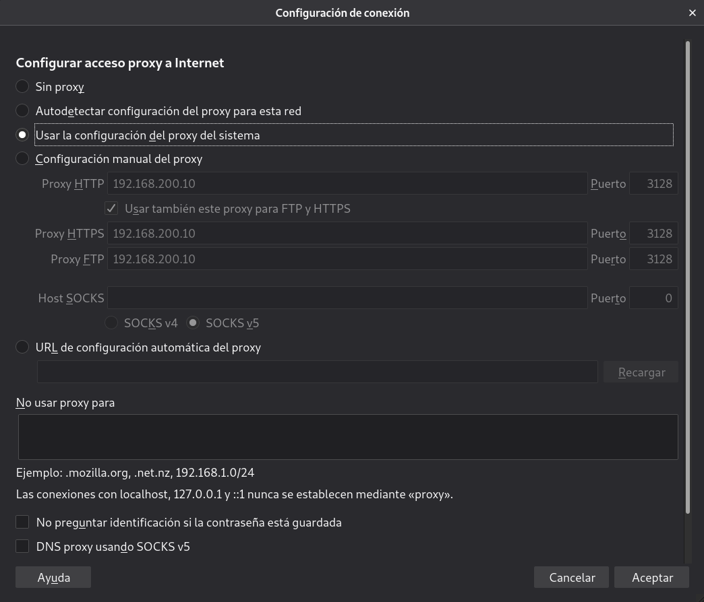

Title: Proxy, proxy inverso y balanceador de carga
Date: 2018/02/21
Category: Servicios de Red e Internet
Header_Cover: theme/images/banner-servicios.jpg
Tags: Proxy, Proxy inverso, Balanceador de carga, Squid

- Tarea 1: Instala squid en la máquina squid y configúralo para que permita conexiones desde la red donde este tu ordenador.

- Tarea 2: Prueba que tu ordenador está navegando a través del proxy (HTTP/HTTPS) configurando el proxy de dos maneras diferentes:

    - Directamente indicándolo en el navegador.

    - Configurando el proxy del sistema en el entorno gráfico (tienes que indicar en el navegador que vas a hacer uso del proxy del sistema).

Muestra el contenido del fichero `/var/log/squid/access.log` para comprobar que está funcionando el proxy.

- Tarea 3: Configura squid para que pueda ser utilizado desde el cliente interno. En el cliente interno configura el proxy desde la línea de comandos (con una variable de entorno). Fíjate que no hemos puesto ninguna regla SNAT y podemos navegar (protocolo HTTP), pero no podemos hacer ping o utilizar otro servicio.

- Tarea 4: Con squid podemos filtrar el acceso por url o dominios, realiza las configuraciones necesarias para implementar un filtro que funcione como lista negra (todo el acceso es permitido menos las url o dominios que indiquemos en un fichero.)

- Tarea 5: Realiza las configuraciones necesarias para implementar un filtro que funcione como lista blanca (todo el acceso es denegado menos las url o dominios que indiquemos en un fichero.)

--------------------------------------------------------------------------------

## Proxy

En este artículo vamos a instalar un *proxy* **Squid** para configurar nuestro cliente para que acceda a internet por medio de este *proxy*.

El escenario en el que vamos a trabajar, está definido en este [Vagrantfile](images/sri_Proxy_ProxyInverso_y_Balanceador_de_Carga/Vagrantfile.txt).

En primer lugar, vamos a llevar a cabo la instalación de *Squid* en la primera máquina llamada *proxy*. Para ello empleamos el siguiente comando:

<pre>
apt install squid -y
</pre>

Y lo iniciaremos, además de habilitarlo en cada inicio del sistema:

<pre>
systemctl enable squid && systemctl start squid
</pre>

Una vez instalado, tendremos que llevar a cabo su configuración. En mi caso, me interesa que *Squid* permita conexiones desde mi red local. Por defecto, escuchará peticiones en el puerto **3128**. Para que no permita conexiones desde cualquier dirección, nos dirigiremos a su fichero de configuración `/etc/squid/squid.conf` y en él debemos buscar la siguiente línea:

<pre>
http_access deny all
</pre>

Puede ser que nos la encontramos con el siguiente aspecto:

<pre>
http_access allow all
</pre>

Si el valor establecido es *allow* significará que permitirá conexiones desde cualquier interfaz de red.

También debemos asegurarnos que las siguientes líneas estén habilitadas, es decir, que no se encuentren comentadas:

<pre>
http_access allow localnet
http_access allow localhost
</pre>

Comprobado estos detalles, añadiremos la siguiente línea:

<pre>
acl localnet src 172.22.9.28
</pre>

Esta línea se encarga de definir una ACL que permitirá a la IP indicada la conexión a nuestro *proxy*.

Es muy **importante** añadir la línea junto a este bloque de ACLs, ya que el orden de las configuraciones influye:

<pre>
acl localnet src 0.0.0.1-0.255.255.255  # RFC 1122 "this" network (LAN)
acl localnet src 10.0.0.0/8             # RFC 1918 local private network (LAN)
acl localnet src 100.64.0.0/10          # RFC 6598 shared address space (CGN)
acl localnet src 169.254.0.0/16         # RFC 3927 link-local (directly plugged) machines
acl localnet src 172.16.0.0/12          # RFC 1918 local private network (LAN)
acl localnet src 192.168.0.0/16         # RFC 1918 local private network (LAN)
acl localnet src fc00::/7               # RFC 4193 local private network range
acl localnet src fe80::/10              # RFC 4291 link-local (directly plugged) machines

acl localnet src 172.22.9.28

acl SSL_ports port 443
acl Safe_ports port 80          # http
acl Safe_ports port 21          # ftp
acl Safe_ports port 443         # https
acl Safe_ports port 70          # gopher
acl Safe_ports port 210         # wais
acl Safe_ports port 1025-65535  # unregistered ports
acl Safe_ports port 280         # http-mgmt
acl Safe_ports port 488         # gss-http
acl Safe_ports port 591         # filemaker
acl Safe_ports port 777         # multiling http
acl CONNECT method CONNECT
</pre>

Hecho esto, reiniciaremos el servicio:

<pre>
systemctl restart squid
</pre>

Antes de dirigirnos a nuestro navegador para establecer el nuevo *proxy*, en la terminal, dejaremos el siguiente proceso activo para ver a tiempo real los *logs* de acceso al *proxy*:

<pre>
tail -f /var/log/squid/access.log
</pre>

Para configurar el *proxy* en nuestro navegador, en mi caso, explicaré como es el proceso en **Firefox**, nos dirigimos a **Preferencias**, y en el apartado **General**, al final nos aparece una sección llamada **Configuración de red**, dentro de su configuración podremos establecer manualmente nuestro *proxy*.ç

Establecido el *proxy* vamos a probar a acceder a diferentes webs como pueden ser [https://javierpzh.github.io/](https://javierpzh.github.io/), [https://www.youtube.com](https://www.youtube.com) y [https://www.google.com/](https://www.google.com/).

Una vez comprobamos que podemos acceder correctamente, vamos a revisar el proceso que dejamos en ejecución en nuestra terminal:

<pre>
root@proxy:~# tail -f /var/log/squid/access.log
1613985923.460     12 192.168.200.1 TCP_TUNNEL/200 39 CONNECT fonts.googleapis.com:443 - HIER_DIRECT/142.250.184.170 -
1613985923.466     19 192.168.200.1 TCP_TUNNEL/200 39 CONNECT fonts.googleapis.com:443 - HIER_DIRECT/142.250.184.170 -
1613985923.479     32 192.168.200.1 TCP_TUNNEL/200 39 CONNECT maxcdn.bootstrapcdn.com:443 - HIER_DIRECT/209.197.3.15 -
1613985923.511      0 192.168.200.1 NONE/000 0 NONE error:transaction-end-before-headers - HIER_NONE/- -
1613985923.521     10 192.168.200.1 TCP_TUNNEL/200 39 CONNECT fonts.gstatic.com:443 - HIER_DIRECT/216.58.211.227 -
1613985923.521     11 192.168.200.1 TCP_TUNNEL/200 39 CONNECT fonts.gstatic.com:443 - HIER_DIRECT/216.58.211.227 -
1613985926.218     98 192.168.200.1 TCP_TUNNEL/200 5461 CONNECT fonts.googleapis.com:443 - HIER_DIRECT/142.250.184.170 -
1613985926.221    102 192.168.200.1 TCP_TUNNEL/200 5121 CONNECT fonts.googleapis.com:443 - HIER_DIRECT/142.250.184.170 -
1613985926.785     10 192.168.200.1 TCP_TUNNEL/200 39 CONNECT fonts.gstatic.com:443 - HIER_DIRECT/216.58.211.227 -
1613985926.880     18 192.168.200.1 TCP_TUNNEL/200 39 CONNECT lh3.googleusercontent.com:443 - HIER_DIRECT/142.250.184.1 -
1613985928.513    170 192.168.200.1 TCP_TUNNEL/200 10059 CONNECT yt3.ggpht.com:443 - HIER_DIRECT/142.250.184.1 -
1613985932.983     17 192.168.200.1 TCP_TUNNEL/200 39 CONNECT lh3.googleusercontent.com:443 - HIER_DIRECT/142.250.184.1 -
1613985932.987     21 192.168.200.1 TCP_TUNNEL/200 39 CONNECT ssl.gstatic.com:443 - HIER_DIRECT/216.58.215.131 -
1613985932.987     21 192.168.200.1 TCP_TUNNEL/200 39 CONNECT fonts.gstatic.com:443 - HIER_DIRECT/216.58.211.227 -
</pre>

Vemos como nos muestra los *logs* referentes a los accesos que acabamos de realizar.

Ahora, vamos a dirigirnos de nuevo a la configuración del navegador, a la parte de la configuración del *proxy* e indicaremos que use la configuración *proxy* del sistema.

.
