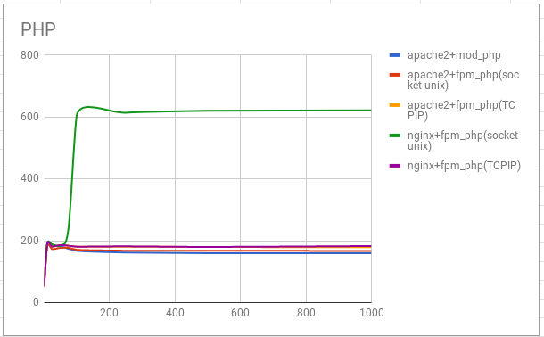

Title: Aumento de rendimiento de servidores web con Varnish
Date: 2018/02/22
Category: Servicios de Red e Internet
Header_Cover: theme/images/banner-servicios.jpg
Tags: Nginx, PHP_FPM, Varnish

En este artículo vamos a ver como podemos aumentar el rendimiento de nuestro servidor web con **Varnish**.

Para ello, antes, vamos a comparar el rendimiento de distintas configuraciones de servidores web sirviendo páginas dinámicas programadas con *PHP*, en concreto, vamos a servir un *CMS Wordpress*.

Las configuraciones que vamos a realizar son las siguientes:

- Módulo Apache2-PHP5
- Apache2 + PHP-FPM (socket unix)
- Apache2 + PHP-FPM (socket TCP)
- Nginx + PHP-FPM (socket unix)
- Nginx + PHP-FPM (socket TCP)

Para cada una de las configuraciones he hecho una prueba de rendimiento con el comando `ab`, por ejemplo, durante 10 segundos, he hecho 200 peticiones concurrentes.

<pre>
ab -t 10 -c 200 -k http://172.22.x.x/wordpress/index.php
</pre>

Después de hacer muchas pruebas de rendimiento con un número variable de peticiones concurrentes (1, 10, 25, 50, 75, 100, 250, 500, 1000) y distintas direcciones del *Wordpress*, los resultados obtenidos son los siguientes:

**NOTA:** No es importante el número concreto de peticiones/segundo. Puede variar por muchas razones, como pueden ser:

- Desde donde haga las pruebas (no es lo mismo hacerlas desde *localhost*, o desde una máquina en la misma red, o desde internet).
- El estado del servidor, que recursos tenga libre,...

Lo importante es calcular una media intentando hacer las pruebas en un escenario lo más similar posible (por eso después de realizar cada prueba es recomendable reiniciar los servicios).

Podemos determinar que la opción que nos ofrece más rendimiento es **Nginx + PHP-FPM (socket unix)**, cuyo resultado es aproximadamente unas 600 peticiones/segundo (parámetro *Requests per second* de `ab`).

A partir de esa configuración vamos a intentar aumentar el rendimiento de nuestro servidor.

Para ello vamos a llevar a cabo los siguientes apartados:

**1. Vamos a configurar una máquina con la configuración ganadora: Nginx + PHP-FPM (socket unix). Para ello ejecuta la receta *ansible* que encontraras en [este repositorio](https://github.com/josedom24/ansible_nginx_fpm_php). Accede al *Wordpress* y termina la configuración del sitio.**

Comenzaremos clonando el repositorio en nuestro sistema:

<pre>
javier@debian:~/Ansible$ git clone https://github.com/josedom24/ansible_nginx_fpm_php.git
Clonando en 'ansible_nginx_fpm_php'...
remote: Enumerating objects: 40, done.
remote: Counting objects: 100% (40/40), done.
remote: Compressing objects: 100% (27/27), done.
remote: Total 40 (delta 0), reused 36 (delta 0), pack-reused 0
Desempaquetando objetos: 100% (40/40), listo.

javier@debian:~/Ansible$ cd ansible_nginx_fpm_php/

javier@debian:~/Ansible/ansible_nginx_fpm_php$ ls
ansible.cfg  group_vars  hosts  LICENSE  README.md  roles  site.retry  site.yaml
</pre>

En mi caso, he tenido que modificar el fichero `ansible.cfg` ya que voy a utilizar como equipo auxiliar una máquina construida en *Vagrant* y dichas máquinas no se crean con un usuario llamado *debian*, sino *vagrant*. Además de esta modificación, he editado el fichero `hosts` y en él he indicado la dirección IP correcta, es decir, la IP de dicha máquina *Vagrant*. Realizados estos cambios, vamos a ejecutar la receta de *Ansible*:

<pre>
javier@debian:~/Ansible/ansible_nginx_fpm_php$ ansible-playbook site.yaml

PLAY [servidores_web] **********************************************************************************

TASK [Gathering Facts] *********************************************************************************
ok: [nodo1]

TASK [nginx : install nginx, php-fpm] ******************************************************************
changed: [nodo1]

TASK [nginx : Copy info.php] ***************************************************************************
changed: [nodo1]

TASK [nginx : Copy virtualhost default] ****************************************************************
changed: [nodo1]

RUNNING HANDLER [nginx : restart nginx] ****************************************************************
changed: [nodo1]

PLAY [servidores_web] **********************************************************************************

TASK [Gathering Facts] *********************************************************************************
ok: [nodo1]

TASK [mariadb : ensure mariadb is installed] ***********************************************************
changed: [nodo1]

TASK [mariadb : ensure mariadb binds to internal interface] ********************************************
changed: [nodo1]

RUNNING HANDLER [mariadb : restart mariadb] ************************************************************
changed: [nodo1]

PLAY [servidores_web] **********************************************************************************

TASK [Gathering Facts] *********************************************************************************
ok: [nodo1]

TASK [wordpress : install unzip] ***********************************************************************
changed: [nodo1]

TASK [wordpress : download wordpress] ******************************************************************
changed: [nodo1]

TASK [wordpress : unzip wordpress] *********************************************************************
changed: [nodo1]

TASK [wordpress : create database wordpress] ***********************************************************
changed: [nodo1]

TASK [wordpress : create user mysql wordpress] *********************************************************
changed: [nodo1] => (item=localhost)

TASK [wordpress : copy wp-config.php] ******************************************************************
changed: [nodo1]

RUNNING HANDLER [wordpress : restart nginx] ************************************************************
changed: [nodo1]

PLAY RECAP *********************************************************************************************
nodo1                      : ok=17   changed=14   unreachable=0    failed=0
</pre>

Terminado el proceso, automáticamente tendremos listo nuestro servidor web, en la dirección IP especificada. En mi caso es la *192.168.0.35*, por lo que si me dirijo al navegador e introduzco dicha dirección me aparece la siguiente web:

Podemos ver como efectivamente se encuentra ejecutándose el servidor *Nginx*, pero, ¿se estará ejecutando el proceso adecuado para *Wordpress*? Para comprobarlo, vamos a añadir a nuestra dirección `/wordpress`:

Parece ser que también disponemos de nuestro *Wordpress*, así que vamos a terminar la instalación de esta nueva web y acceder a su panel de administración:

**2. Vamos a hacer las pruebas de rendimiento desde la misma máquina, es decir vamos a ejecutar instrucciones similares a esta:**

<pre>
ab -t 10 -c 200 -k http:/127.0.0.1/wordpress/index.php
</pre>

Realiza algunas prueba de rendimiento con varios valores distintos para el nivel de concurrencia (50,100,250,500) y apunta el resultado de peticiones/segundo (parámetro Requests per second de ab). Puedes hacer varias pruebas y quedarte con la media. Reinicia el servidor nginx y el fpm-php entre cada prueba para que los resultados sean los más reales posibles.

**3. Configura un *proxy inverso - caché Varnish* escuchando en el puerto 80 y que se comunica con el servidor web por el puerto 8080. Entrega y muestra una comprobación de que *Varnish* está funcionando con la nueva configuración. Realiza pruebas de rendimiento (quedate con el resultado del parámetro Requests per second) y comprueba si hemos aumentado el rendimiento. Si hacemos varias peticiones a la misma URL, ¿cuantas peticiones llegan al servidor web? (comprueba el fichero access.log para averiguarlo).**

.
