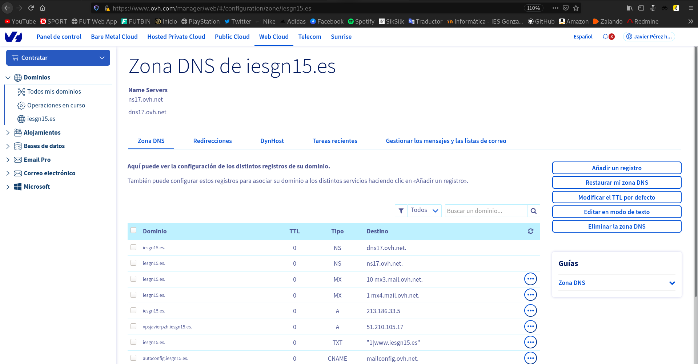
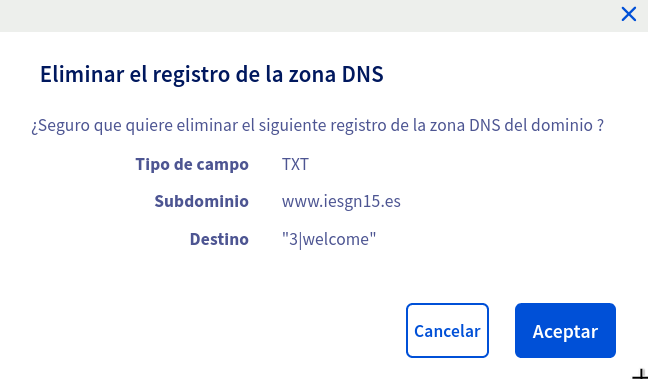
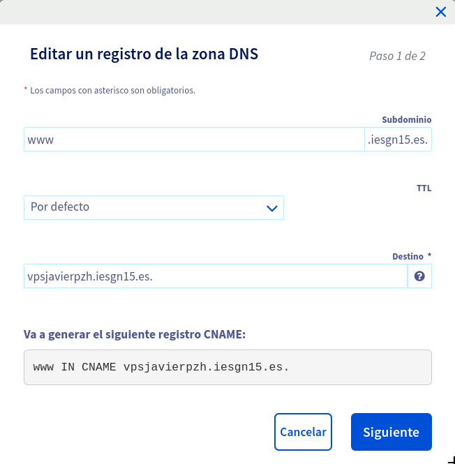

Title: Instalación de un servidor LEMP
Date: 2020/11/9
Category: Servicios de Red e Internet
Header_Cover: theme/images/banner-servicios.jpg
Tags: LEMP, Linux, Nginx, MySQL, MariaDB, PHP, OVH

## Instalación de un servidor LEMP

**Esta tarea la vamos a realizar sobre el servidor OVH**

**1. Instala un servidor web nginx**

<pre>
apt update && apt install nginx -y
</pre>

**2. Instala un servidor de base de datos MariaDB. Ejecuta el programa necesario para asegurar el servicio, ya que lo vamos a tener corriendo en el entorno de producción.**

<pre>
apt install mariadb-server mariadb-client -y
</pre>

Una vez lo hemos instalado, vamos a configurar una serie de opciones con el comando `mysql_secure_installation`. Vamos a especificarle una **contraseña de root**, vamos a **eliminar los usuarios anónimos**, vamos a **desactivar el acceso remoto** a la base de datos, en resumen, vamos a restablecer la base de datos, con nuestras preferencias. Esta es una manera de asegurar el servicio. Aquí muestro el proceso:

<pre>
root@vpsjavierpzh:~# mysql_secure_installation

NOTE: RUNNING ALL PARTS OF THIS SCRIPT IS RECOMMENDED FOR ALL MariaDB
      SERVERS IN PRODUCTION USE!  PLEASE READ EACH STEP CAREFULLY!

In order to log into MariaDB to secure it, we'll need the current
password for the root user.  If you've just installed MariaDB, and
you haven't set the root password yet, the password will be blank,
so you should just press enter here.

Enter current password for root (enter for none):
OK, successfully used password, moving on...

Setting the root password ensures that nobody can log into the MariaDB
root user without the proper authorisation.

You already have a root password set, so you can safely answer 'n'.

Change the root password? [Y/n] Y
New password:
Re-enter new password:
Password updated successfully!
Reloading privilege tables..
 ... Success!

By default, a MariaDB installation has an anonymous user, allowing anyone
to log into MariaDB without having to have a user account created for
them.  This is intended only for testing, and to make the installation
go a bit smoother.  You should remove them before moving into a
production environment.

Remove anonymous users? [Y/n] Y
 ... Success!

Normally, root should only be allowed to connect from 'localhost'.  This
ensures that someone cannot guess at the root password from the network.

Disallow root login remotely? [Y/n] Y
 ... Success!

By default, MariaDB comes with a database named 'test' that anyone can
access.  This is also intended only for testing, and should be removed
before moving into a production environment.

Remove test database and access to it? [Y/n] Y
 - Dropping test database...
 ... Success!
 - Removing privileges on test database...
 ... Success!

Reloading the privilege tables will ensure that all changes made so far
will take effect immediately.

Reload privilege tables now? [Y/n] Y
 ... Success!

Cleaning up...

All done!  If you've completed all of the above steps, your MariaDB
installation should now be secure.

Thanks for using MariaDB!
</pre>

**3. Instala un servidor de aplicaciones `php` `php-fpm`.**

<pre>
apt install php php-fpm -y
</pre>

**4. Crea un virtualhost al que vamos acceder con el nombre `www.iesgnXX.es`. Recuerda que tendrás que crear un registro `CNAME` en la zona DNS.**

Para realizar este paso, nos dirigimos a **nuestra zona DNS de OVH**:

Una vez aquí, antes de crear el nuevo registro

**5. Cuando se acceda al virtualhost por defecto `default` nos tiene que redirigir al virtualhost que hemos creado en el punto anterior.**

**6. Cuando se acceda a `www.iesgnXX.es` se nos redigirá a la página `www.iesgnXX.es/principal`**

**7. En la página `www.iesgnXX.es/principal` se debe mostrar una página web estática (utiliza alguna plantilla para que tenga hoja de estilo). En esta página debe aparecer tu nombre, y una lista de enlaces a las aplicaciones que vamos a ir desplegando posteriormente.**

**8. Configura el nuevo virtualhost, para que pueda ejecutar PHP. Determina que configuración tiene por defecto `php-fpm` (socket unix o socket TCP) para configurar nginx de forma adecuada.**

**9. Crea un fichero `info.php` que demuestre que está funcionando el servidor LEMP.**
