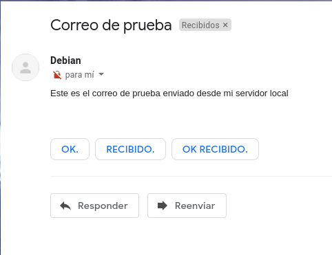
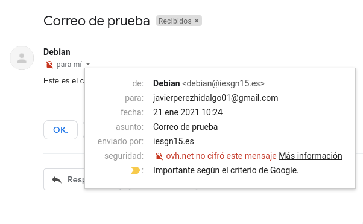

Title: Servidor de correos
Date: 2021/01/21
Category: Servicios de Red e Internet
Header_Cover: theme/images/banner-servicios.jpg
Tags: Correos, postfix, dovecot, imap, imaps, SMTPS

En este *post* vamos a instalar y configurar de manera adecuada un servidor de correos en una máquina de **OVH**. Mi dominio es `iesgn15.es`. El nombre del servidor de correo será `mail.iesgn15.es` (Este es el nombre que deberá aparecer en el registro MX).

#### Instalación

Para comenzar el artículo vamos a instalar las utilidades principales que necesitamos para crear nuestro servidor de correos. Empezaremos por instalar los paquetes `postfix` y `bsd-mailx` que corresponden al servidor y a las utilidades del cliente respectivamente.

<pre>
apt install postfix bsd-mailx -y
</pre>

Comencemos.

#### Gestión de correos desde el servidor

- **Tarea 1: Vamos a enviar un correo desde nuestro servidor local al exterior (Gmail).**

Antes de realizar este paso, vamos a crear un registro de tipo **SPF** en nuestro DNS de OVH, esto le servirá a **Gmail** para identificar que nuestro correo no es **Spam**. He creado el siguiente registro:

Ahora vamos a probar a enviar un correo electrónico desde nuestro servidor local, para ello haremos uso de la herramienta `mail`:

<pre>
debian@vpsjavierpzh:~$ mail javierperezhidalgo01@gmail.com
Subject: Correo de prueba       
Este es el correo de prueba enviado desde mi servidor local
Cc:
</pre>

Parece que ya hemos enviado el correo, pero para asegurarnos vamos a visualizar los *logs* de nuestro servidor, que se encuentran en el fichero `/var/log/mail.log`:

<pre>
...
Jan 21 10:24:22 vpsjavierpzh postfix/pickup[24623]: A492F101017: uid=1000 from=<\debian\>
Jan 21 10:24:22 vpsjavierpzh postfix/cleanup[25286]: A492F101017: message-id=<\20210121092422.A492F101017@vpsjavierpzh.iesgn15.es\>
Jan 21 10:24:22 vpsjavierpzh postfix/qmgr[9341]: A492F101017: from=<\debian@iesgn15.es\>, size=488, nrcpt=1 (queue active)
Jan 21 10:24:30 vpsjavierpzh postfix/smtp[25289]: A492F101017: to=<\javierperezhidalgo01@gmail.com\>, relay=gmail-smtp-in.l.google.com[173.194.76.26]:25, delay=7.8, delays=0.05/0.01/0.26/7.5, dsn=2.0.0, status=sent (250 2.0.0 OK  1611221070 h17si4006834wmq.57 - gsmtp)
Jan 21 10:24:30 vpsjavierpzh postfix/qmgr[9341]: A492F101017: removed
...
</pre>

Podemos observar que nos muestra una serie de mensajes de los que podemos sacar que hemos enviado un correo desde `debian@iesgn15.es` hacia `javierperezhidalgo01@gmail.com` y que el estado es *sent*, por lo que en teoría el correo debería haber llegado correctamente. Si nos dirigimos a la bandeja de entrada del correo `javierperezhidalgo01@gmail.com`:

Vemos que efectivamente hemos recibido el correo procedente de `debian@iesgn15.es`.

Antes de terminar, vamos a analizar más a fondo el código del correo, para ello hacemos *click* en *Mostrar original*:

<pre>
...
Received-SPF: pass (google.com: domain of debian@iesgn15.es designates 51.210.105.17 as permitted sender) client-ip=51.210.105.17;
...
</pre>

En estas líneas se aprecia como ha pasado correctamente y ha hecho uso del registro **SPF** y por tanto no nos muestra este mensaje como *Spam*.

- **Tarea 2: Vamos a enviar un correo desde el exterior (Gmail) a nuestro servidor local.**

Al igual que en la tarea anterior, antes de realizar este ejercicio, vamos a crear un registro de tipo **MX** en nuestro DNS de OVH, esto le servirá . He creado el siguiente registro:

--------------------------------------------------------------------------------

--------------------------------------------------------------------------------

Hecho esto, vamos a enviar un correo desde **Gmail** hacia `debian@iesgn15.es`:

Una vez enviado, vamos a comprobar que lo hayamos recibido en nuestro servidor local, para ello vamos a visualizar de nuevo los *logs* del fichero `/var/log/mail.log`:

<pre>
Jan 21 10:45:32 vpsjavierpzh postfix/smtpd[25717]: connect from mail-io1-f43.google.com[209.85.166.43]
Jan 21 10:45:33 vpsjavierpzh postfix/smtpd[25717]: 35244101016: client=mail-io1-f43.google.com[209.85.166.43]
Jan 21 10:45:33 vpsjavierpzh postfix/cleanup[25726]: 35244101016: message-id=<CAMu5ax_BkYemDjV=A1yf1wrDBZ6w_tHZ0Ws+tnPX+3k2TF5ghw@mail.gmail.com>
Jan 21 10:45:33 vpsjavierpzh postfix/qmgr[9341]: 35244101016: from=<javierperezhidalgo01@gmail.com>, size=2643, nrcpt=1 (queue active)
Jan 21 10:45:33 vpsjavierpzh postfix/local[25727]: 35244101016: to=<debian@iesgn15.es>, relay=local, delay=0.02, delays=0.01/0.01/0/0, dsn=2.0.0, status=sent (delivered to mailbox)
Jan 21 10:45:33 vpsjavierpzh postfix/qmgr[9341]: 35244101016: removed
Jan 21 10:45:33 vpsjavierpzh postfix/smtpd[25717]: disconnect from mail-io1-f43.google.com[209.85.166.43] ehlo=2 starttls=1 mail=1 rcpt=1 bdat=1 quit=1 commands=7
You have mail in /var/mail/debian
</pre>

Vaya, parece que tenemos un nuevo correo procedente de la dirección `javierperezhidalgo01@gmail.com` y lo ha almacenado en la ruta `/var/mail/debian`, así que vamos a verificarlo.

Para leer los nuevos correos, haremos uso de la herramienta `mail`.

<pre>
debian@vpsjavierpzh:~$ mail
Mail version 8.1.2 01/15/2001.  Type ? for help.
"/var/mail/debian": 1 message 1 new
\>N  1 javierperezhidalg  Thu Jan 21 10:45   54/2768  Correo de prueba
& 1
</pre>

Vemos que nos indica que tenemos un correo sin leer, si indicamos su número y lo leemos:

<pre>
Message 1:
From javierperezhidalgo01@gmail.com  Thu Jan 21 10:45:33 2021
X-Original-To: debian@iesgn15.es

...

Subject: Correo de prueba
To: debian@iesgn15.es
Content-Type:

...

Este es el correo de prueba enviado desde Gmail

...
</pre>

Efectivamente hemos recibido el correo.

Una vez leído, salimos del programa y vemos que guarda el correo en la dirección `/home/debian/mbox`:

<pre>
& q
Saved 1 message in /home/debian/mbox
</pre>

Explicado esto, vamos a pasar con el siguiente ejercicio.

#### Uso de alias y redirecciones

- **Tarea 3 (No obligatoria): Uso de alias y redirecciones.**

Vamos a comprobar como los procesos del servidor pueden mandar correos para informar sobre su estado. Por ejemplo cada vez que se ejecuta una tarea `cron` podemos enviar un correo informando del resultado. Normalmente estos correos se mandan al usuario **root** del servidor, para ello:

<pre>
crontab -e
</pre>

E indico donde se envía el correo:

<pre>
MAILTO = root
</pre>

Puedes poner alguna tarea en el *cron* para ver como se mandan correo.

Posteriormente usando alias y redirecciones podemos hacer llegar esos correos a nuestro correo personal.

Configura el `cron` para enviar correo al usuario **root**. Comprueba que están llegando esos correos al root. Crea un nuevo alias para que se manden a un usuario sin privilegios. Comprueban que llegan a ese usuario. Por último crea una redirección para enviar esos correo a tu correo personal (gmail,hotmail,…).

--------------------------------------------------------------------------------

En primer lugar vamos a configurar un nuevo **alias**, para que los correos que tengan como destinatario al usuario **root**, también lleguen al buzón del usuario **debian**. Para ello vamos a editar el fichero `/etc/aliases` y añadiremos la siguiente línea:

<pre>
root: debian
</pre>

De manera que el contenido total del fichero `/etc/aliases` sería:

<pre>
# See man 5 aliases for format
postmaster:    root
root: debian
</pre>

Cuando se modifica este fichero, debemos ejecutar el siguiente comando para aplicar los cambios:

<pre>
newaliases
</pre>

Hecho esto, vamos a enviar un correo desde **Gmail** hacia `root@iesgn15.es`:

Una vez enviado, vamos a comprobar que lo hayamos recibido en nuestro servidor local, en el usuario **debian**, para leer los nuevos correos, haremos uso de la herramienta anterior en el usuario *debian*.

<pre>
debian@vpsjavierpzh:~$ mail
Mail version 8.1.2 01/15/2001.  Type ? for help.
"/var/mail/debian": 2 messages 2 new
...
\>N  2 javierperezhidalg  Tue Feb  2 13:53   54/2752  =?UTF-8?Q?prueba_de_reenv=C3=ADo?=
 & 2
</pre>

Vemos que nos indica que tenemos dos correos sin leer (el primero es una prueba), si indicamos su número, en esta caso el 2, y lo leemos:

<pre>
Message 2:
From javierperezhidalgo01@gmail.com  Tue Feb  2 13:53:29 2021
X-Original-To: root@iesgn15.es

...

Subject: =?UTF-8?Q?prueba_de_reenv=C3=ADo?=
To: root@iesgn15.es
Content-Type:

...

hola, llega al usuario debian?

...
</pre>

Efectivamente hemos recibido el correo en el usuario *debian* y podemos apreciar que el destinatario del correo es **root**.

Una redirección se utiliza para enviar el correo que llegue a un usuario, a una cuenta de correo externa. Para usuarios reales, las redirecciones se definen en el fichero `~/.forward` y el formato de este fichero es simplemente un listado de cuentas de correo a las que se quiere redirigir el correo.

En mi caso, en dicho fichero introduzco mi dirección de correo externa:

<pre>
javierperezhidalgo01@gmail.com
</pre>

#### Para asegurar el envío

- **Tarea 4 (No obligatoria): Configura de manera adecuada DKIM es tu sistema de correos. Comprueba el registro DKIM en la página https://mxtoolbox.com/dkim.aspx. Configura `postfix` para que firme los correos que envía. Manda un correo y comprueba la verificación de las firmas en ellos.**

#### Para luchar contra el SPAM

- **Tarea 5 (No obligatorio): Configura de manera adecuada `Postfix` para que tenga en cuenta el registro SPF de los correos que recibe. Muestra el *log* del correo para comprobar que se está haciendo el testeo del registro SPF.**

- **Tarea 6 (No obligatoria): Configura un sistema antispam. Realiza comprobaciones para comprobarlo.**

- **Tarea 7 (No obligatoria): Configura un sistema antivirus. Realiza comprobaciones para comprobarlo.**

#### Gestión de correos desde un cliente

- **Tarea 8: Configura el buzón de los usuarios de tipo `Maildir`. Envía un correo a tu usuario y comprueba que el correo se ha guardado en el buzón `Maildir` del usuario del sistema correspondiente. Recuerda que ese tipo de buzón no se puede leer con la utilidad `mail`.**

- **Tarea 9: Instala configura `dovecot` para ofrecer el protocolo `IMAP`. Configura `dovecot` de manera adecuada para ofrecer autentificación y cifrado. Para realizar el cifrado de la comunicación crea un certificado en LetsEncrypt para el dominio mail.iesgn15.es. Recuerda que para el ofrecer el cifrado tiene varias soluciones:**

    - IMAP con STARTTLS: STARTTLS transforma una conexión insegura en una segura mediante el uso de SSL/TLS. Por lo tanto usando el mismo puerto 143/tcp tenemos cifrada la comunicación.

    - IMAPS: Versión segura del protocolo IMAP que usa el puerto 993/tcp.
    Ofrecer las dos posibilidades.

Elige una de las opciones anterior para realizar el cifrado. Y muestra la configuración de un cliente de correo (evolution, thunderbird, …) y muestra como puedes leer los correos enviado a tu usuario.

- **Tarea 10 (No obligatoria): Instala un webmail (roundcube, horde, rainloop) para gestionar el correo del equipo mediante una interfaz web. Muestra la configuración necesaria y cómo eres capaz de leer los correos que recibe tu usuario.**

- **Tarea 11: Configura de manera adecuada `postfix` para que podamos mandar un correo desde un cliente remoto. La conexión entre cliente y servidor debe estar autentificada con SASL usando `dovecot` y además debe estar cifrada. Para cifrar esta comunicación puedes usar dos opciones:**

    - ESMTP + STARTTLS: Usando el puerto 567/tcp enviamos de forma segura el correo al servidor.

    - SMTPS: Utiliza un puerto no estándar (465) para SMTPS (Simple Mail Transfer Protocol Secure). No es una extensión de smtp. Es muy parecido a HTTPS.

Elige una de las opciones anterior para realizar el cifrado. Y muestra la configuración de un cliente de correo (evolution, thunderbird, …) y muestra como puedes enviar los correos.

- **Tarea 12 (No obligatoria): Configura el cliente webmail para el envío de correo. Realiza una prueba de envío con el webmail.**

#### Comprobación final

- **Tarea 13 (No obligatoria): Prueba de envío de correo. En [https://www.mail-tester.com/](https://www.mail-tester.com/) tenemos una herramienta completa y fácil de usar a la que podemos enviar un correo para que verifique y puntúe el correo que enviamos. Captura la pantalla y muestra la puntuación que has sacado.**

.
