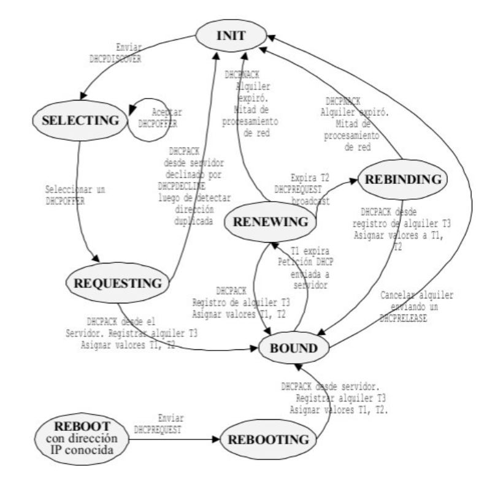

Title: Servidor DHCP con NAT
Date: 2020/10/15
Category: Servicios de Red e Internet
Header_Cover: theme/images/banner-servicios.jpg
Tags: servidor, dhcp, nat, snat

## Teoría

**Tarea 1: Lee el documento [Teoría: Servidor DHCP](https://fp.josedomingo.org/serviciosgs/u02/dhcp.html) y explica el funcionamiento del servidor DHCP resumido en este [gráfico](https://fp.josedomingo.org/serviciosgs/u02/img/dhcp.png).**

Voy a explicar este gráfico que define el funcionamiento de un servidor DHCP.

Primeramente se inicia el cliente DHCP, y se encuentra en su estado inicial (**INIT**), ya que aún no posee ningún tipo de información. Acto seguido envía un **DHCPDISCOVER** al puerto 67 del servidor, este mensaje usa la dirección IP de broadcast la red (255.255.255.255). Si no existe un servidor DHCP en la red local, el router deberá tener un agente **DHCP relay** para la retransmisión de esta petición hacia las otras subredes.
El mensaje DHCPDISCOVER, se envía tras esperar de 1 a 10 segundos para evitar una posible colisión con otros clientes DHCP.

Una vez enviado este mensaje, el cliente pasa a un estado llamado **SELECTING**, donde va a recibir los mensajes **DHCPOFFER** del servidor DHCP, configurados para atender a este cliente. En el caso de que el cliente reciba más de un mensaje DHCPOFFER, escogerá uno. Como respuesta, el cliente DHCP enviará un mensaje **DHCPREQUEST** para elegir un servidor DHCP, el que contestará con un **DHCPACK**, que contendrá la configuración de red para el cliente.
En este punto, como opción, el cliente envía una petición **ARP** con la dirección IP que le ha asignado el servidor, para comprobar que dicha dirección no esté duplicada. Si lo estuviera, el DHCPACK del servidor se ignora y se envía un **DHCPDECLINE** y el cliente regresaría al estado inicial. Si la dirección es únicamente utilizada por el cliente, éste pasaría a estado **BOUND**.

En dicho estado, se colocan tres valores de temporización, que pueden ser especificados en el servidor:

- **T1:** tiempo de renovación del alquiler. Si no se especifica su valor, se recurre esta fórmula, **T3 x 0'5**.
- **T2:** tiempo de reenganche. Si no se especifica su valor, se recurre esta fórmula, **T3 x 0'875**.
- **T3:** tiempo de duración del alquiler. Este valor se debe indicar en el servidor de manera indispensable.

El DHCPACK siempre trae consigo el valor de T3. Los valores de T1 y T2 se configuran en el servidor DHCP; de no ser así, se usan los valores por defecto siguientes:

## DHCPv4

####Preparación del escenario

**Crea un escenario usando Vagrant que defina las siguientes máquinas:**

- **Servidor:** Tiene dos tarjetas de red: una pública y una privada que se conectan a la red local.
- **nodo_lan1:** Un cliente conectado a la red local.

#### Servidor DHCP

**Instala un servidor dhcp en el ordenador “servidor” que de servicio a los ordenadores de red local, teniendo en cuenta que el tiempo de concesión sea 12 horas y que la red local tiene el direccionamiento `192.168.100.0/24`.**

**Tarea 2: Entrega el fichero `Vagrantfile` que define el escenario.**

He creado este fichero Vagrantfile para definir el escenario.

<pre>
# -*- mode: ruby -*-
# vi: set ft=ruby :

Vagrant.configure("2") do |config|
  config.vm.define :servidor do |servidor|
        servidor.vm.box="debian/buster64"
        servidor.vm.hostname="servidordhcp"
        servidor.vm.network :public_network, :bridge=>"wlo"
        servidor.vm.network :private_network, ip: "192.168.100.1", virtualbox__intnet: "red1"
  end

  config.vm.define :nodolan1 do |nodolan1|
        nodolan1.vm.box="debian/buster64"
        nodolan1.vm.hostname="nodolan1"
        nodolan1.vm.network :private_network, virtualbox__intnet: "red1", type: "dhcp"
  end

end
</pre>

**Tarea 3: Muestra el fichero de configuración del servidor, la lista de concesiones, la modificación en la configuración que has hecho en el cliente para que tome la configuración de forma automática y muestra la salida del comando `ip address`.**

Una vez creado el Vagrantfile, ejecutamos estos comandos y nos conectamos a las máquinas.

<pre>
vagrant up
vagrant ssh servidor
vagrant ssh nodolan1
</pre>

En la máquina servidor instalamos los paquetes necesarios para instalar el servidor dhcp.

<pre>
apt update && apt install isc-dhcp-server -y
</pre>

Una vez instalado, tenemos que editar estos dos ficheros:

Primero en el `/etc/default/isc-dhcp-server`, modificamos la línea `INTERFACESv4` para que quede así:

<pre>
INTERFACESv4="eth2"
</pre>

Y segundo, en el `/etc/dhcp/dhcpd.conf`, tenemos que realizar esta configuración, que por defecto viene comentada:

<pre>
# A slightly different configuration for an internal subnet.
subnet 192.168.100.0 netmask 255.255.255.0 {
  range 192.168.100.3 192.168.100.10;
  option domain-name-servers 8.8.8.8,8.8.4.4;
  option routers 192.168.100.1;
  option broadcast-address 192.168.100.255;
  default-lease-time 10;
  max-lease-time 43200;
}
</pre>

Le hemos especificado que nuestra red es la 192.168.100.0/24, de ahí la máscara puesta, el rango de direcciones va desde la 3 hasta la 10,                                , le indicamos que la puerta de enlace sea la 192.168.100.1, y el broadcast la 192.168.100.255. Le he puesto un tiempo de concesión por defecto de 10 segundos para no tener que esperar mucho, y un tiempo de concesión máximo de 12 horas, que son 43200 segundos.

Y una vez hecho esto, si realizamos un `systemctl restart isc-dhcp-server.service`, y reiniciamos el servidor dhcp, el cliente debería recibir automáticamente una dirección IP dentro del rango que hemos puesto.

<pre>
root@servidordhcp:/home/vagrant# systemctl restart isc-dhcp-server.service

root@servidordhcp:/home/vagrant# cat /var/lib/dhcp/dhcpd.leases
# The format of this file is documented in the dhcpd.leases(5) manual page.
# This lease file was written by isc-dhcp-4.4.1

# authoring-byte-order entry is generated, DO NOT DELETE
authoring-byte-order little-endian;

server-duid "\000\001\000\001'\033\`\"\010\000'|]\230";

lease 192.168.100.3 {
  starts 4 2020/10/15 19:34:31;
  ends 4 2020/10/15 19:39:31;
  cltt 4 2020/10/15 19:34:31;
  binding state active;
  next binding state free;
  rewind binding state free;
  hardware ethernet 08:00:27:06:dc:18;
  uid "\377'\006\334\030\000\001\000\001'\033^\245\010\000'\006\334\030";
  client-hostname "nodolan1";
}
root@servidordhcp:/home/vagrant#
</pre>

Vemos que en la lista de concesiones del servidor, que es la `/var/lib/dhcp/dhcpd.leases` nos aparece como que ha dado la IP 192.168.100.3 al cliente nodolan1.

Si ahora nos vamos al cliente, nos va a mostrar que posee la dirección 192.168.100.3, que es la que nos mostraba el servidor.

<pre>
root@nodolan1:/home/vagrant# ip a

...

3: eth1: <BROADCAST,MULTICAST,UP,LOWER_UP> mtu 1500 qdisc pfifo_fast state UP group default qlen 1000
    link/ether 08:00:27:06:dc:18 brd ff:ff:ff:ff:ff:ff
    inet6 fe80::a00:27ff:fe06:dc18/64 scope link
       valid_lft forever preferred_lft forever
root@nodolan1:/home/vagrant# ip a

...

3: eth1: <BROADCAST,MULTICAST,UP,LOWER_UP> mtu 1500 qdisc pfifo_fast state UP group default qlen 1000
    link/ether 08:00:27:06:dc:18 brd ff:ff:ff:ff:ff:ff
    inet 192.168.100.3/24 brd 192.168.100.255 scope global dynamic eth1
       valid_lft 290sec preferred_lft 290sec
    inet6 fe80::a00:27ff:fe06:dc18/64 scope link
       valid_lft forever preferred_lft forever
root@nodolan1:/home/vagrant#
</pre>

Vemos como en la eth1, tenemos esta dirección.

**Tarea 4: Configura el servidor para que funcione como router y NAT, de esta forma los clientes tengan internet. Muestra las rutas por defecto del servidor y el cliente. Realiza una prueba de funcionamiento para comprobar que el cliente tiene acceso a internet (utiliza nombres, para comprobar que tiene resolución DNS).**

Ahora lo que tenemos que hacer es cambiar las puertas de enlace para que el cliente tenga acceso a internet. Esto lo conseguimos cambiando las puertas de enlace del servidor y del cliente.

Al servidor le tenemos que poner la 192.168.0.1, que es la ruta para que acceda al router de mi casa.
Vemos como la hemos cambiado:

<pre>
root@servidordhcp:/home/vagrant# ip r
default via 10.0.2.2 dev eth0
10.0.2.0/24 dev eth0 proto kernel scope link src 10.0.2.15
192.168.0.0/24 dev eth1 proto kernel scope link src 192.168.0.31
192.168.100.0/24 dev eth2 proto kernel scope link src 192.168.100.1

root@servidordhcp:/home/vagrant# ip r replace default via 192.168.0.1

root@servidordhcp:/home/vagrant# ip r
default via 192.168.0.1 dev eth1
10.0.2.0/24 dev eth0 proto kernel scope link src 10.0.2.15
192.168.0.0/24 dev eth1 proto kernel scope link src 192.168.0.31
192.168.100.0/24 dev eth2 proto kernel scope link src 192.168.100.1
</pre>

Al cliente le vamos a poner la 192.168.100.1, que es la puerta de enlace que pertenece al servidor web, de esta manera el cliente se conecta al servidor dhcp (que está conectado con el equipo principal) y sale por su puerta de enlace hacia el equipo principal que es el que está conectado al router del proveedor de internet:

<pre>
root@nodolan1:/home/vagrant# ip r
default via 10.0.2.2 dev eth0
10.0.2.0/24 dev eth0 proto kernel scope link src 10.0.2.15
192.168.100.0/24 dev eth1 proto kernel scope link src 192.168.100.3

root@nodolan1:/home/vagrant# ip r replace default via 192.168.100.1

root@nodolan1:/home/vagrant# ip r
default via 192.168.100.1 dev eth1
10.0.2.0/24 dev eth0 proto kernel scope link src 10.0.2.15
192.168.100.0/24 dev eth1 proto kernel scope link src 192.168.100.3
</pre>

Ahora debemos activar el `bit de forward` en la máquina que va a actuar como servidor. Esto va a permitir que funcione como router, o más concretamente en este caso como dispositivo de NAT.
Se puede activar con el siguiente comando:

<pre>
echo 1 > /proc/sys/net/ipv4/ip_forward
</pre>

Este comando lo que hace es poner a '1' el valor del bit de forward, por tanto lo activa.
Pero esta activación se borra cuando se apaga el equipo. Para que dicha activación permanezca debemos definirla en el fichero `/etc/sysctl.conf`, descomentando esta línea que por defecto viene desactivada:

<pre>
net.ipv4.ip_forward=1
</pre>

Por último, vamos a añadir, también en el servidor, esta regla a `iptables` para que se haga `SNAT` de todos los equipos de la red 192.168.100.0/24 es tan simple como:

<pre>
iptables -t nat -A POSTROUTING -s 192.168.100.0/24 -o eth1 -j MASQUERADE
</pre>

Ahora sí, vamos a comprobar que el cliente posee realmente conexión haciéndole un ping a `www.google.es`:

<pre>
root@nodolan1:/home/vagrant# ping www.google.es
PING www.google.es (216.58.209.67) 56(84) bytes of data.
64 bytes from waw02s06-in-f3.1e100.net (216.58.209.67): icmp_seq=1 ttl=117 time=17.7 ms
64 bytes from waw02s06-in-f3.1e100.net (216.58.209.67): icmp_seq=2 ttl=117 time=121 ms
64 bytes from waw02s06-in-f3.1e100.net (216.58.209.67): icmp_seq=3 ttl=117 time=21.8 ms
^C
--- www.google.es ping statistics ---
3 packets transmitted, 3 received, 0% packet loss, time 5ms
rtt min/avg/max/mdev = 17.712/53.625/121.410/47.959 ms
</pre>

Vemos que hace ping correctamente, por tanto ya tenemos conexión en nuestro cliente.

**Tarea 5: Realizar una captura, desde el servidor usando `tcpdump`, de los cuatro paquetes que corresponden a una concesión: `DISCOVER`, `OFFER`, `REQUEST`, `ACK`.**

Para realizar una captura con la utilidad `tcpdump`, antes debemos instalar el paquete:

<pre>
apt update && apt install tcpdump -y
</pre>

#### Funcionamiento del DHCP

**Vamos a comprobar que ocurre con la configuración de los clientes en determinadas circunstancias, para ello vamos a poner un tiempo de concesión muy bajo.**

**Tarea 6: Los clientes toman una configuración, y a continuación apagamos el servidor dhcp. ¿qué ocurre con el cliente windows? ¿Y con el cliente linux?**
**Tarea 7: Los clientes toman una configuración, y a continuación cambiamos la configuración del servidor dhcp (por ejemplo el rango). ¿qué ocurriría con un cliente windows? ¿Y con el cliente linux?**

#### Reservas

**Crea una reserva para el que el cliente tome siempre la dirección `192.168.100.100`.**

**Tarea 8: Indica las modificaciones realizadas en los ficheros de configuración y entrega una comprobación de que el cliente ha tomado esa dirección.**

#### Uso de varios ámbitos

**Modifica el escenario Vagrant para añadir una nueva red local y un nuevo nodo:**

- **Servidor: En el servidor hay que crear una nueva interfaz.**
- **nodo_lan2: Un cliente conectado a la segunda red local.**

**Configura el servidor dhcp en el ordenador “servidor” para que de servicio a los ordenadores de la nueva red local, teniendo en cuenta que el tiempo de concesión sea 24 horas y que la red local tiene el direccionamiento 192.168.200.0/24.**

**Tarea 9: Entrega el nuevo fichero Vagrantfile que define el escenario.**

**Tarea 10: Explica las modificaciones que has hecho en los distintos ficheros de configuración. Entrega las comprobaciones necesarias de que los dos ámbitos están funcionando.**

**Tarea 11: Realiza las modificaciones necesarias para que los cliente de la segunda red local tengan acceso a internet. Entrega las comprobaciones necesarias.**
