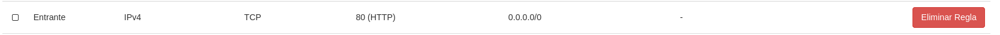
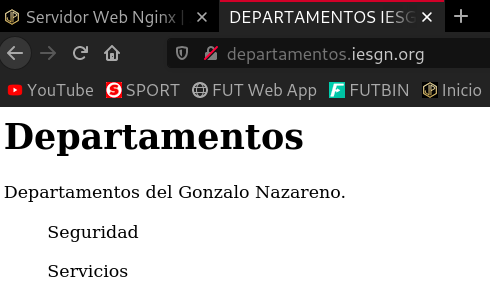
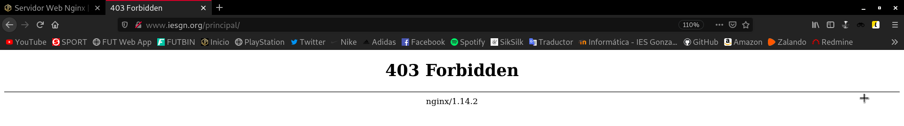
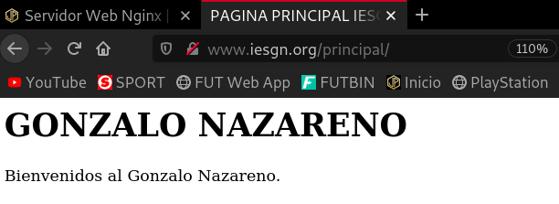
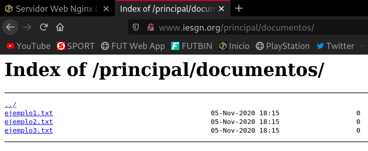
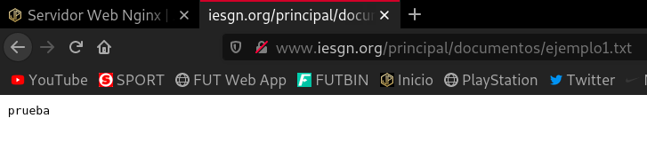

Title: Servidor Web Nginx
Date: 2020/11/8
Category: Servicios de Red e Internet
Header_Cover: theme/images/banner-servicios.jpg
Tags: web, Nginx

## Servidor Web Nginx

**1. Crea una máquina del cloud con una red pública. Añade la clave pública del profesor a la máquina. Instala el servidor web nginx en la máquina. Modifica la página `index.html` que viene por defecto y accede a ella desde un navegador.**

He creado esta instancia con una imagen del *cloud* llamada *Debian Buster 10.6* y un sabor llamado *m1.mini*.

Voy a añadir la clave pública de José Domingo que se encuentra en la [Wiki](https://dit.gonzalonazareno.org/redmine/projects/asir2/wiki/Claves_p%C3%BAblicas_de_los_profesores).

Para ello la descargo previamente:

<pre>
debian@deb10-servidornginx:~$ wget https://dit.gonzalonazareno.org/redmine/attachments/download/1996/id_rsa.pub
--2020-11-03 17:49:14--  https://dit.gonzalonazareno.org/redmine/attachments/download/1996/id_rsa.pub
Resolving dit.gonzalonazareno.org (dit.gonzalonazareno.org)... 192.168.203.2
Connecting to dit.gonzalonazareno.org (dit.gonzalonazareno.org)|192.168.203.2|:443... connected.
HTTP request sent, awaiting response... 302 Found
Location: https://dit.gonzalonazareno.org/redmine/login?back_url=https%3A%2F%2Fdit.gonzalonazareno.org%2Fredmine%2Fattachments%2Fdownload%2F1996%2Fid_rsa.pub [following]
--2020-11-03 17:49:14--  https://dit.gonzalonazareno.org/redmine/login?back_url=https%3A%2F%2Fdit.gonzalonazareno.org%2Fredmine%2Fattachments%2Fdownload%2F1996%2Fid_rsa.pub
Reusing existing connection to dit.gonzalonazareno.org:443.
HTTP request sent, awaiting response... 200 OK
Length: unspecified [text/html]
Saving to: ‘id_rsa.pub’

id_rsa.pub                    [ <=>                                  ]   5.08K  --.-KB/s    in 0.001s  

2020-11-03 17:49:14 (3.56 MB/s) - ‘id_rsa.pub’ saved [5199]

debian@deb10-servidornginx:~$ ls
id_rsa.pub
</pre>

Ahora la importo en el fichero `authorized_keys` de la instancia.

<pre>
echo `cat ./id_rsa.pub` >> .ssh/authorized_keys
</pre>

- **Entrega la ip flotante de la máquina para que el profesor pueda acceder a ella.**

La IP de la instancia es la **172.22.200.116**

- **Entrega una captura de pantalla accediendo a ella.**

<pre>
javier@debian:~$ ssh debian@172.22.200.116
Linux deb10-servidornginx 4.19.0-11-cloud-amd64 #1 SMP Debian 4.19.146-1 (2020-09-17) x86_64

The programs included with the Debian GNU/Linux system are free software;
the exact distribution terms for each program are described in the
individual files in /usr/share/doc/*/copyright.

Debian GNU/Linux comes with ABSOLUTELY NO WARRANTY, to the extent
permitted by applicable law.
Last login: Tue Nov  3 17:54:49 2020 from 172.23.0.46

debian@deb10-servidornginx:~$
</pre>

Hemos accedido a la instancia.

#### Virtual Hosting

**Queremos que nuestro servidor web ofrezca dos sitios web, teniendo en cuenta lo siguiente:**

- **Cada sitio web tendrá nombres distintos.**

- **Cada sitio web compartirán la misma dirección IP y el mismo puerto (80).**

**Los dos sitios web tendrán las siguientes características:**

- **El nombre de dominio del primero será `www.iesgn.org`, su directorio base será `/srv/www/iesgn` y contendrá una página llamada `index.html`, donde sólo se verá una bienvenida a la página del Instituto Gonzalo Nazareno.**

- **En el segundo sitio vamos a crear una página donde se pondrán noticias por parte de los departamento, el nombre de este sitio será `departamentos.iesgn.org`, y su directorio base será `/srv/www/departamentos`. En este sitio sólo tendremos una página inicial `index.html`, dando la bienvenida a la página de los departamentos del instituto.**

**2. Configura la resolución estática en los clientes y muestra el acceso a cada una de las páginas.**

Antes de instalar el servidor web, en nuestro administrador de instancias, en mi caso, estoy utilizando una instancia del servicio de *cloud* de mi instituto, debemos abrir el **puerto 80 (HTTP)**, ya que sino no nos va a dejar acceder a las páginas que configuremos.

Para instalar el servidor **Nginx**, voy a realizar una actualización de los repositorios, es decir, un `apt update`, pero si intentamos realizarlo, nos da un error que sinceramente desconozco el por qué, pero que he solventado comentando las líneas `src` en el fichero `/etc/apt/sources.list`.

<pre>
apt update && apt install nginx -y
</pre>

Antes de empezar con el proceso de configuración, apunto que voy a obviar cosas y no voy a dar tantos detalles ya que el proceso es muy parecido al del servidor **Apache** y en esos posts ya he dado los detalles suficientes. Si quieres ver los [posts de Apache](https://javierpzh.github.io/tag/apache.html).

Una vez tenemos instalado *Nginx*, vamos a configurarlo. En primer lugar, voy a crear la configuración de las páginas que tenemos que servir, para ello creo los ficheros `iesgn.conf` y `departamentos.conf`:

<pre>
root@deb10-servidornginx:~# cd /etc/nginx/sites-available/

root@deb10-servidornginx:/etc/nginx/sites-available# ls
default

root@deb10-servidornginx:/etc/nginx/sites-available# cp default iesgn.conf

root@deb10-servidornginx:/etc/nginx/sites-available# nano iesgn.conf

root@deb10-servidornginx:/etc/nginx/sites-available# cp iesgn.conf departamentos.conf

root@deb10-servidornginx:/etc/nginx/sites-available# nano departamentos.conf
</pre>

Así quedaría el fichero `iesgn.conf`:

<pre>
server {
        listen 80;

        root /srv/www/iesgn;
        index index.html index.htm index.nginx-debian.html;

        server_name www.iesgn.org;

        location / {
                try_files $uri $uri/ =404;
        }
}
</pre>

Y así el `departamentos.conf`:

<pre>
server {
        listen 80;

        root /srv/www/departamentos;
        index index.html index.htm index.nginx-debian.html;

        server_name departamentos.iesgn.org;

        location / {
                try_files $uri $uri/ =404;
        }
}
</pre>

Creamos los enlaces simbólicos a la ruta `/etc/nginx/sites-enabled/` para habilitar el servicio de ambas páginas:

<pre>
ln -s /etc/nginx/sites-available/iesgn.conf /etc/nginx/sites-enabled/
ln -s /etc/nginx/sites-available/departamentos.conf /etc/nginx/sites-enabled/
</pre>

En segundo lugar, vamos a crear la estructura de directorios de las páginas, y vamos a crear los respectivos `index.html`:

<pre>
root@deb10-servidornginx:/srv# mkdir www

root@deb10-servidornginx:/srv# cd www/

root@deb10-servidornginx:/srv/www# mkdir iesgn departamentos

root@deb10-servidornginx:/srv/www# ls
departamentos  iesgn

root@deb10-servidornginx:/srv/www# touch ./iesgn/index.html ./departamentos/index.html

root@deb10-servidornginx:/srv/www# ls -R
.:
departamentos  iesgn

./departamentos:
index.html

./iesgn:
index.html
</pre>

Le cambiamos el propietario y grupo al directorio `/srv/www` y todos sus hijos a `www-data` que es el usuario de *Nginx*:

<pre>
chown -R www-data:www-data /srv/www
</pre>

En este punto, solo nos faltaría reiniciar el servicio:

<pre>
systemctl restart nginx
</pre>

Si queremos visualizar las páginas en nuestra máquina anfitriona, añadimos estas líneas al fichero `/etc/hosts`:

<pre>
172.22.200.116  www.iesgn.org
172.22.200.116  departamentos.iesgn.org
</pre>

Página `www.iesgn.org`:

Página `departamentos.iesgn.org`:

#### Mapeo de URL

**Cambia la configuración del sitio web `www.iesgn.org` para que se comporte de la siguiente forma:**

**3. Cuando se entre a la dirección `www.iesgn.org` se redireccionará automáticamente a `www.iesgn.org/principal`, donde se mostrará el mensaje de bienvenida. En el directorio principal no se permite ver la lista de los ficheros, no se permite que se siga los enlaces simbólicos y no se permite negociación de contenido. Muestra al profesor el funcionamiento.**

Creamos el directorio `principal`:

<pre>
root@deb10-servidornginx:/srv/www/iesgn# mkdir principal
</pre>

Creamos la redirección, en este caso permanente, con la siguiente línea en el fichero de configuración `/etc/nginx/sites-available/iesgn.conf`:

<pre>
rewrite ^/$ /principal permanent;
</pre>

Para que no se permita ver la lista de ficheros, ni se sigan los enlaces simbólicos, como nos pide el ejercicio, introducimos el siguiente bloque *location* en `/etc/nginx/sites-available/iesgn.conf`:

<pre>
location /principal {
                autoindex off;
                disable_symlinks on;
}
</pre>

Antes de crear el `index.html`, vamos a comprobar que estas opciones están funcionando correctamente.

Para comprobar que no se muestra el listado de ficheros, vamos a crear un archivo `.txt` y vamos a crear un enlace simbólico sobre este archivo, así también comprobaremos que no se siguen los enlaces simbólicos.

Creamos el fichero de prueba y el enlace simbólico:

<pre>
touch /home/debian/ejemplo1.txt

ln -s /home/debian/ejemplo1.txt /srv/www/iesgn/principal/
</pre>

Vemos que hemos creado el enlace simbólico en `/srv/www/iesgn/principal`:

<pre>
root@deb10-servidornginx:/srv/www# ls -R
.:
departamentos  iesgn

./departamentos:
index.html

./iesgn:
index.html  principal

./iesgn/principal:
ejemplo1.txt
</pre>

Tendremos que cambiar el propietario de este enlace simbólico. Yo recurro de nuevo al comando utilizado anteriormente ya que lo aplica a los subdirectorios y archivos hijos:

<pre>
chown -R www-data:www-data /srv/www
</pre>

Reiniciamos el servicio:

<pre>
systemctl restart nginx
</pre>

Vamos a acceder a la página `www.iesgn.org`:

Vemos como además de redirigirnos automáticamente a `www.iesgn.org/principal`, no nos muestra el listado de ficheros. Si probamos a acceder a `www.iesgn.org/principal/ejemplo1.txt`, para ver si nos permite seguir el enlace simbólico:

Vemos que tampoco nos deja, por tanto tendríamos la página bien configurada. Ahora vamos a añadir un `index.html`:

<pre>
root@deb10-servidornginx:/srv/www/iesgn# cp index.html ./principal/

root@deb10-servidornginx:/srv/www/iesgn# chown -R www-data:www-data /srv/www
</pre>

Si ahora accedemos a la ruta `www.iesgn.org` nos redirigirá automáticamente a `www.iesgn.org/principal` y nos mostrará está página:

**4. Si accedes a la página `www.iesgn.org/principal/documentos` se visualizarán los documentos que hay en `/srv/doc`. Por lo tanto se permitirá el listado de fichero y el seguimiento de enlaces simbólicos siempre que sean a ficheros o directorios cuyo dueño sea el usuario. Muestra al profesor el funcionamiento.**

Creamos el directorio `doc` y creamos algunos documentos, no copio el `index.html` para que así nos muestre el listado de ficheros. Establecemos de nuevo como propietario `www-data`:

<pre>
root@deb10-servidornginx:/srv# mkdir doc

root@deb10-servidornginx:/srv# cd doc

root@deb10-servidornginx:/srv/doc# touch ejemplo1.txt ejemplo2.txt ejemplo3.txt

root@deb10-servidornginx:/srv/doc# ls
ejemplo1.txt  ejemplo2.txt  ejemplo3.txt

root@deb10-servidornginx:/srv/doc# cd ..

root@deb10-servidornginx:/srv# chown -R www-data:www-data /srv/doc/
</pre>

Introducimos la siguiente línea en el fichero de configuración `/etc/nginx/sites-available/iesgn.conf` para configurar el **alias** y habilitar el listado de ficheros y el seguimiento de los enlaces simbólicos siempre que el dueño del enlace y del archivo sea el mismo:

<pre>
location /principal/documentos {
                alias /srv/doc;
                autoindex on;
                disable_symlinks if_not_owner;
}
</pre>

Accedemos a `www.iesgn.org/principal/documentos`:

Vemos que podemos ver el contenido de los ficheros:

**5. En todo el host virtual se debe redefinir los mensajes de error de objeto no encontrado y no permitido. Para el ello se crearan dos ficheros html dentro del directorio error. Entrega las modificaciones necesarias en la configuración y una comprobación del buen funcionamiento.**

#### Autentificación, Autorización, y Control de Acceso

**6. Añade al escenario otra máquina conectada por una red interna al servidor. A la URL `departamentos.iesgn.org/intranet` sólo se debe tener acceso desde el cliente de la red local, y no se pueda acceder desde la anfitriona por la red pública. A la URL `departamentos.iesgn.org/internet`, sin embargo, sólo se debe tener acceso desde la anfitriona por la red pública, y no desde la red local.**

**7. Autentificación básica. Limita el acceso a la URL `departamentos.iesgn.org/secreto`. Comprueba las cabeceras de los mensajes HTTP que se intercambian entre el servidor y el cliente.**

**8. Vamos a combinar el control de acceso (tarea 6) y la autentificación (tarea 7), y vamos a configurar el virtual host para que se comporte de la siguiente manera: el acceso a la URL `departamentos.iesgn.org/secreto` se hace forma directa desde la intranet, desde la red pública te pide la autentificación. Muestra el resultado al profesor.**
