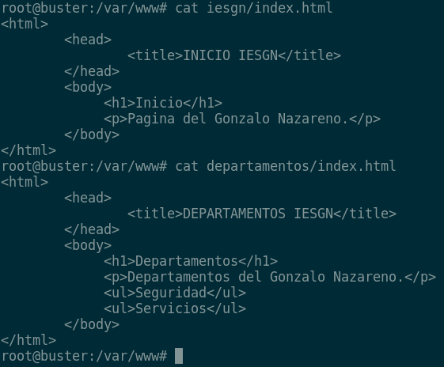
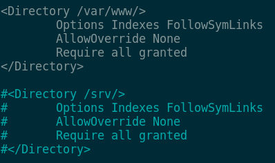

Title: VirtualHosting con Apache
Date: 2020/10/14
Category: Servicios de Red e Internet

## Configuración de VirtualHosting

Antes de nada voy a decir que en mi caso voy a utilizar [Vagrant](https://www.vagrantup.com/) y como provider [VirtualBox](https://www.virtualbox.org/).

El objetivo de esta práctica es la puesta en marcha de dos sitios web utilizando el mismo servidor web apache. Hay que tener en cuenta lo siguiente:

- Cada sitio web tendrá nombres distintos.
- Cada sitio web compartirán la misma dirección IP y el mismo puerto (80).

Queremos construir en nuestro servidor web apache dos sitios web con las siguientes características:

- El nombre de dominio del primero será `www.iesgn.org`, su directorio base será `/var/www/iesgn` y contendrá una página llamada `index.html`, donde sólo se verá una bienvenida a la página del Instituto Gonzalo Nazareno.
- En el segundo sitio vamos a crear una página donde se pondrán noticias por parte de los departamento, el nombre de este sitio será `www.departamentosgn.org`, y su directorio base será `/var/www/departamentos`. En este sitio sólo tendremos una página inicial `index.html`, dando la bienvenida a la página de los departamentos del instituto.

Para conseguir estos dos sitios virtuales debes seguir los siguientes pasos:

**1. Los ficheros de configuración de los sitios webs se encuentran en el directorio `/etc/apache2/sites-available`, por defecto hay dos ficheros, uno se llama `000-default.conf` que es la configuración del sitio web por defecto. Necesitamos tener dos ficheros para realizar la configuración de los dos sitios virtuales, para ello vamos a copiar el fichero `000-default.conf`:**

<pre>
cd /etc/apache2/sites-available
cp 000-default.conf iesgn.conf
cp 000-default.conf departamentos.conf
</pre>

**De esta manera tendremos un fichero llamado `iesgn.conf` para realizar la configuración del sitio web `www.iesgn.org`, y otro llamado `departamentos.conf` para el sitio web `www.departamentosgn.org`.**

**2. Modificamos los ficheros `iesgn.conf` y `departamentos.conf`, para indicar el nombre que vamos a usar para acceder al host virtual `(ServerName)` y el directorio de trabajo (`DocumentRoot`).**

Cambiamos las líneas de ServerName y DocumentRoot de forma que queden así:

Para la página `www.iesgn.org`:

<pre>
ServerName www.iesgn.org
DocumentRoot /var/www/iesgn
</pre>

Para `www.departamentosgn.org`:

<pre>
ServerName www.departamentosgn.org
DocumentRoot /var/www/departamentos
</pre>

**3. No es suficiente crear los ficheros de configuración de cada sitio web, es necesario crear un enlace simbólico a estos ficheros dentro del directorio `/etc/apache2/sites-enabled`, para ello:**

<pre>
a2ensite iesgn
a2ensite departamentos
</pre>

**La creación de los enlaces simbólicos se puede hacer con la instrucción `a2ensite nombre_fichero_configuracion`, para deshabilitar el sitio tenemos que borrar el enlace simbólico o usar la instrucción `a2dissite nombre_fichero_configuracion`.**

<pre>
a2ensite iesgn.conf
a2ensite departamentos.conf
</pre>

**4. Crea los directorios y los ficheros 'index.html' necesarios en `/var/www` y reiniciamos el servicio.**

Para reiniciar el servicio:

<pre>
systemctl restart apache2.service
</pre>

**5. Para terminar lo único que tendremos que hacer es cambiar el fichero hosts en los clientes y poner dos nuevas líneas donde se haga la conversión entre los dos nombre de dominio y la dirección IP del servidor.**

Hay que decir que si queremos visualizar las dos páginas webs en nuestro cliente, debemos configurar una red privada.

Para crear una red `hostonly`, podemos simplemente descomentar la siguiente línea que viene comentada por defecto en el fichero 'Vagrantfile'. Esto asignará un IP privada fija a nuestra mv.

<pre>
config.vm.network "private_network", ip: "192.168.33.10"
</pre>

Luego en el fichero `/etc/hosts` del cliente, añadir estas dos líneas:

<pre>
192.168.33.10    www.iesgn.org
192.168.33.10    www.departamentosgn.org
</pre>

La IP obviamente depende de la cual tengamos asignada a la mv.

Voy a abrir las páginas desde el cliente.

**Repite el ejercicio cambiando los directorios de trabajo a `/srv/www`. ¿Qué modificación debes hacer en el fichero `/etc/apache2/apache2.conf`?**

Lo primero que debemos hacer es modificar el fichero `apache2.conf`, que actualmente posee esta configuración:

Esto indica que mostrará todos los ficheros de las páginas alojadas en la ruta `/var/www/`. Lo que debemos hacer es comentar estas líneas y descomentar las de abajo que hacen referencia a la ruta `/srv/` y todos sus hijos:

Ahora creamos la estructura de directorios que queremos y copiamos los mismos 'index.html' que hemos utilizado antes:
<pre>
cd /var/www/iesgn
cp index.html /srv/www/iesgn/
cd ../departamentos/
cp index.html /srv/www/departamentos/
</pre>

Ahora ya solo nos quedaría modificar los archivos `iesgn.conf` y `departamentos.conf` que se encuentran en el directorio `/etc/apache2/sites-available`. En mi caso he utilizado los mismos ficheros de configuración que había generado antes, por tanto solo tendría que cambiar la ruta del 'DocumentRoot', pero también se podrían generar otros archivos de configuración, si deseamos conservar estos:

La línea del fichero `iesgn.conf` quedaría:

<pre>
DocumentRoot /srv/www/iesgn
</pre>

Y la del `departamentos.conf`:

<pre>
DocumentRoot /srv/www/departamentos
</pre>

Ahora reiniciamos el servicio:

<pre>
systemctl restart apache2.service
</pre>

Y ya podríamos ver las páginas alojadas en nuestro directorio `/srv/`.
